# report

## /.

Old URL: https://bazel.build/.
New URL: https://preview.bazel.build/.

| Old | New |
| --- | --- |
| 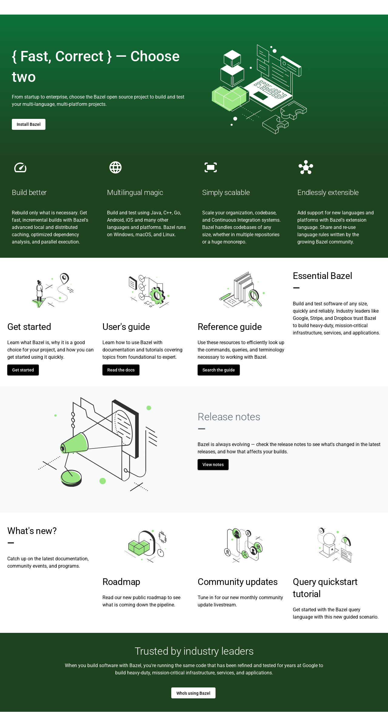 | 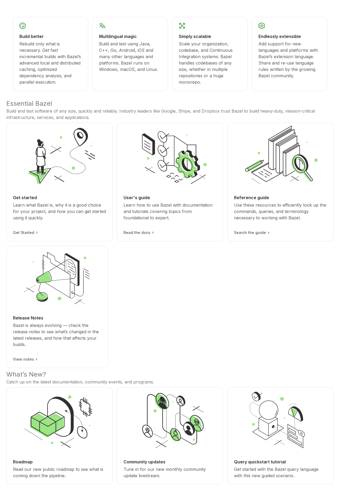 |

- The hero section containing the main heading '{ Fast, Correct } — Choose two' and the 'Install Bazel' call to action is missing.
- The 'Trusted by industry leaders' social proof section at the bottom of the page is missing.
- Inconsistent capitalization in card titles: 'Release Notes' is in Title Case, while others like 'Get started', 'User's guide', and 'Community updates' are in Sentence Case.
- Inconsistent capitalization in link text: the 'Get Started >' link uses Title Case, whereas other links like 'Read the docs >', 'Search the guide >', and 'View notes >' use Sentence Case.
- The primary illustration for the 'Essential Bazel' section (next to the section title and description in the original site) is missing.
- Inconsistent layout for section descriptions: the 'Essential Bazel' description text is full-width, while the 'What's New?' description text is narrow and left-aligned.

## /about

Old URL: https://bazel.build/about
New URL: https://preview.bazel.build/about

| Old | New |
| --- | --- |
| 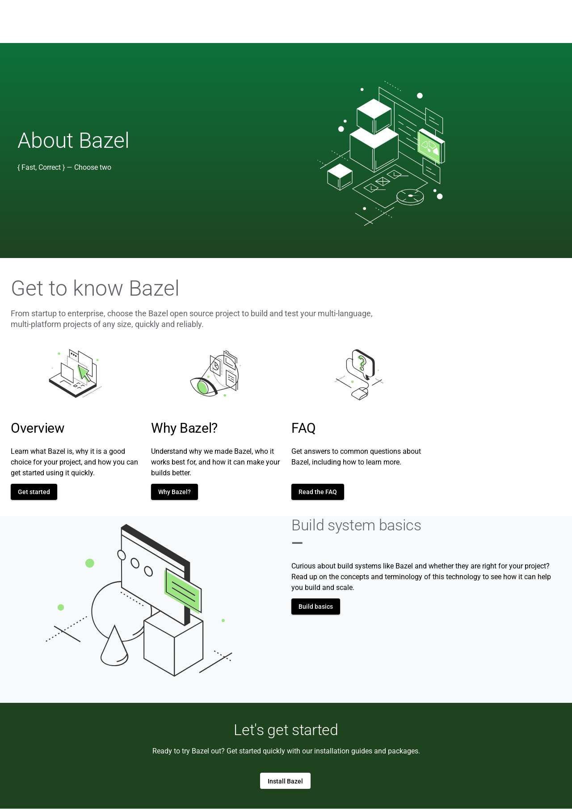 | 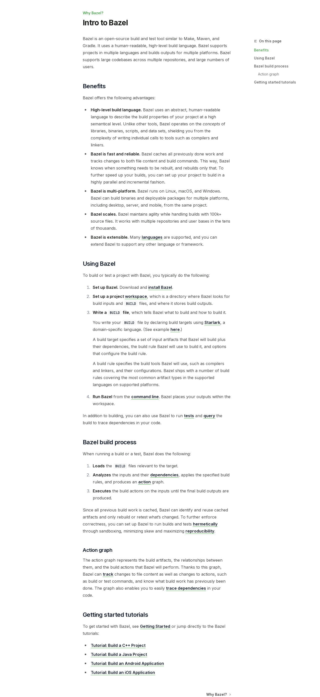 |

- Punctuation (periods) is incorrectly included in the underlined text of links, specifically in 'install Bazel.' and 'command line.'
- Link styling is inconsistent across the page; some links are underlined, while others (like 'languages', 'Starlark', and 'hermetically') are only indicated by green text.
- The 'On this page' table of contents sidebar has an inconsistent dash bullet for the nested 'Action graph' item, while parent items have no bullets.
- There is a heading hierarchy inconsistency: the 'Action graph' heading in the main body is visually identical in size and weight to top-level headings like 'Bazel build process', despite being nested in the table of contents.
- All illustrative graphics and diagrams that defined the original page's visual identity are missing.
- Entire sections from the original page, such as 'FAQ' and 'Build system basics', are missing from the new version of the page.

## /about/faq

Old URL: https://bazel.build/about/faq
New URL: https://preview.bazel.build/about/faq

OK

## /about/intro

Old URL: https://bazel.build/about/intro
New URL: https://preview.bazel.build/about/intro

OK

## /about/roadmap

Old URL: https://bazel.build/about/roadmap
New URL: https://preview.bazel.build/about/roadmap

NOT_OK

## /about/vision

Old URL: https://bazel.build/about/vision
New URL: https://preview.bazel.build/about/vision

OK

## /about/why

Old URL: https://bazel.build/about/why
New URL: https://preview.bazel.build/about/why

OK

## /advanced/performance/build-performance-breakdown

Old URL: https://bazel.build/advanced/performance/build-performance-breakdown
New URL: https://preview.bazel.build/advanced/performance/build-performance-breakdown

OK

## /advanced/performance/build-performance-metrics

Old URL: https://bazel.build/advanced/performance/build-performance-metrics
New URL: https://preview.bazel.build/advanced/performance/build-performance-metrics

| Old | New |
| --- | --- |
| 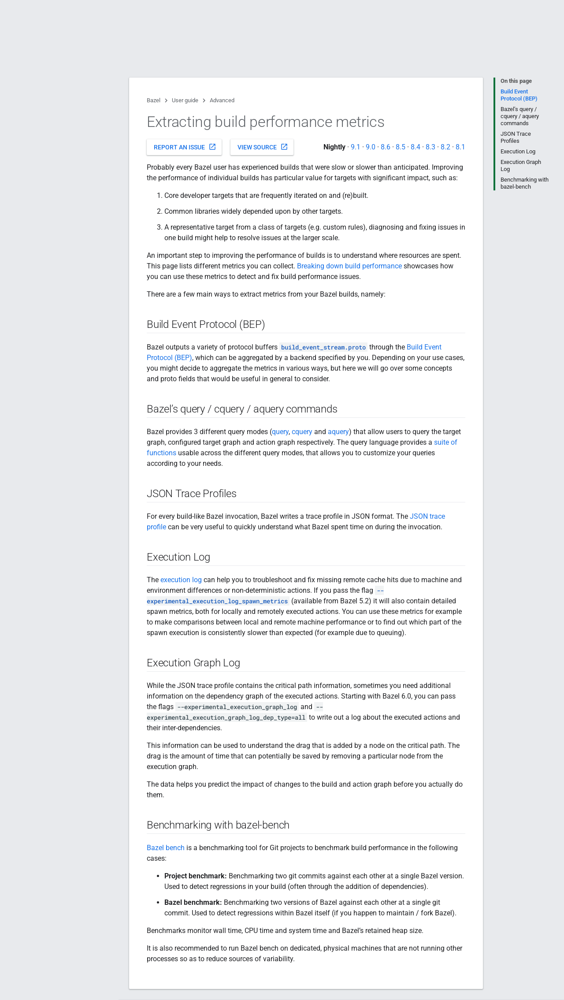 | 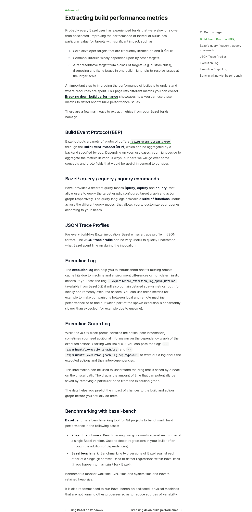 |

- In the 'Execution Log' and 'Execution Graph Log' sections, there are incorrect spaces inserted between the '--' and the rest of the flag name (e.g., '-- experimental_execution_log_spawn_metrics').

## /advanced/performance/iteration-speed

Old URL: https://bazel.build/advanced/performance/iteration-speed
New URL: https://preview.bazel.build/advanced/performance/iteration-speed

OK

## /advanced/performance/json-trace-profile

Old URL: https://bazel.build/advanced/performance/json-trace-profile
New URL: https://preview.bazel.build/advanced/performance/json-trace-profile

OK

## /advanced/performance/memory

Old URL: https://bazel.build/advanced/performance/memory
New URL: https://preview.bazel.build/advanced/performance/memory

| Old | New |
| --- | --- |
| 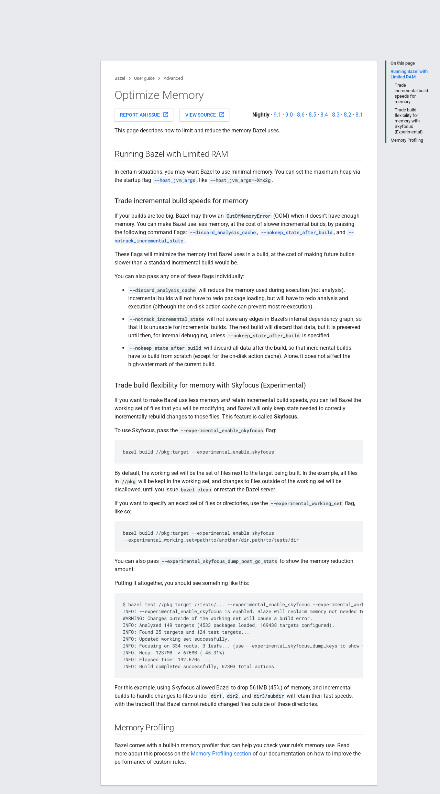 | 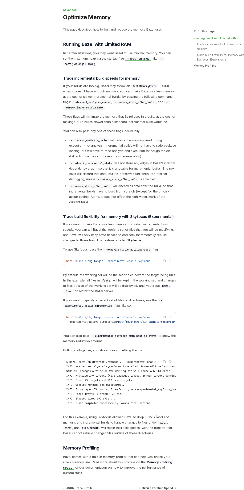 |

- Extra whitespace has been introduced before punctuation (commas and periods) that follow inline code snippets, such as in "--host_jvm_args ,", "--notrack_incremental_state .", and "dir1 , dir2 ,".
- The command "bazel clean" in the text has been incorrectly split into two separate code blocks with a space in between, whereas it was a single code block in the original.
- In the section "Trade build flexibility for memory with Skyfocus (Experimental)", the flag name "--experimental_working_set" has been changed to "--experimental_active_directories" in both the description text and the code examples.

## /basics

Old URL: https://bazel.build/basics
New URL: https://preview.bazel.build/basics

| Old | New |
| --- | --- |
| 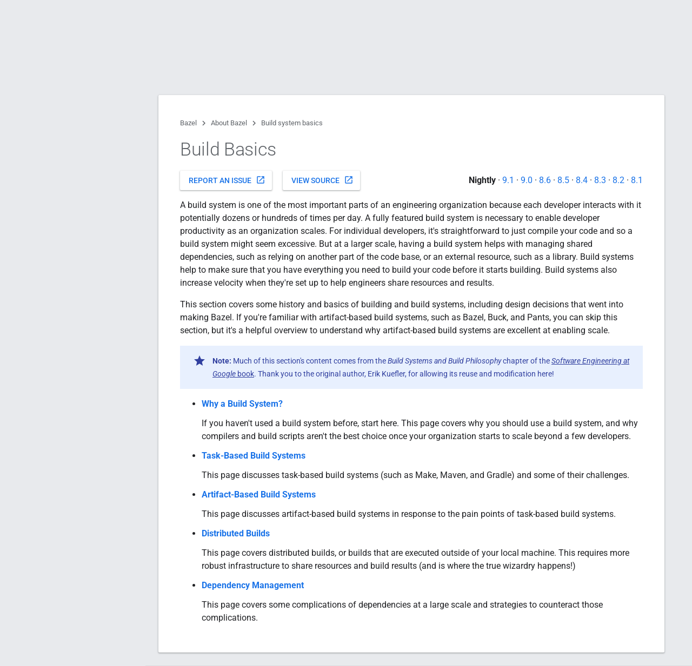 |  |

- The note callout starting with 'Much of this section's content comes from...' is unstyled on the new site, missing its background color and icon.

## /basics/artifact-based-builds

Old URL: https://bazel.build/basics/artifact-based-builds
New URL: https://preview.bazel.build/basics/artifact-based-builds

| Old | New |
| --- | --- |
| 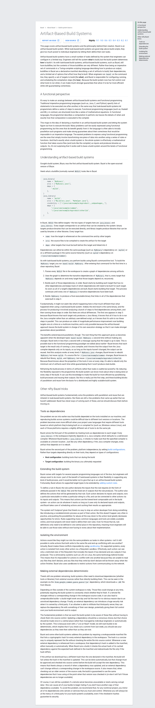 | 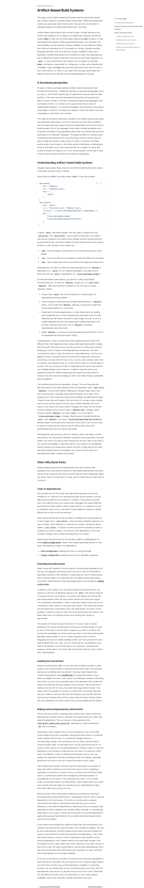 |

- Extra spaces are incorrectly introduced between inline code segments and following punctuation marks throughout the page, such as 'MyBinary 's', 'java_library .', and 'java_library ,'.
- Numerous inline links from the original documentation have been lost in the migration, including links for 'artifact-based build system', 'Blaze', 'Maven', 'distributed', 'highly scalable', and the target attributes 'name', 'srcs', and 'deps'.

## /basics/build-systems

Old URL: https://bazel.build/basics/build-systems
New URL: https://preview.bazel.build/basics/build-systems

OK

## /basics/dependencies

Old URL: https://bazel.build/basics/dependencies
New URL: https://preview.bazel.build/basics/dependencies

OK

## /basics/distributed-builds

Old URL: https://bazel.build/basics/distributed-builds
New URL: https://preview.bazel.build/basics/distributed-builds

OK

## /basics/hermeticity

Old URL: https://bazel.build/basics/hermeticity
New URL: https://preview.bazel.build/basics/hermeticity

| Old | New |
| --- | --- |
| 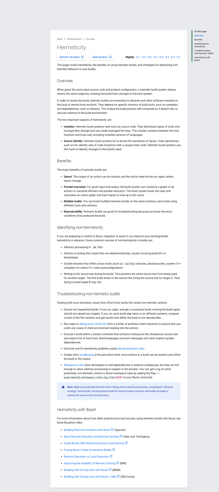 | 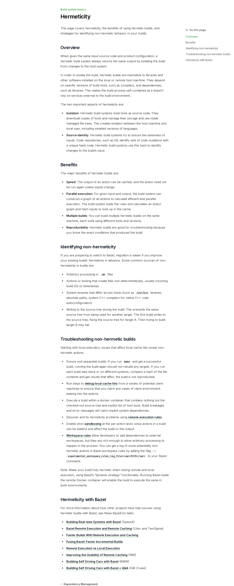 |

- The "Note" callout in the "Troubleshooting non-hermeticity builds" section is missing its styling (blue background and icon) in the new site.
- Raw HTML tags (<var>) are visible in the code block at the end of the "Troubleshooting non-hermeticity builds" section.

## /basics/task-based-builds

Old URL: https://bazel.build/basics/task-based-builds
New URL: https://preview.bazel.build/basics/task-based-builds

| Old | New |
| --- | --- |
| 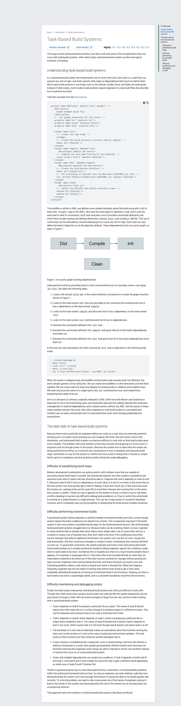 | 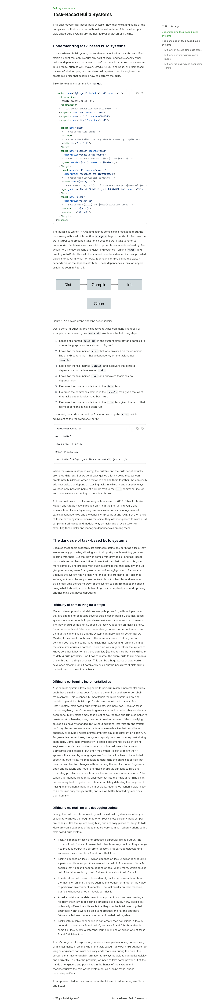 |

- The 'REPORT AN ISSUE' and 'VIEW SOURCE' buttons are missing from the top of the page.
- The text 'ant dist' in the paragraph preceding the numbered list is missing its monospace code formatting.
- The shell script code block is missing the '$' prompt characters at the start of each line that were present in the original version.

## /brand

Old URL: https://bazel.build/brand
New URL: https://preview.bazel.build/brand

OK

## /build/share-variables

Old URL: https://bazel.build/build/share-variables
New URL: https://preview.bazel.build/build/share-variables

OK

## /build/style-guide

Old URL: https://bazel.build/build/style-guide
New URL: https://preview.bazel.build/build/style-guide

OK

## /community

Old URL: https://bazel.build/community
New URL: https://preview.bazel.build/community

| Old | New |
| --- | --- |
| 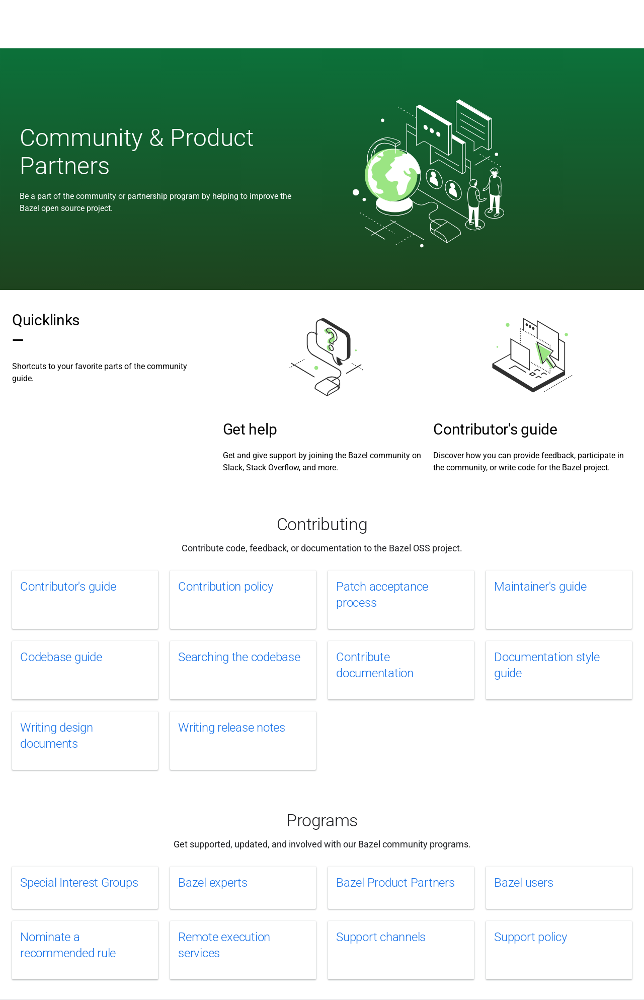 | 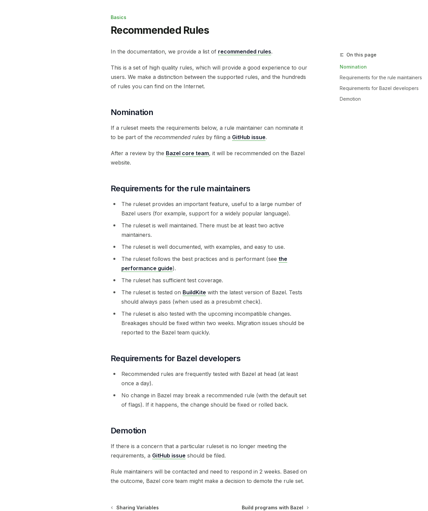 |

- The content of the new page ('Recommended Rules') does not match the content of the old page ('Community & Product Partners').
- The illustrations, green banner, and structured sections (Quicklinks, Contributing, Programs) with navigation cards from the old page are entirely missing in the new version.
- The page title has been changed from 'Community & Product Partners' to 'Recommended Rules'.

## /community/experts

Old URL: https://bazel.build/community/experts
New URL: https://preview.bazel.build/community/experts

| Old | New |
| --- | --- |
| 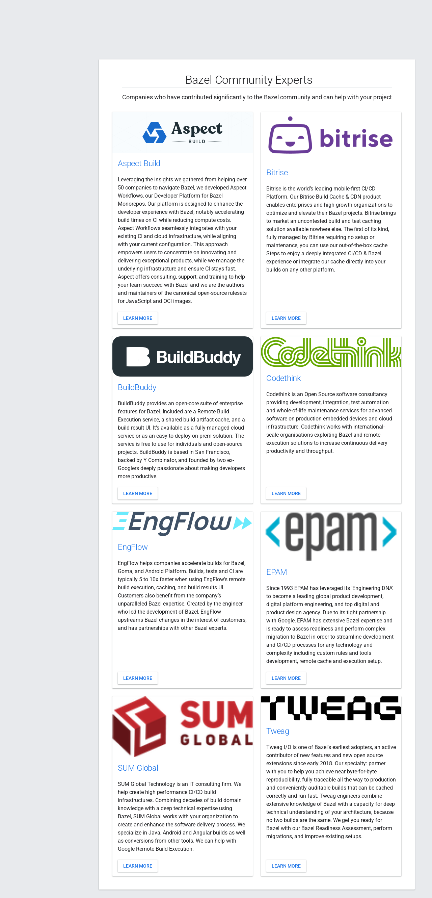 | 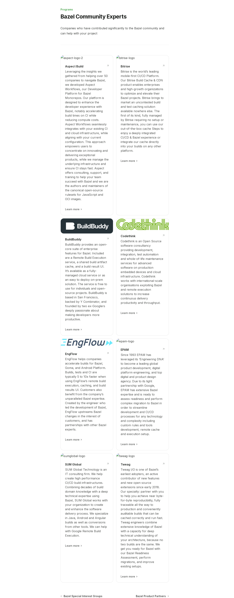 |

- The logo images for Aspect Build, Bitrise, EPAM, SUM Global, and Tweag are broken on the new site, showing only their filenames or alt-text (e.g., 'aspect-logo-2', 'bitrise-logo', 'epam-logo', 'sumglobal-logo', and 'tweag-logo') instead of the actual logos.

## /community/partners

Old URL: https://bazel.build/community/partners
New URL: https://preview.bazel.build/community/partners

| Old | New |
| --- | --- |
| 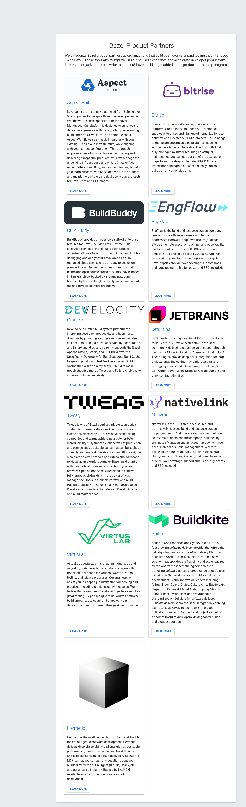 | 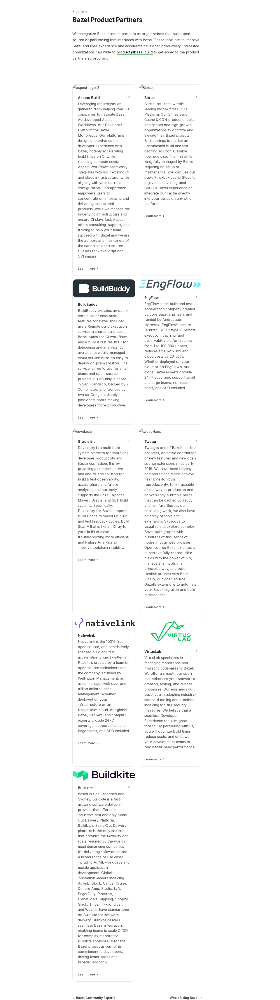 |

- The logo for Aspect Build is missing and replaced by the text 'aspect-logo-2'.
- The logo for Bitrise is missing and replaced by text.
- The logo for Gradle Inc. is missing and replaced by the text 'Develocity'.
- The logo for Tweag is missing and replaced by the text 'tweag-logo'.
- The partner card for JetBrains is missing from the page.
- The partner card for Hermetiq is missing from the page.

## /community/recommended-rules

Old URL: https://bazel.build/community/recommended-rules
New URL: https://preview.bazel.build/community/recommended-rules

| Old | New |
| --- | --- |
| 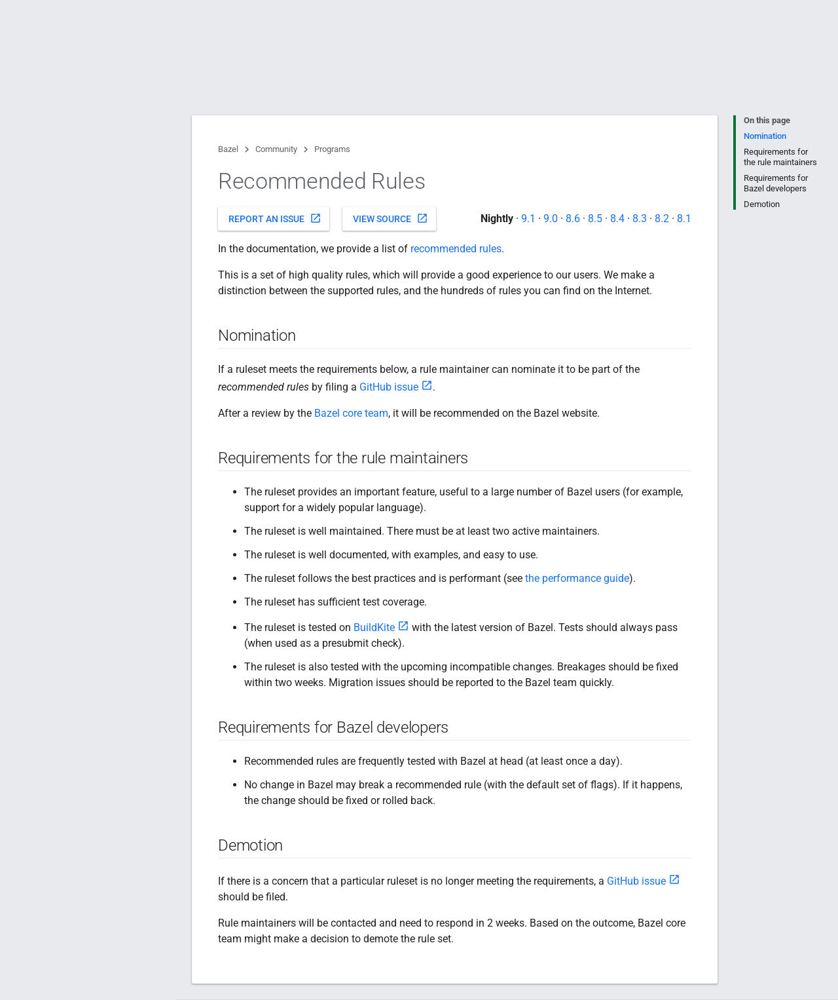 |  |

- The 'REPORT AN ISSUE' and 'VIEW SOURCE' buttons at the top of the page are missing in the new version.
- The breadcrumbs have changed from 'Bazel > Community > Programs' in the old version to just 'Basics' in the new version.

## /community/remote-execution-services

Old URL: https://bazel.build/community/remote-execution-services
New URL: https://preview.bazel.build/community/remote-execution-services

OK

## /community/sig

Old URL: https://bazel.build/community/sig
New URL: https://preview.bazel.build/community/sig

OK

## /community/update

Old URL: https://bazel.build/community/update
New URL: https://preview.bazel.build/community/update

NOT_OK

## /community/users

Old URL: https://bazel.build/community/users
New URL: https://preview.bazel.build/community/users

| Old | New |
| --- | --- |
|  |  |

- The 'Note' callout at the top of the page is unstyled and missing its icon.
- There are numerous broken images throughout the 'Companies using Bazel' section, such as for Adobe, Ascend.io, FINDMINE, and LingoChamp.

## /concepts

Old URL: https://bazel.build/concepts
New URL: https://preview.bazel.build/concepts

| Old | New |
| --- | --- |
| 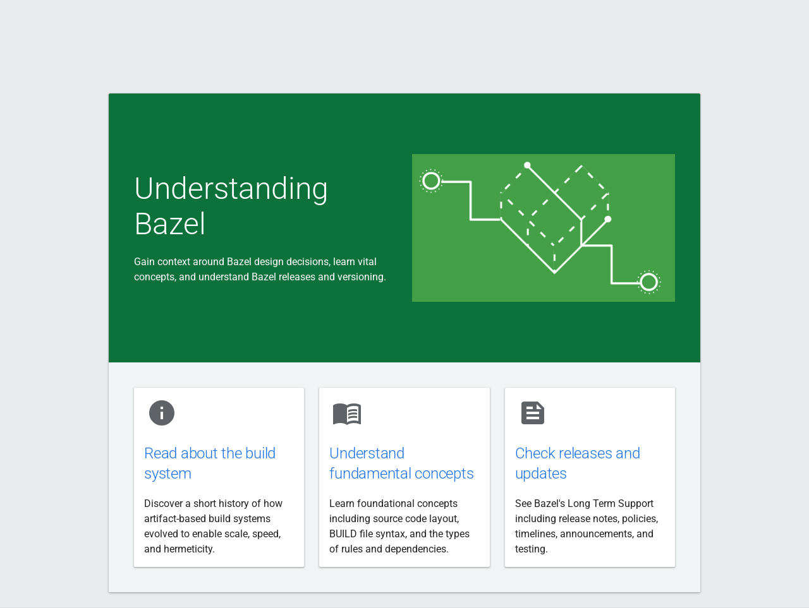 |  |

- The text 'Labelsarrow_forward' at the bottom of the page appears to be a broken UI element where a Material Icon name has been concatenated with the text string.
- The page content and title do not match the old version of the page; the original 'Understanding Bazel' landing page featured three main sections ('Read about the build system', 'Understand fundamental concepts', and 'Check releases and updates'), while the new page only includes the 'fundamental concepts' content and has a different title.

## /concepts/build-files

Old URL: https://bazel.build/concepts/build-files
New URL: https://preview.bazel.build/concepts/build-files

| Old | New |
| --- | --- |
| 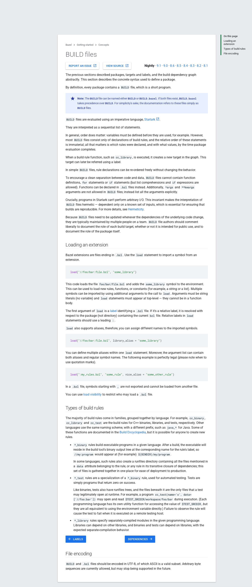 | 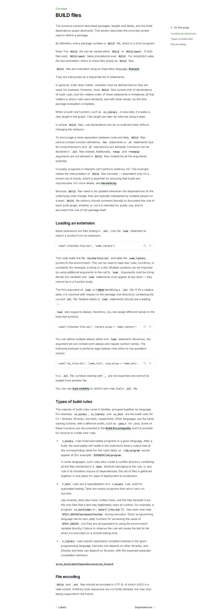 |

- The 'Note' callout (admonition) at the top of the page is unstyled, lacking the background color and icon present in the original.
- There is broken navigation text ('arrow_backLabelsDependenciesarrow_forward') appearing before the 'File encoding' section, which seems to be a failure to render the previous/next buttons correctly.

## /concepts/build-ref

Old URL: https://bazel.build/concepts/build-ref
New URL: https://preview.bazel.build/concepts/build-ref

| Old | New |
| --- | --- |
| 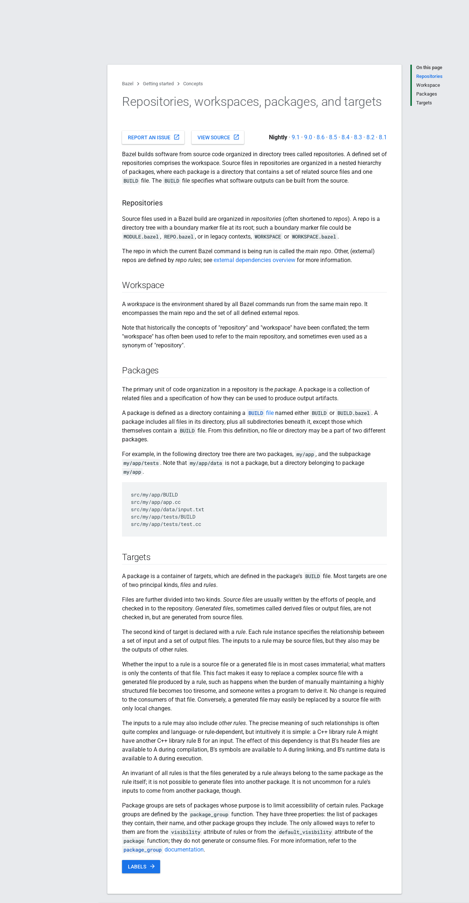 | 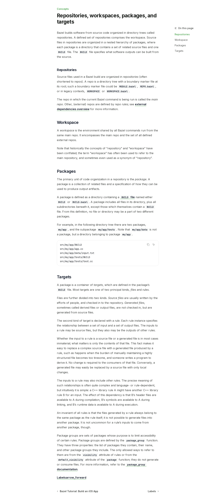 |

- The 'LABELS' button at the bottom of the page is incorrectly rendered as text 'Labelsarrow_forward', where 'arrow_forward' is likely a Material Design icon name that failed to render as an icon.
- The link for 'package_group documentation' at the end of the Targets section has an extraneous leading underscore.
- Inline code snippets (such as 'BUILD', 'MODULE.bazel', 'REPO.bazel', etc.) have lost their monospace font styling and are now only rendered as bold text, making them harder to distinguish as code elements.

## /concepts/dependencies

Old URL: https://bazel.build/concepts/dependencies
New URL: https://preview.bazel.build/concepts/dependencies

| Old | New |
| --- | --- |
| 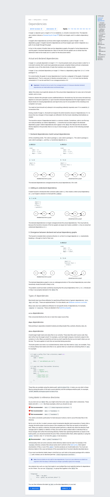 | 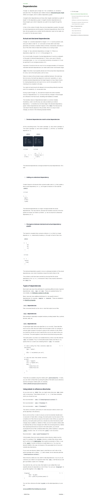 |

- The 'Important' and 'Note' callouts (admonitions) are missing their background color and icons.
- All dependency graph diagrams are missing throughout the 'Actual and declared dependencies' section.
- The code block filename headers (e.g., 'a/BUILD', 'b/BUILD') have lost their formatting and are now plain text.
- The 'Recommended' and 'Not recommended' indicators are missing their thumb icons and color-coded text styling.

## /concepts/labels

Old URL: https://bazel.build/concepts/labels
New URL: https://preview.bazel.build/concepts/labels

| Old | New |
| --- | --- |
| 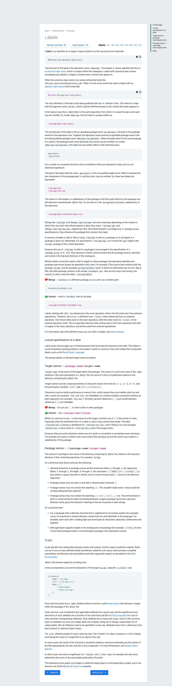 | 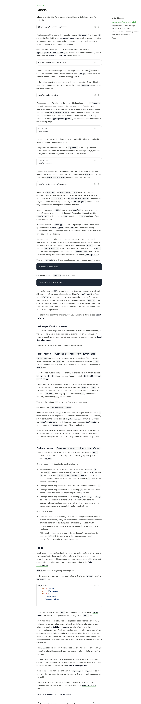 |

- Raw HTML tags (<var>) are visible in the section headings for 'Target names' and 'Package names'.
- Raw HTML tags (<var>) are visible in the 'On this page' table of contents for 'Target names' and 'Package names'.
- The footer navigation contains raw icon font names ('arrow_back' and 'arrow_forward') rendered as text instead of displaying icons.
- The 'Wrong' and 'Correct' callouts are missing their respective thumbs-up and thumbs-down icons.

## /concepts/platforms

Old URL: https://bazel.build/concepts/platforms
New URL: https://preview.bazel.build/concepts/platforms

| Old | New |
| --- | --- |
| 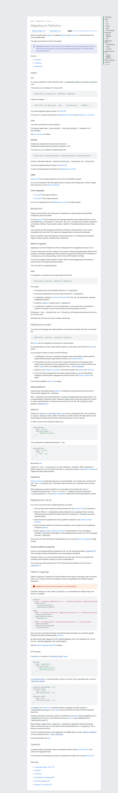 | 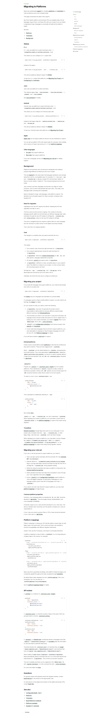 |

- The 'Caution' admonition in the 'Platform mappings' section is unstyled, as it lacks the background and border present in other callouts like 'Key Point'.
- In the 'On this page' navigation sidebar, 'Common platform properties' and 'Platform mappings' are incorrectly indented as sub-items under 'Migrating your rule set', despite being top-level H2 sections in the content.

## /concepts/visibility

Old URL: https://bazel.build/concepts/visibility
New URL: https://preview.bazel.build/concepts/visibility

OK

## /configure/attributes

Old URL: https://bazel.build/configure/attributes
New URL: https://preview.bazel.build/configure/attributes

ERROR

## /configure/best-practices

Old URL: https://bazel.build/configure/best-practices
New URL: https://preview.bazel.build/configure/best-practices

| Old | New |
| --- | --- |
| 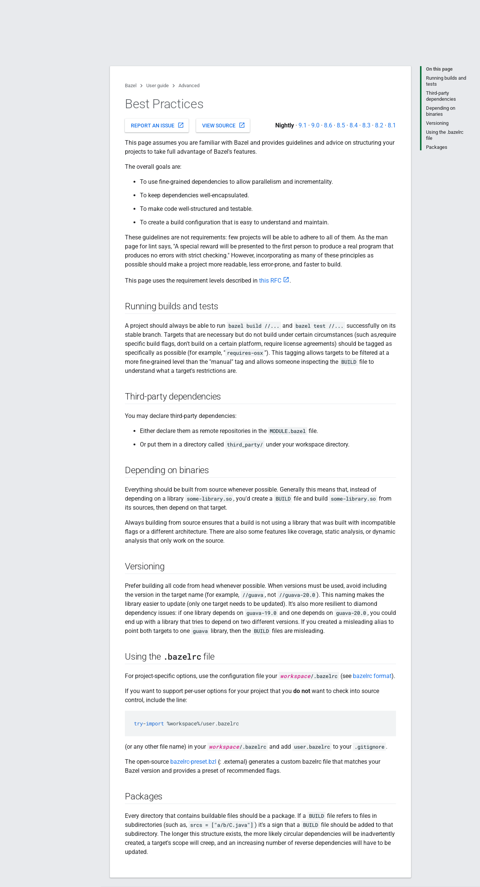 | 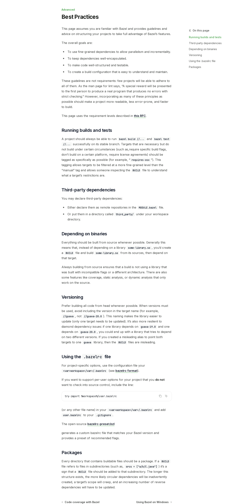 |

- Literal HTML tags (<var> and </var>) are visible in the text within the 'Using the .bazelrc file' section.
- An incorrect paragraph break splits a sentence after the 'bazelrc-preset.bzl' link in the 'Using the .bazelrc file' section.

## /configure/coverage

Old URL: https://bazel.build/configure/coverage
New URL: https://preview.bazel.build/configure/coverage

OK

## /configure/integrate-cpp

Old URL: https://bazel.build/configure/integrate-cpp
New URL: https://preview.bazel.build/configure/integrate-cpp

| Old | New |
| --- | --- |
| 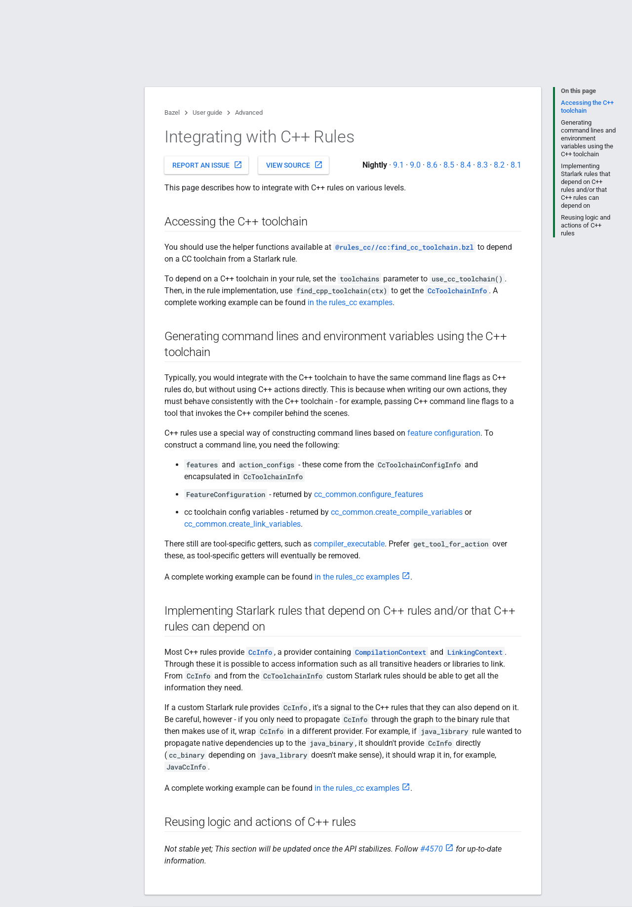 | 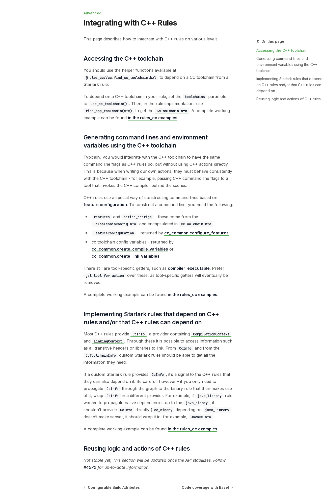 |

- There are extra spaces before punctuation (commas and periods) when they immediately follow a link or code span, such as 'CcInfo ,', 'LinkingContext .', and 'examples .'.
- There are unnecessary line breaks within the bullet points in the 'Generating command lines and environment variables using the C++ toolchain' section, causing the text to wrap prematurely.

## /configure/windows

Old URL: https://bazel.build/configure/windows
New URL: https://preview.bazel.build/configure/windows

| Old | New |
| --- | --- |
| 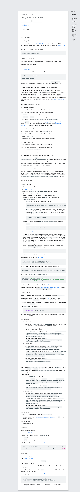 |  |

- Multiple code blocks throughout the page are showing raw HTML tags such as '<code class="devsite-terminal" ...>' instead of rendering properly. This occurs in the 'Build C++ with MSVC', 'Build Java', and 'Build Python' sections.

## /contribute

Old URL: https://bazel.build/contribute
New URL: https://preview.bazel.build/contribute

| Old | New |
| --- | --- |
| 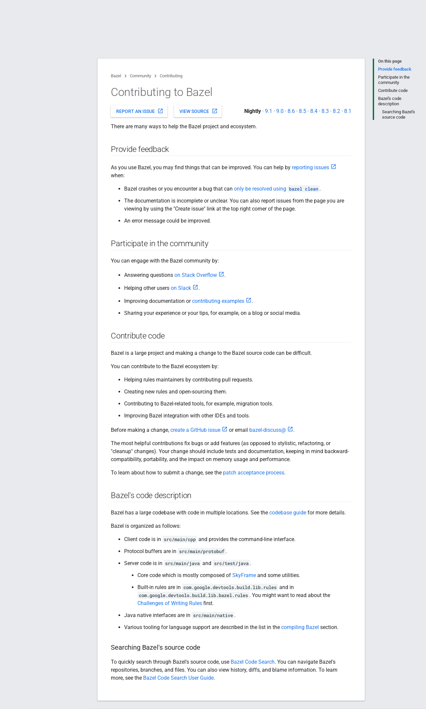 | 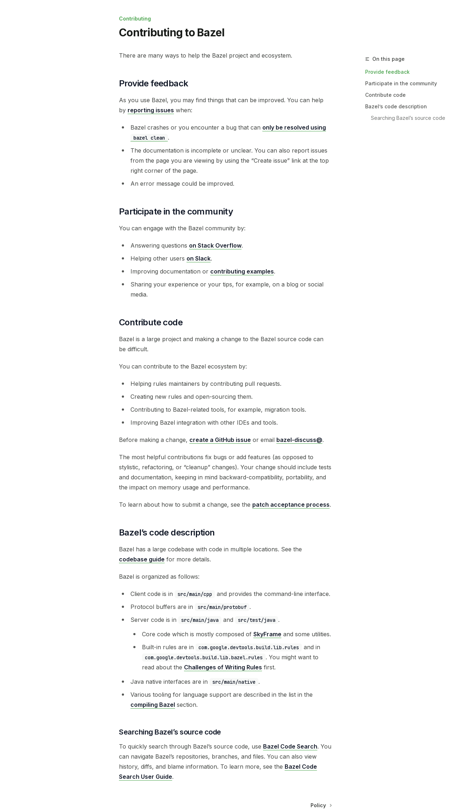 |

- The "REPORT AN ISSUE" and "VIEW SOURCE" buttons are missing from the top of the page.
- There are unnecessary extra spaces before periods that follow inline code blocks throughout the page (e.g., after `bazel clean`, `src/main/protobuf`, `src/test/java`, `com.google.devtools.build.lib.bazel.rules`, and `src/main/native`).

## /contribute/breaking-changes

Old URL: https://bazel.build/contribute/breaking-changes
New URL: https://preview.bazel.build/contribute/breaking-changes

| Old | New |
| --- | --- |
| 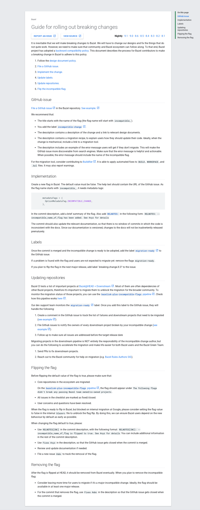 | 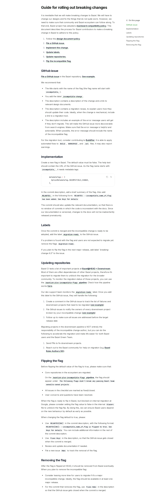 |

- External link icons (box with arrow) are missing from all links that previously had them.
- Inconsistent link styling: several links are missing underlines or other visual indicators that they are clickable, specifically 'incompatible-change', 'migration-ready', and 'Bazel Rules Authors SIG'.

## /contribute/codebase

Old URL: https://bazel.build/contribute/codebase
New URL: https://preview.bazel.build/contribute/codebase

OK

## /contribute/design-documents

Old URL: https://bazel.build/contribute/design-documents
New URL: https://preview.bazel.build/contribute/design-documents

| Old | New |
| --- | --- |
| 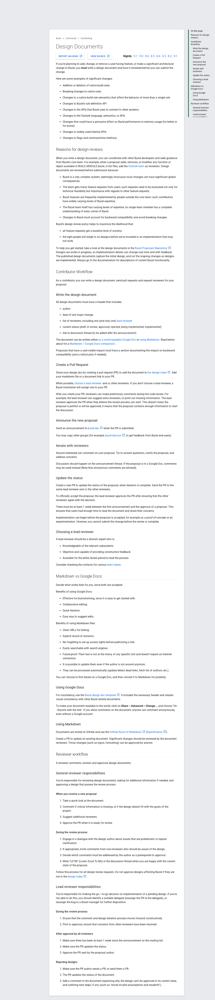 | 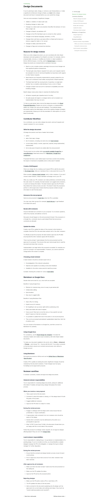 |

- The 'REPORT AN ISSUE' and 'VIEW SOURCE' buttons are missing from the top of the content area.
- The breadcrumb path is incomplete, showing only 'Contributing' instead of 'Bazel > Community > Contributing'.
- The 'On this page' sidebar is missing the 'Rejecting designs' section heading.
- The 'On this page' sidebar incorrectly includes 'During the review process' as a sub-item under 'Reviewer workflow' while omitting other equivalent sub-headings from the content, such as 'When you receive a new proposal' and 'After approval by all reviewers'.

## /contribute/docs

Old URL: https://bazel.build/contribute/docs
New URL: https://preview.bazel.build/contribute/docs

OK

## /contribute/docs-style-guide

Old URL: https://bazel.build/contribute/docs-style-guide
New URL: https://preview.bazel.build/contribute/docs-style-guide

| Old | New |
| --- | --- |
|  |  |

- The 'Note' callout in the 'File type' section is unstyled, appearing as plain text instead of a highlighted box with an icon.
- The 'Inline code formatting' heading is missing from the 'On this page' navigation sidebar.
- The nested ordered list items in the 'Lists' section are incorrectly rendered with both bullet points and numbers.
- The 'Yes' and 'No' icons and their associated green and red colors are missing from example sections throughout the page.

## /contribute/maintainers-guide

Old URL: https://bazel.build/contribute/maintainers-guide
New URL: https://preview.bazel.build/contribute/maintainers-guide

OK

## /contribute/patch-acceptance

Old URL: https://bazel.build/contribute/patch-acceptance
New URL: https://preview.bazel.build/contribute/patch-acceptance

OK

## /contribute/policy

Old URL: https://bazel.build/contribute/policy
New URL: https://preview.bazel.build/contribute/policy

| Old | New |
| --- | --- |
| 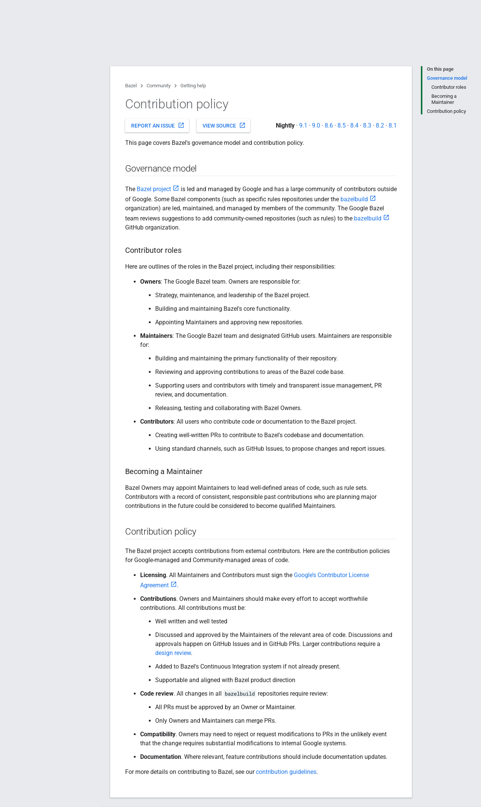 |  |

- The page metadata (frontmatter) such as 'translation: human', 'page_type: lcat', and 'title: 'Contribution policy'' is being incorrectly rendered as visible text at the top of the content area.
- The main page title has been incorrectly split into 'Contributing' and 'Policy' instead of using the full title 'Contribution policy'.
- The 'On this page' navigation sidebar incorrectly includes the raw metadata strings in its list of sections.

## /contribute/release-notes

Old URL: https://bazel.build/contribute/release-notes
New URL: https://preview.bazel.build/contribute/release-notes

| Old | New |
| --- | --- |
| 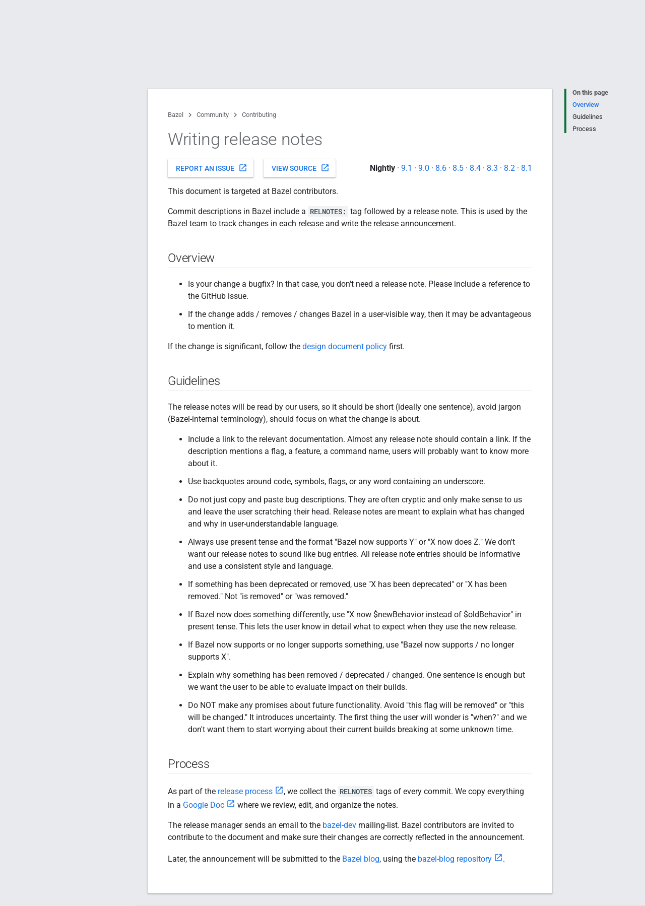 | 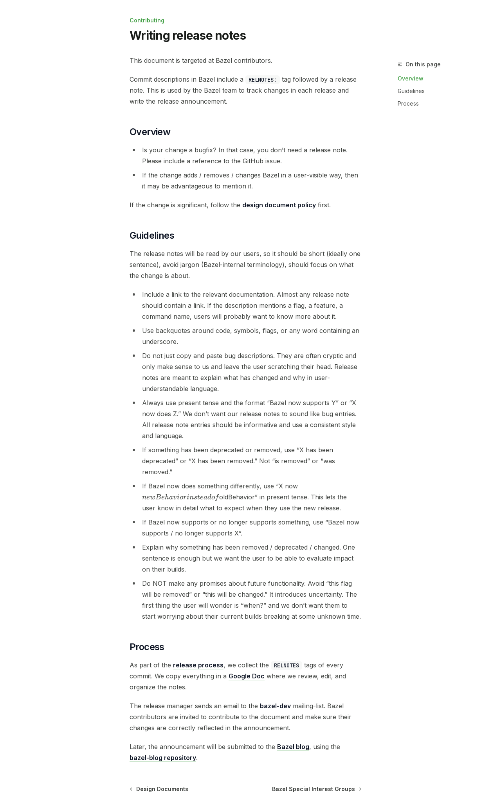 |

- In the 'Guidelines' section, the text 'relevant documentation' in the first bullet point is no longer a link.
- In the 'Guidelines' section, the sixth bullet point contains corrupted text: the example 'X now $newBehavior instead of $oldBehavior' has been rendered as 'X now newBehaviorinsteadofoldBehavior' with missing spaces, missing dollar signs, and incorrect italicization.

## /contribute/search

Old URL: https://bazel.build/contribute/search
New URL: https://preview.bazel.build/contribute/search

ERROR

## /contribute/statemachine-guide

Old URL: https://bazel.build/contribute/statemachine-guide
New URL: https://preview.bazel.build/contribute/statemachine-guide

OK

## /docs

Old URL: https://bazel.build/docs
New URL: https://preview.bazel.build/docs

ERROR

## /docs/android-build-performance

Old URL: https://bazel.build/docs/android-build-performance
New URL: https://preview.bazel.build/docs/android-build-performance

| Old | New |
| --- | --- |
| 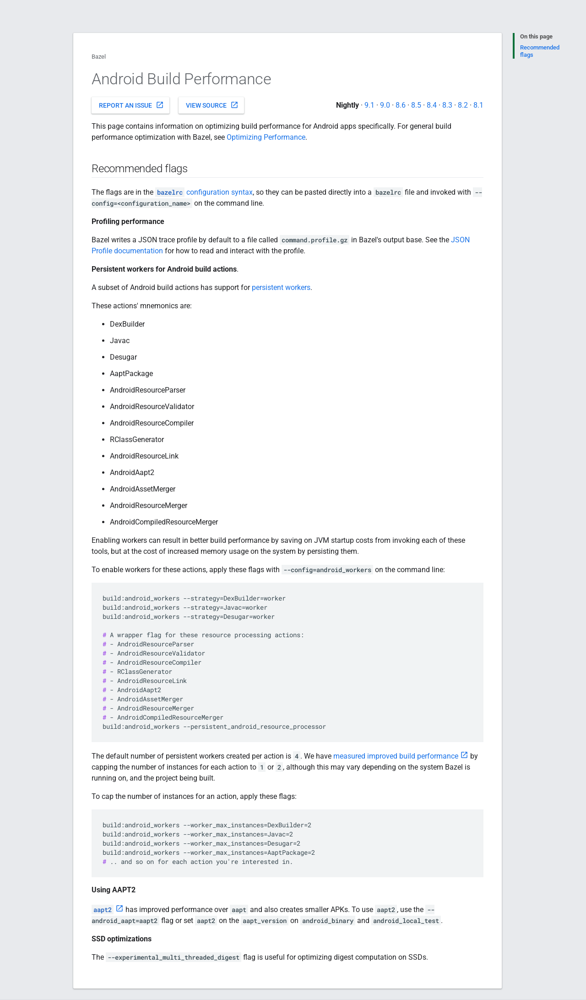 | 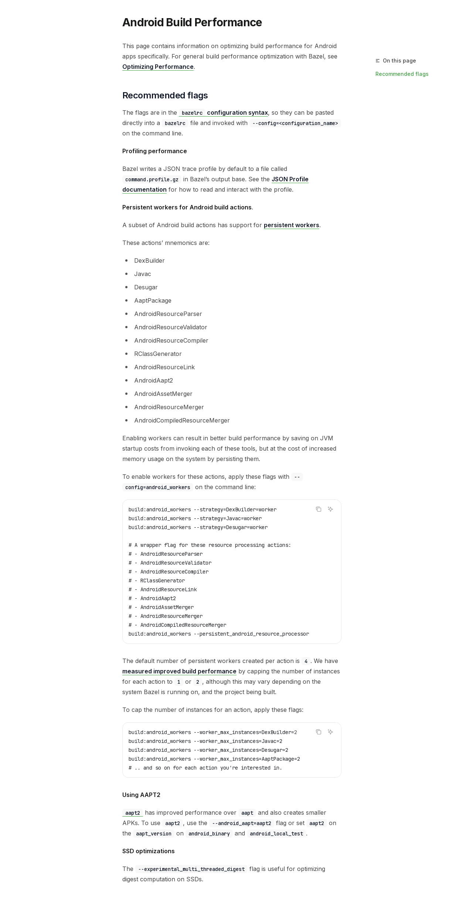 |

- The numbers '4', '1', and '2' in the paragraph regarding persistent workers have lost their inline code formatting.
- There are unnecessary extra spaces before punctuation marks (commas and periods) that follow inline code blocks, such as in 'action is 4 .', 'to 1 or 2 ,', 'To use aapt2 ,', and 'android_local_test .'.
- The link for 'aapt2' at the beginning of the 'Using AAPT2' section has been removed and is now just plain inline code.

## /docs/android-instrumentation-test

Old URL: https://bazel.build/docs/android-instrumentation-test
New URL: https://preview.bazel.build/docs/android-instrumentation-test

OK

## /docs/android-ndk

Old URL: https://bazel.build/docs/android-ndk
New URL: https://preview.bazel.build/docs/android-ndk

| Old | New |
| --- | --- |
| 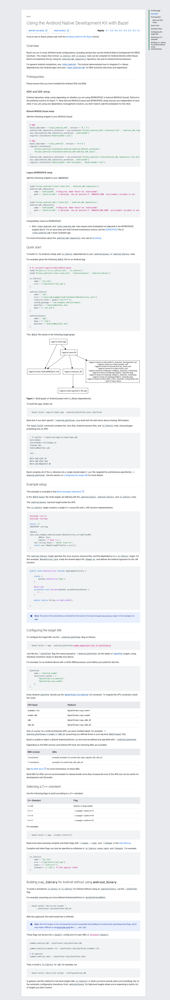 | 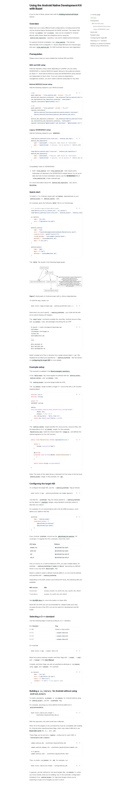 |

- Literal HTML tags '<var>' and '</var>' are visible within the first code block of the 'Configuring the target ABI' section.
- The 'cc_library' and 'cc_binary' rules in the first paragraph of the 'Overview' section are missing code-style formatting.
- The terms '--android_platforms=//:arm64,//:x86_64' and 'BUILD.bazel' in the body text of the 'Configuring the target ABI' section are missing code-style formatting.
- Multiple terms in the 'Building a cc_library for Android without using android_binary' section, including 'my/platforms/BUILD', 'bazelrc', 'project/.bazelrc', and the wild-cards '/...' and ':all', are missing code-style formatting.

## /docs/bazel-and-android

Old URL: https://bazel.build/docs/bazel-and-android
New URL: https://preview.bazel.build/docs/bazel-and-android

| Old | New |
| --- | --- |
|  |  |

- Missing 'REPORT AN ISSUE' and 'VIEW SOURCE' buttons below the main heading.
- Missing external link icons for external links such as 'Codelab: Building Android Apps with Bazel' and 'rules_jvm_external'.
- Missing 'Bazel' breadcrumb/category label above the main 'Android and Bazel' heading.

## /docs/bazel-and-apple

Old URL: https://bazel.build/docs/bazel-and-apple
New URL: https://preview.bazel.build/docs/bazel-and-apple

| Old | New |
| --- | --- |
|  |  |

- In the 'Xcode selection' section, the inline code snippet '--xcode_version' is incorrectly split across two lines.
- The monospaced formatting is missing for the string '@local_config_xcode//:host_available_xcodes' in the final paragraph, appearing as regular bold text instead.
- Several items that were plain monospaced text in the original (such as those in the 'Modules', 'Configuration fragments', and 'Providers' lists) are now styled as links with underlines and green coloring, which appears to be a migration error.

## /docs/bazel-and-cpp

Old URL: https://bazel.build/docs/bazel-and-cpp
New URL: https://preview.bazel.build/docs/bazel-and-cpp

| Old | New |
| --- | --- |
|  |  |

- The 'Toolchain features' section is incorrectly nested as a subsection of 'Best practices' instead of being a top-level section.
- In the 'Include paths' section, the angle brackets in the '#include <foo/bar/baz.h>' code snippet are incorrectly rendered as HTML entities ('&lt;' and '&gt;').
- In the 'Include paths' section, the directory shortcuts '.' and '..' are missing their code-style formatting.
- In the 'BUILD files' section, there is an extra space before the period at the end of the sentence '...[library-name]_test.cc .'.

## /docs/bazel-and-java

Old URL: https://bazel.build/docs/bazel-and-java
New URL: https://preview.bazel.build/docs/bazel-and-java

| Old | New |
| --- | --- |
|  |  |

- Widespread missing inline code styling: many terms that should be rendered as code (e.g., --java_runtime_version, .bazelrc, src/main/java, BUILD, java_library) are displayed as plain text without the monospaced font and background shading present in the original document.
- The 'On this page' table of contents sidebar is incomplete, failing to include several sections that are present on the page, such as 'Multiple versions of Java source code in a single repository' and all the sub-sections under 'Configuring the Java toolchains' (e.g., 'Configuring additional execution toolchains').
- In the 'Configuring the version of the source code in your repository' section, the placeholder syntax '{ver}' from the original site has been incorrectly changed to '(ver)' in the new site's text.

## /docs/bazel-and-javascript

Old URL: https://bazel.build/docs/bazel-and-javascript
New URL: https://preview.bazel.build/docs/bazel-and-javascript

OK

## /docs/cc-toolchain-config-reference

Old URL: https://bazel.build/docs/cc-toolchain-config-reference
New URL: https://preview.bazel.build/docs/cc-toolchain-config-reference

| Old | New |
| --- | --- |
|  | 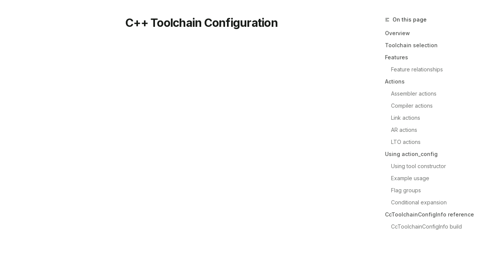 |

- The entire main content of the page is missing, leaving a large blank area below the 'C++ Toolchain Configuration' header.

## /docs/configurable-attributes

Old URL: https://bazel.build/docs/configurable-attributes
New URL: https://preview.bazel.build/docs/configurable-attributes

ERROR

## /docs/mobile-install

Old URL: https://bazel.build/docs/mobile-install
New URL: https://preview.bazel.build/docs/mobile-install

| Old | New |
| --- | --- |
| 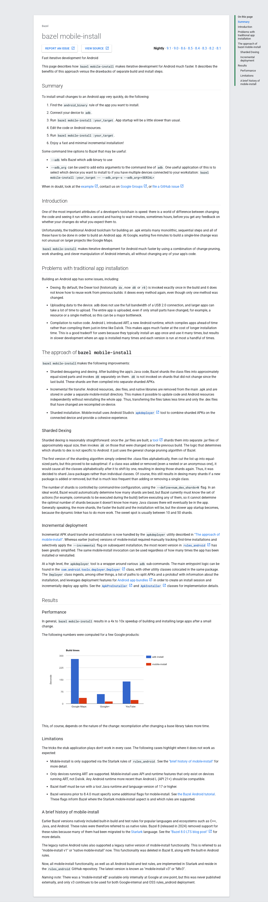 | 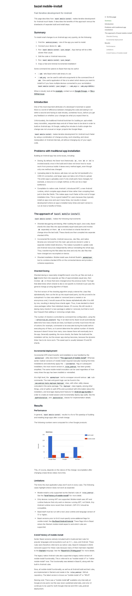 |

- The 'Limitations' and 'A brief history of mobile-install' sections are incorrectly nested under 'Results' in the 'On this page' navigation sidebar.

## /docs/sandboxing

Old URL: https://bazel.build/docs/sandboxing
New URL: https://preview.bazel.build/docs/sandboxing

OK

## /docs/user-manual

Old URL: https://bazel.build/docs/user-manual
New URL: https://preview.bazel.build/docs/user-manual

| Old | New |
| --- | --- |
|  |  |

- Bullet points and colons are missing from several lists describing option values (e.g., under --compilation_mode, --spawn_strategy, --test_output, and --announce_rc), causing them to appear as plain paragraphs instead of clear list items.

## /extending

Old URL: https://bazel.build/extending
New URL: https://preview.bazel.build/extending

| Old | New |
| --- | --- |
| 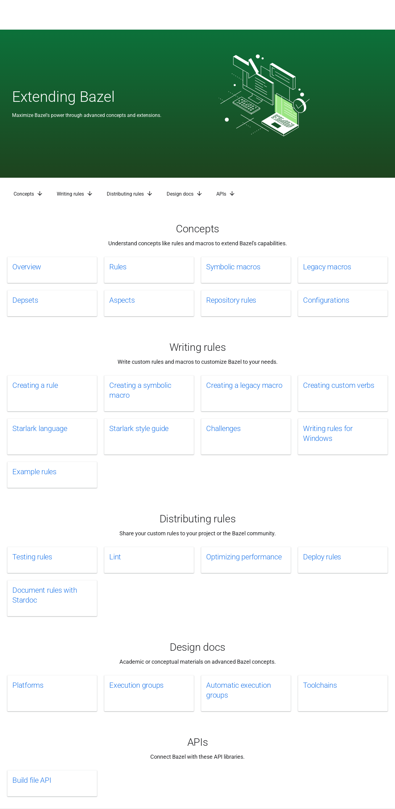 |  |

- There is an extra space before the period following the first mention of ".bzl" in the first paragraph.
- There is an extra space before the comma following the first instance of the word "genrule" in the "Macros and rules" section.
- The new page is missing several navigation items and sections that were present on the original page, such as cards for "Depsets", "Configurations", "Platforms", "Execution groups", and "Toolchains".

## /extending/aspects

Old URL: https://bazel.build/extending/aspects
New URL: https://preview.bazel.build/extending/aspects

OK

## /extending/auto-exec-groups

Old URL: https://bazel.build/extending/auto-exec-groups
New URL: https://preview.bazel.build/extending/auto-exec-groups

| Old | New |
| --- | --- |
| 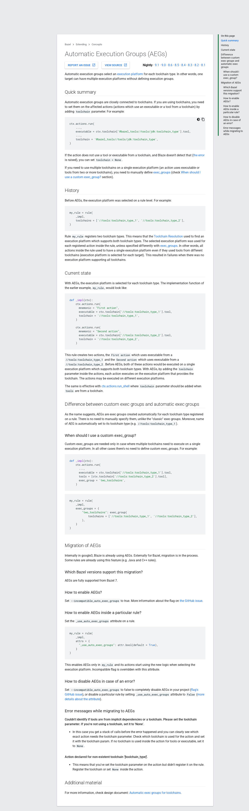 | 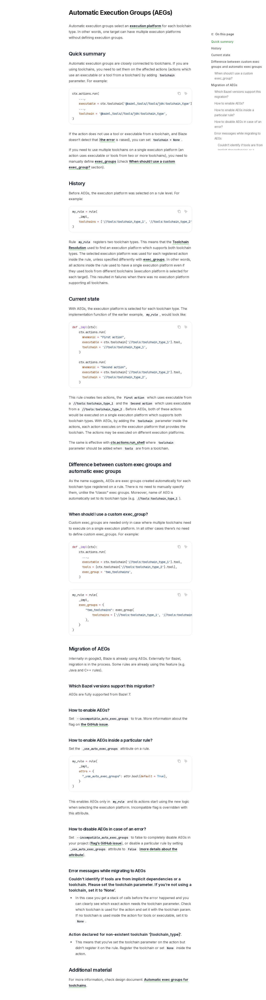 |

- Missing link for the text '(the error is raised)' in the 'Quick summary' section; it has been replaced by bold text.
- Missing monospace formatting for 'my_rule' in the 'History', 'Current state', and 'How to enable AEGs inside a particular rule?' sections.
- Missing monospace formatting for 'First action' and 'Second action' in the 'Current state' section.
- Missing monospace formatting for 'exec_groups' in the 'Quick summary' section and its related link.
- Missing monospace formatting for 'toolchain', 'ctx.actions.run_shell', and 'tools' in the body text of the 'Current state' section.
- Missing monospace formatting for 'tools' and 'toolchain' in the 'Error messages while migrating to AEGs' section.
- Missing monospace formatting for 'toolchain' in the 'Action declared for non-existent toolchain...' section.

## /extending/concepts

Old URL: https://bazel.build/extending/concepts
New URL: https://preview.bazel.build/extending/concepts

OK

## /extending/config

Old URL: https://bazel.build/extending/config
New URL: https://preview.bazel.build/extending/config

| Old | New |
| --- | --- |
|  |  |

- Stray 'E' character appearing before 'on this page' in both the breadcrumb navigation and the right sidebar title.
- Unrendered markdown list in the 'Badly behaved builds: a case study' section, where raw asterisks are visible instead of bullet points.

## /extending/depsets

Old URL: https://bazel.build/extending/depsets
New URL: https://preview.bazel.build/extending/depsets

OK

## /extending/exec-groups

Old URL: https://bazel.build/extending/exec-groups
New URL: https://preview.bazel.build/extending/exec-groups

| Old | New |
| --- | --- |
| 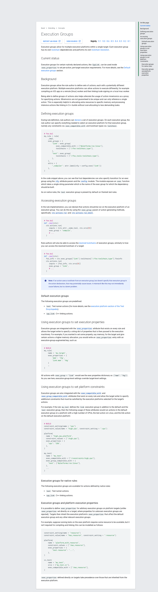 | 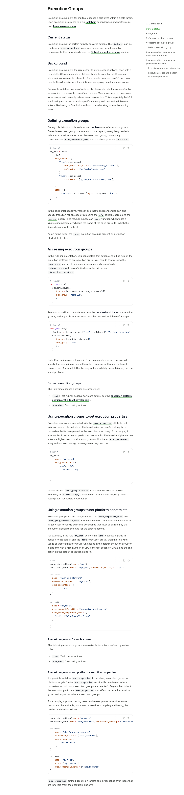 |

- The callout under the 'Accessing execution groups' section is unstyled, lacking its blue background and star icon.
- Raw markdown syntax for a link is visible in the text under the 'Accessing execution groups' section: '[ ctx.actions.run ] (/rules/lib/builtins/actions#run)'.

## /extending/legacy-macros

Old URL: https://bazel.build/extending/legacy-macros
New URL: https://preview.bazel.build/extending/legacy-macros

| Old | New |
| --- | --- |
| 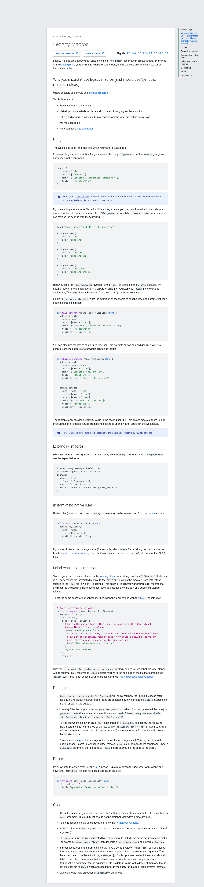 | 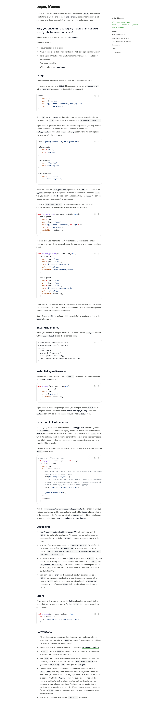 |

- Unstyled callouts/admonitions: The 'Note' sections regarding '$@' and '$<' have lost their blue background box and star icon styling, appearing as plain text instead.

## /extending/macros

Old URL: https://bazel.build/extending/macros
New URL: https://preview.bazel.build/extending/macros

OK

## /extending/platforms

Old URL: https://bazel.build/extending/platforms
New URL: https://preview.bazel.build/extending/platforms

| Old | New |
| --- | --- |
| 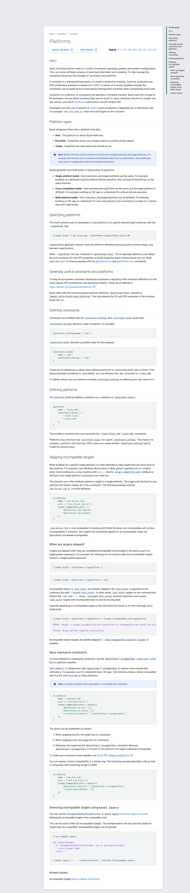 | 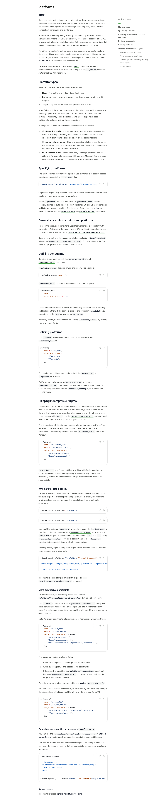 |

- The note callouts in the 'Platform types' and 'More expressive constraints' sections are unstyled and appear as regular text in the new version, missing their colored background and icons.

## /extending/rules

Old URL: https://bazel.build/extending/rules
New URL: https://preview.bazel.build/extending/rules

| Old | New |
| --- | --- |
|  |  |

- Several callouts (admonitions) that were styled with a blue background and border in the original documentation are unstyled in the new site, appearing as plain text paragraphs (e.g., under the 'Files', 'Requesting output files', and 'Migrating from legacy providers' sections).

## /extending/toolchains

Old URL: https://bazel.build/extending/toolchains
New URL: https://preview.bazel.build/extending/toolchains

| Old | New |
| --- | --- |
|  |  |

- There is excessive vertical whitespace following almost all code blocks, creating large unnatural gaps in the document flow.
- The syntax highlighting in code blocks has been significantly reduced, with many keywords and identifiers appearing as plain black text instead of being color-coded as in the original site.
- Callout boxes (e.g., 'Note' and 'Tip' boxes) are missing the colon that should follow the title label (e.g., 'Note Some Bazel rules...' instead of 'Note: Some Bazel rules...').
- Some inline text formatting has been lost during migration, such as the monospace font for command-line flags like '--extra_toolchains' and italics for emphasized words like 'mandatory'.

## /external/extension

Old URL: https://bazel.build/external/extension
New URL: https://preview.bazel.build/external/extension

| Old | New |
| --- | --- |
| 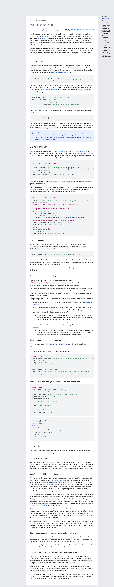 | 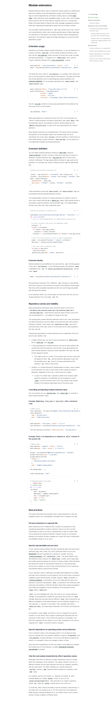 |

- Unstyled callout: The 'Note' admonition under 'Extension usage' has lost its blue background, icon, and distinct styling.
- Raw HTML tags: The 'Repository names and visibility' section displays raw '<var>' tags instead of rendering them.

## /external/faq

Old URL: https://bazel.build/external/faq
New URL: https://preview.bazel.build/external/faq

OK

## /external/lockfile

Old URL: https://bazel.build/external/lockfile
New URL: https://preview.bazel.build/external/lockfile

OK

## /external/migration

Old URL: https://bazel.build/external/migration
New URL: https://preview.bazel.build/external/migration

OK

## /external/migration_tool

Old URL: https://bazel.build/external/migration_tool
New URL: https://preview.bazel.build/external/migration_tool

ERROR

## /external/mod-command

Old URL: https://bazel.build/external/mod-command
New URL: https://preview.bazel.build/external/mod-command

ERROR

## /external/module

Old URL: https://bazel.build/external/module
New URL: https://preview.bazel.build/external/module

| Old | New |
| --- | --- |
| 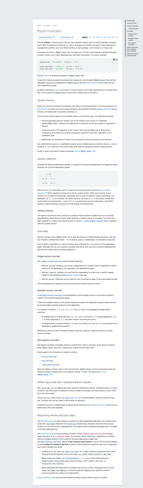 | 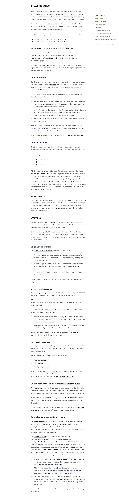 |

- The HTML <var> tags are displayed as literal text instead of being rendered in the 'Repository names and strict deps' section.

## /external/overview

Old URL: https://bazel.build/external/overview
New URL: https://preview.bazel.build/external/overview

| Old | New |
| --- | --- |
| 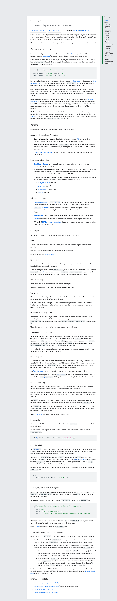 | 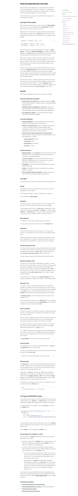 |

- The "On this page" sidebar navigation menu is missing the final two sections: "Shortcomings of the WORKSPACE system" and "External links on Bzlmod".
- In the "Directory layout" section, the code block contains an erroneous extra space character between "external/" and "canonical_name".

## /external/registry

Old URL: https://bazel.build/external/registry
New URL: https://preview.bazel.build/external/registry

| Old | New |
| --- | --- |
| 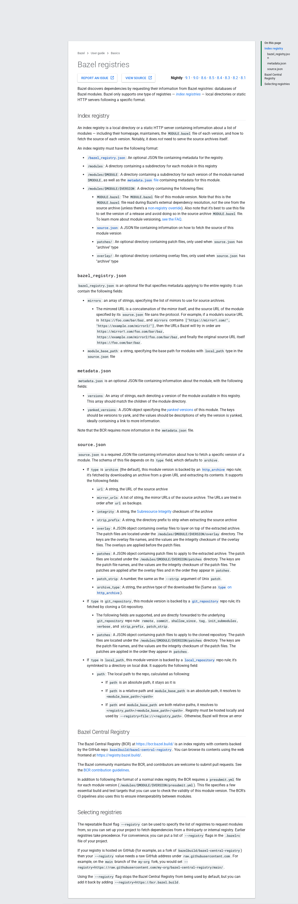 | 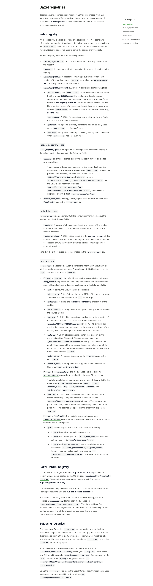 |

- Unwanted spaces before punctuation (colons, commas, periods) following inline code elements throughout the document.

## /external/repo

Old URL: https://bazel.build/external/repo
New URL: https://preview.bazel.build/external/repo

| Old | New |
| --- | --- |
| 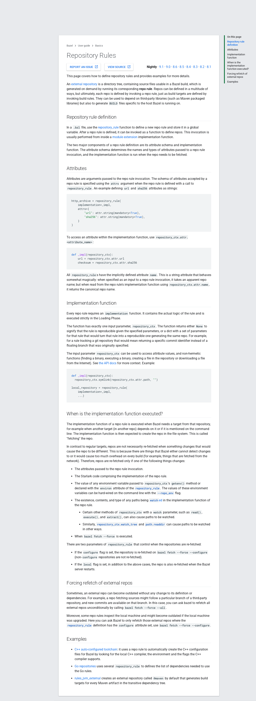 | 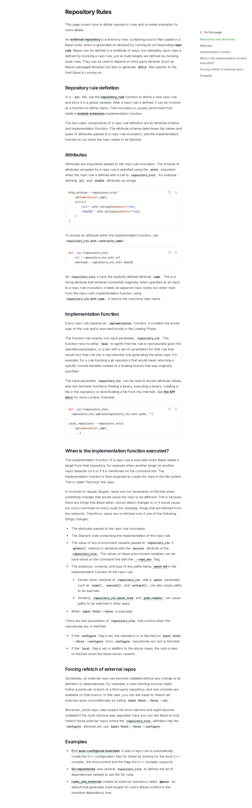 |

- In the 'When is the implementation function executed?' section, the word 'watched' is incorrectly split into 'watch' (formatted as inline code) and 'ed' (formatted as plain text) with a space in between.
- Extraneous whitespace has been introduced before punctuation marks that follow inline code elements (e.g., 'repository_ctx 's', 'repository_rule .', and '...--all .').

## /external/vendor

Old URL: https://bazel.build/external/vendor
New URL: https://preview.bazel.build/external/vendor

| Old | New |
| --- | --- |
| 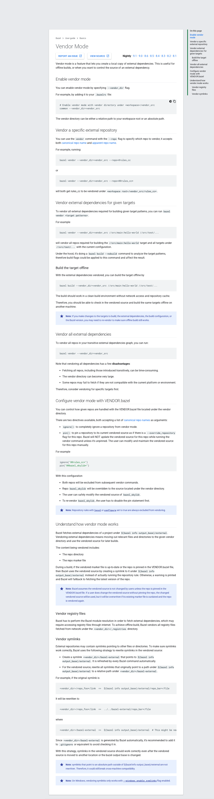 | 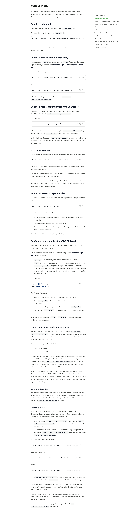 |

- Unstyled callouts: Several 'Note' sections (e.g., under 'Build the target offline', 'Configure vendor mode with VENDOR.bazel', 'Understand how vendor mode works', and 'Vendor symlinks') are rendered as plain text instead of the styled blue admonition boxes found on the original site.

## /help

Old URL: https://bazel.build/help
New URL: https://preview.bazel.build/help

OK

## /install

Old URL: https://bazel.build/install
New URL: https://preview.bazel.build/install

OK

## /install/bazelisk

Old URL: https://bazel.build/install/bazelisk
New URL: https://preview.bazel.build/install/bazelisk

| Old | New |
| --- | --- |
| 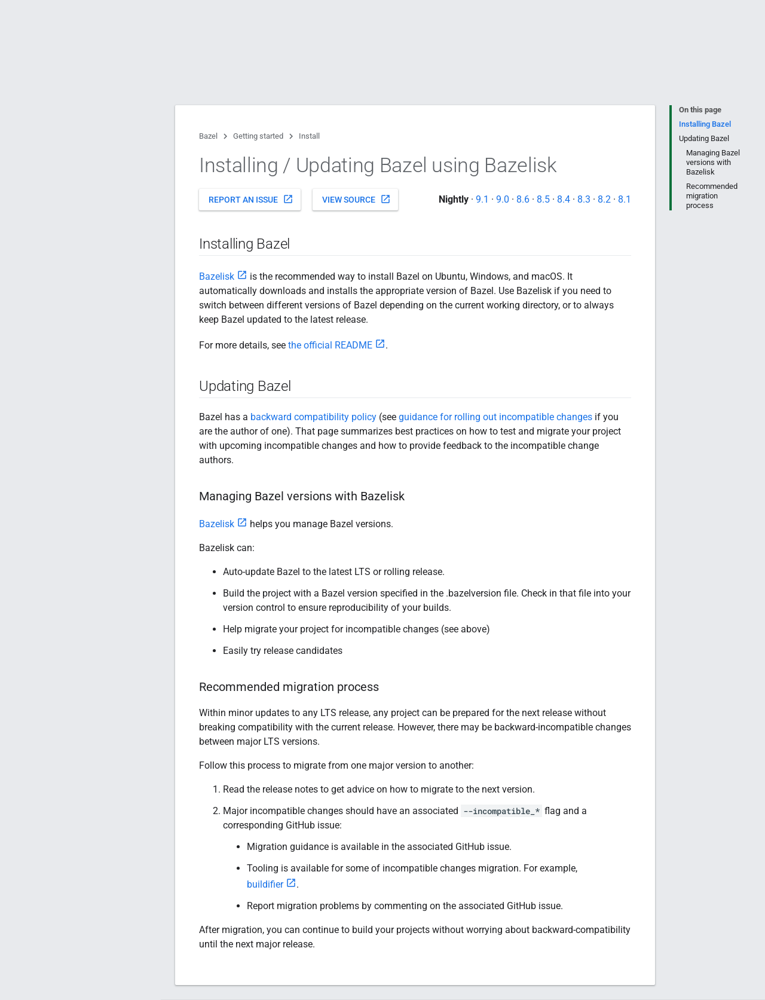 | 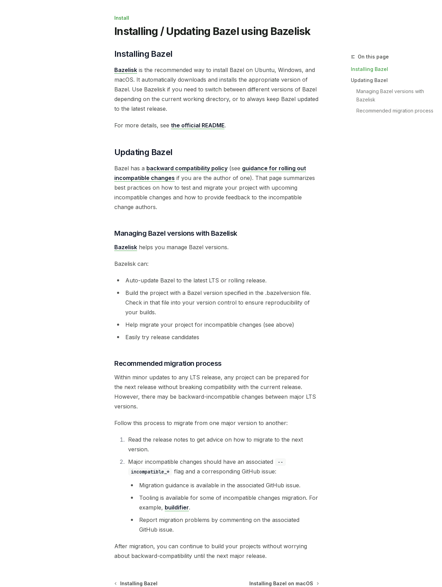 |

- The inline code block '--incompatible_*' is incorrectly broken across two lines in the 'Recommended migration process' section.

## /install/compile-source

Old URL: https://bazel.build/install/compile-source
New URL: https://preview.bazel.build/install/compile-source

| Old | New |
| --- | --- |
| 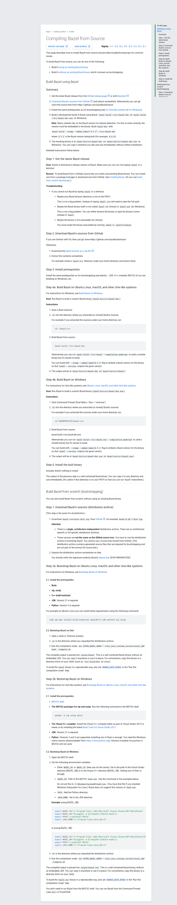 | 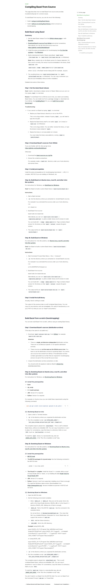 |

- Extra spaces are being inserted after double dashes (--) in code snippets, both inline and within code blocks (e.g., '-- compilation_mode' instead of '--compilation_mode', '-- tool_java_runtime_version' instead of '--tool_java_runtime_version').
- The 'On this page' sidebar navigation is missing several sections that are present in the document, such as 'Troubleshooting' under Step 1, '2.2. Bootstrap Bazel on Unix', and '2.2. Bootstrap Bazel on Windows'.
- In sections Step 4a and Step 4b, the inline code spans for output paths are wrapping awkwardly, occasionally breaking after the '(or' text or mid-path.

## /install/completion

Old URL: https://bazel.build/install/completion
New URL: https://preview.bazel.build/install/completion

OK

## /install/docker-container

Old URL: https://bazel.build/install/docker-container
New URL: https://preview.bazel.build/install/docker-container

| Old | New |
| --- | --- |
| 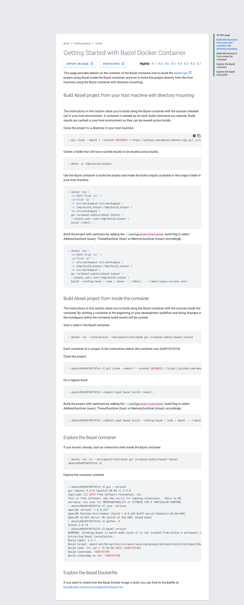 | 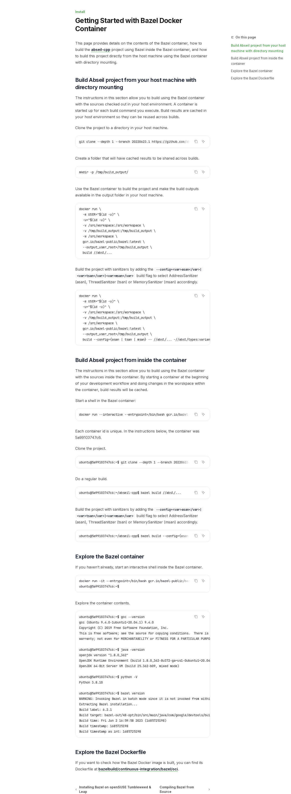 |

- Literal HTML <var> tags are visible in the text instead of being rendered in the paragraphs describing the --config build flag.

## /install/ide

Old URL: https://bazel.build/install/ide
New URL: https://preview.bazel.build/install/ide

OK

## /install/os-x

Old URL: https://bazel.build/install/os-x
New URL: https://preview.bazel.build/install/os-x

| Old | New |
| --- | --- |
| 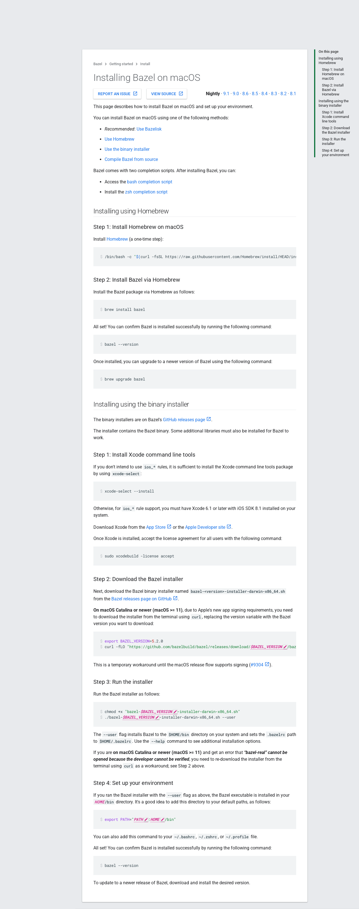 | 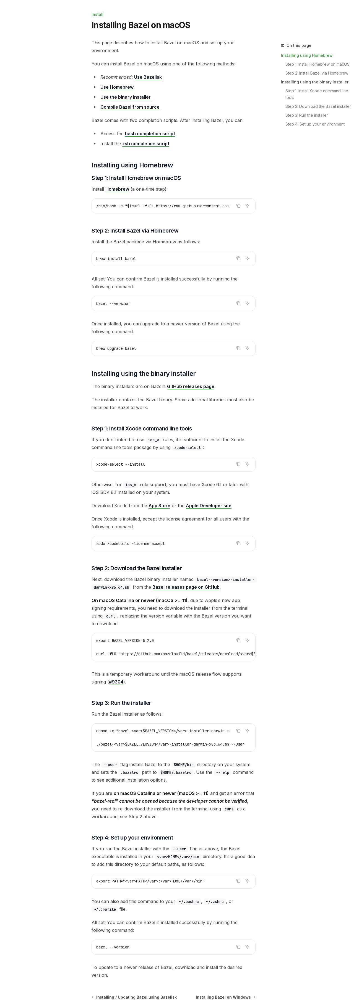 |

- Literal HTML '<var>' tags are displayed within the code blocks in the 'Installing using the binary installer' section (Steps 2, 3, and 4).

## /install/redhat

Old URL: https://bazel.build/install/redhat
New URL: https://preview.bazel.build/install/redhat

NOT_OK

## /install/suse

Old URL: https://bazel.build/install/suse
New URL: https://preview.bazel.build/install/suse

| Old | New |
| --- | --- |
| 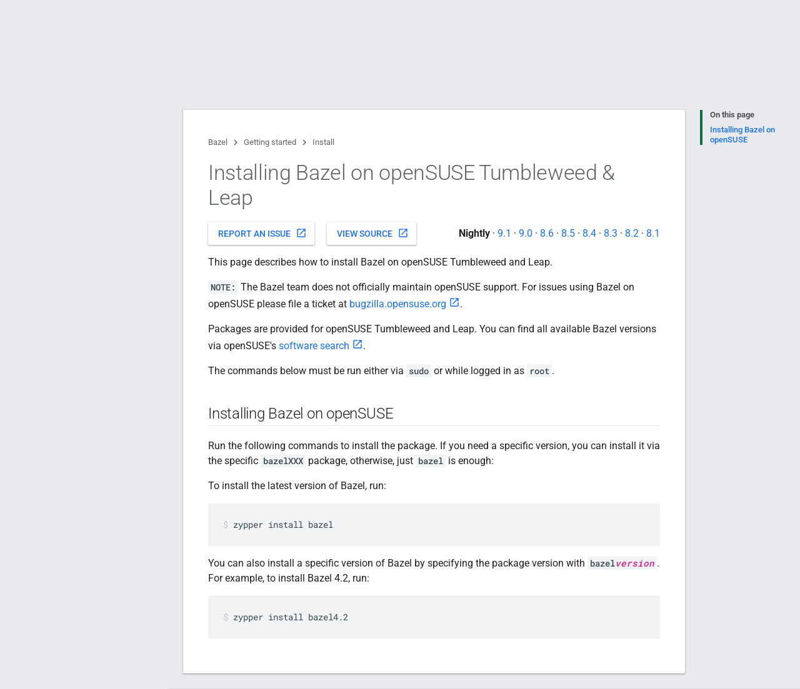 | 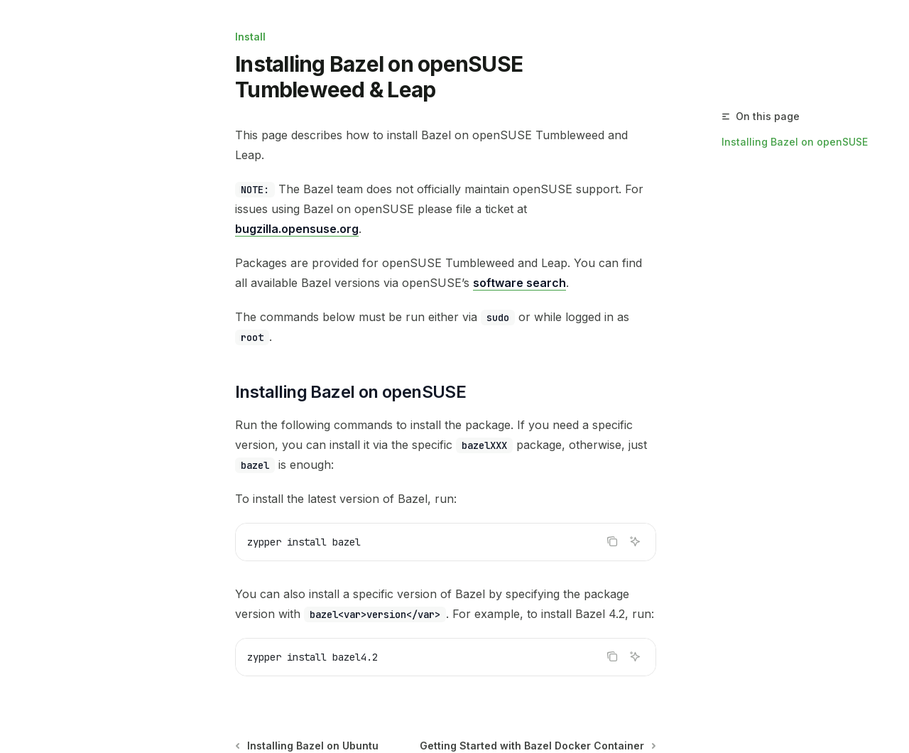 |

- The raw HTML tags `<var>` and `</var>` are visible in the text within the phrase `bazel<var>version</var>`.
- The 'REPORT AN ISSUE' and 'VIEW SOURCE' action buttons are missing from the page header area.

## /install/ubuntu

Old URL: https://bazel.build/install/ubuntu
New URL: https://preview.bazel.build/install/ubuntu

| Old | New |
| --- | --- |
| 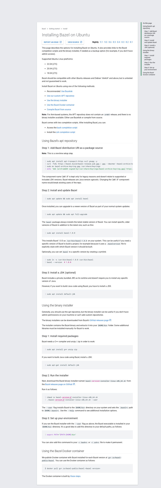 | 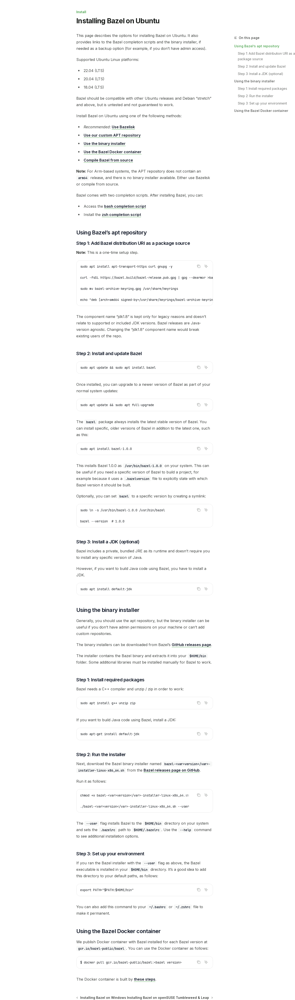 |

- Raw HTML tags (<var>, </var>) are visible in the text and code blocks within the "Step 2: Run the installer" section.

## /install/windows

Old URL: https://bazel.build/install/windows
New URL: https://preview.bazel.build/install/windows

| Old | New |
| --- | --- |
| 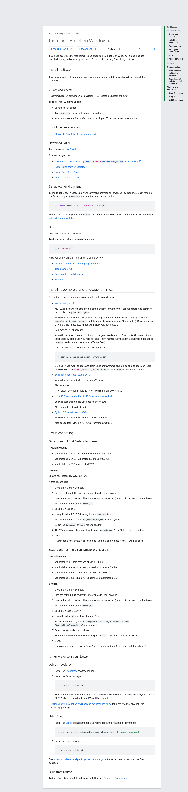 | 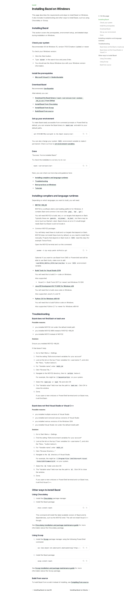 |

- Literal "<var>" HTML tags are visible in the text and code blocks throughout the page, indicating a rendering error.
- The shell prompt ("$") at the beginning of command-line examples has been removed in the new version of the site.

## /migrate

Old URL: https://bazel.build/migrate
New URL: https://preview.bazel.build/migrate

OK

## /migrate/maven

Old URL: https://bazel.build/migrate/maven
New URL: https://preview.bazel.build/migrate/maven

| Old | New |
| --- | --- |
| 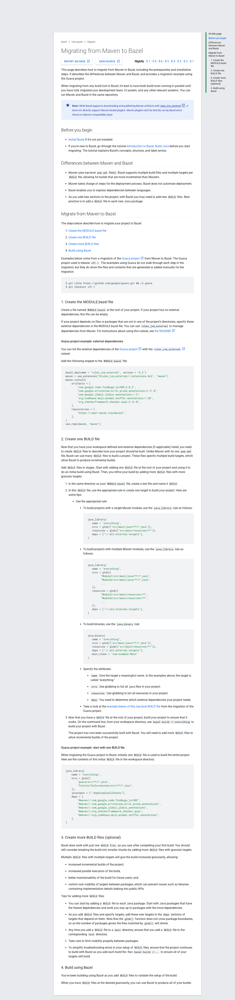 | 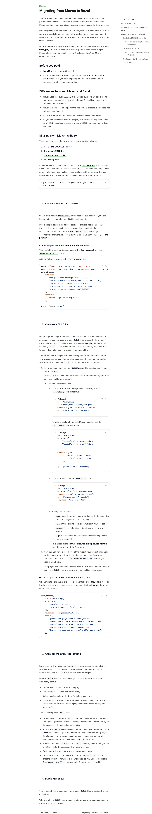 |

- Unstyled note callout at the top of the page (missing blue background and icon)

## /migrate/xcode

Old URL: https://bazel.build/migrate/xcode
New URL: https://preview.bazel.build/migrate/xcode

| Old | New |
| --- | --- |
| 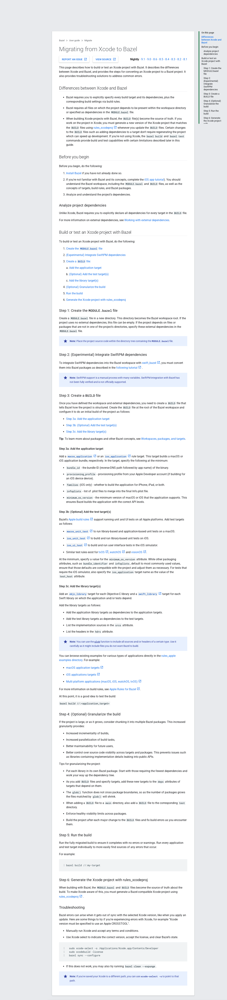 | 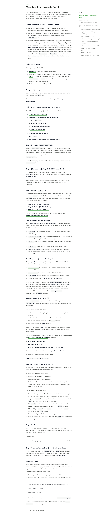 |

- Unstyled callouts (admonitions): The 'Note' sections throughout the page have lost their blue background styling and icons, appearing as plain text in the new version.

## /query/aquery

Old URL: https://bazel.build/query/aquery
New URL: https://preview.bazel.build/query/aquery

| Old | New |
| --- | --- |
| 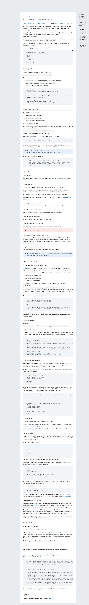 | 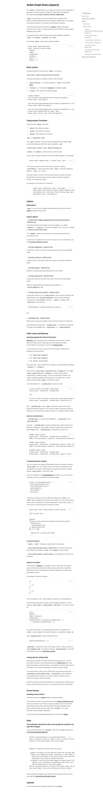 |

- Unstyled 'Important' callout: missing background, icon, and border styling.
- Unstyled 'Warning' callout: missing background, icon, and border styling.
- Unstyled 'Note' callout: missing background, icon, and border styling.
- Unstyled code block for 'AspectClass(param=value,...)': missing background styling.
- Unstyled code block in the FAQ section: missing background styling.

## /query/cquery

Old URL: https://bazel.build/query/cquery
New URL: https://preview.bazel.build/query/cquery

| Old | New |
| --- | --- |
|  |  |

- The 'Note' callouts (e.g., in the 'Using cquery options', 'Protocol message output', and 'Files output' sections) are unstyled in the new version, appearing as regular paragraphs instead of highlighted blocks with icons.

## /query/guide

Old URL: https://bazel.build/query/guide
New URL: https://preview.bazel.build/query/guide

| Old | New |
| --- | --- |
| 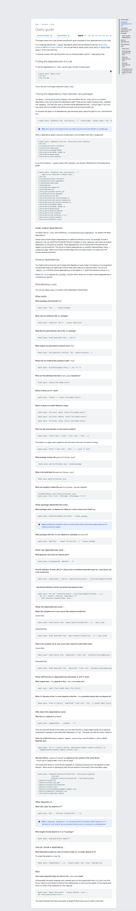 | 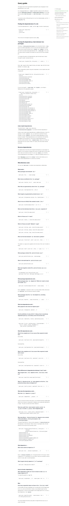 |

- Inline code formatting (monospaced font and background) is missing in several section headers (e.g., 'What packages exist beneath foo ?', 'What rules are defined in the foo package?').
- Inline code formatting is missing within all 'Note' callouts (e.g., 'dot', 'svg', 'buildfiles' are not styled as code).
- Inline code formatting is missing in various body paragraphs, such as under 'Reverse dependencies' (e.g., 'rdeps(u, x)', 'x', 'u'), 'Miscellaneous uses' ('bazel query'), and the final 'Misc' section ('85').
- Extraneous spaces are introduced before question marks in several section headers where they follow an inline code element (e.g., 'What packages exist beneath foo ?').

## /query/language

Old URL: https://bazel.build/query/language
New URL: https://preview.bazel.build/query/language

| Old | New |
| --- | --- |
|  |  |

- The 'Important' callout regarding the use of parentheses is missing from the end of the 'Algebraic set operations' section.
- The 'Package definition files: loadfiles' section heading is duplicated.
- The first instance of the 'Package definition files: loadfiles' heading is followed by incorrect content and a grammar line ('expr ::= loadfiles(expr)') that duplicates the 'rbuildfiles' section content.
- The warning callout in the 'Package definition files: loadfiles' section has incorrect formatting, with the entire paragraph of text being bolded.
- The bulleted list in the 'Functions' section incorrectly includes the keywords 'except', 'let', and 'set', which were not present in the original functions list.

## /query/quickstart

Old URL: https://bazel.build/query/quickstart
New URL: https://preview.bazel.build/query/quickstart

| Old | New |
| --- | --- |
|  |  |

- Callouts (Note, Caution, Tip) are unstyled and appear as plain text, losing their distinct background colors and icons from the original site.

## /reference

Old URL: https://bazel.build/reference
New URL: https://preview.bazel.build/reference

| Old | New |
| --- | --- |
| 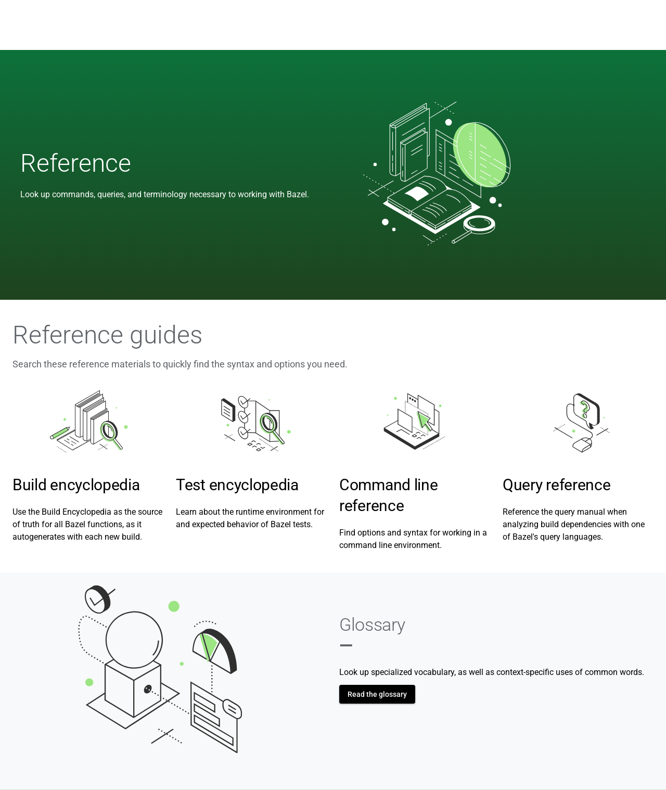 |  |

- The new page is missing major navigational sections and content from the original Reference landing page, specifically the 'Test encyclopedia', 'Command line reference', 'Query reference', and 'Glossary' sections.
- The hero section with the green background and illustration from the old site has been removed and not replaced with an equivalent visual element.
- In the 'Language-agnostic native rules' table, there are leading asterisks (e.g., '* action_listener*') that appear to be unrendered Markdown list bullets.
- Multiple links within table cells, such as those in the 'Library rules' column for C / C++, are listed without any delimiters like commas or bullet points, making them difficult to distinguish.

## /reference/be/android

Old URL: https://bazel.build/reference/be/android
New URL: https://preview.bazel.build/reference/be/android

NOT_OK

## /reference/be/c-cpp

Old URL: https://bazel.build/reference/be/c-cpp
New URL: https://preview.bazel.build/reference/be/c-cpp

OK

## /reference/be/common-definitions

Old URL: https://bazel.build/reference/be/common-definitions
New URL: https://preview.bazel.build/reference/be/common-definitions

| Old | New |
| --- | --- |
|  |  |

- The table for the 'size' attribute in the 'Attributes common to all test rules (*_test)' section is missing the 'CPU (in cores)' and 'Default timeout' columns.

## /reference/be/extra-actions

Old URL: https://bazel.build/reference/be/extra-actions
New URL: https://preview.bazel.build/reference/be/extra-actions

| Old | New |
| --- | --- |
| 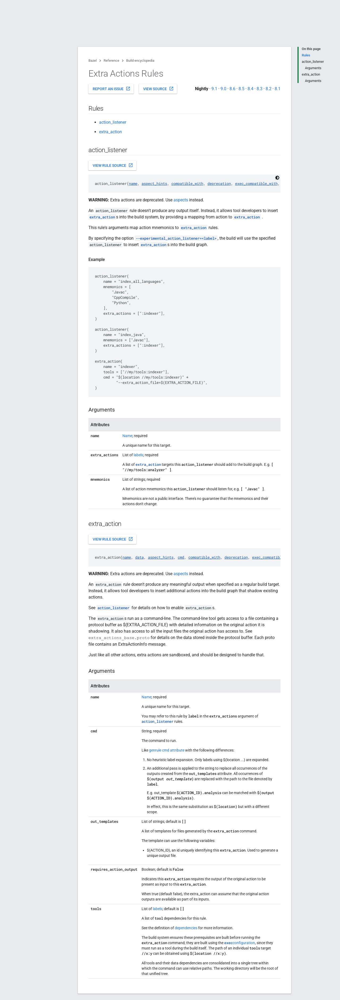 | 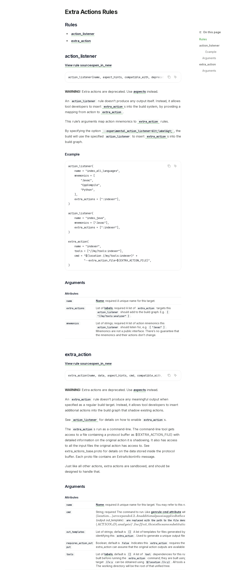 |

- The 'View rule source' links have the icon identifier 'open_in_new' concatenated with the link text.
- The Arguments tables contain multiple instances of text merging without proper spacing between the attribute metadata (e.g., 'required') and the description (e.g., 'requiredA list').
- The description for the 'cmd' attribute in the 'extra_action' section has severe formatting errors where whitespace is missing between words and sentences, rendering the text nearly unreadable (e.g., 'with(location...)areexpanded.2.Anadditionalpassisappliedtothes').

## /reference/be/functions

Old URL: https://bazel.build/reference/be/functions
New URL: https://preview.bazel.build/reference/be/functions

| Old | New |
| --- | --- |
|  |  |

- Extraneous small square icons (likely missing or incorrectly rendered glyphs) appear at the end of many paragraphs and next to inline code snippets throughout the documentation, causing significant visual clutter and impairing readability.

## /reference/be/general

Old URL: https://bazel.build/reference/be/general
New URL: https://preview.bazel.build/reference/be/general

OK

## /reference/be/java

Old URL: https://bazel.build/reference/be/java
New URL: https://preview.bazel.build/reference/be/java

| Old | New |
| --- | --- |
|  |  |

- Broken documentation macros and placeholders are visible in the text instead of being rendered correctly (e.g., '[*Make variable*]' instead of '%{' and '[reference/make-variable-substitution]' appearing in the middle of sentences).

## /reference/be/make-variables

Old URL: https://bazel.build/reference/be/make-variables
New URL: https://preview.bazel.build/reference/be/make-variables

| Old | New |
| --- | --- |
| 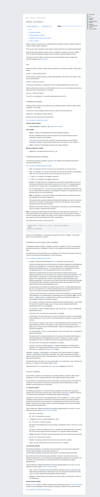 | 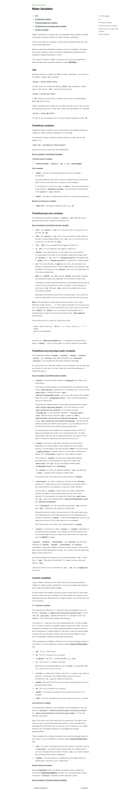 |

- In the 'Predefined genrule variables' section, the '<' character is incorrectly rendered as the HTML entity '&lt;' in the bullet points and within the Bash code block.
- In the 'Predefined genrule variables' section, the text within the Note and the sentence following the code block incorrectly displays HTML entities (like '&quot;') instead of intended characters.

## /reference/be/objective-c

Old URL: https://bazel.build/reference/be/objective-c
New URL: https://preview.bazel.build/reference/be/objective-c

| Old | New |
| --- | --- |
| 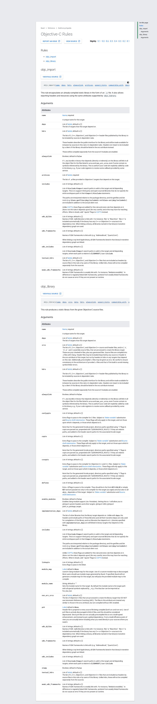 | 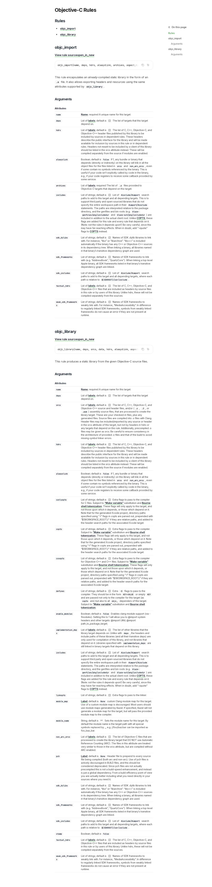 |

- The attribute name 'linkopts' in the 'objc_library' section contains a stray backslash ('\linkopts').
- Long attribute names are being incorrectly wrapped, breaking words across lines (e.g., 'weak_sdk_frameworks' and 'implementation_deps').
- The 'View rule source' links have the icon name 'open_in_new' appended directly to the link text without any spacing.

## /reference/be/overview

Old URL: https://bazel.build/reference/be/overview
New URL: https://preview.bazel.build/reference/be/overview

| Old | New |
| --- | --- |
| 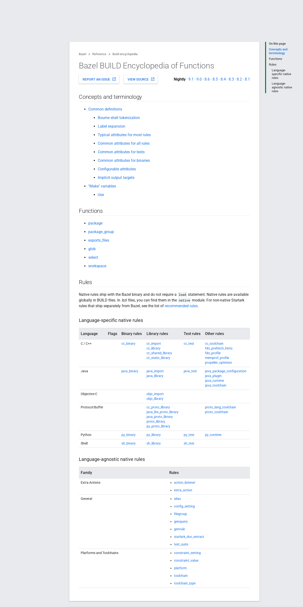 | 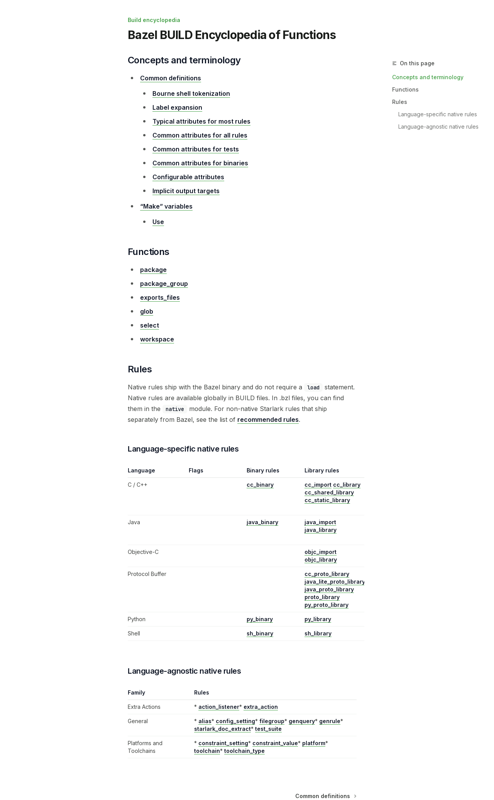 |

- The 'Language-specific native rules' table is missing the 'Test rules' and 'Other rules' columns.
- The 'Rules' column in the 'Language-agnostic native rules' table is incorrectly formatted, with list items displayed horizontally and concatenated with asterisks instead of as a vertical list.

## /reference/be/platforms-and-toolchains

Old URL: https://bazel.build/reference/be/platforms-and-toolchains
New URL: https://preview.bazel.build/reference/be/platforms-and-toolchains

| Old | New |
| --- | --- |
| 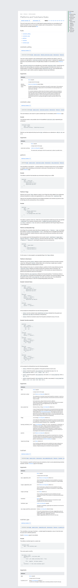 |  |

- Unrendered HTML tags and entities (e.g., &lt;b&gt;, &amp;lcub;) in the bullet points under the 'Example: Execution properties' section for the 'platform' rule.
- Unrendered HTML tags and entities in the default value for the 'exec_properties' attribute in the 'Arguments' table for the 'platform' rule.

## /reference/be/protocol-buffer

Old URL: https://bazel.build/reference/be/protocol-buffer
New URL: https://preview.bazel.build/reference/be/protocol-buffer

| Old | New |
| --- | --- |
| 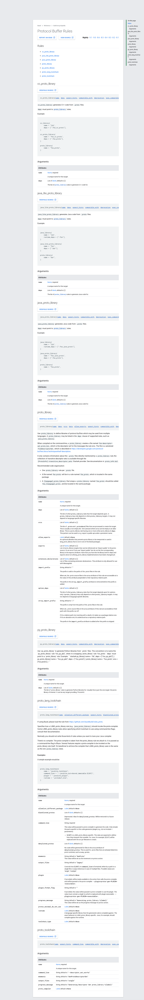 | 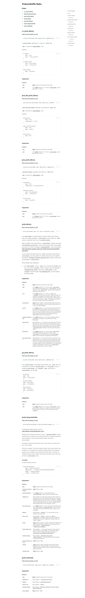 |

- HTML entities such as &quot;, &lt;, and &gt; are incorrectly displayed as literal text instead of being rendered as characters in the attribute descriptions for proto_lang_toolchain and proto_toolchain.
- An incorrect extra space is introduced in the $(OUT) variable placeholder within the command_line attribute description for proto_lang_toolchain (appearing as '$ (OUT)').

## /reference/be/python

Old URL: https://bazel.build/reference/be/python
New URL: https://preview.bazel.build/reference/be/python

| Old | New |
| --- | --- |
|  |  |

- The 'open_in_new' icon name is incorrectly rendered as plain text instead of a graphical icon in the 'View rule source' links for each rule (e.g., 'View rule sourceopen_in_new').

## /reference/be/shell

Old URL: https://bazel.build/reference/be/shell
New URL: https://preview.bazel.build/reference/be/shell

| Old | New |
| --- | --- |
| 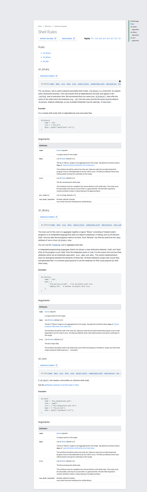 | 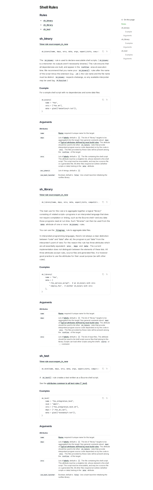 |

- The 'View rule source' links have an error where the icon name text is concatenated with the link text: 'View rule sourceopen_in_new'.
- In the attribute tables (e.g., under sh_binary Arguments), the description text for each attribute is concatenated on the same line as the type and requirement information, instead of being on a new line (e.g., 'Name; required A unique name for this target.').

## /reference/be/workspace

Old URL: https://bazel.build/reference/be/workspace
New URL: https://preview.bazel.build/reference/be/workspace

NOT_OK

## /reference/flag-cheatsheet

Old URL: https://bazel.build/reference/flag-cheatsheet
New URL: https://preview.bazel.build/reference/flag-cheatsheet

| Old | New |
| --- | --- |
| 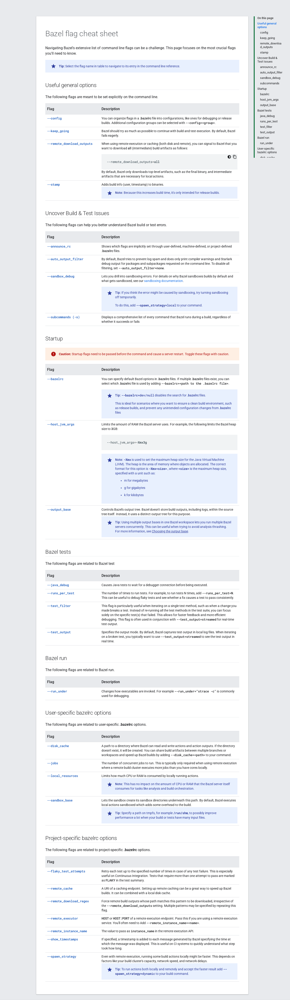 | 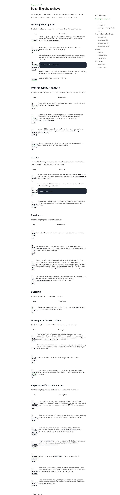 |

- Most 'Tip' and 'Note' callouts (admonitions) are missing entirely from the new page.
- The 'Caution' callout under the 'Startup' section is missing its styling and icon, appearing as plain text.
- Tables have broken layouts where the 'Flag' column is too narrow, causing extreme and unreadable word wrapping.
- Double dashes ('--') at the beginning of flag names in the tables have been incorrectly converted to em-dashes ('—').

## /reference/glossary

Old URL: https://bazel.build/reference/glossary
New URL: https://preview.bazel.build/reference/glossary

| Old | New |
| --- | --- |
|  |  |

- Unstyled callouts i.e. admonitions

## /reference/skyframe

Old URL: https://bazel.build/reference/skyframe
New URL: https://preview.bazel.build/reference/skyframe

OK

## /reference/test-encyclopedia

Old URL: https://bazel.build/reference/test-encyclopedia
New URL: https://preview.bazel.build/reference/test-encyclopedia

| Old | New |
| --- | --- |
|  |  |

- The note callout in the 'Tag conventions' section is unstyled and missing its background color and icon compared to the original site.
- Throughout the document (e.g., in 'Tag conventions', 'Runfiles', 'Execution platform', and the 'Initial conditions' table), link URLs are being explicitly displayed in parentheses next to the link text instead of being hidden behind the hyperlinks.

## /release

Old URL: https://bazel.build/release
New URL: https://preview.bazel.build/release

| Old | New |
| --- | --- |
| 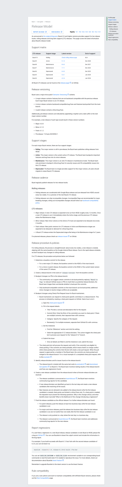 | 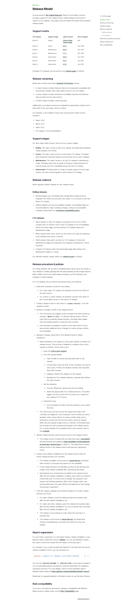 |

- In the 'Support matrix' table, the 'Latest version' for Bazel 9 is incorrectly listed as 9.0.2 instead of 9.1.0.
- In the 'Release procedure & policies' section, step 2 incorrectly specifies the branch name as 'release-<version>' instead of 'release-v<version>'.
- In the 'Release procedure & policies' section, step 5, the 'postsubmit' link is rendered as plain bold text and is missing its hyperlink.
- In the 'Release procedure & policies' section, step 5, the link for 'downstream test pipeline' is broken, exposing raw Markdown syntax: '[downstream test pipeline] (https://buildkite.com/bazel/bazel-at-head-plus-downstream)'.
- In the 'Report regressions' section, the 'bisect feature' link is broken, exposing raw Markdown syntax: '[bisect feature] (https://github.com/bazelbuild/bazelisk#--bisect)'.
- Formatting for '@bazel-io flag' in section 3.1 of 'Release procedure & policies' has changed from a styled code block to quoted text with inconsistent spacing ('" @bazel-io flag "').

## /release/backward-compatibility

Old URL: https://bazel.build/release/backward-compatibility
New URL: https://preview.bazel.build/release/backward-compatibility

| Old | New |
| --- | --- |
| 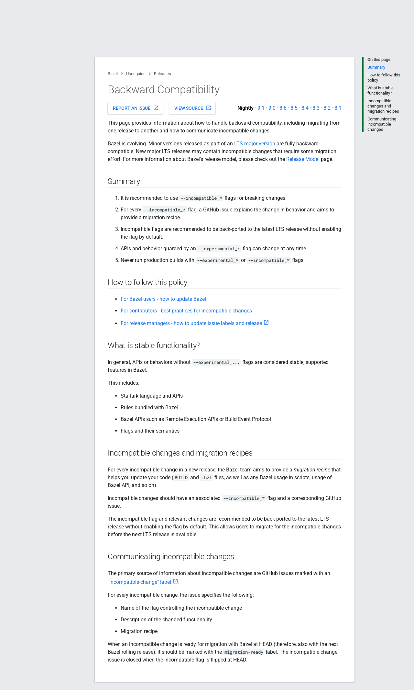 | 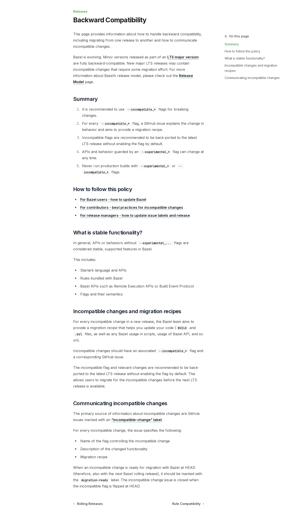 |

- In the 'Summary' section, item 5, the flag '--incompatible_*' is incorrectly broken across two lines, appearing as '--' followed by a line break and then 'incompatible_*', which likely indicates an unintended space was inserted during migration.

## /release/rolling

Old URL: https://bazel.build/release/rolling
New URL: https://preview.bazel.build/release/rolling

| Old | New |
| --- | --- |
| 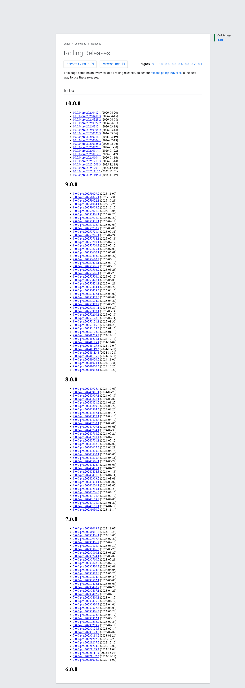 | 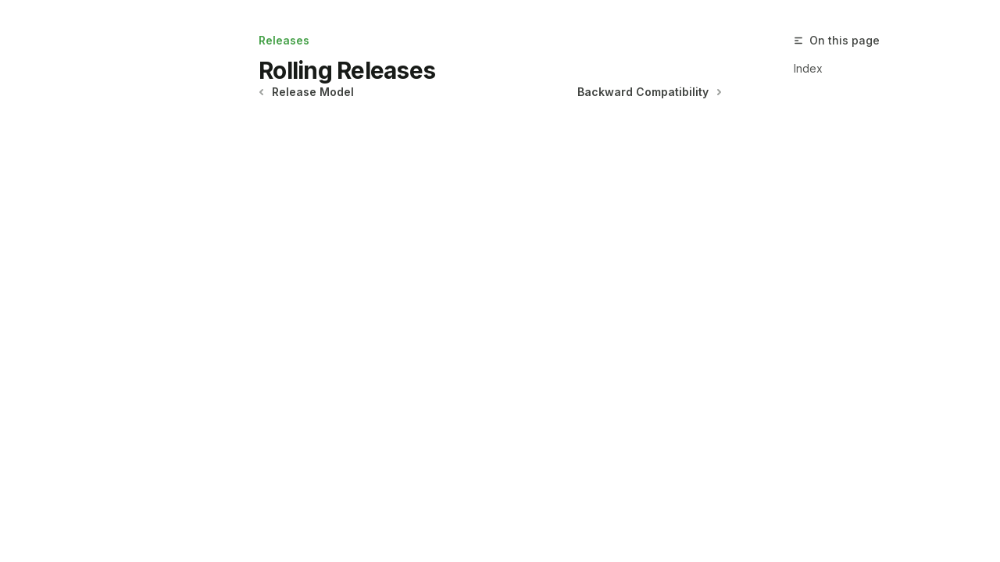 |

- All content below the main title is missing, including version headers (10.0.0, 9.0.0, etc.), the lists of releases, the introductory paragraph, and the 'REPORT AN ISSUE'/'VIEW SOURCE' buttons.

## /release/rule-compatibility

Old URL: https://bazel.build/release/rule-compatibility
New URL: https://preview.bazel.build/release/rule-compatibility

| Old | New |
| --- | --- |
| 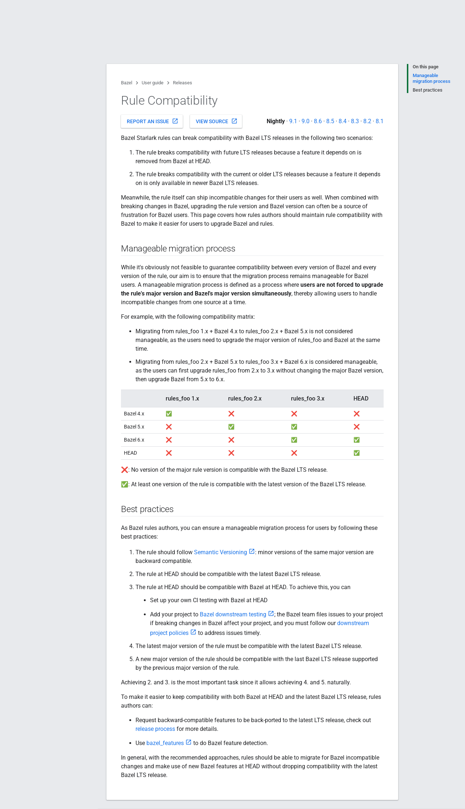 | 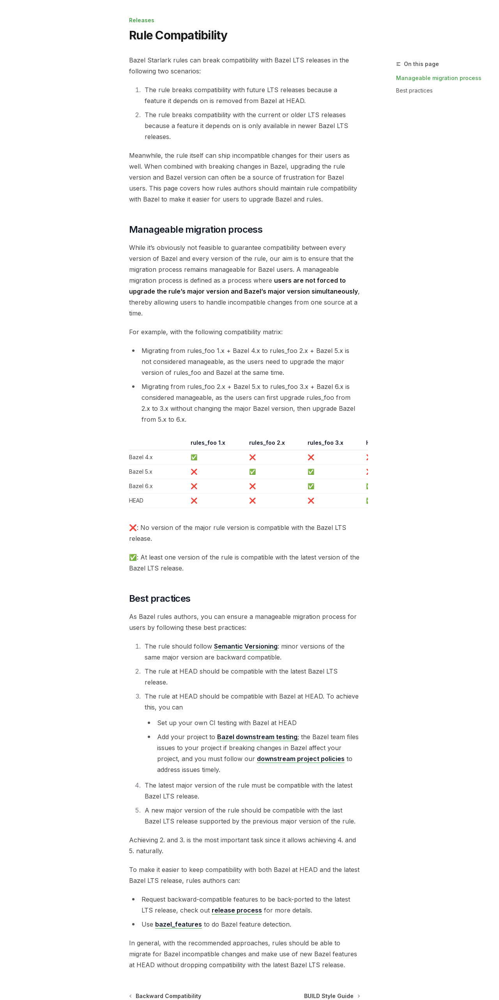 |

- The compatibility table headers are misaligned with the columns.
- The 'REPORT AN ISSUE' and 'VIEW SOURCE' buttons are missing.

## /remote/bep

Old URL: https://bazel.build/remote/bep
New URL: https://preview.bazel.build/remote/bep

| Old | New |
| --- | --- |
| 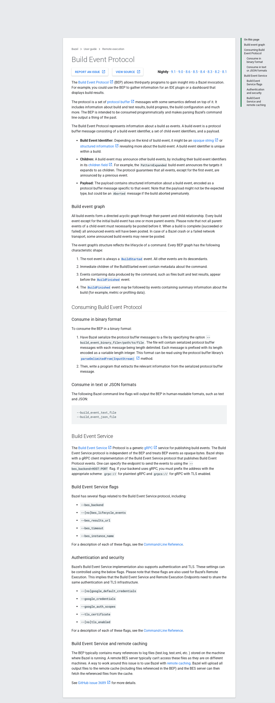 | 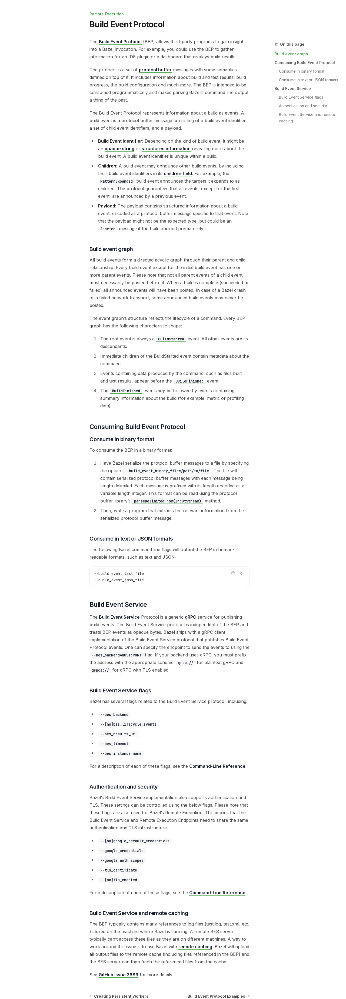 |

- External link icons (represented by a square with an arrow) are missing from all links that previously featured them throughout the text paragraphs.

## /remote/bep-examples

Old URL: https://bazel.build/remote/bep-examples
New URL: https://preview.bazel.build/remote/bep-examples

| Old | New |
| --- | --- |
| 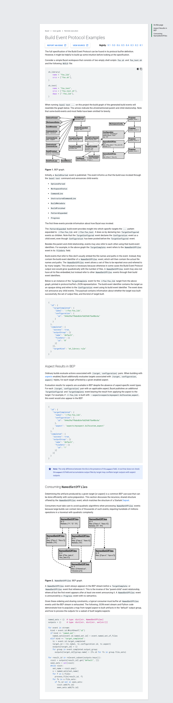 | 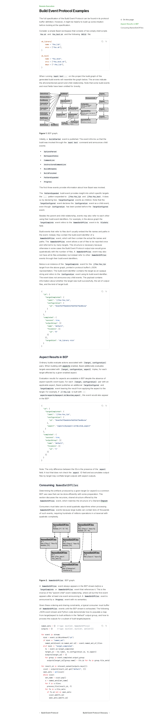 |

- The callout/note starting with "Note: The only difference between the IDs..." is unstyled in the new website, missing its background color and icon from the original.

## /remote/bep-glossary

Old URL: https://bazel.build/remote/bep-glossary
New URL: https://preview.bazel.build/remote/bep-glossary

OK

## /remote/cache-local

Old URL: https://bazel.build/remote/cache-local
New URL: https://preview.bazel.build/remote/cache-local

OK

## /remote/cache-remote

Old URL: https://bazel.build/remote/cache-remote
New URL: https://preview.bazel.build/remote/cache-remote

| Old | New |
| --- | --- |
| 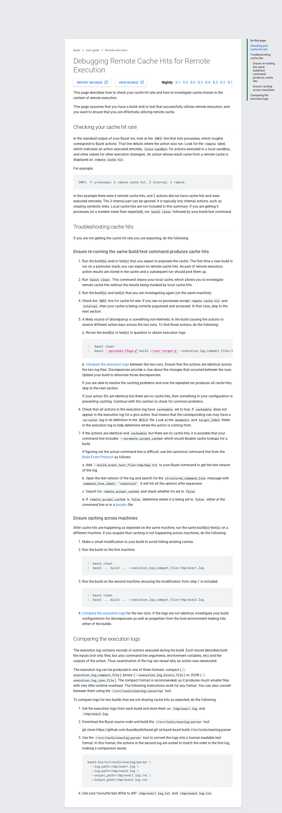 | 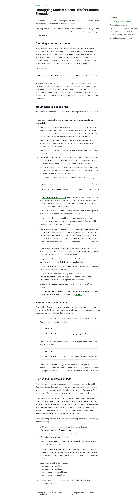 |

- In the 'Ensure re-running the same build/test command produces cache hits' section, step 5a contains a code block with unrendered raw HTML tags and entities (e.g., <var> and &lt;var&gt;).
- In the 'Comparing the execution logs' section, the code block under step 3 has several formatting issues: it uses em-dashes (—) instead of double-hyphens (--), it is missing the line-continuation backslashes, and it has lost its indentation.

## /remote/caching

Old URL: https://bazel.build/remote/caching
New URL: https://preview.bazel.build/remote/caching

| Old | New |
| --- | --- |
| 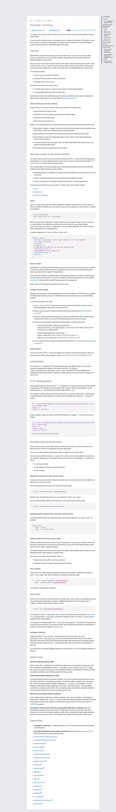 |  |

- Literal HTML tags (e.g., <var>, </var>) are incorrectly rendered as plain text within several code blocks in sections such as 'Google Cloud Storage', 'Read from and write to the remote cache', 'Unix sockets', and 'Disk cache'.
- Multiple inline code elements (e.g., '.bazelrc', '~', 'build --disk_cache', and '--remote_upload_local_results=false') are missing monospaced styling and appear as regular body text.
- Syntax highlighting is missing or incomplete in many code blocks; for example, comments and keywords in the 'nginx' configuration block are not color-coded as they were in the original site.

## /remote/ci

Old URL: https://bazel.build/remote/ci
New URL: https://preview.bazel.build/remote/ci

| Old | New |
| --- | --- |
| 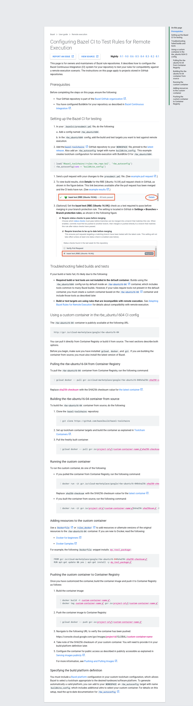 | 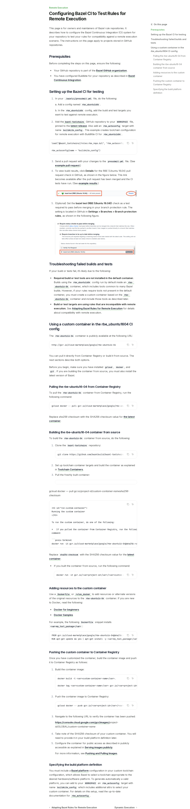 |

- The heading 'Running the custom container' is improperly rendered, displaying raw HTML tags: <h3>id="run-custom-container">.
- A section of the 'Running the custom container' instructions contains raw, unrendered Markdown syntax, including backticks and the 'posix-terminal' language identifier.
- Under 'Building the rbe-ubuntu16-04 container from source', the third point has an empty code block, while the command text is rendered as plain text below it with incorrect formatting.
- Raw <var> tags are visible in the body text and inside code blocks (e.g., <var>my_tool_package</var>), indicating a parsing error.

## /remote/creating

Old URL: https://bazel.build/remote/creating
New URL: https://preview.bazel.build/remote/creating

| Old | New |
| --- | --- |
| 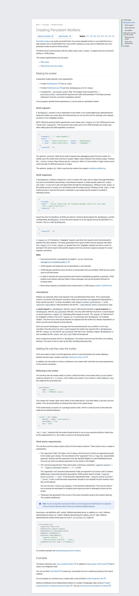 | 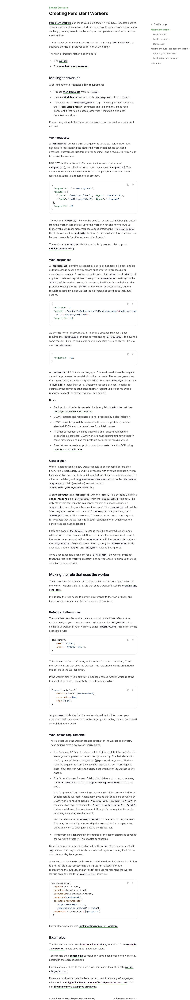 |

- The 'Note' callout in the 'Work action requirements' section is unstyled in the new website, appearing as a regular paragraph instead of a styled admonition box.

## /remote/dynamic

Old URL: https://bazel.build/remote/dynamic
New URL: https://preview.bazel.build/remote/dynamic

OK

## /remote/multiplex

Old URL: https://bazel.build/remote/multiplex
New URL: https://preview.bazel.build/remote/multiplex

| Old | New |
| --- | --- |
| 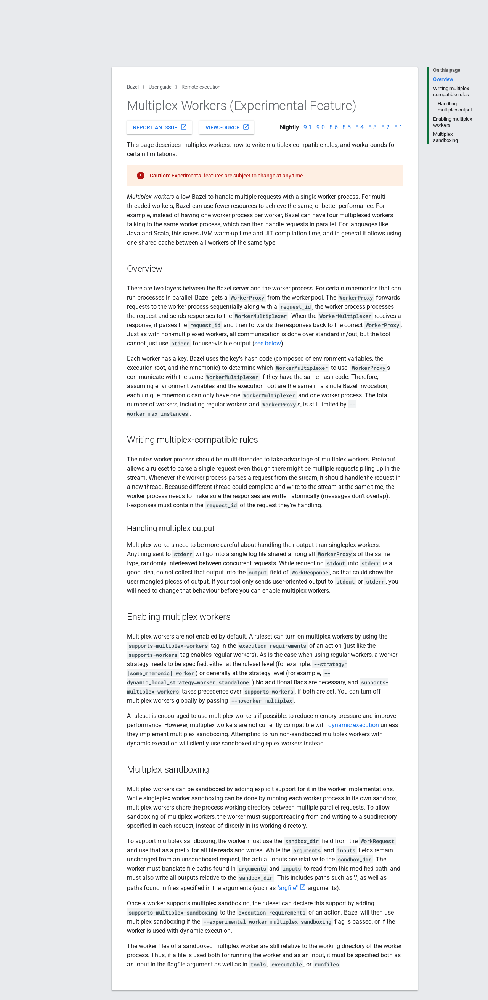 | 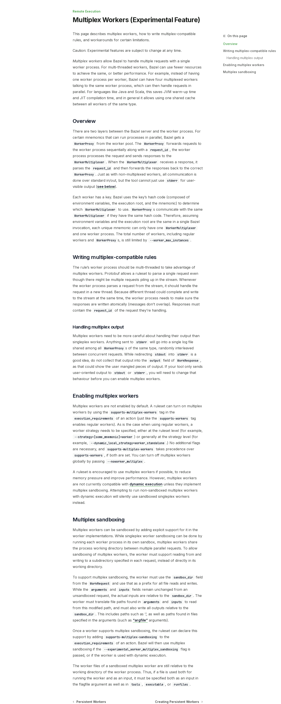 |

- The 'Caution' callout is unstyled and appears as plain text, missing the distinctive background and icon from the original site.
- Inline code snippets are inconsistently styled; many terms (e.g., 'WorkerProxy', 'request_id') in the first half of the page are missing the light grey background highlight that is present in the original site and in other code snippets later on the same page.

## /remote/output-directories

Old URL: https://bazel.build/remote/output-directories
New URL: https://preview.bazel.build/remote/output-directories

| Old | New |
| --- | --- |
| 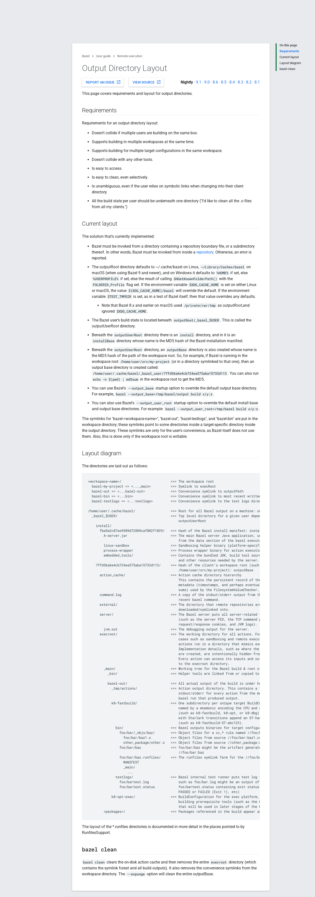 | 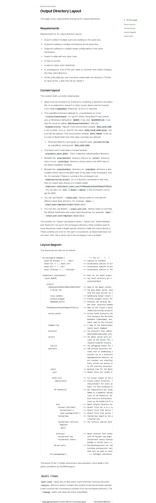 |

- The layout diagram code block contains unrendered HTML entities, such as "&lt;" and "&gt;", instead of angle brackets.

## /remote/persistent

Old URL: https://bazel.build/remote/persistent
New URL: https://preview.bazel.build/remote/persistent

| Old | New |
| --- | --- |
| 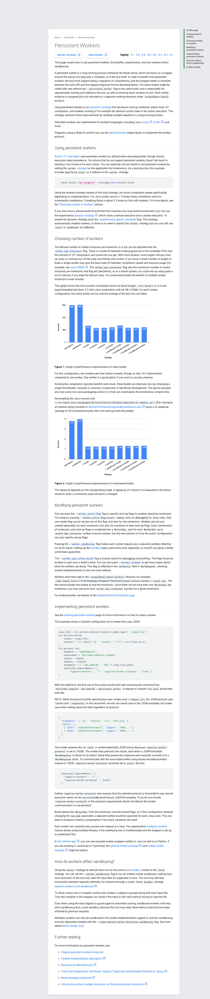 | 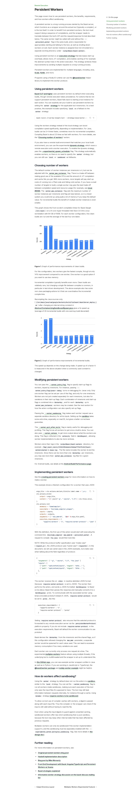 |

- In the 'Using persistent workers' section, the first code block incorrectly displays literal '<var>' and '</var>' tags around 'my:target'.

## /remote/rbe

Old URL: https://bazel.build/remote/rbe
New URL: https://preview.bazel.build/remote/rbe

OK

## /remote/rules

Old URL: https://bazel.build/remote/rules
New URL: https://preview.bazel.build/remote/rules

| Old | New |
| --- | --- |
| 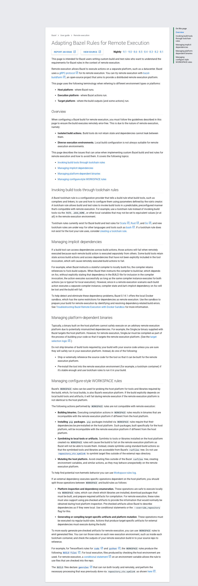 |  |

- In the 'Invoking build tools through toolchain rules' section, the link for Scala is improperly rendered, displaying raw markdown syntax including the full URL: '[Scala](https://github.com/bazelbuild/rules_scala/blob/master/scala/scala_toolchain.bzl)'.
- In the 'Invoking build tools through toolchain rules' section, the links for 'Rust' and 'Go' are missing and rendered as plain text.

## /remote/sandbox

Old URL: https://bazel.build/remote/sandbox
New URL: https://preview.bazel.build/remote/sandbox

| Old | New |
| --- | --- |
| 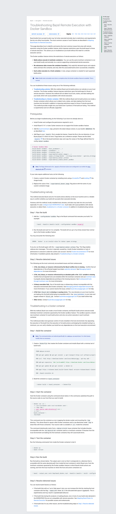 | 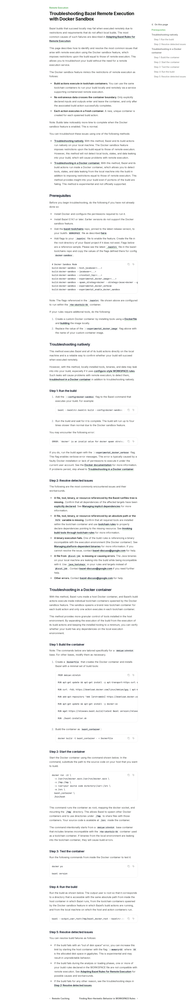 |

- Admonitions are unstyled: 'Note' callouts have lost their blue background and star icons compared to the old site.
- Placeholders in code blocks (such as '<target>', '<your source code directory>', and 'XX') have lost their pink highlighting.
- External link icons are missing from links throughout the page.

## /remote/workspace

Old URL: https://bazel.build/remote/workspace
New URL: https://preview.bazel.build/remote/workspace

| Old | New |
| --- | --- |
| 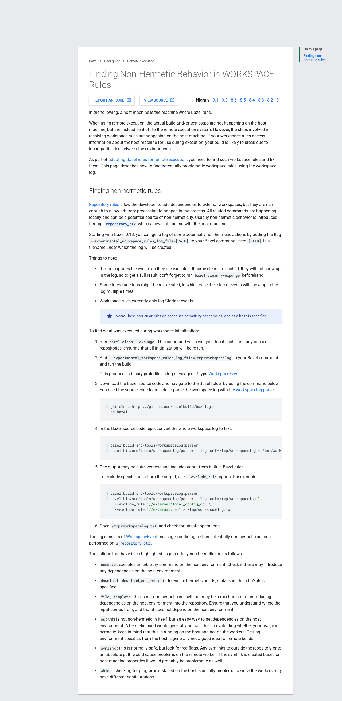 | 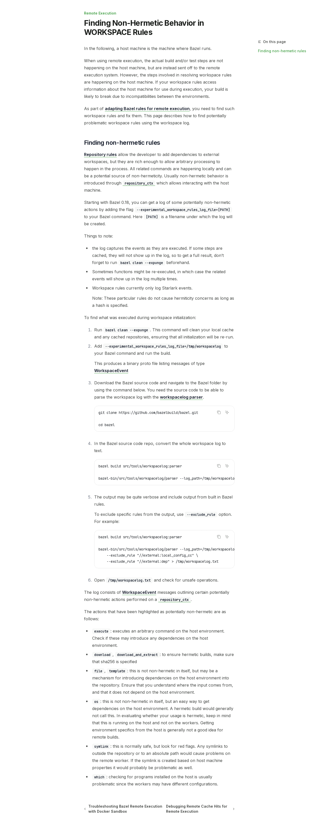 |

- The note callout in the 'Finding non-hermetic rules' section has lost its styling (blue background and star icon) and is now plain text.

## /rules

Old URL: https://bazel.build/rules
New URL: https://preview.bazel.build/rules

| Old | New |
| --- | --- |
| 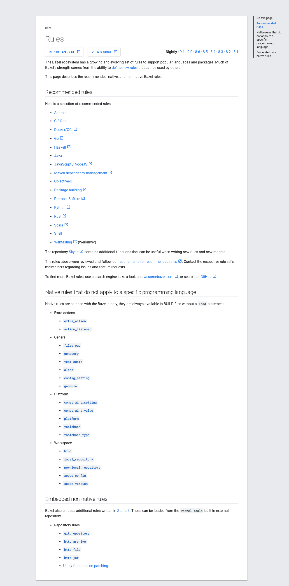 | 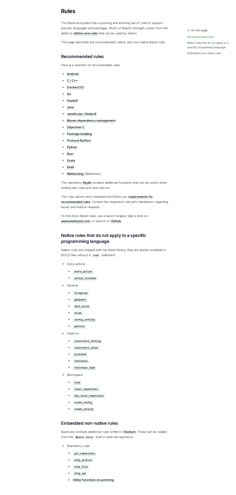 |

- Inconsistent bolding of links throughout the page: links in the 'Recommended rules' list and some in-text links (e.g., 'define new rules', 'requirements for recommended rules') are bolded, while others (e.g., links in the 'Native rules' section, 'Skylib', 'awesomebazel.com', 'GitHub') are not.
- Missing 'REPORT AN ISSUE' and 'VIEW SOURCE' buttons at the top of the page content.
- Missing external link icons for all links that previously had them (e.g., Docker/OCI, Go, Skylib, awesomebazel.com, GitHub).

## /rules/bzl-style

Old URL: https://bazel.build/rules/bzl-style
New URL: https://preview.bazel.build/rules/bzl-style

| Old | New |
| --- | --- |
| 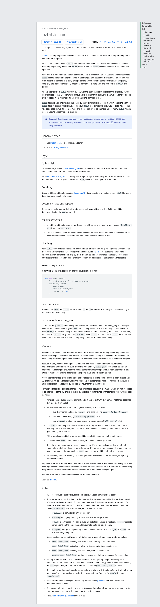 | 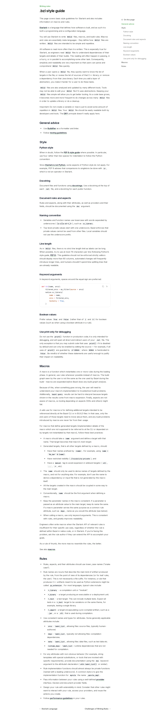 |

- The 'Important' callout has lost its distinct styling, including the blue background and star icon, and now appears as a generic gray box.
- There are unwanted spaces around inline code elements, particularly when they are inside parentheses or followed by punctuation (e.g., '( //visibility:private )' instead of '(//visibility:private)' and 'is , which' instead of 'is, which').

## /rules/challenges

Old URL: https://bazel.build/rules/challenges
New URL: https://preview.bazel.build/rules/challenges

OK

## /rules/deploying

Old URL: https://bazel.build/rules/deploying
New URL: https://preview.bazel.build/rules/deploying

OK

## /rules/faq

Old URL: https://bazel.build/rules/faq
New URL: https://preview.bazel.build/rules/faq

| Old | New |
| --- | --- |
| 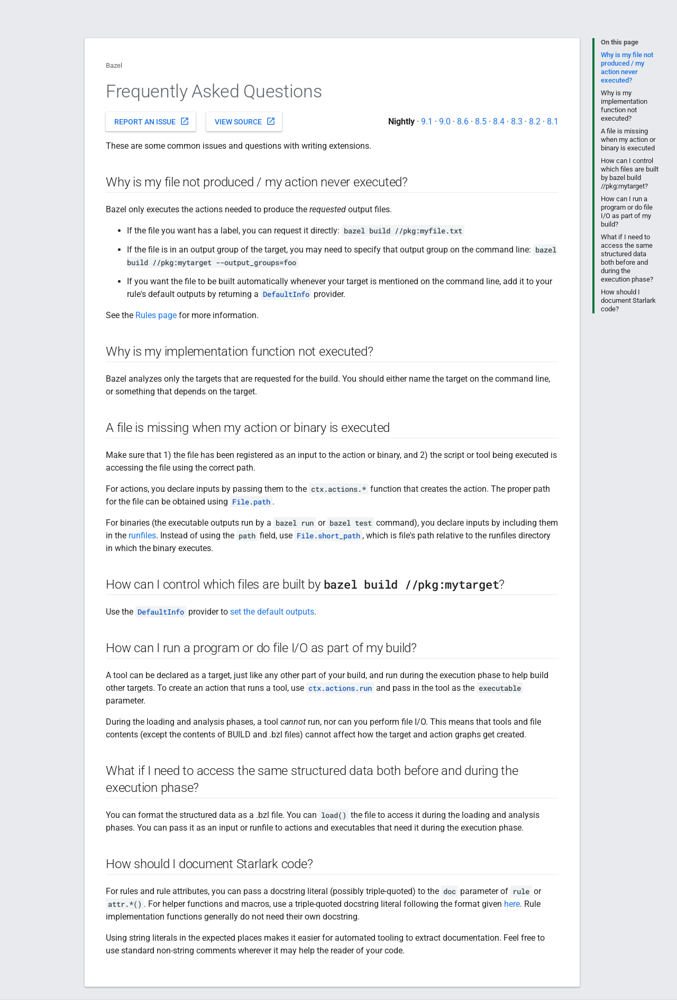 | 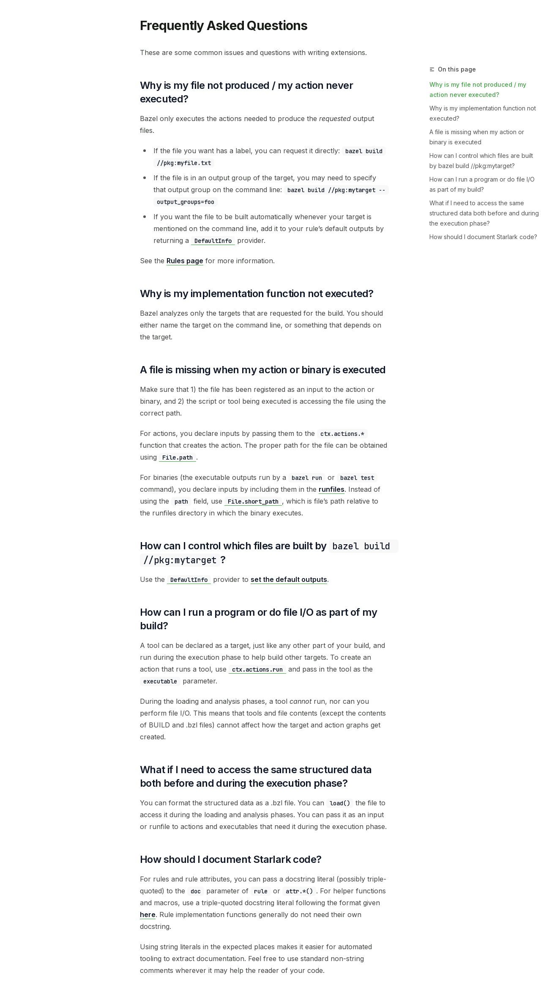 |

- The horizontal rules that serve as visual separators between sections in the old site are missing in the new site, making the page structure less clear.
- In the 'On this page' sidebar, the link 'How can I control which files are built by //pkg:mytarget?' is missing the 'bazel build' portion of the actual section heading.
- The section heading 'How can I control which files are built by bazel build //pkg:mytarget ?' has an unnecessary space before the question mark.
- The 'REPORT AN ISSUE' and 'VIEW SOURCE' buttons present in the original page are missing in the new version.

## /rules/language

Old URL: https://bazel.build/rules/language
New URL: https://preview.bazel.build/rules/language

| Old | New |
| --- | --- |
| 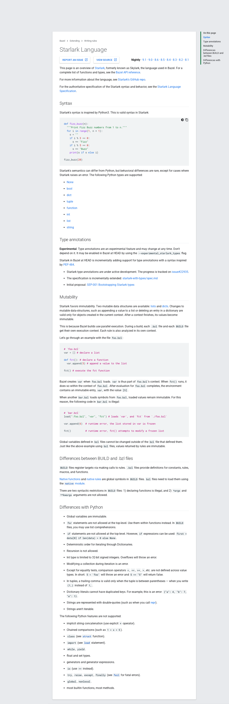 | 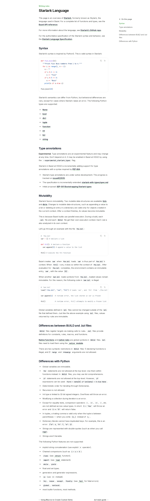 |

- In the "Differences between BUILD and .bzl files" section, the terms "BUILD", "*args", and "**kwargs" in the third paragraph are missing inline code styling (monospace font and background).
- In the "Differences with Python" section, the comparison operators "<" and "<=" are missing inline code styling, while ">=" and ">" in the same sentence are correctly styled.
- In the "Differences with Python" section, the word "if" in the phrase "However, if expressions can be used" is missing inline code styling, while the "if" at the beginning of the previous sentence is correctly styled.

## /rules/legacy-macro-tutorial

Old URL: https://bazel.build/rules/legacy-macro-tutorial
New URL: https://preview.bazel.build/rules/legacy-macro-tutorial

| Old | New |
| --- | --- |
| 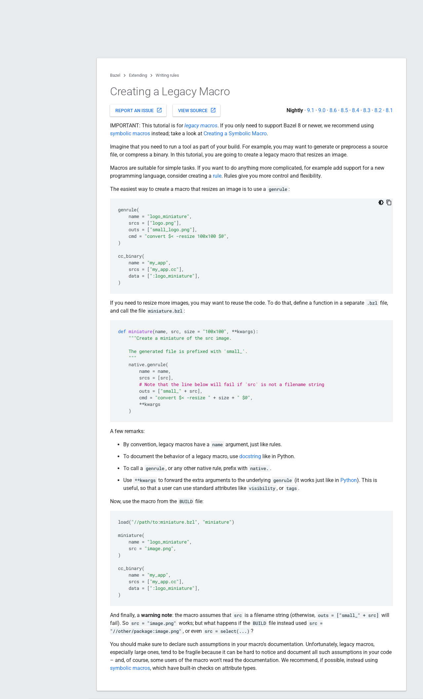 | 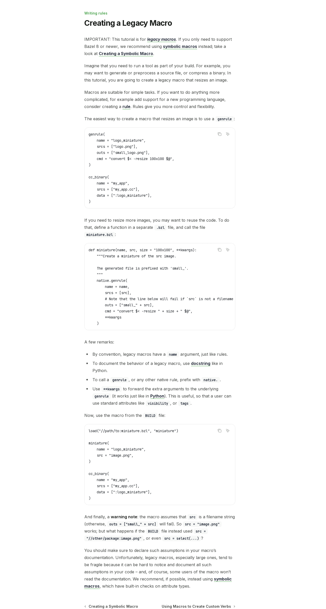 |

- There are unwanted extra spaces introduced before punctuation marks (like colons, commas, and periods) when they follow inline code spans or links (e.g., 'miniature.bzl :', 'genrule ,', 'native. .', 'Macro .').
- In the 'warning note' section, the code snippet 'outs = ["small_" + src]' has lost its code span formatting (monospace font and background) and is rendered as plain text.

## /rules/lib/builtins

Old URL: https://bazel.build/rules/lib/builtins
New URL: https://preview.bazel.build/rules/lib/builtins

OK

## /rules/lib/builtins/Action

Old URL: https://bazel.build/rules/lib/builtins/Action
New URL: https://preview.bazel.build/rules/lib/builtins/Action

OK

## /rules/lib/builtins/Args

Old URL: https://bazel.build/rules/lib/builtins/Args
New URL: https://preview.bazel.build/rules/lib/builtins/Args

OK

## /rules/lib/builtins/Aspect

Old URL: https://bazel.build/rules/lib/builtins/Aspect
New URL: https://preview.bazel.build/rules/lib/builtins/Aspect

| Old | New |
| --- | --- |
| 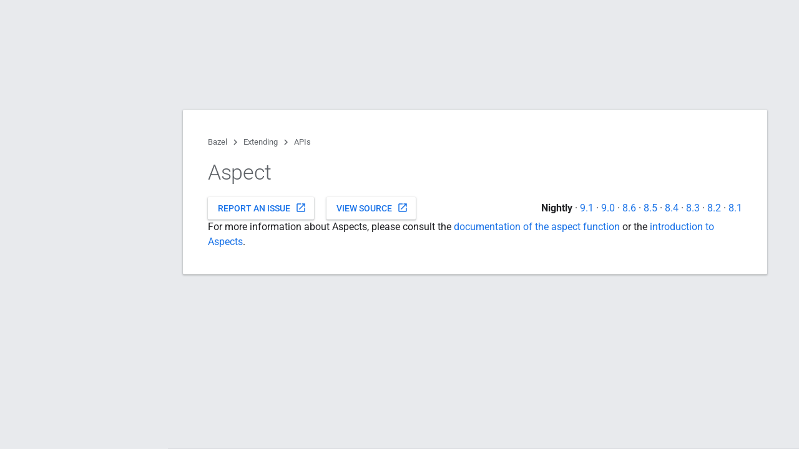 | 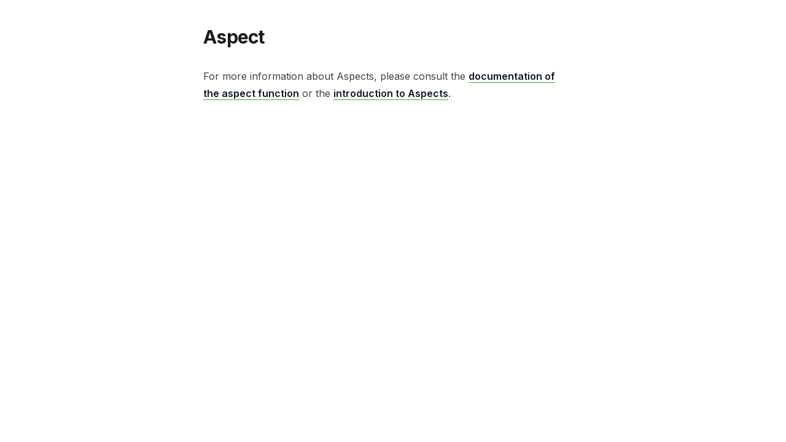 |

- The words 'documentation of' are no longer included as part of the link to 'the aspect function'.

## /rules/lib/builtins/Attribute

Old URL: https://bazel.build/rules/lib/builtins/Attribute
New URL: https://preview.bazel.build/rules/lib/builtins/Attribute

OK

## /rules/lib/builtins/BuildSetting

Old URL: https://bazel.build/rules/lib/builtins/BuildSetting
New URL: https://preview.bazel.build/rules/lib/builtins/BuildSetting

OK

## /rules/lib/builtins/CcCompilationOutputs

Old URL: https://bazel.build/rules/lib/builtins/CcCompilationOutputs
New URL: https://preview.bazel.build/rules/lib/builtins/CcCompilationOutputs

OK

## /rules/lib/builtins/CcLinkingOutputs

Old URL: https://bazel.build/rules/lib/builtins/CcLinkingOutputs
New URL: https://preview.bazel.build/rules/lib/builtins/CcLinkingOutputs

| Old | New |
| --- | --- |
| 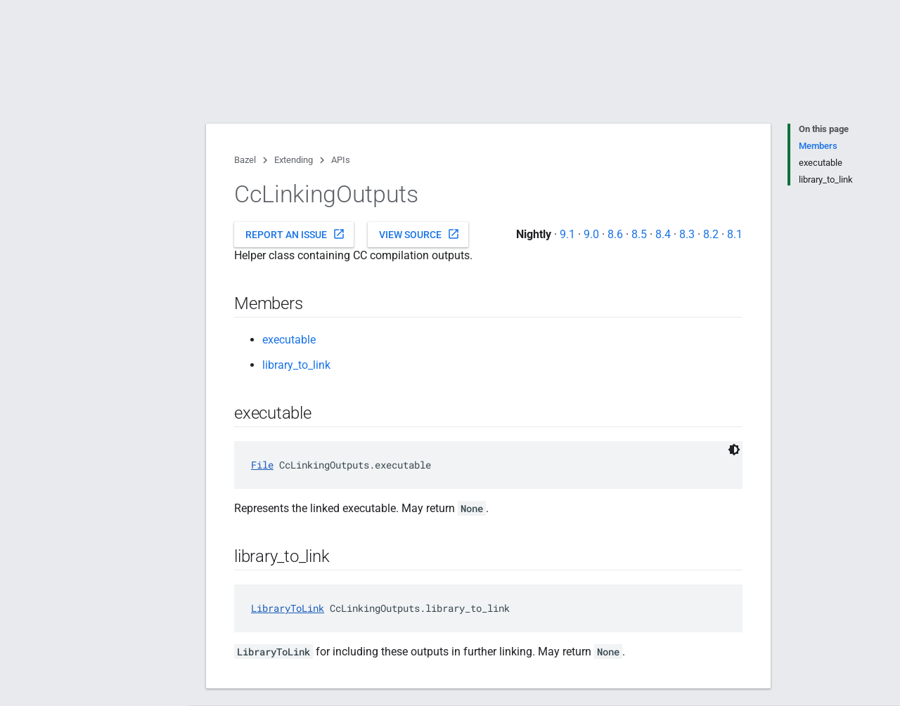 | 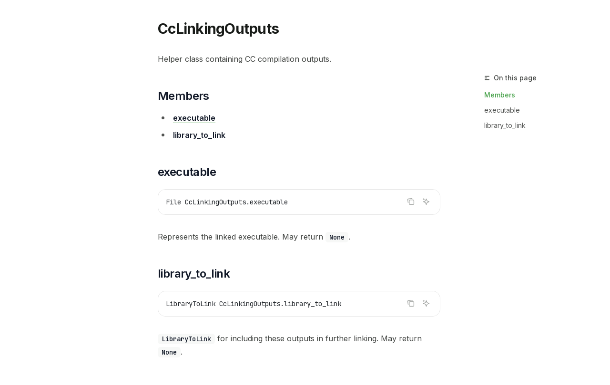 |

- Inline code snippets (e.g., 'LibraryToLink', 'None') in the description sections are incorrectly causing line breaks, appearing on their own lines instead of inline with the surrounding text.
- The 'REPORT AN ISSUE' and 'VIEW SOURCE' buttons are missing from the top of the page content.
- Cross-links on types within code signatures and descriptions (e.g., 'File', 'LibraryToLink') have been lost and appear as plain text.

## /rules/lib/builtins/CompilationContext

Old URL: https://bazel.build/rules/lib/builtins/CompilationContext
New URL: https://preview.bazel.build/rules/lib/builtins/CompilationContext

OK

## /rules/lib/builtins/DirectoryExpander

Old URL: https://bazel.build/rules/lib/builtins/DirectoryExpander
New URL: https://preview.bazel.build/rules/lib/builtins/DirectoryExpander

OK

## /rules/lib/builtins/DottedVersion

Old URL: https://bazel.build/rules/lib/builtins/DottedVersion
New URL: https://preview.bazel.build/rules/lib/builtins/DottedVersion

OK

## /rules/lib/builtins/ExecGroupCollection

Old URL: https://bazel.build/rules/lib/builtins/ExecGroupCollection
New URL: https://preview.bazel.build/rules/lib/builtins/ExecGroupCollection

OK

## /rules/lib/builtins/ExecTransitionFactory

Old URL: https://bazel.build/rules/lib/builtins/ExecTransitionFactory
New URL: https://preview.bazel.build/rules/lib/builtins/ExecTransitionFactory

OK

## /rules/lib/builtins/Facts

Old URL: https://bazel.build/rules/lib/builtins/Facts
New URL: https://preview.bazel.build/rules/lib/builtins/Facts

| Old | New |
| --- | --- |
| 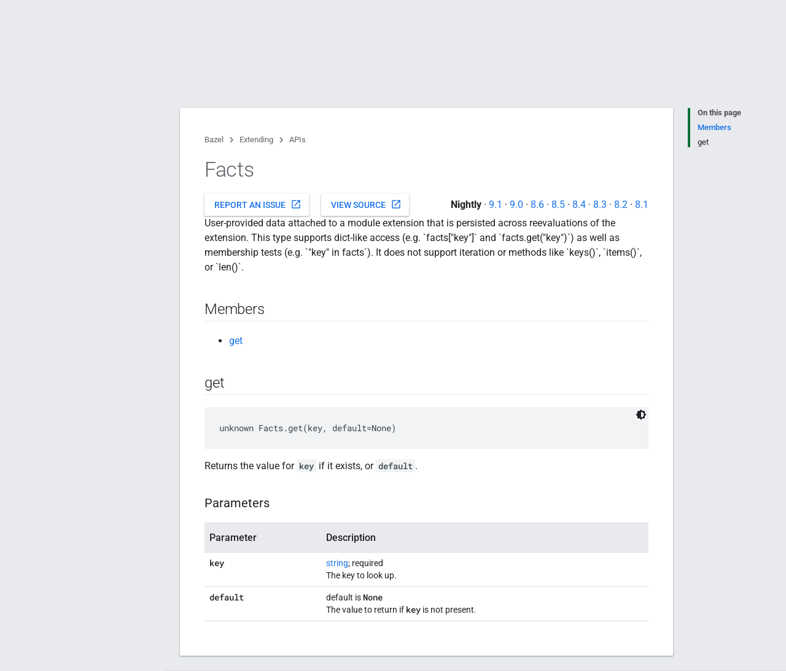 | 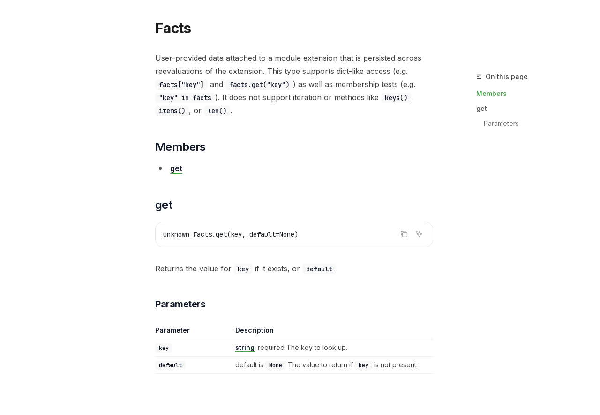 |

- Line breaks are missing within the cells of the 'Parameters' table, causing text that should be on separate lines to be merged (e.g., 'required' and 'The key to look up').
- Extra spaces have been introduced before punctuation marks (periods, commas, and parentheses) that follow inline code blocks in the introductory paragraph.

## /rules/lib/builtins/FeatureConfiguration

Old URL: https://bazel.build/rules/lib/builtins/FeatureConfiguration
New URL: https://preview.bazel.build/rules/lib/builtins/FeatureConfiguration

OK

## /rules/lib/builtins/File

Old URL: https://bazel.build/rules/lib/builtins/File
New URL: https://preview.bazel.build/rules/lib/builtins/File

OK

## /rules/lib/builtins/Label

Old URL: https://bazel.build/rules/lib/builtins/Label
New URL: https://preview.bazel.build/rules/lib/builtins/Label

| Old | New |
| --- | --- |
| 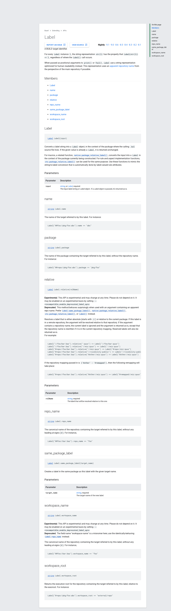 | 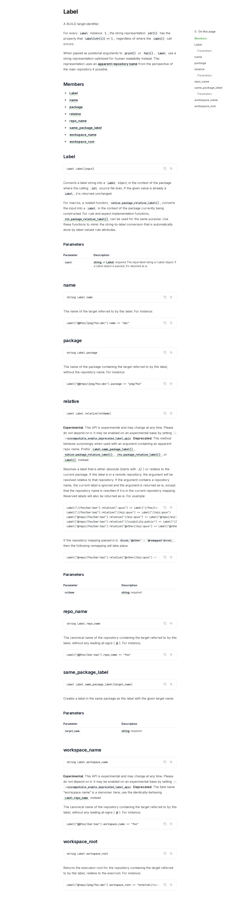 |

- In the 'relative' section, HTML entities '&lcub;' and '&rcub;' are displayed instead of literal curly braces '{' and '}'.
- Parameter descriptions are missing from the tables in the 'relative' and 'same_package_label' sections (e.g., the descriptive text for 'relName' and 'target_name' is gone).
- In the 'relative' section's 'Deprecated' note, there are unnecessary spaces before the commas in the list of alternative methods.
- Experimental notes incorrectly include an extra hyphen/bullet point before the flag name '--incompatible_enable_deprecated_label_apis'.

## /rules/lib/builtins/LateBoundDefault

Old URL: https://bazel.build/rules/lib/builtins/LateBoundDefault
New URL: https://preview.bazel.build/rules/lib/builtins/LateBoundDefault

OK

## /rules/lib/builtins/LibraryToLink

Old URL: https://bazel.build/rules/lib/builtins/LibraryToLink
New URL: https://preview.bazel.build/rules/lib/builtins/LibraryToLink

OK

## /rules/lib/builtins/License

Old URL: https://bazel.build/rules/lib/builtins/License
New URL: https://preview.bazel.build/rules/lib/builtins/License

OK

## /rules/lib/builtins/LinkerInput

Old URL: https://bazel.build/rules/lib/builtins/LinkerInput
New URL: https://preview.bazel.build/rules/lib/builtins/LinkerInput

| Old | New |
| --- | --- |
| 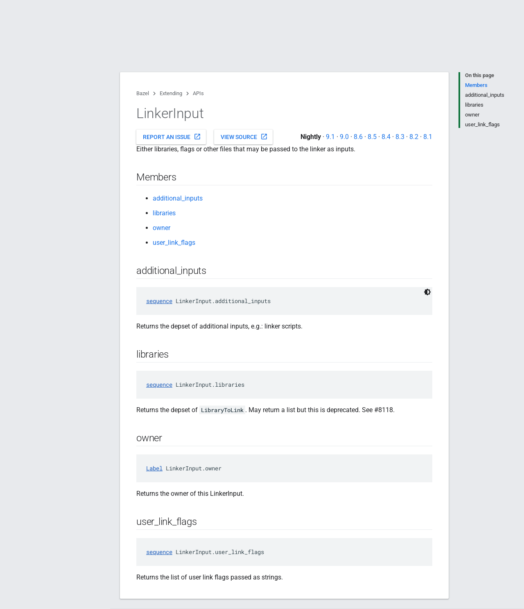 | 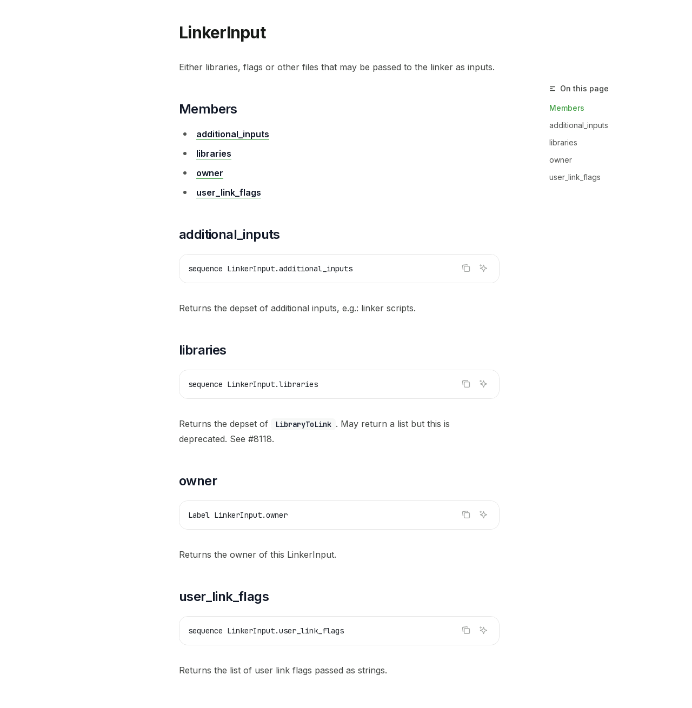 |

- In the 'libraries' section, there is a stray space between the code-formatted 'LibraryToLink' and the following period.
- In the 'libraries' section, the link to GitHub issue #8118 is missing.

## /rules/lib/builtins/LinkingContext

Old URL: https://bazel.build/rules/lib/builtins/LinkingContext
New URL: https://preview.bazel.build/rules/lib/builtins/LinkingContext

OK

## /rules/lib/builtins/Provider

Old URL: https://bazel.build/rules/lib/builtins/Provider
New URL: https://preview.bazel.build/rules/lib/builtins/Provider

OK

## /rules/lib/builtins/Subrule

Old URL: https://bazel.build/rules/lib/builtins/Subrule
New URL: https://preview.bazel.build/rules/lib/builtins/Subrule

OK

## /rules/lib/builtins/SymlinkEntry

Old URL: https://bazel.build/rules/lib/builtins/SymlinkEntry
New URL: https://preview.bazel.build/rules/lib/builtins/SymlinkEntry

OK

## /rules/lib/builtins/Target

Old URL: https://bazel.build/rules/lib/builtins/Target
New URL: https://preview.bazel.build/rules/lib/builtins/Target

| Old | New |
| --- | --- |
| 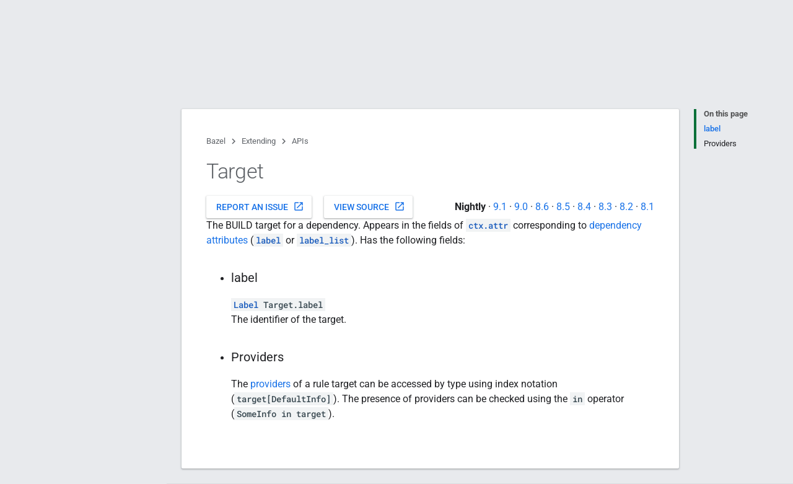 | 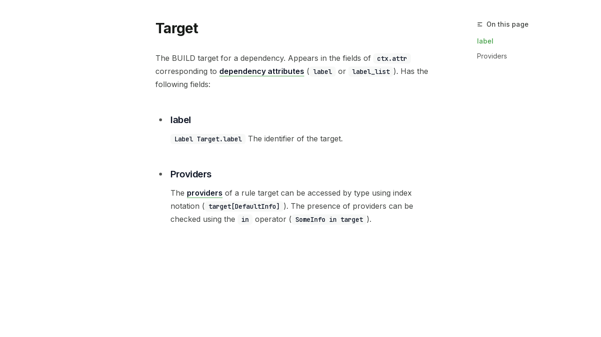 |

- In the 'label' section, the description text 'The identifier of the target.' is on the same line as the code snippet, whereas it was on a new line in the original site.
- Multiple hyperlinks are missing in the new site: 'label' and 'label_list' in the introductory paragraph, and the 'Label' type in the 'label' section are no longer clickable links.
- Unnecessary extra whitespace has been introduced around inline code blocks when they are enclosed in parentheses, such as '( label or label_list )', '( target[DefaultInfo] )', and '( SomeInfo in target )'.

## /rules/lib/builtins/TemplateDict

Old URL: https://bazel.build/rules/lib/builtins/TemplateDict
New URL: https://preview.bazel.build/rules/lib/builtins/TemplateDict

| Old | New |
| --- | --- |
| 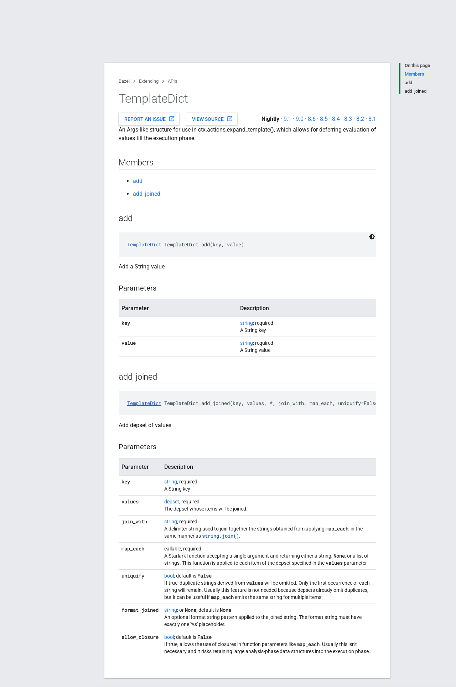 | 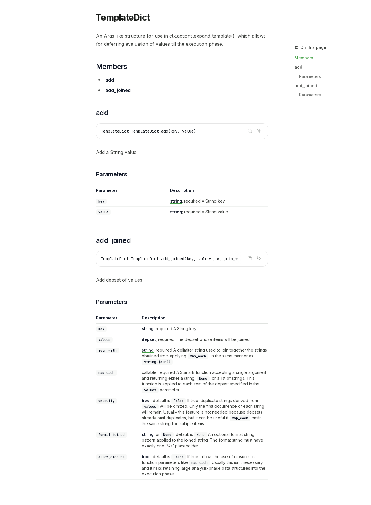 |

- Missing line breaks between parameter metadata (type and requirement) and descriptions in the 'Parameters' tables.
- Extraneous spaces before punctuation in parameter descriptions, specifically before the comma after 'map_each', before the period after 'string.join()', and before the semicolon in the 'format_joined' row.

## /rules/lib/builtins/ToolchainContext

Old URL: https://bazel.build/rules/lib/builtins/ToolchainContext
New URL: https://preview.bazel.build/rules/lib/builtins/ToolchainContext

| Old | New |
| --- | --- |
| 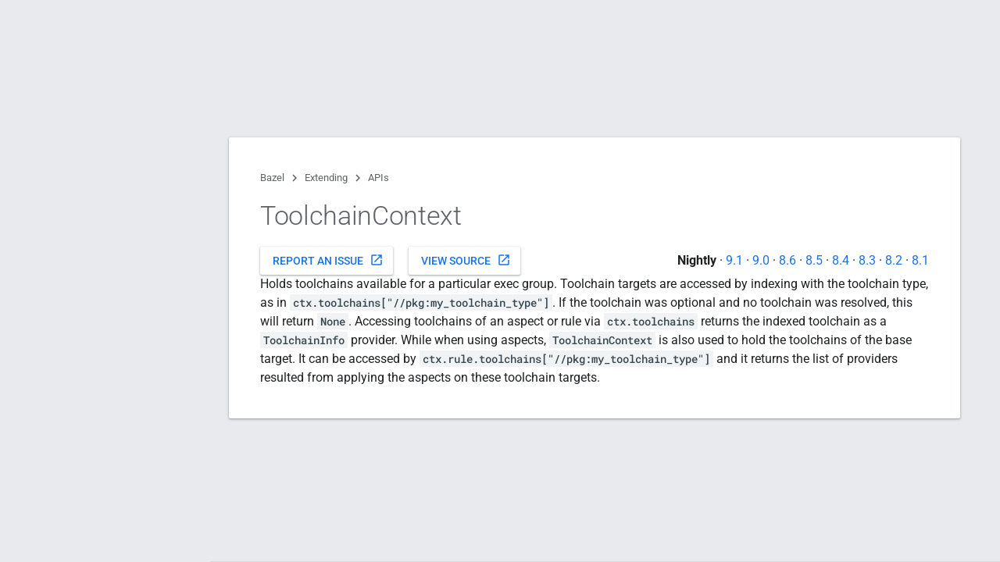 | 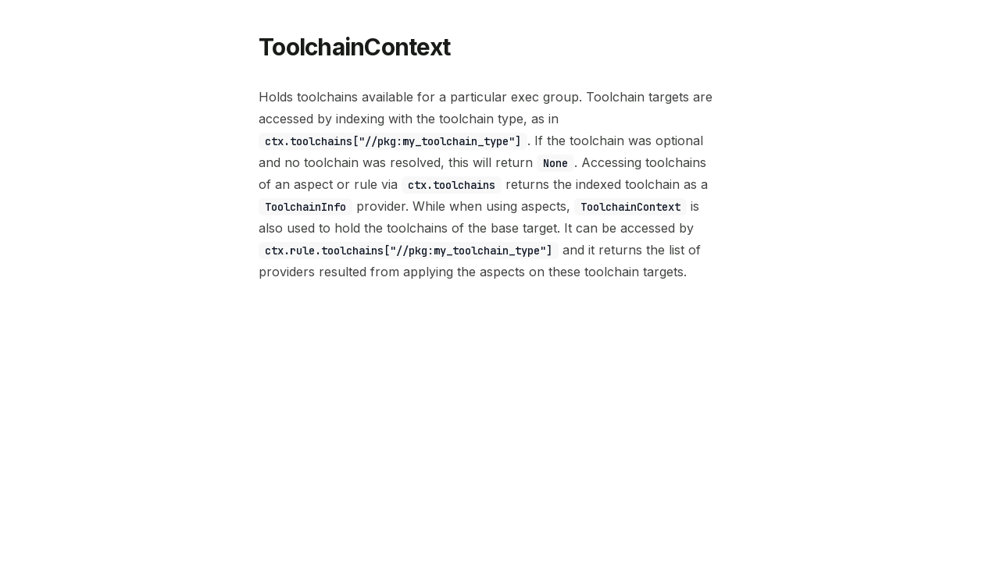 |

- There is a missing space between the inline code block 'ctx.rule.toolchains["//pkg:my_toolchain_type"]' and the word 'and' that follows it.

## /rules/lib/builtins/actions

Old URL: https://bazel.build/rules/lib/builtins/actions
New URL: https://preview.bazel.build/rules/lib/builtins/actions

OK

## /rules/lib/builtins/apple_platform

Old URL: https://bazel.build/rules/lib/builtins/apple_platform
New URL: https://preview.bazel.build/rules/lib/builtins/apple_platform

OK

## /rules/lib/builtins/bazel_module

Old URL: https://bazel.build/rules/lib/builtins/bazel_module
New URL: https://preview.bazel.build/rules/lib/builtins/bazel_module

OK

## /rules/lib/builtins/bazel_module_tags

Old URL: https://bazel.build/rules/lib/builtins/bazel_module_tags
New URL: https://preview.bazel.build/rules/lib/builtins/bazel_module_tags

| Old | New |
| --- | --- |
| 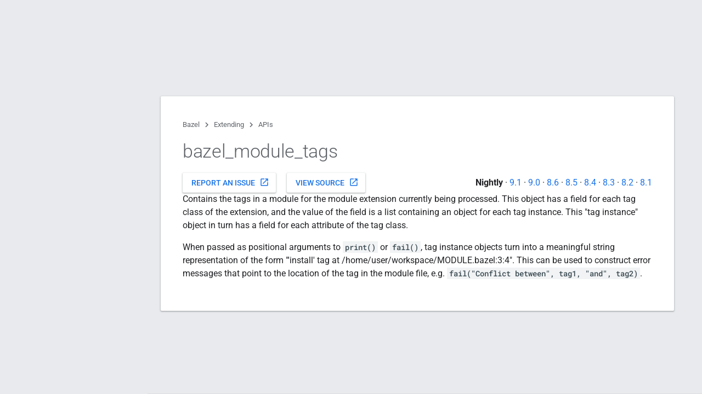 | 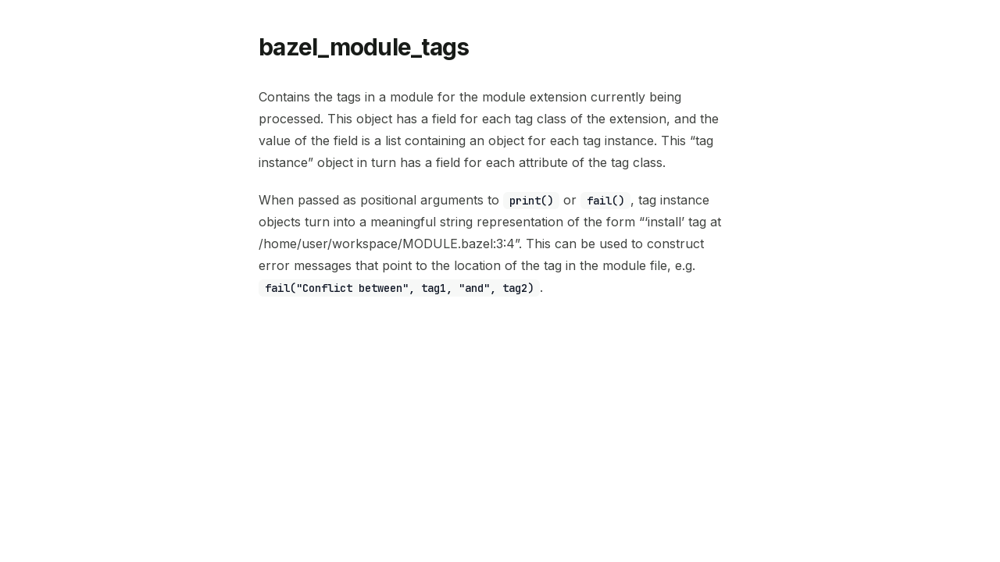 |

- Smart quotes are used instead of straight quotes in the body text (e.g., “tag instance” instead of "tag instance").

## /rules/lib/builtins/configuration

Old URL: https://bazel.build/rules/lib/builtins/configuration
New URL: https://preview.bazel.build/rules/lib/builtins/configuration

| Old | New |
| --- | --- |
| 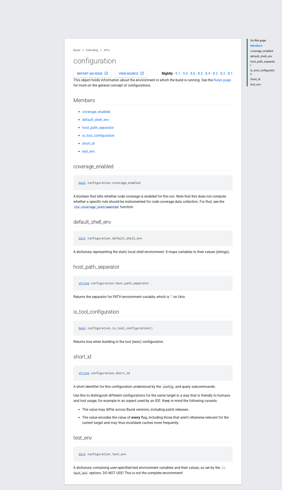 | 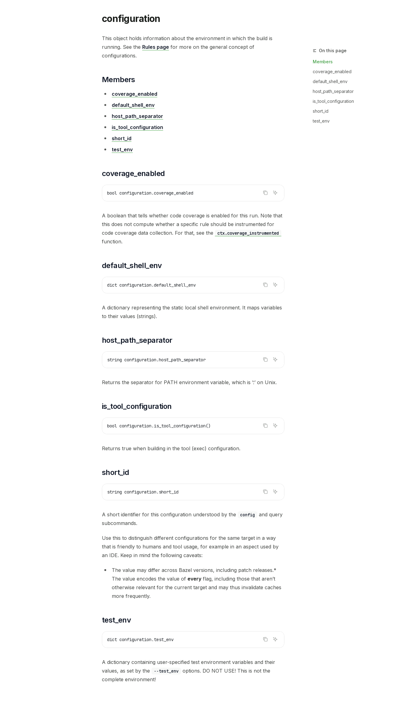 |

- In the coverage_enabled section, an extra underscore has been added before 'ctx.coverage_instrumented'.
- In the short_id section, an extra asterisk appears at the end of the first bullet point: 'patch releases.*'.
- In the short_id section, the second bullet point is missing its bullet marker, appearing as a continuation of the first item.

## /rules/lib/builtins/ctx

Old URL: https://bazel.build/rules/lib/builtins/ctx
New URL: https://preview.bazel.build/rules/lib/builtins/ctx

OK

## /rules/lib/builtins/depset

Old URL: https://bazel.build/rules/lib/builtins/depset
New URL: https://preview.bazel.build/rules/lib/builtins/depset

| Old | New |
| --- | --- |
| 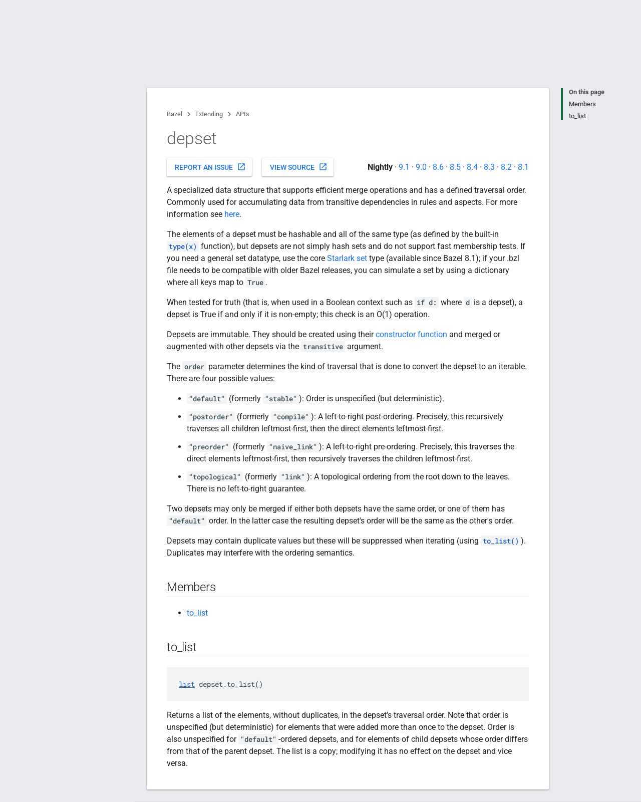 | 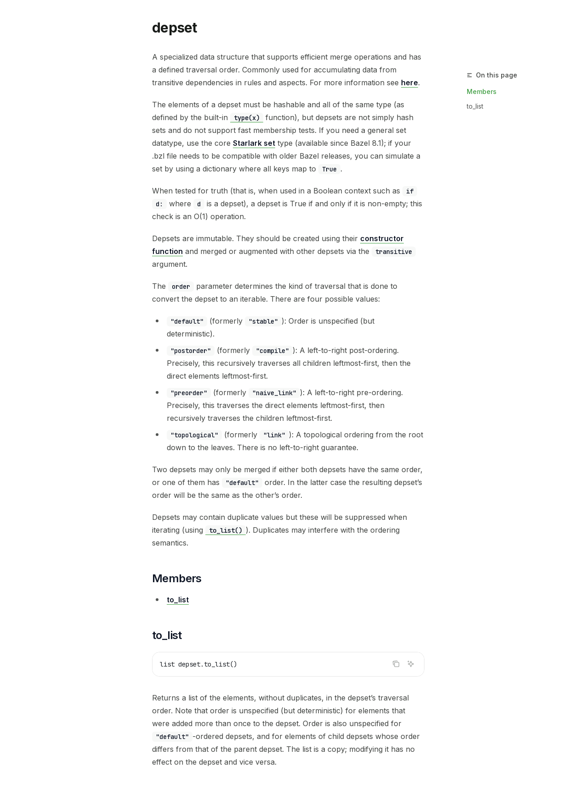 |

- Literal underscores are appearing around some links in the text (e.g., "_type(x)_" and "_to_list()_"), likely as a result of unparsed formatting characters.
- There is incorrect spacing before punctuation following some inline code or link elements, such as an extra space before the period in "True ." and before the hyphen in "'default' -ordered".

## /rules/lib/builtins/exec_result

Old URL: https://bazel.build/rules/lib/builtins/exec_result
New URL: https://preview.bazel.build/rules/lib/builtins/exec_result

OK

## /rules/lib/builtins/extension_metadata

Old URL: https://bazel.build/rules/lib/builtins/extension_metadata
New URL: https://preview.bazel.build/rules/lib/builtins/extension_metadata

OK

## /rules/lib/builtins/fragments

Old URL: https://bazel.build/rules/lib/builtins/fragments
New URL: https://preview.bazel.build/rules/lib/builtins/fragments

OK

## /rules/lib/builtins/java_annotation_processing

Old URL: https://bazel.build/rules/lib/builtins/java_annotation_processing
New URL: https://preview.bazel.build/rules/lib/builtins/java_annotation_processing

OK

## /rules/lib/builtins/macro

Old URL: https://bazel.build/rules/lib/builtins/macro
New URL: https://preview.bazel.build/rules/lib/builtins/macro

| Old | New |
| --- | --- |
| 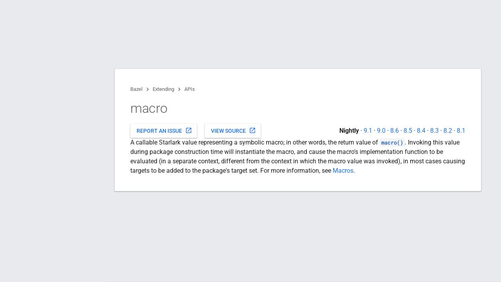 | 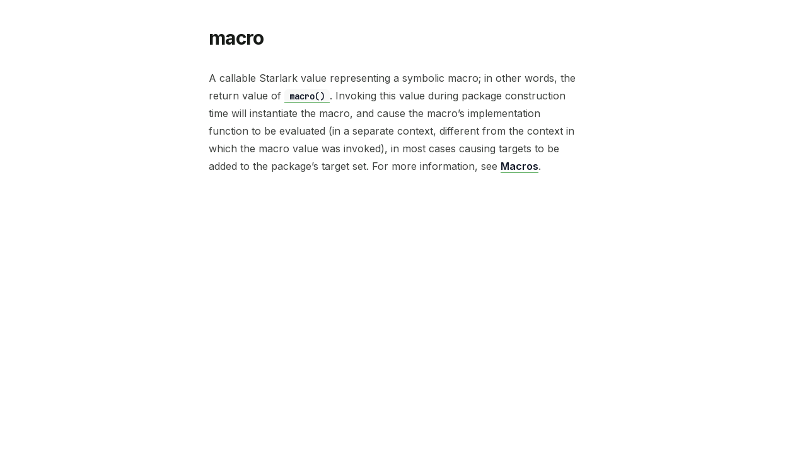 |

- The breadcrumbs (Bazel > Extending > APIs) are missing.
- The 'REPORT AN ISSUE' button is missing.
- The 'VIEW SOURCE' button is missing.

## /rules/lib/builtins/module_ctx

Old URL: https://bazel.build/rules/lib/builtins/module_ctx
New URL: https://preview.bazel.build/rules/lib/builtins/module_ctx

| Old | New |
| --- | --- |
|  |  |

- There is an extraneous 'E.' character at the beginning of the 'On this page' title in the right-hand navigation sidebar.
- The description for the 'facts' parameter in the 'extension_metadata' section has broken layout: part of the descriptive text is incorrectly moved into a separate grey side-box that disrupts the table formatting.

## /rules/lib/builtins/path

Old URL: https://bazel.build/rules/lib/builtins/path
New URL: https://preview.bazel.build/rules/lib/builtins/path

OK

## /rules/lib/builtins/propagation_ctx

Old URL: https://bazel.build/rules/lib/builtins/propagation_ctx
New URL: https://preview.bazel.build/rules/lib/builtins/propagation_ctx

OK

## /rules/lib/builtins/repo_metadata

Old URL: https://bazel.build/rules/lib/builtins/repo_metadata
New URL: https://preview.bazel.build/rules/lib/builtins/repo_metadata

OK

## /rules/lib/builtins/repository_ctx

Old URL: https://bazel.build/rules/lib/builtins/repository_ctx
New URL: https://preview.bazel.build/rules/lib/builtins/repository_ctx

| Old | New |
| --- | --- |
|  |  |

- HTML entities &lbrace; and &rbrace; are not being rendered correctly and appear as literal text in the parameter tables of several sections (e.g., download, download_and_extract, execute, extract, repo_metadata, and template).

## /rules/lib/builtins/repository_os

Old URL: https://bazel.build/rules/lib/builtins/repository_os
New URL: https://preview.bazel.build/rules/lib/builtins/repository_os

| Old | New |
| --- | --- |
| 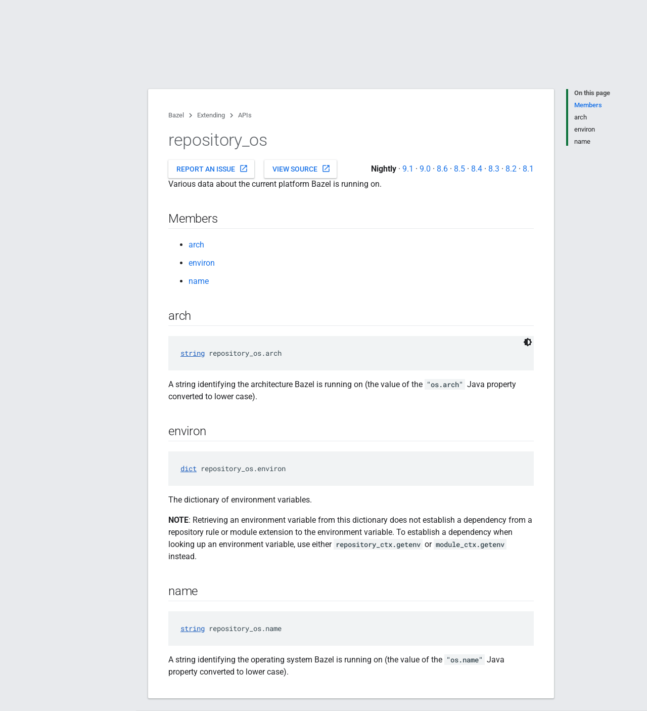 | 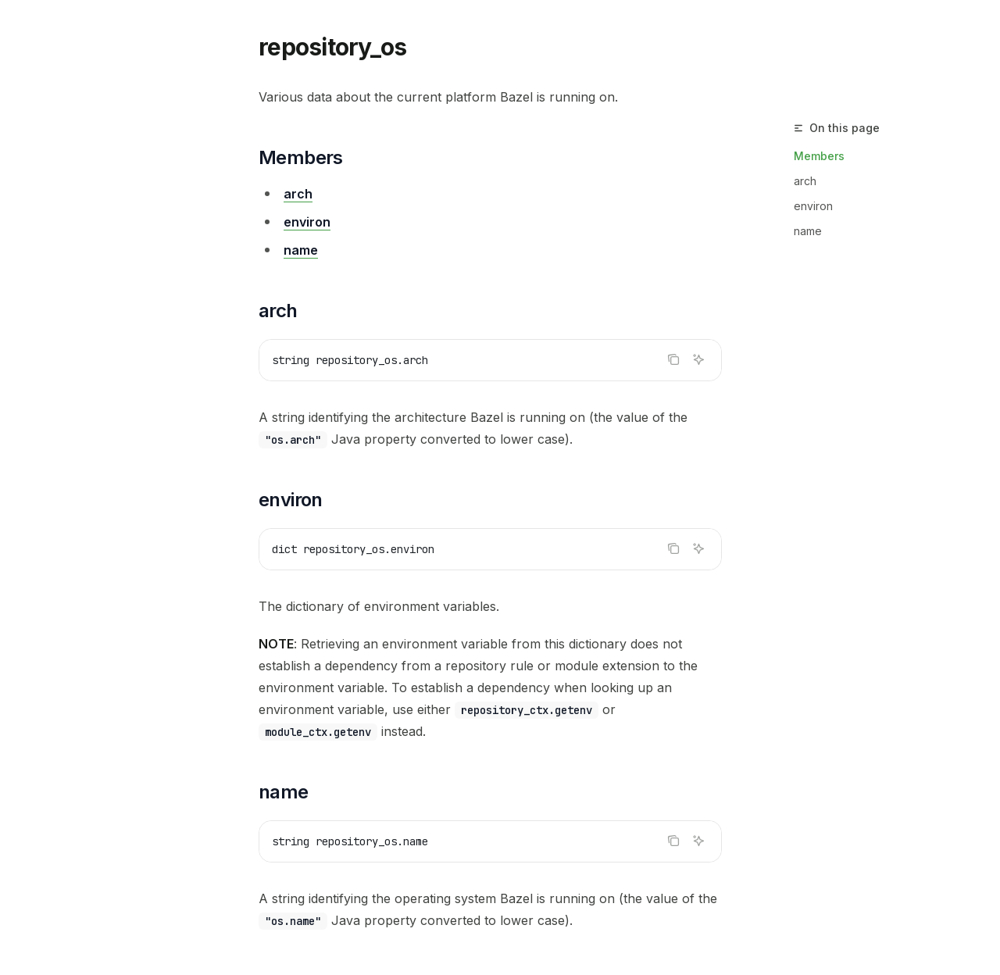 |

- The return types in the code signature blocks (e.g., 'string' and 'dict') are no longer hyperlinked to their respective documentation pages as they were in the old site.
- The references to 'repository_ctx.getenv' and 'module_ctx.getenv' in the 'NOTE' section have lost their hyperlinks, even though they are now styled as inline code.

## /rules/lib/builtins/repository_rule

Old URL: https://bazel.build/rules/lib/builtins/repository_rule
New URL: https://preview.bazel.build/rules/lib/builtins/repository_rule

OK

## /rules/lib/builtins/root

Old URL: https://bazel.build/rules/lib/builtins/root
New URL: https://preview.bazel.build/rules/lib/builtins/root

OK

## /rules/lib/builtins/rule

Old URL: https://bazel.build/rules/lib/builtins/rule
New URL: https://preview.bazel.build/rules/lib/builtins/rule

OK

## /rules/lib/builtins/rule_attributes

Old URL: https://bazel.build/rules/lib/builtins/rule_attributes
New URL: https://preview.bazel.build/rules/lib/builtins/rule_attributes

| Old | New |
| --- | --- |
| 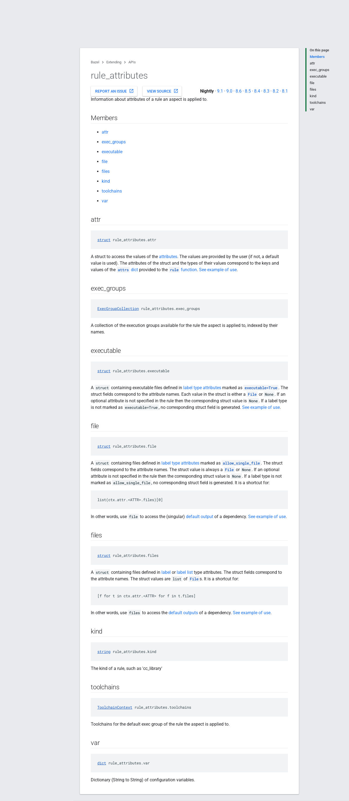 | 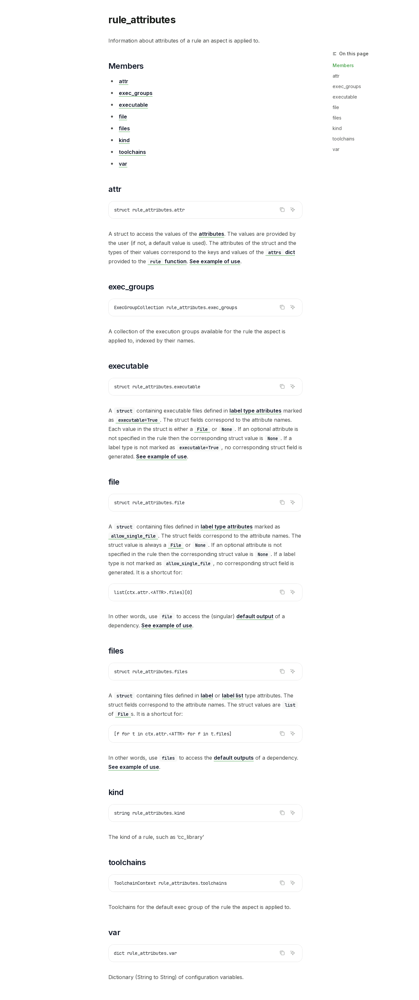 |

- The 'Members' list is incorrectly nested, with all items from 'exec_groups' onwards appearing as sub-bullets of 'attr'.
- There is inconsistent bolding in the 'Members' list; 'executable', 'files', and 'toolchains' are bolded while other items are not.
- Inline code elements (e.g., 'struct', 'executable=True', 'None', 'File', 'allow_single_file') are missing monospaced font formatting throughout the page.

## /rules/lib/builtins/runfiles

Old URL: https://bazel.build/rules/lib/builtins/runfiles
New URL: https://preview.bazel.build/rules/lib/builtins/runfiles

| Old | New |
| --- | --- |
| 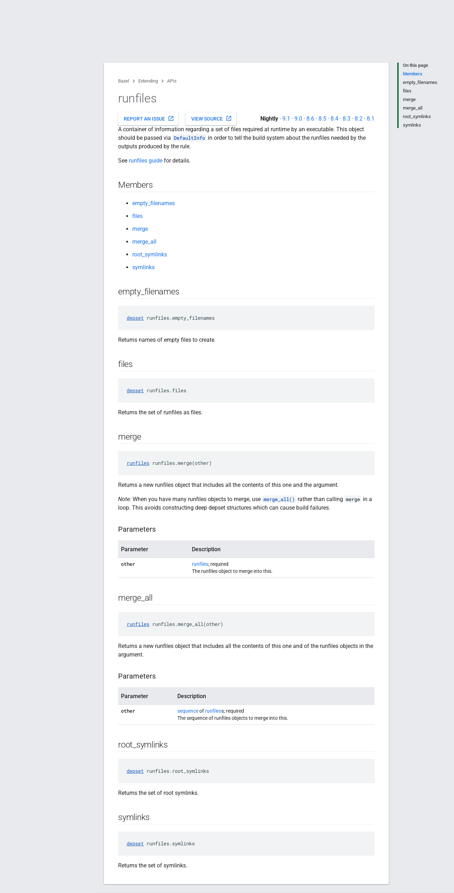 | 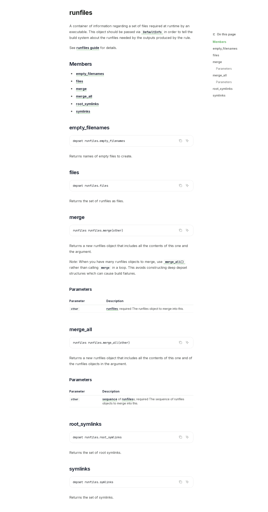 |

- In the 'Parameters' tables for 'merge' and 'merge_all', the description text is missing a line break after the requirement status ('; required'), causing it to be concatenated onto the same line as the parameter metadata.

## /rules/lib/builtins/struct

Old URL: https://bazel.build/rules/lib/builtins/struct
New URL: https://preview.bazel.build/rules/lib/builtins/struct

| Old | New |
| --- | --- |
| 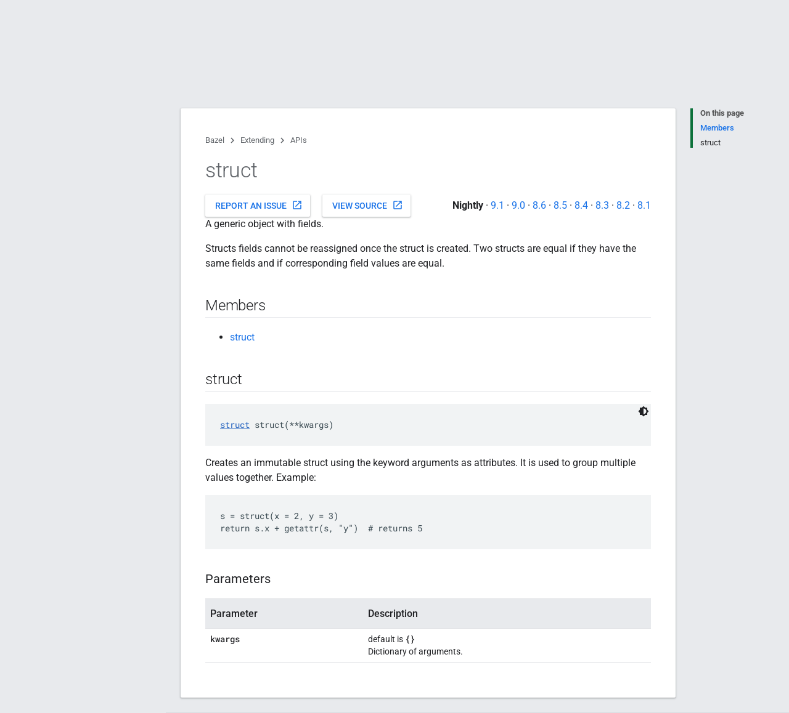 | 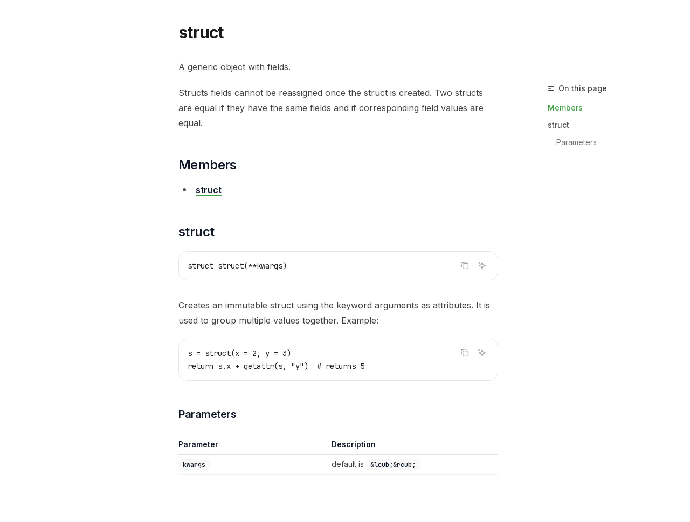 |

- The text "Dictionary of arguments." is missing from the Description column of the Parameters table.
- HTML character entities "&lcub;&rcub;" are not correctly rendered as "{}" in the Description column of the Parameters table.

## /rules/lib/builtins/subrule_ctx

Old URL: https://bazel.build/rules/lib/builtins/subrule_ctx
New URL: https://preview.bazel.build/rules/lib/builtins/subrule_ctx

OK

## /rules/lib/builtins/tag_class

Old URL: https://bazel.build/rules/lib/builtins/tag_class
New URL: https://preview.bazel.build/rules/lib/builtins/tag_class

OK

## /rules/lib/builtins/template_ctx

Old URL: https://bazel.build/rules/lib/builtins/template_ctx
New URL: https://preview.bazel.build/rules/lib/builtins/template_ctx

| Old | New |
| --- | --- |
| 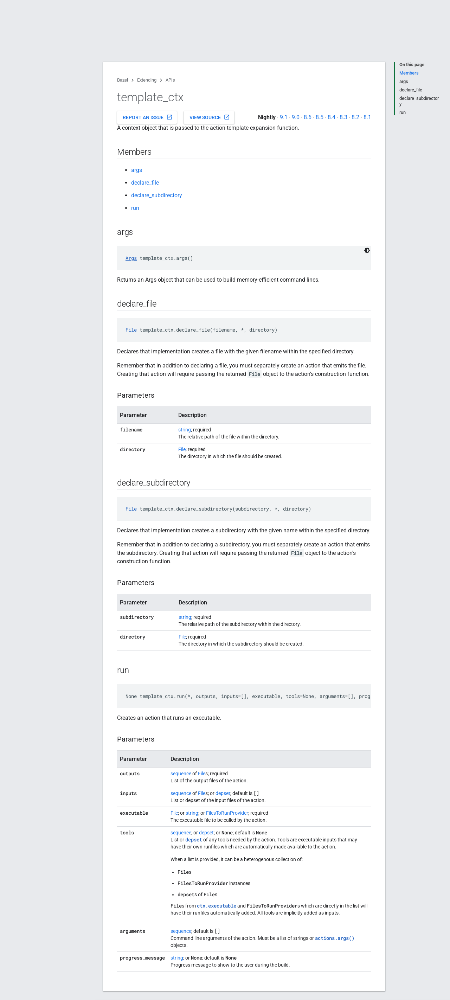 | 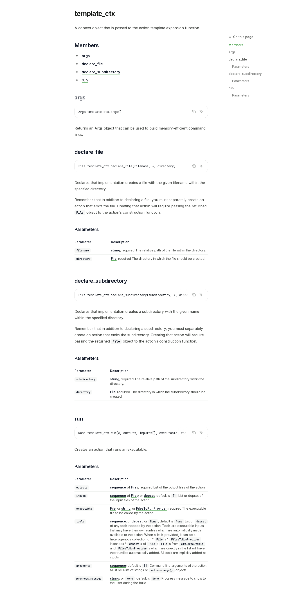 |

- In all parameter tables (e.g., under 'declare_file', 'declare_subdirectory', and 'run'), the type and requirement information are merged onto the same line as the parameter description, lacking the line break that existed in the old site.
- The bulleted list in the 'tools' parameter description of the 'run' method has been flattened into a single paragraph, making it much harder to read.
- There are several spacing errors in the 'tools' parameter description of the 'run' method where plurals have been broken up with extra spaces (e.g., 'File s', 'depset s', 'FileToRunProvider s').

## /rules/lib/builtins/toolchain_type

Old URL: https://bazel.build/rules/lib/builtins/toolchain_type
New URL: https://preview.bazel.build/rules/lib/builtins/toolchain_type

OK

## /rules/lib/builtins/transition

Old URL: https://bazel.build/rules/lib/builtins/transition
New URL: https://preview.bazel.build/rules/lib/builtins/transition

| Old | New |
| --- | --- |
| 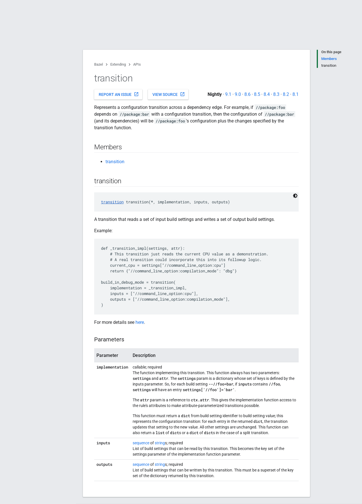 | 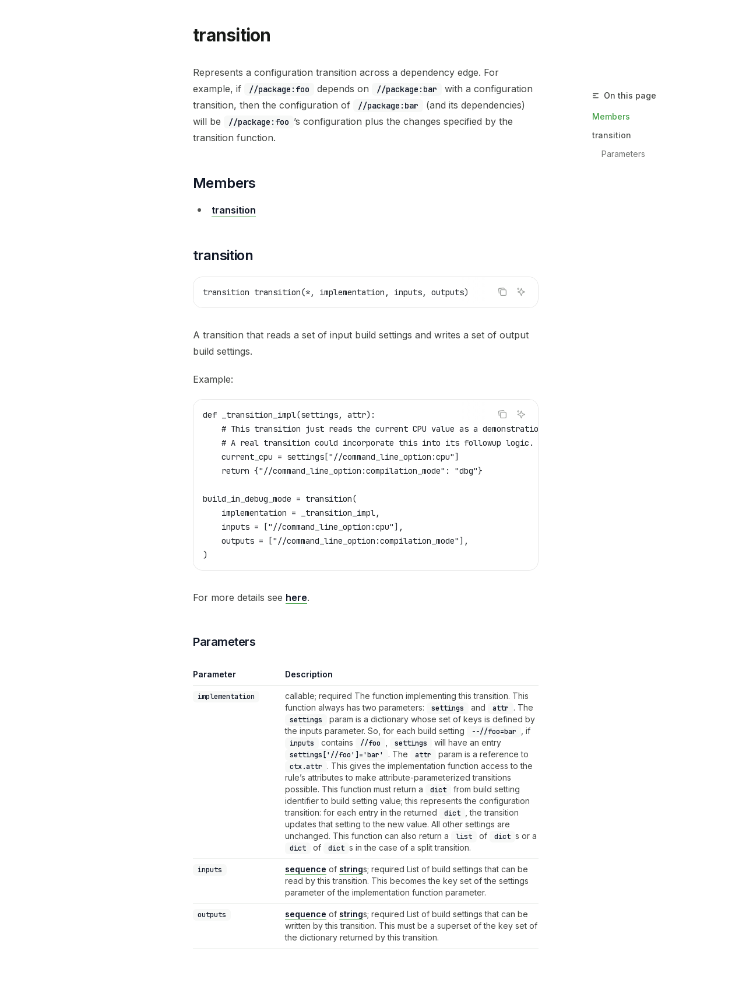 |

- In the Parameters table, the newline after 'callable; required' for the 'implementation' parameter is missing, causing it to merge with the subsequent sentence.
- Unwanted extra spaces have been injected into code snippets and around punctuation within the Parameters table descriptions (e.g., 'ctx . attr', 'settings [ \' //foo \' ] = \' bar \'', 'strings ; required').

## /rules/lib/builtins/wasm_module

Old URL: https://bazel.build/rules/lib/builtins/wasm_module
New URL: https://preview.bazel.build/rules/lib/builtins/wasm_module

| Old | New |
| --- | --- |
| 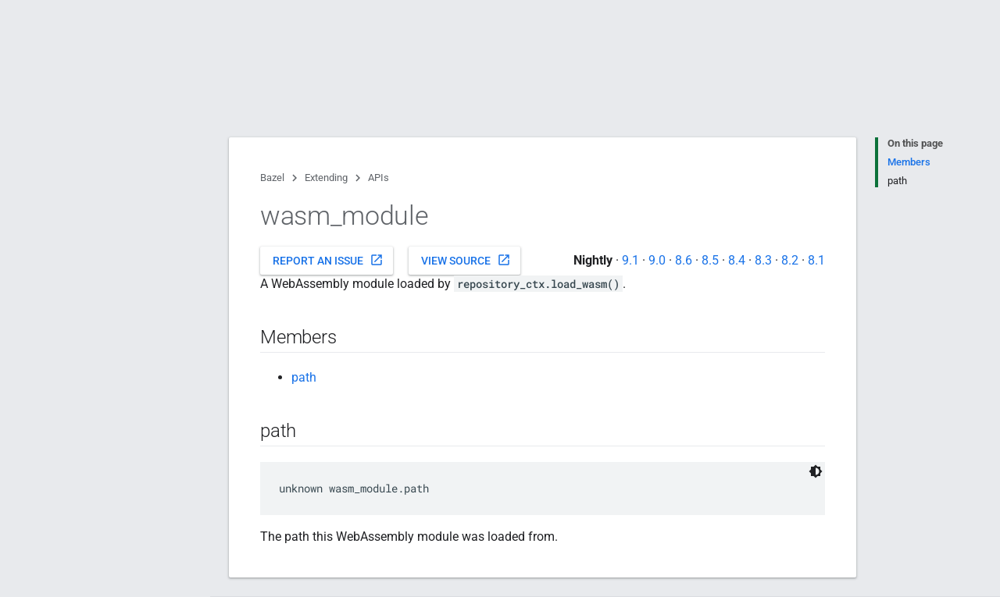 | 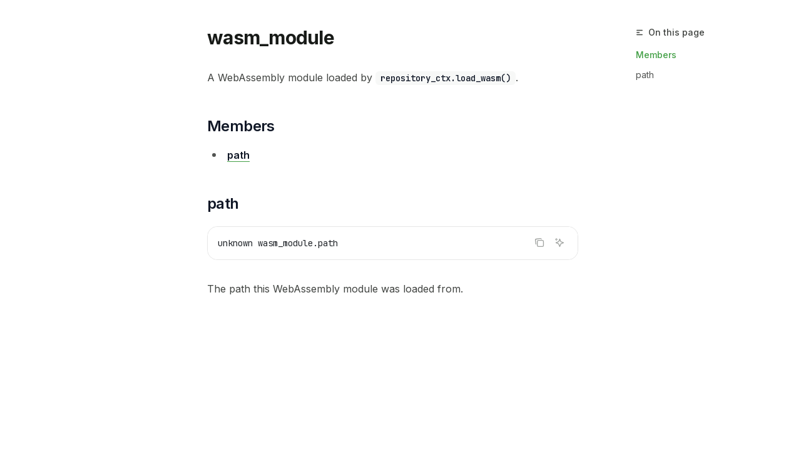 |

- The breadcrumbs (Bazel > Extending > APIs) are missing in the new website.
- The 'REPORT AN ISSUE' and 'VIEW SOURCE' buttons are missing in the new website.
- The horizontal rules separating the section headers from the content are missing in the new website.

## /rules/lib/core

Old URL: https://bazel.build/rules/lib/core
New URL: https://preview.bazel.build/rules/lib/core

OK

## /rules/lib/core/bool

Old URL: https://bazel.build/rules/lib/core/bool
New URL: https://preview.bazel.build/rules/lib/core/bool

OK

## /rules/lib/core/builtin_function_or_method

Old URL: https://bazel.build/rules/lib/core/builtin_function_or_method
New URL: https://preview.bazel.build/rules/lib/core/builtin_function_or_method

OK

## /rules/lib/core/dict

Old URL: https://bazel.build/rules/lib/core/dict
New URL: https://preview.bazel.build/rules/lib/core/dict

| Old | New |
| --- | --- |
| 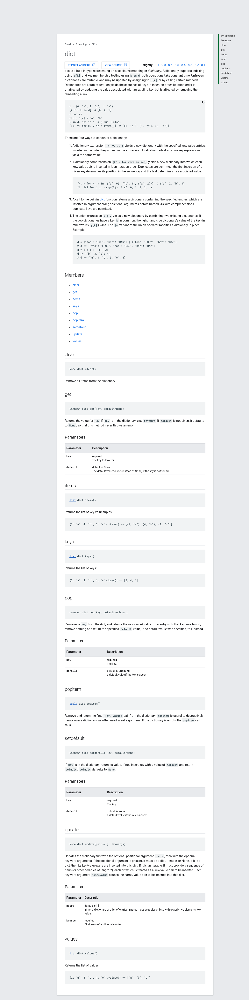 | 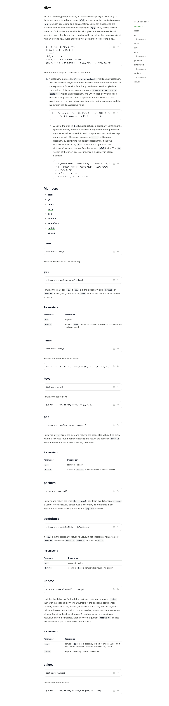 |

- HTML entities for curly braces (`&lcub;` and `&rcub;`) are visible in the introductory text instead of the actual characters.
- The list describing ways to construct a dictionary has incorrect nesting: points 3 and 4 are rendered as sub-bullets under point 2.
- The 'Parameters' tables throughout the page (e.g., for 'get', 'pop', 'setdefault', and 'update') are broken, with column content merged and table styling missing.

## /rules/lib/core/float

Old URL: https://bazel.build/rules/lib/core/float
New URL: https://preview.bazel.build/rules/lib/core/float

OK

## /rules/lib/core/function

Old URL: https://bazel.build/rules/lib/core/function
New URL: https://preview.bazel.build/rules/lib/core/function

OK

## /rules/lib/core/int

Old URL: https://bazel.build/rules/lib/core/int
New URL: https://preview.bazel.build/rules/lib/core/int

OK

## /rules/lib/core/json

Old URL: https://bazel.build/rules/lib/core/json
New URL: https://preview.bazel.build/rules/lib/core/json

| Old | New |
| --- | --- |
| 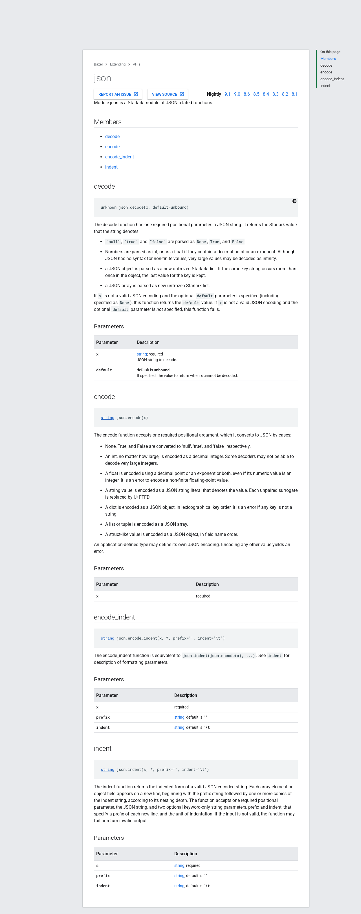 | 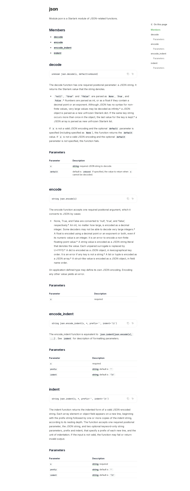 |

- Stray asterisks appear at the end of many list items in the 'decode' and 'encode' sections (e.g., 'infinity.*', 'is kept.*', 'respectively.*', etc.).
- Inconsistent monospace styling for terms like 'None', 'True', and 'False' in the 'encode' section description compared to the 'decode' section and the original site.
- Lack of proper spacing or a line break in the 'decode' section's Parameters table for the 'default' description, resulting in 'unbound If' being run together.
- Inconsistent monospace styling for parameter names in the Parameters tables; some parameters like 'x' and 's' are plain text while others like 'default' and 'prefix' are styled as code blocks.

## /rules/lib/core/list

Old URL: https://bazel.build/rules/lib/core/list
New URL: https://preview.bazel.build/rules/lib/core/list

| Old | New |
| --- | --- |
| 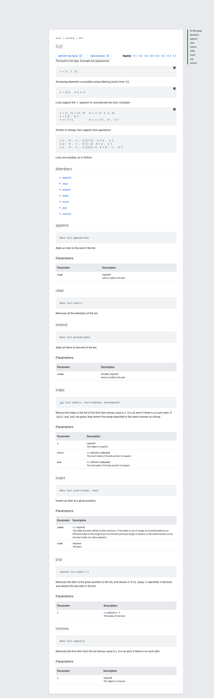 | 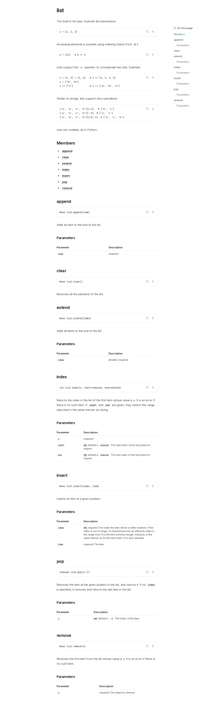 |

- The description for the 'item' parameter in the 'append' section is missing the text 'Item to add at the end.'
- The description for the 'items' parameter in the 'extend' section is missing the text 'Items to add at the end.'
- The description for the 'x' parameter in the 'index' section is missing the text 'The object to search.'
- The description for the 'item' parameter in the 'insert' section is missing the text 'The item.'

## /rules/lib/core/range

Old URL: https://bazel.build/rules/lib/core/range
New URL: https://preview.bazel.build/rules/lib/core/range

OK

## /rules/lib/core/set

Old URL: https://bazel.build/rules/lib/core/set
New URL: https://preview.bazel.build/rules/lib/core/set

| Old | New |
| --- | --- |
|  |  |

- The 'On this page' navigation sidebar is truncated and missing several sections and sub-sections, ending abruptly at 'issubset'.

## /rules/lib/core/string

Old URL: https://bazel.build/rules/lib/core/string
New URL: https://preview.bazel.build/rules/lib/core/string

| Old | New |
| --- | --- |
|  |  |

- In the 'format' section, HTML entities like '&lbrace;' and '&rbrace;' are displayed as literal text in both the description and the parameters table instead of being rendered as curly braces ('{' and '}').

## /rules/lib/core/tuple

Old URL: https://bazel.build/rules/lib/core/tuple
New URL: https://preview.bazel.build/rules/lib/core/tuple

OK

## /rules/lib/fragments

Old URL: https://bazel.build/rules/lib/fragments
New URL: https://preview.bazel.build/rules/lib/fragments

OK

## /rules/lib/fragments/apple

Old URL: https://bazel.build/rules/lib/fragments/apple
New URL: https://preview.bazel.build/rules/lib/fragments/apple

OK

## /rules/lib/fragments/bazel_android

Old URL: https://bazel.build/rules/lib/fragments/bazel_android
New URL: https://preview.bazel.build/rules/lib/fragments/bazel_android

OK

## /rules/lib/fragments/coverage

Old URL: https://bazel.build/rules/lib/fragments/coverage
New URL: https://preview.bazel.build/rules/lib/fragments/coverage

OK

## /rules/lib/fragments/cpp

Old URL: https://bazel.build/rules/lib/fragments/cpp
New URL: https://preview.bazel.build/rules/lib/fragments/cpp

OK

## /rules/lib/fragments/java

Old URL: https://bazel.build/rules/lib/fragments/java
New URL: https://preview.bazel.build/rules/lib/fragments/java

OK

## /rules/lib/fragments/objc

Old URL: https://bazel.build/rules/lib/fragments/objc
New URL: https://preview.bazel.build/rules/lib/fragments/objc

OK

## /rules/lib/fragments/platform

Old URL: https://bazel.build/rules/lib/fragments/platform
New URL: https://preview.bazel.build/rules/lib/fragments/platform

OK

## /rules/lib/fragments/proto

Old URL: https://bazel.build/rules/lib/fragments/proto
New URL: https://preview.bazel.build/rules/lib/fragments/proto

OK

## /rules/lib/fragments/py

Old URL: https://bazel.build/rules/lib/fragments/py
New URL: https://preview.bazel.build/rules/lib/fragments/py

NOT_OK

## /rules/lib/globals

Old URL: https://bazel.build/rules/lib/globals
New URL: https://preview.bazel.build/rules/lib/globals

OK

## /rules/lib/globals/all

Old URL: https://bazel.build/rules/lib/globals/all
New URL: https://preview.bazel.build/rules/lib/globals/all

| Old | New |
| --- | --- |
|  |  |

- The Parameters tables in the new site are missing punctuation (semicolons and periods) and appropriate spacing between parameter metadata (type, required/default status) and the descriptive text, causing the information to run together.

## /rules/lib/globals/build

Old URL: https://bazel.build/rules/lib/globals/build
New URL: https://preview.bazel.build/rules/lib/globals/build

| Old | New |
| --- | --- |
| 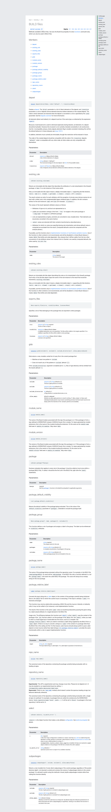 |  |

- In the 'Parameters' tables, long parameter names are incorrectly broken mid-word due to narrow column widths (e.g., 'exclude_directories' is broken into 'exclude_directorie' and 's' in the 'glob' section, and 'allow_empty' is broken into 'allow_empt' and 'y' in the 'subpackages' section).
- The 'On this page' navigation sidebar incorrectly includes 'Parameters' sub-links for sections that do not actually have a Parameters section (e.g., existing_rules, module_name, module_version, package_default_visibility, package_name, repo_name, and repository_name).

## /rules/lib/globals/bzl

Old URL: https://bazel.build/rules/lib/globals/bzl
New URL: https://preview.bazel.build/rules/lib/globals/bzl

OK

## /rules/lib/globals/module

Old URL: https://bazel.build/rules/lib/globals/module
New URL: https://preview.bazel.build/rules/lib/globals/module

OK

## /rules/lib/globals/repo

Old URL: https://bazel.build/rules/lib/globals/repo
New URL: https://preview.bazel.build/rules/lib/globals/repo

| Old | New |
| --- | --- |
| 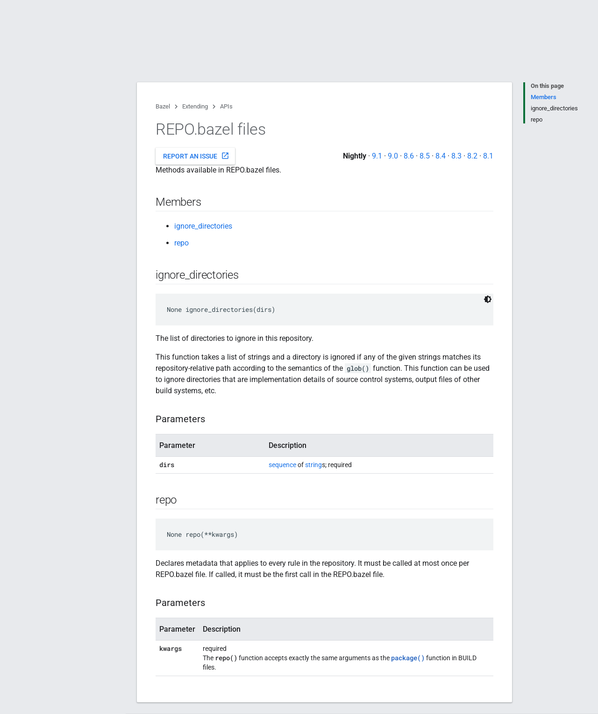 | 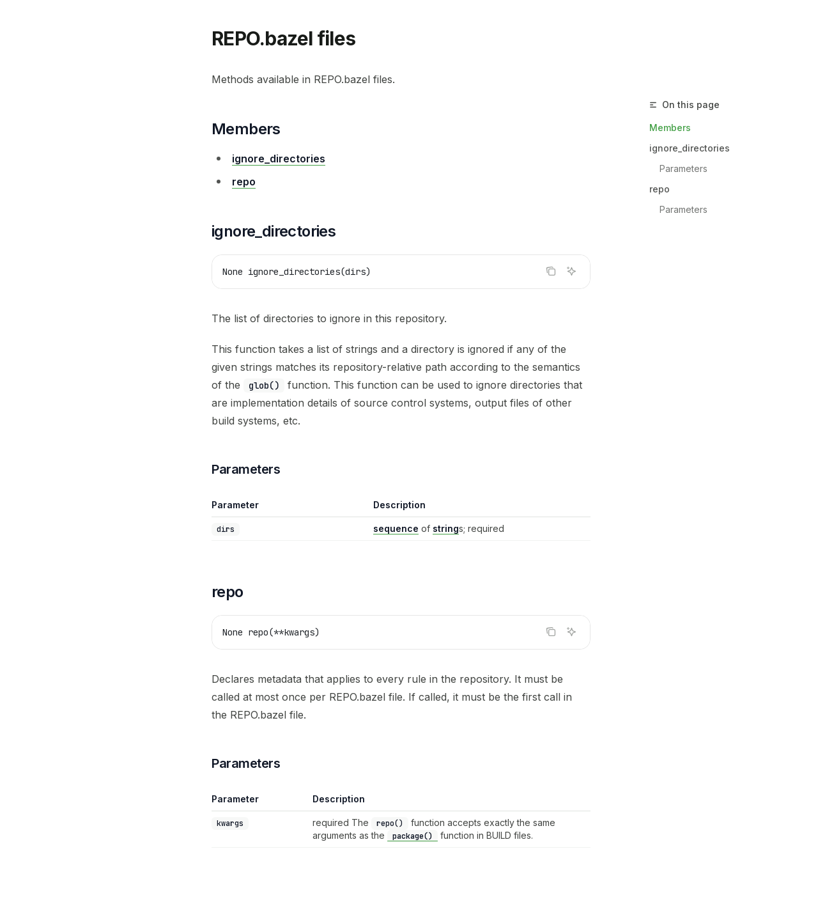 |

- In the 'repo' parameters table, the 'required' label and the subsequent description text are merged into a single line, rather than being separated by a line break.
- In the 'repo' parameters table, the function name 'package()' has been incorrectly changed to '_package()'.
- The link for '_package()' in the 'repo' parameters table is styled inconsistently in black text, while other links on the page are green.
- In the 'ignore_directories' parameters table, the link for 'strings' incorrectly includes the trailing semicolon.

## /rules/lib/globals/vendor

Old URL: https://bazel.build/rules/lib/globals/vendor
New URL: https://preview.bazel.build/rules/lib/globals/vendor

OK

## /rules/lib/globals/workspace

Old URL: https://bazel.build/rules/lib/globals/workspace
New URL: https://preview.bazel.build/rules/lib/globals/workspace

NOT_OK

## /rules/lib/overview

Old URL: https://bazel.build/rules/lib/overview
New URL: https://preview.bazel.build/rules/lib/overview

OK

## /rules/lib/providers

Old URL: https://bazel.build/rules/lib/providers
New URL: https://preview.bazel.build/rules/lib/providers

OK

## /rules/lib/providers/AnalysisTestResultInfo

Old URL: https://bazel.build/rules/lib/providers/AnalysisTestResultInfo
New URL: https://preview.bazel.build/rules/lib/providers/AnalysisTestResultInfo

| Old | New |
| --- | --- |
| 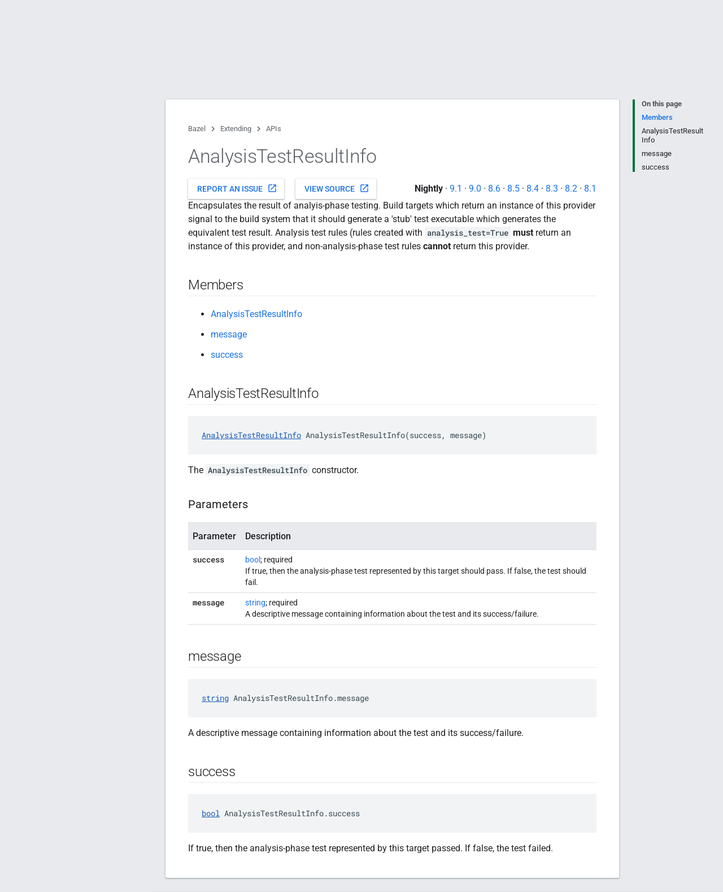 | 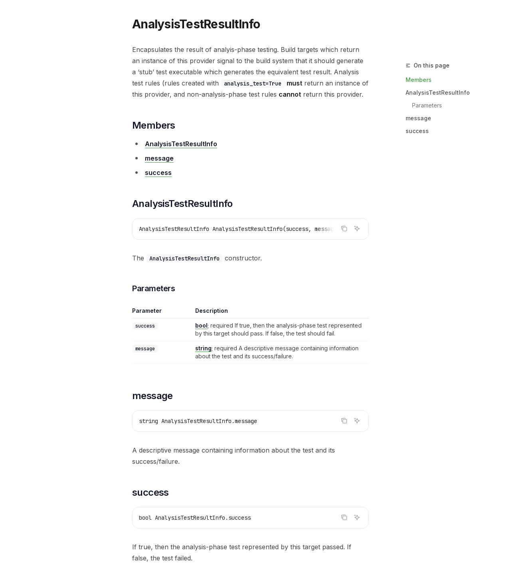 |

- In the 'Parameters' table, the descriptions for 'success' and 'message' are missing a line break between the type/requirement information (e.g., 'bool; required') and the descriptive text, causing them to run together.

## /rules/lib/providers/CcInfo

Old URL: https://bazel.build/rules/lib/providers/CcInfo
New URL: https://preview.bazel.build/rules/lib/providers/CcInfo

| Old | New |
| --- | --- |
| 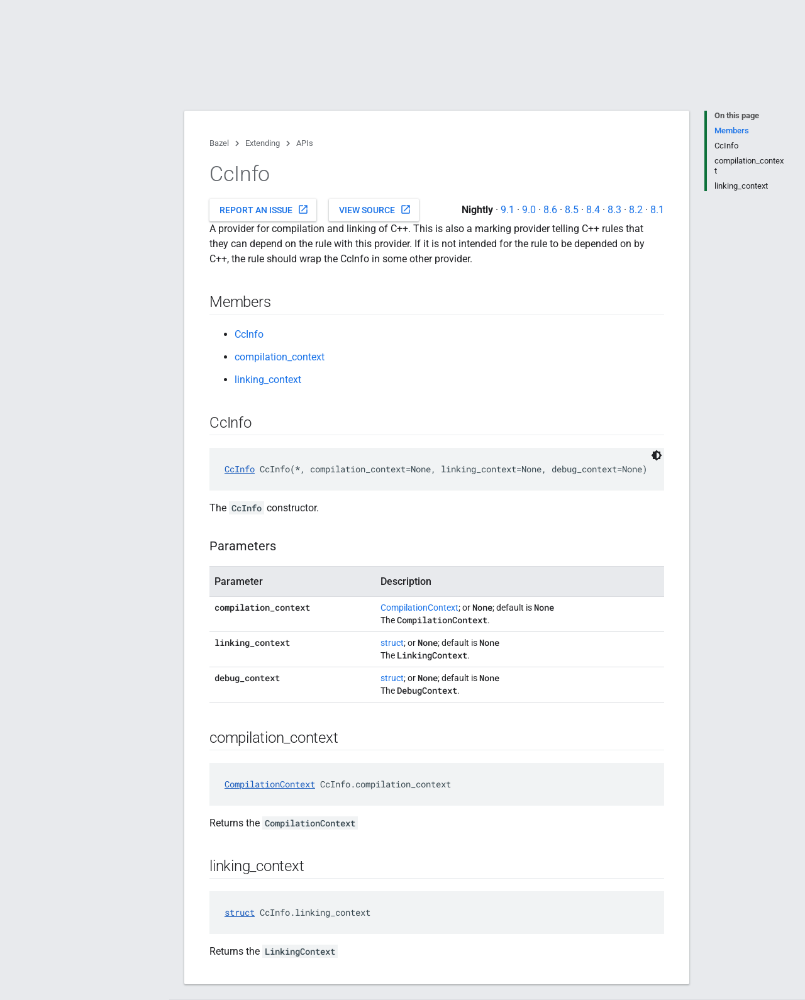 | 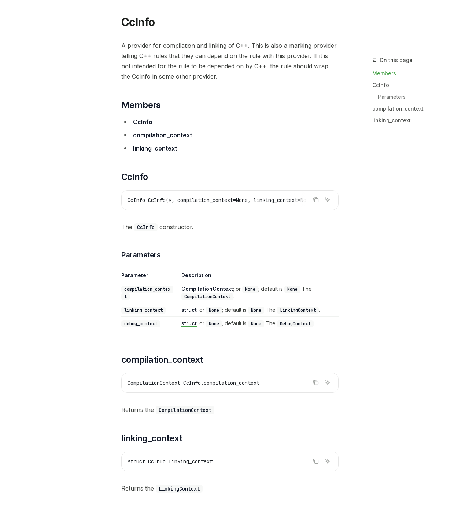 |

- The parameter name "compilation_context" in the first column of the Parameters table is incorrectly wrapped across two lines.
- There is inconsistent spacing around punctuation in the Parameters table; specifically, there are unnecessary spaces before semicolons and periods (e.g., 'CompilationContext ;' and 'CompilationContext .').

## /rules/lib/providers/CcToolchainConfigInfo

Old URL: https://bazel.build/rules/lib/providers/CcToolchainConfigInfo
New URL: https://preview.bazel.build/rules/lib/providers/CcToolchainConfigInfo

OK

## /rules/lib/providers/CcToolchainInfo

Old URL: https://bazel.build/rules/lib/providers/CcToolchainInfo
New URL: https://preview.bazel.build/rules/lib/providers/CcToolchainInfo

| Old | New |
| --- | --- |
| 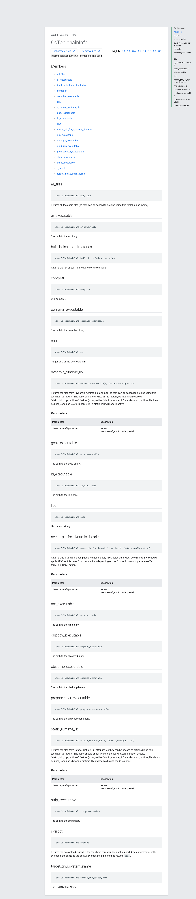 | 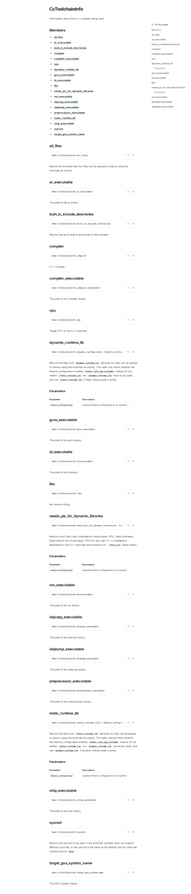 |

- The 'On this page' sidebar on the right is incomplete and missing the final five sections of the page: 'preprocessor_executable', 'static_runtime_lib', 'strip_executable', 'sysroot', and 'target_gnu_system_name'.
- The 'Parameters' sections have lost their table formatting, including row borders and header background colors, which makes the information less structured than on the old site.
- In the 'sysroot' section's description text, an extra space has been introduced before the final period: '... returns `None` .'

## /rules/lib/providers/ConstraintSettingInfo

Old URL: https://bazel.build/rules/lib/providers/ConstraintSettingInfo
New URL: https://preview.bazel.build/rules/lib/providers/ConstraintSettingInfo

OK

## /rules/lib/providers/ConstraintValueInfo

Old URL: https://bazel.build/rules/lib/providers/ConstraintValueInfo
New URL: https://preview.bazel.build/rules/lib/providers/ConstraintValueInfo

| Old | New |
| --- | --- |
| 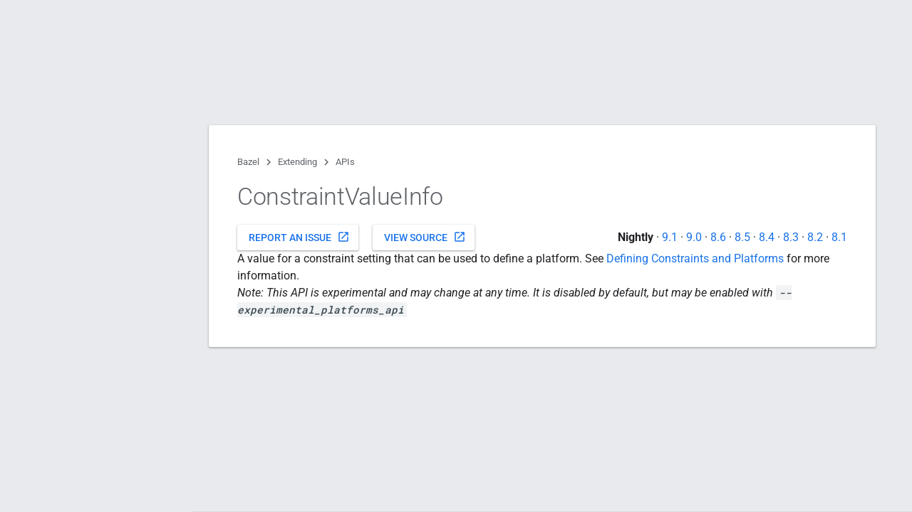 | 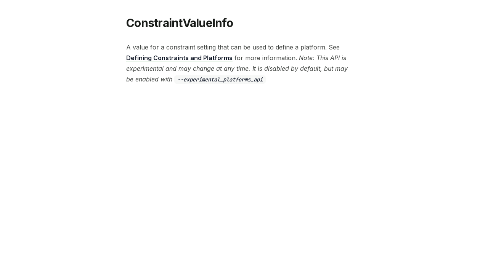 |

- The separate paragraph starting with 'Note: This API is experimental...' has been merged into the preceding paragraph.

## /rules/lib/providers/DebugPackageInfo

Old URL: https://bazel.build/rules/lib/providers/DebugPackageInfo
New URL: https://preview.bazel.build/rules/lib/providers/DebugPackageInfo

| Old | New |
| --- | --- |
| 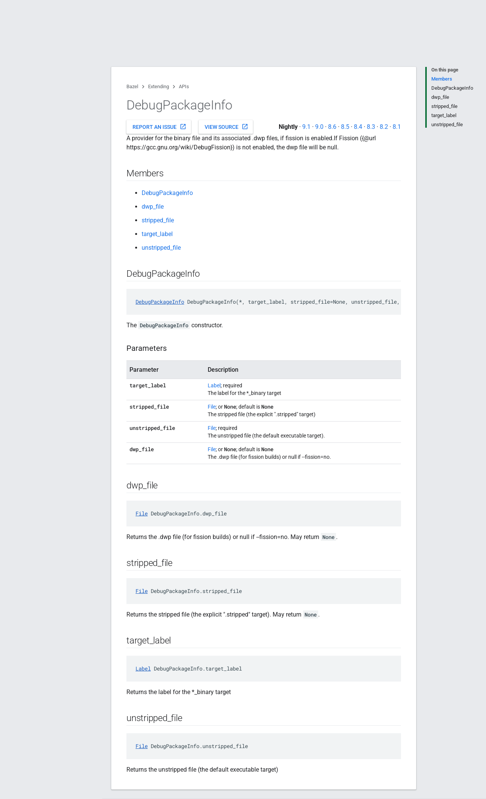 | 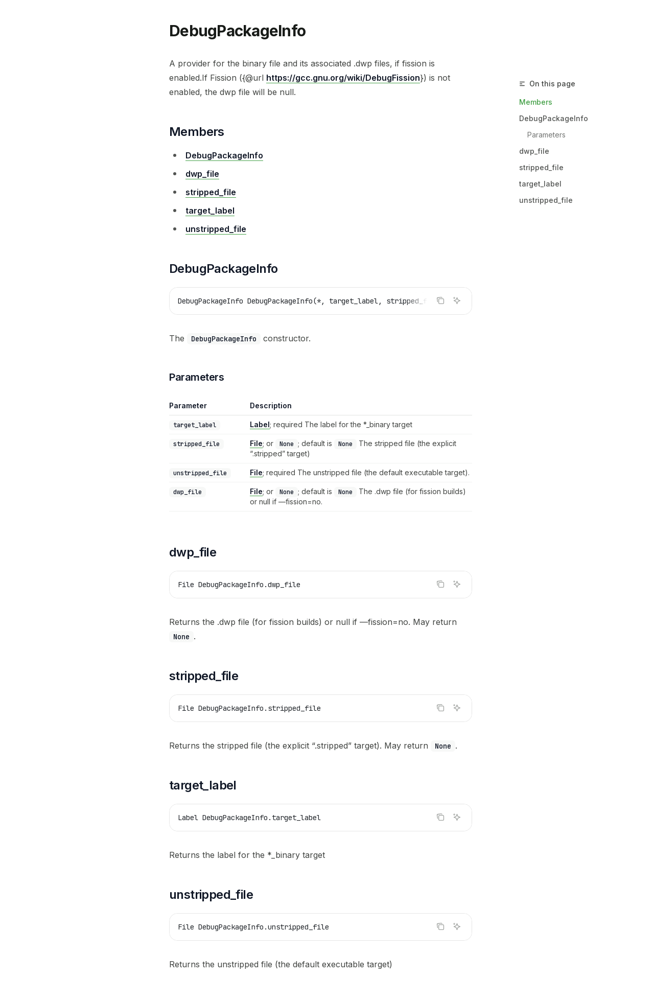 |

- In the "Parameters" table, the parameter description text is not separated from the type and requirement information by a line break, unlike in the original version.
- Double hyphens in command-line flags have been incorrectly converted to em-dashes (e.g., "—fission=no" instead of "--fission=no") in both the "Parameters" table and the "dwp_file" section.
- There is inconsistent and incorrect spacing around semicolons in the "Parameters" table descriptions for "stripped_file" and "dwp_file" (e.g., "File; or None ; default is None").
- An unrendered template tag "{@url ...}" appears in the introductory paragraph.

## /rules/lib/providers/DefaultInfo

Old URL: https://bazel.build/rules/lib/providers/DefaultInfo
New URL: https://preview.bazel.build/rules/lib/providers/DefaultInfo

| Old | New |
| --- | --- |
| 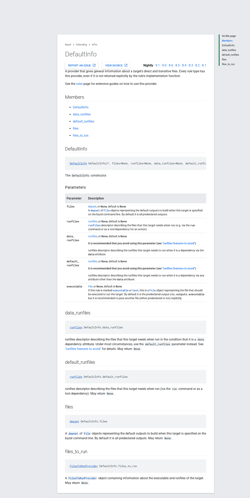 | 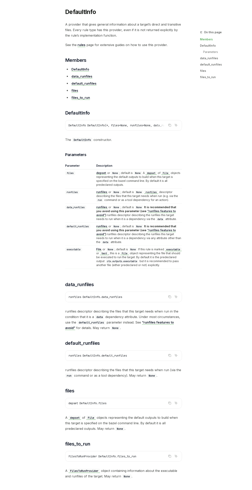 |

- Extra spaces are incorrectly inserted before punctuation marks (semicolons, commas, and periods) when they immediately follow inline code elements. This is noticeable in the 'Parameters' table (e.g., 'depset ;', 'None ;', 'test ,') and in the concluding sentences of several sections (e.g., 'May return None .').
- Missing periods at the end of the first line of the 'Description' column for several items in the 'Parameters' table, such as 'files', 'runfiles', and 'data_runfiles'.
- The layout of the 'Description' column in the 'Parameters' table is inconsistent, with irregular line breaks and spacing between the initial type summary and the subsequent descriptive text compared to the original site.

## /rules/lib/providers/ExecutionInfo

Old URL: https://bazel.build/rules/lib/providers/ExecutionInfo
New URL: https://preview.bazel.build/rules/lib/providers/ExecutionInfo

| Old | New |
| --- | --- |
| 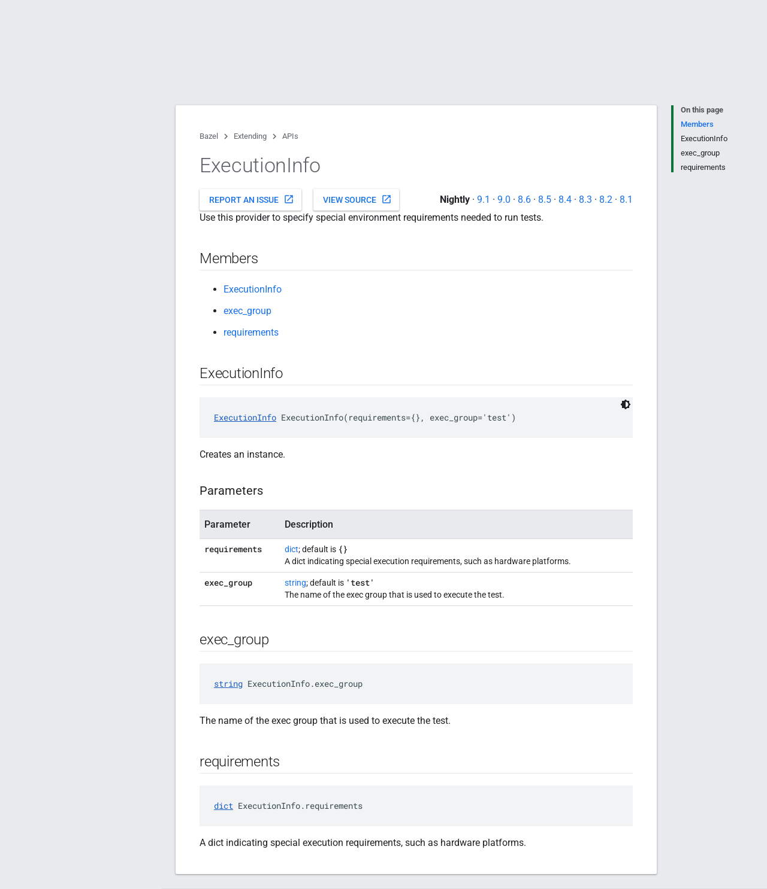 | 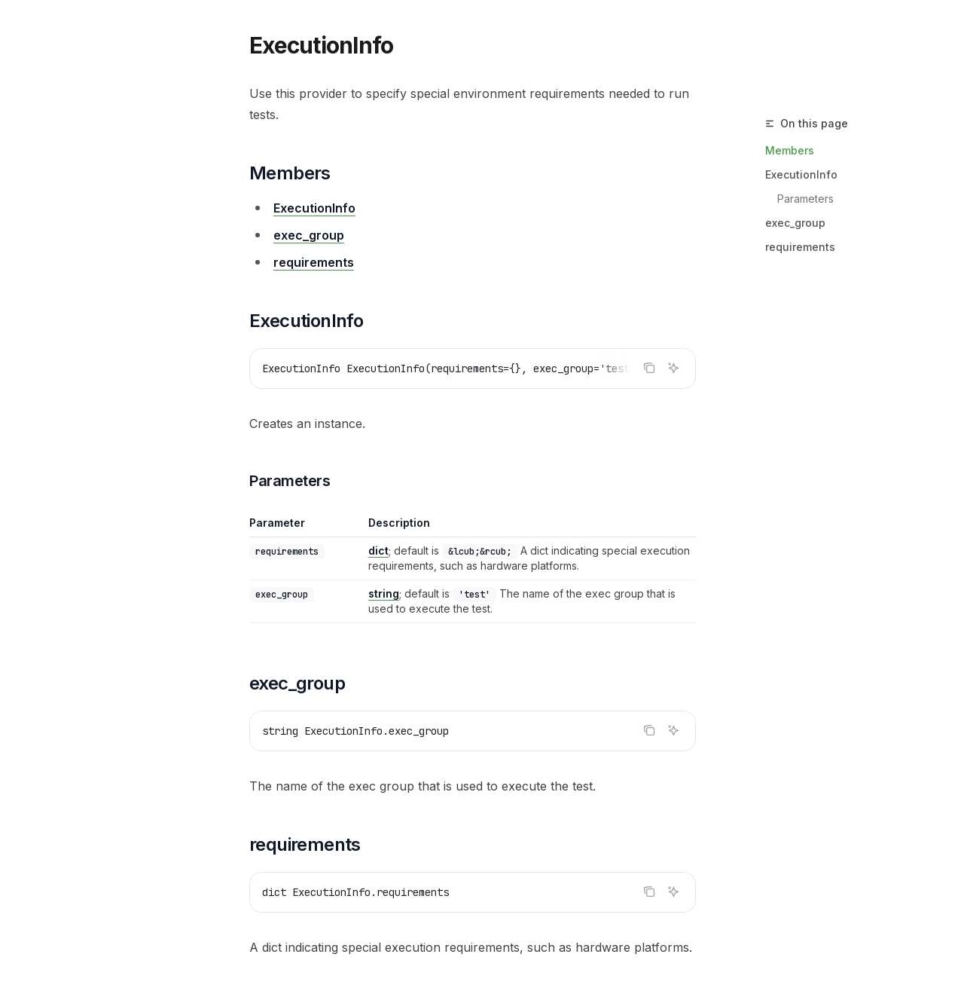 |

- In the Parameters table, the description for 'requirements' contains unrendered HTML entities: '&lcub;&rcub;' instead of '{}'.

## /rules/lib/providers/FeatureFlagInfo

Old URL: https://bazel.build/rules/lib/providers/FeatureFlagInfo
New URL: https://preview.bazel.build/rules/lib/providers/FeatureFlagInfo

| Old | New |
| --- | --- |
| 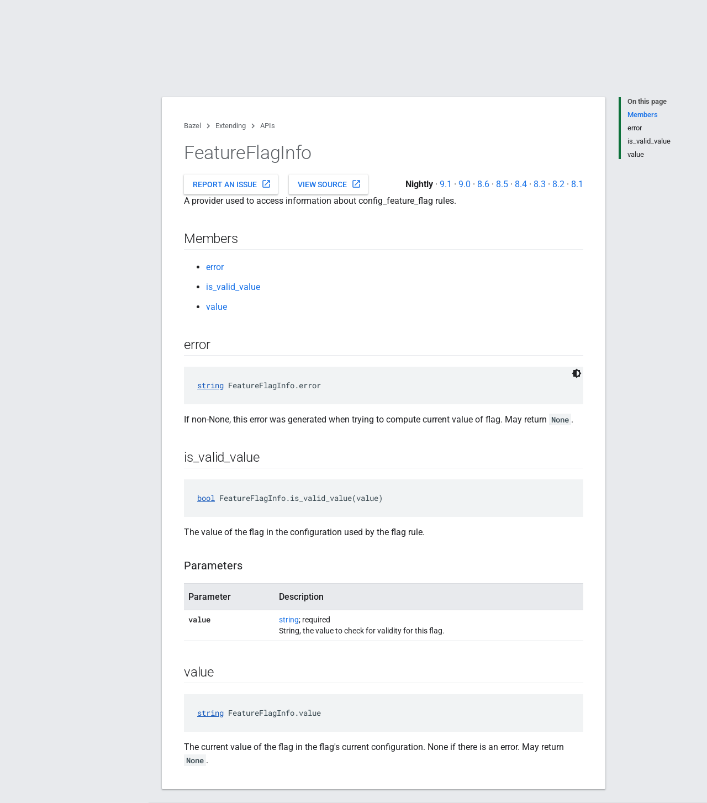 | 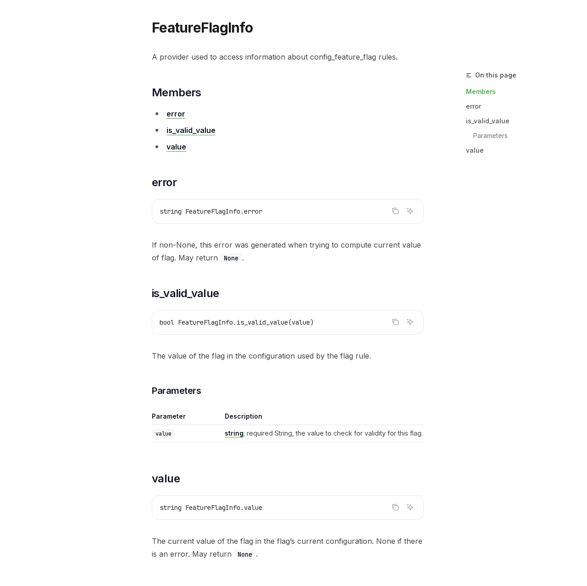 |

- The 'Parameters' table for 'is_valid_value' is missing a line break in the 'Description' column, causing the type information ('string; required') to be merged into the same line as the parameter's descriptive text.
- Types within the code block signatures (such as 'string' and 'bool') are no longer hyperlinked, whereas they were links in the original documentation.

## /rules/lib/providers/FilesToRunProvider

Old URL: https://bazel.build/rules/lib/providers/FilesToRunProvider
New URL: https://preview.bazel.build/rules/lib/providers/FilesToRunProvider

OK

## /rules/lib/providers/InstrumentedFilesInfo

Old URL: https://bazel.build/rules/lib/providers/InstrumentedFilesInfo
New URL: https://preview.bazel.build/rules/lib/providers/InstrumentedFilesInfo

OK

## /rules/lib/providers/JavaRuntimeInfo

Old URL: https://bazel.build/rules/lib/providers/JavaRuntimeInfo
New URL: https://preview.bazel.build/rules/lib/providers/JavaRuntimeInfo

| Old | New |
| --- | --- |
| 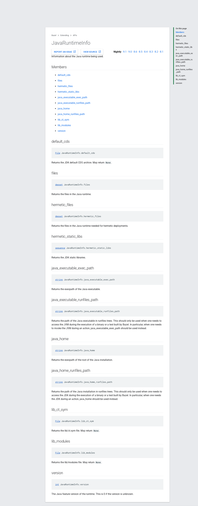 | 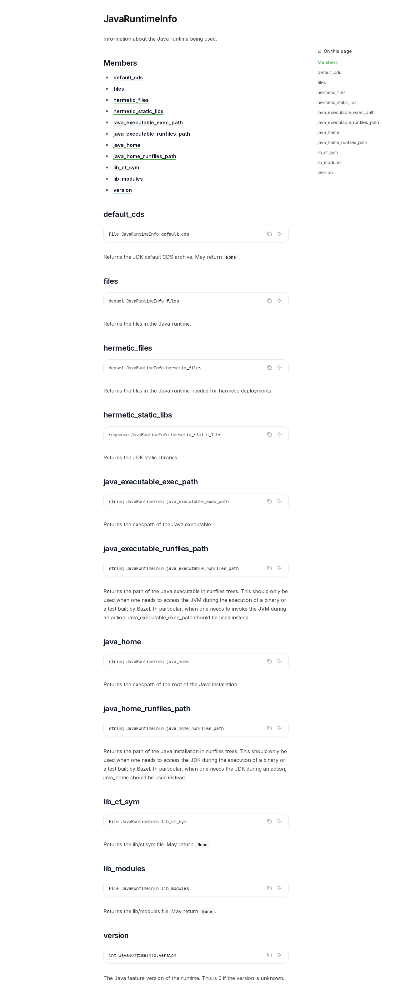 |

- The type names (e.g., File, depset, sequence, string, int) in the member signatures are no longer clickable links as they were in the old site.
- The 'On this page' navigation sidebar has lost its hierarchical indentation, making it harder to distinguish sub-items from the 'Members' heading.

## /rules/lib/providers/JavaToolchainInfo

Old URL: https://bazel.build/rules/lib/providers/JavaToolchainInfo
New URL: https://preview.bazel.build/rules/lib/providers/JavaToolchainInfo

OK

## /rules/lib/providers/ObjcProvider

Old URL: https://bazel.build/rules/lib/providers/ObjcProvider
New URL: https://preview.bazel.build/rules/lib/providers/ObjcProvider

OK

## /rules/lib/providers/OutputGroupInfo

Old URL: https://bazel.build/rules/lib/providers/OutputGroupInfo
New URL: https://preview.bazel.build/rules/lib/providers/OutputGroupInfo

| Old | New |
| --- | --- |
| 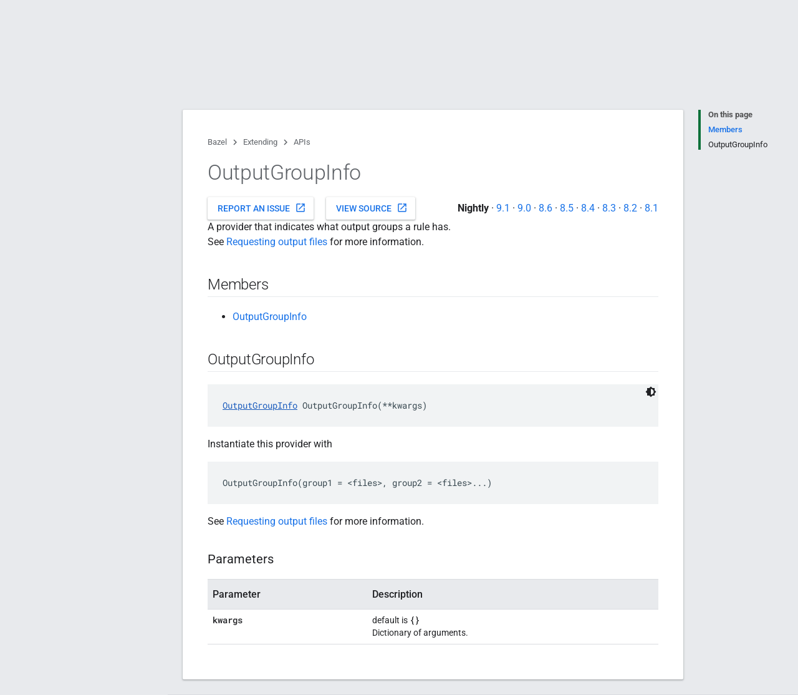 | 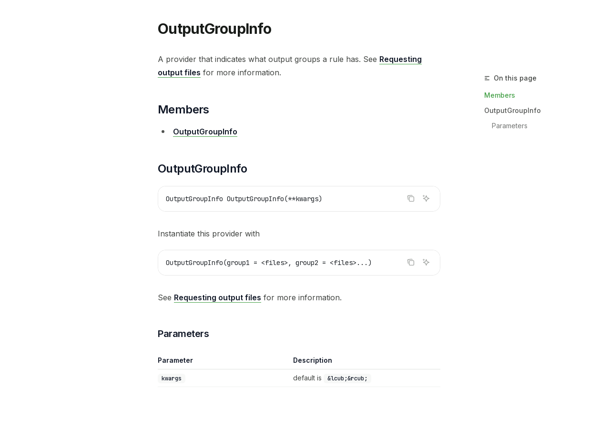 |

- In the Parameters table, the description for 'kwargs' incorrectly renders curly braces as HTML entities (&lcub;&rcub;).
- In the Parameters table, the description for 'kwargs' is missing the sentence 'Dictionary of arguments.'.

## /rules/lib/providers/PlatformInfo

Old URL: https://bazel.build/rules/lib/providers/PlatformInfo
New URL: https://preview.bazel.build/rules/lib/providers/PlatformInfo

| Old | New |
| --- | --- |
| 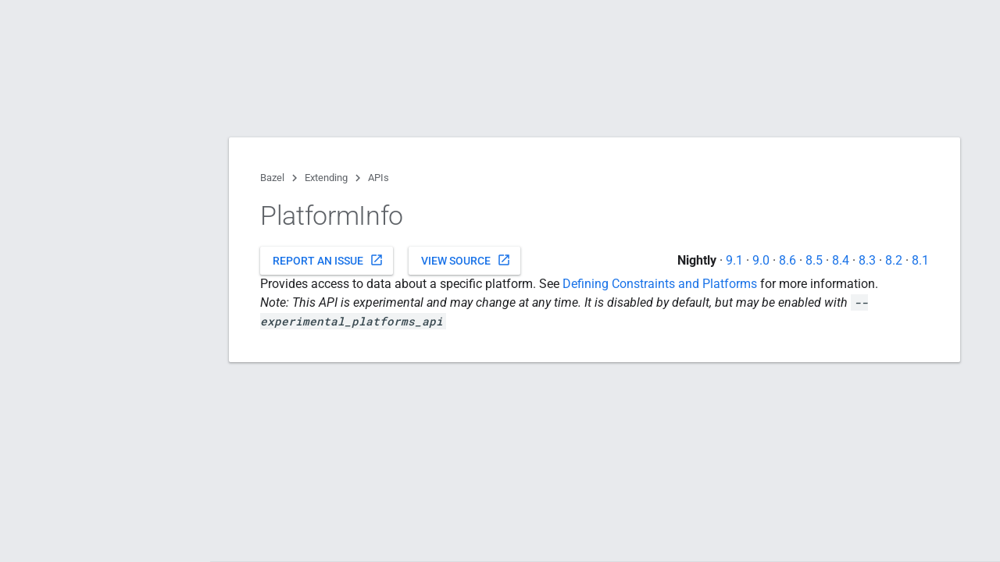 | 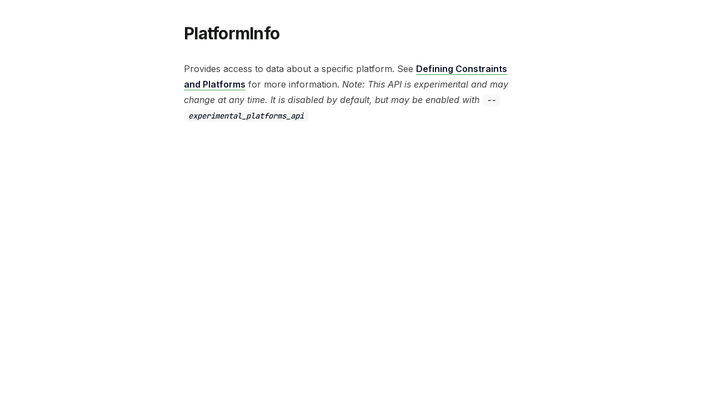 |

- The inline code snippet "--experimental_platforms_api" is incorrectly split into two separate parts with an extra space and is wrapped across two lines.

## /rules/lib/providers/RunEnvironmentInfo

Old URL: https://bazel.build/rules/lib/providers/RunEnvironmentInfo
New URL: https://preview.bazel.build/rules/lib/providers/RunEnvironmentInfo

OK

## /rules/lib/providers/TemplateVariableInfo

Old URL: https://bazel.build/rules/lib/providers/TemplateVariableInfo
New URL: https://preview.bazel.build/rules/lib/providers/TemplateVariableInfo

| Old | New |
| --- | --- |
| 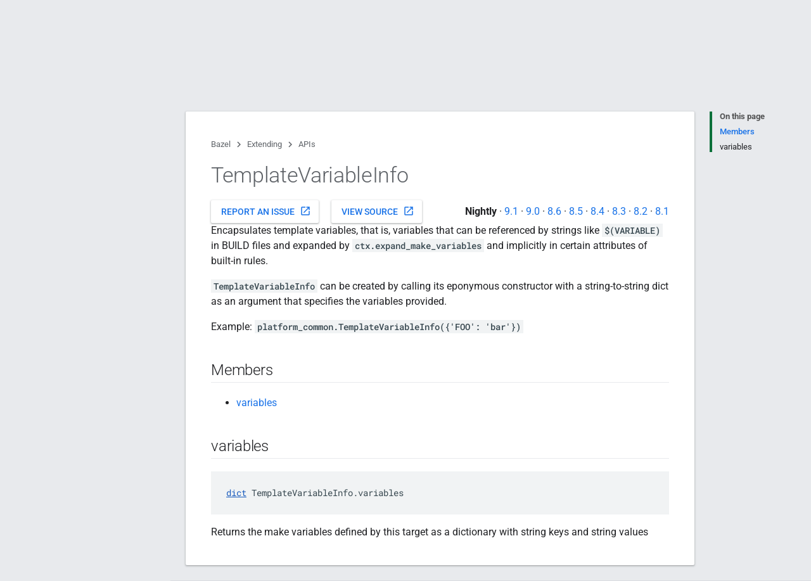 | 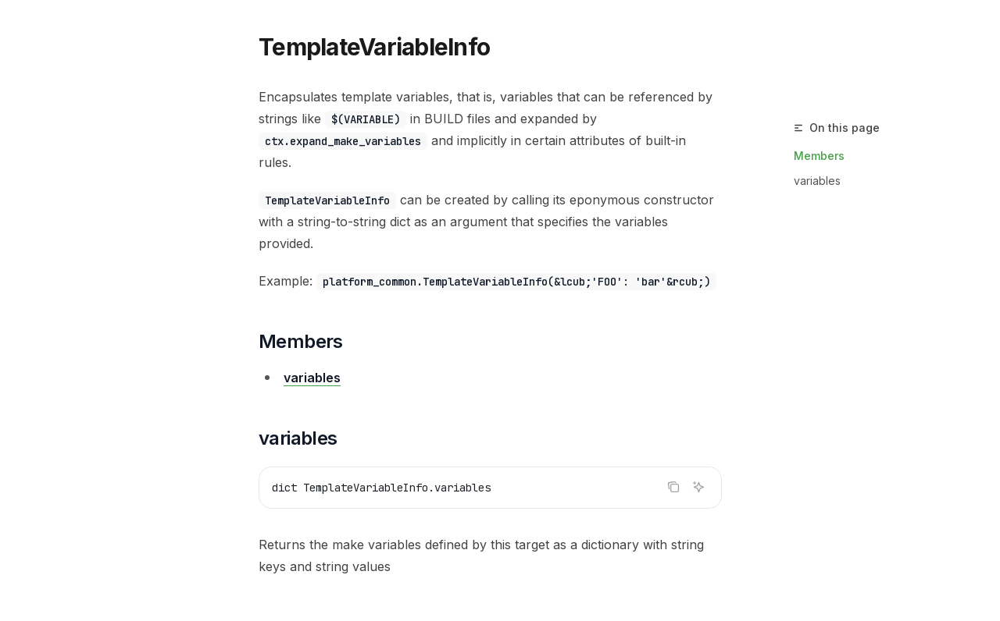 |

- The code example contains unrendered HTML entities '&lcub;' and '&rcub;' instead of curly braces.

## /rules/lib/providers/ToolchainInfo

Old URL: https://bazel.build/rules/lib/providers/ToolchainInfo
New URL: https://preview.bazel.build/rules/lib/providers/ToolchainInfo

OK

## /rules/lib/providers/file_provider

Old URL: https://bazel.build/rules/lib/providers/file_provider
New URL: https://preview.bazel.build/rules/lib/providers/file_provider

OK

## /rules/lib/providers/java_output_jars

Old URL: https://bazel.build/rules/lib/providers/java_output_jars
New URL: https://preview.bazel.build/rules/lib/providers/java_output_jars

OK

## /rules/lib/repo

Old URL: https://bazel.build/rules/lib/repo
New URL: https://preview.bazel.build/rules/lib/repo

OK

## /rules/lib/repo/cache

Old URL: https://bazel.build/rules/lib/repo/cache
New URL: https://preview.bazel.build/rules/lib/repo/cache

OK

## /rules/lib/repo/git

Old URL: https://bazel.build/rules/lib/repo/git
New URL: https://preview.bazel.build/rules/lib/repo/git

| Old | New |
| --- | --- |
| 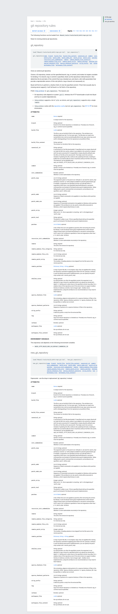 |  |

- In the 'ATTRIBUTES' tables for both 'git_repository' and 'new_git_repository', the first column is too narrow, causing attribute names to be split across multiple lines and making them difficult to read (e.g., 'branch' is rendered as 'br', 'an', 'ch').

## /rules/lib/repo/http

Old URL: https://bazel.build/rules/lib/repo/http
New URL: https://preview.bazel.build/rules/lib/repo/http

| Old | New |
| --- | --- |
| 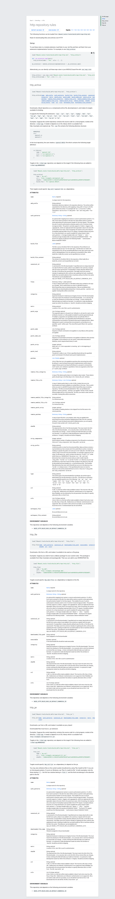 |  |

- The attribute names in the 'ATTRIBUTES' sections for http_archive, http_file, and http_jar are severely truncated to only the first two characters, rendering the tables unreadable.

## /rules/lib/repo/local

Old URL: https://bazel.build/rules/lib/repo/local
New URL: https://preview.bazel.build/rules/lib/repo/local

| Old | New |
| --- | --- |
| 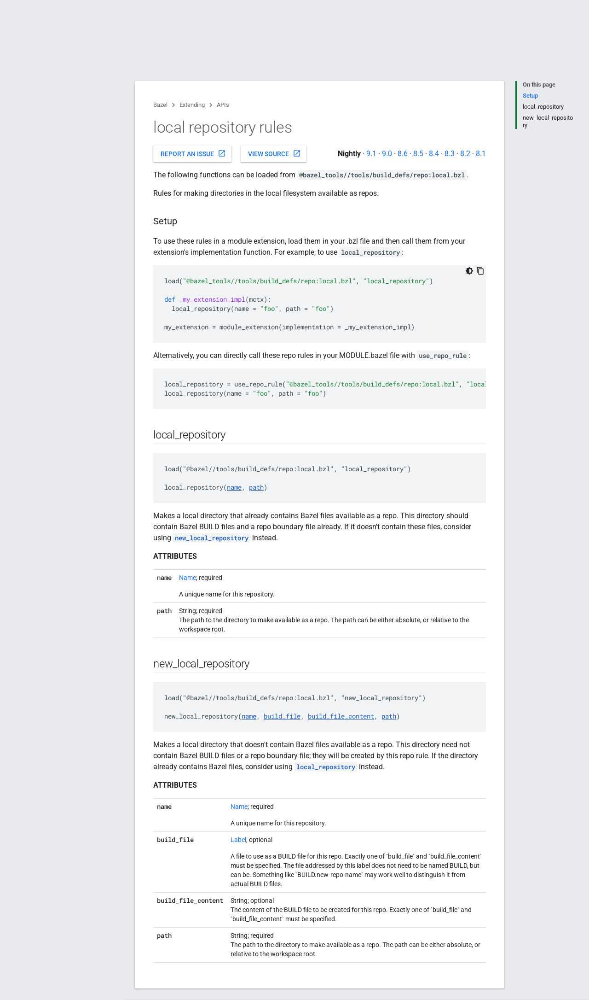 | 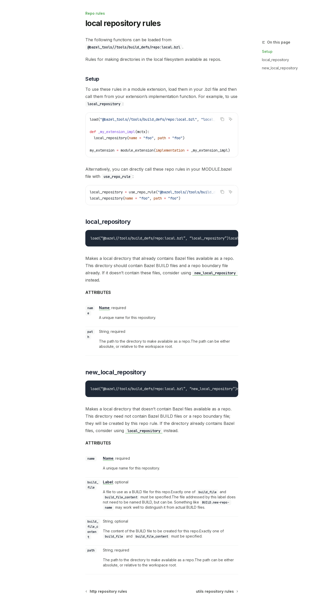 |

- The usage code blocks for 'local_repository' and 'new_local_repository' are missing newlines, causing the 'load' statement and the rule call to be concatenated on a single line.
- The attribute names in the 'ATTRIBUTES' tables are wrapping awkwardly due to insufficient column width (e.g., 'name' is split into 'nam' and 'e').
- There are missing spaces after periods in several attribute descriptions (e.g., 'repo.Exactly' and 'specified.The').

## /rules/lib/repo/utils

Old URL: https://bazel.build/rules/lib/repo/utils
New URL: https://preview.bazel.build/rules/lib/repo/utils

| Old | New |
| --- | --- |
| 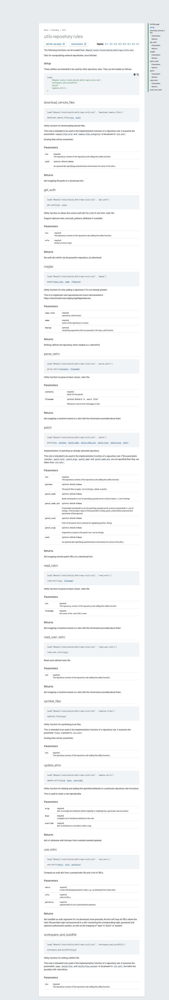 | 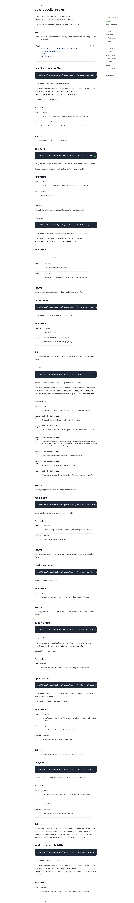 |

- All code blocks have merged lines due to missing newlines, making them difficult to read (e.g., the load statement and function call are on the same line).
- The 'Parameters' tables are poorly formatted with very narrow columns for parameter names, causing words to break across lines (e.g., 'patch_cmds_win' is split into 'patch_cmds_w' and 'in', 'override' is split into 'overrid' and 'e').

## /rules/lib/toplevel

Old URL: https://bazel.build/rules/lib/toplevel
New URL: https://preview.bazel.build/rules/lib/toplevel

OK

## /rules/lib/toplevel/apple_common

Old URL: https://bazel.build/rules/lib/toplevel/apple_common
New URL: https://preview.bazel.build/rules/lib/toplevel/apple_common

| Old | New |
| --- | --- |
| 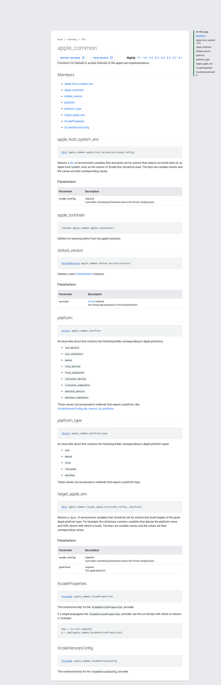 | 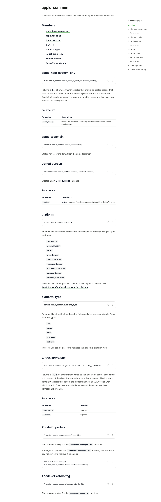 |

- In the 'apple_host_system_env' parameters table, the word 'required' is merged into the description text without proper separation.
- In the 'dotted_version' parameters table, 'string; required' is merged into the description text without proper separation.
- In the 'target_apple_env' parameters table, the descriptions for both 'xcode_config' and 'platform' are missing.

## /rules/lib/toplevel/attr

Old URL: https://bazel.build/rules/lib/toplevel/attr
New URL: https://preview.bazel.build/rules/lib/toplevel/attr

OK

## /rules/lib/toplevel/cc_common

Old URL: https://bazel.build/rules/lib/toplevel/cc_common
New URL: https://preview.bazel.build/rules/lib/toplevel/cc_common

OK

## /rules/lib/toplevel/config

Old URL: https://bazel.build/rules/lib/toplevel/config
New URL: https://preview.bazel.build/rules/lib/toplevel/config

OK

## /rules/lib/toplevel/config_common

Old URL: https://bazel.build/rules/lib/toplevel/config_common
New URL: https://preview.bazel.build/rules/lib/toplevel/config_common

| Old | New |
| --- | --- |
| 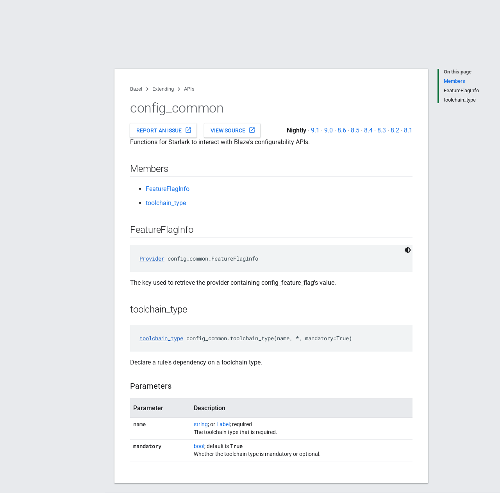 | 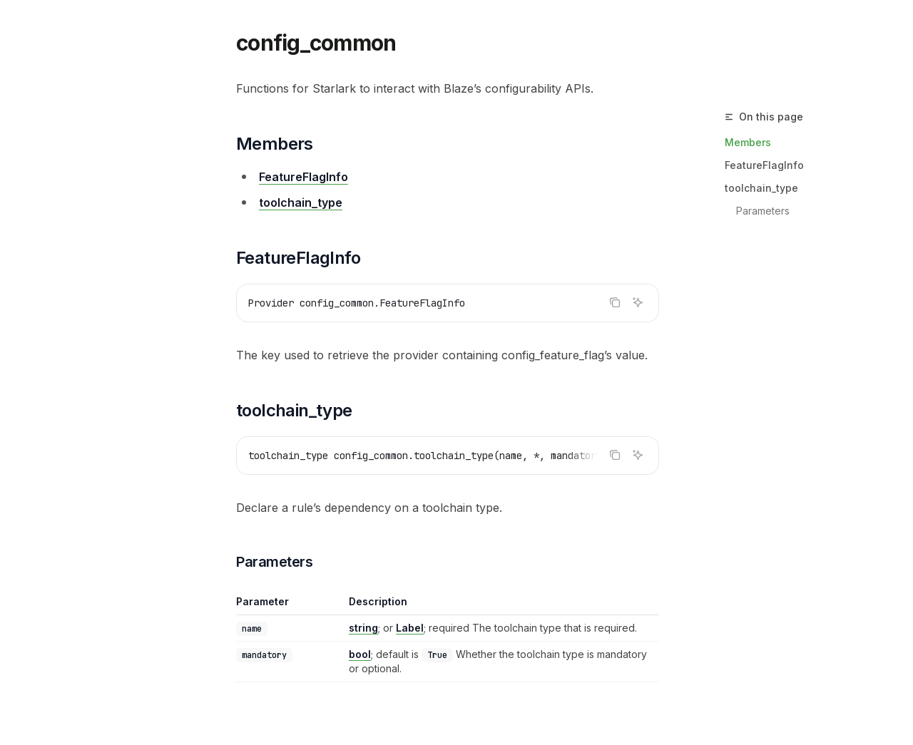 |

- In the Parameters table, the descriptions are missing the line breaks that separated the parameter metadata (type, requirements, defaults) from the descriptive text, leading to run-on sentences.

## /rules/lib/toplevel/coverage_common

Old URL: https://bazel.build/rules/lib/toplevel/coverage_common
New URL: https://preview.bazel.build/rules/lib/toplevel/coverage_common

| Old | New |
| --- | --- |
| 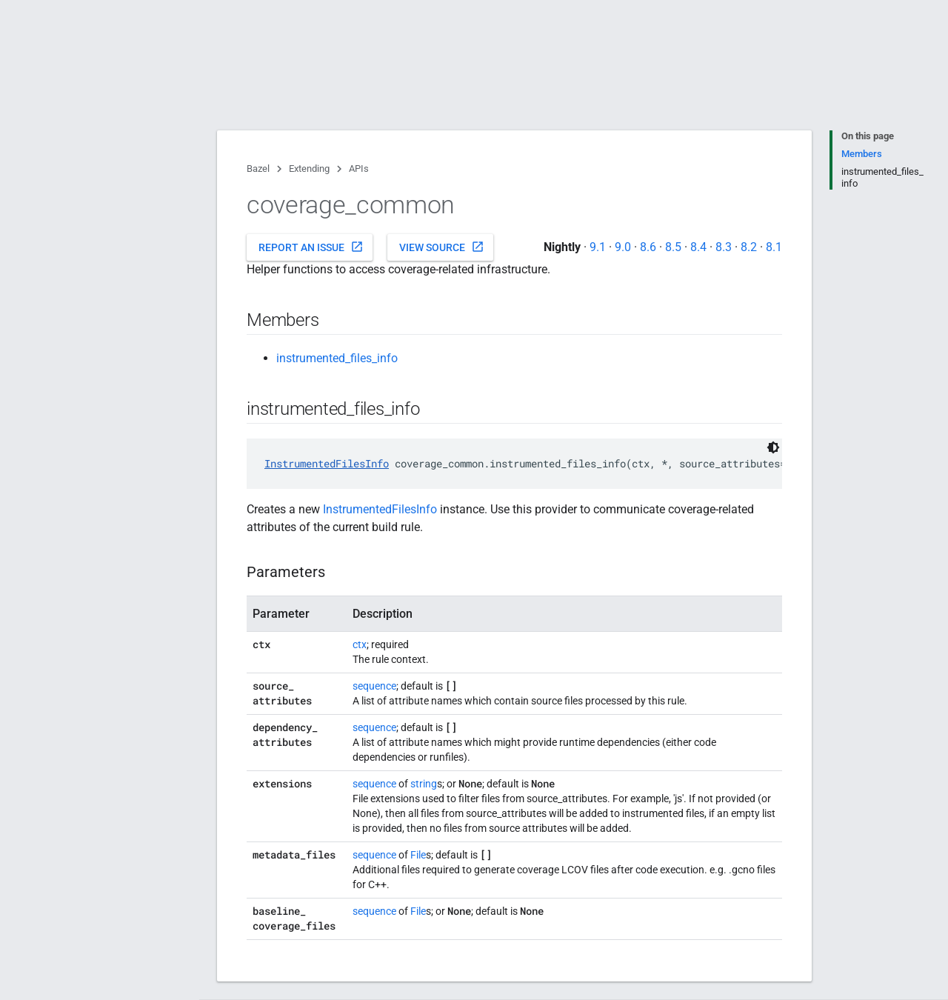 | 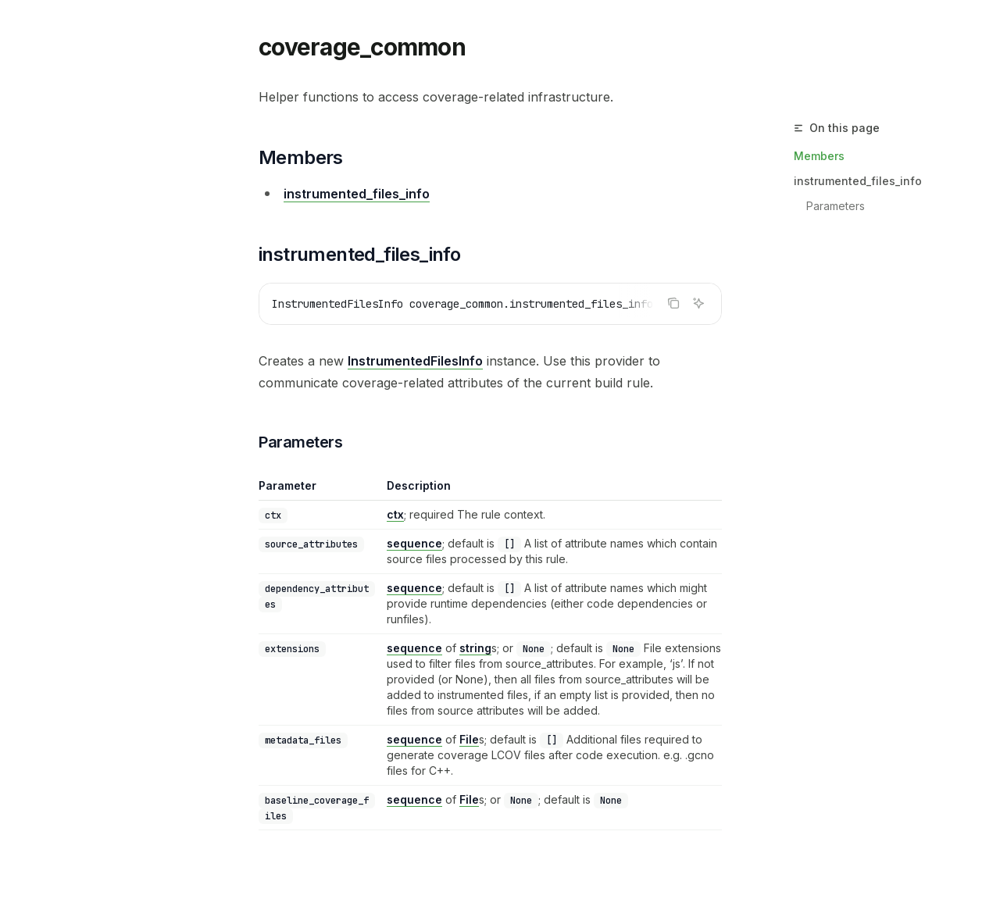 |

- The function signature for 'instrumented_files_info' is missing its parameters (the content after the function name is truncated or missing).
- In the 'Parameters' table, the description text for each parameter is run together with the type and default value information on the same line, whereas the original used line breaks for better readability.

## /rules/lib/toplevel/java_common

Old URL: https://bazel.build/rules/lib/toplevel/java_common
New URL: https://preview.bazel.build/rules/lib/toplevel/java_common

| Old | New |
| --- | --- |
| 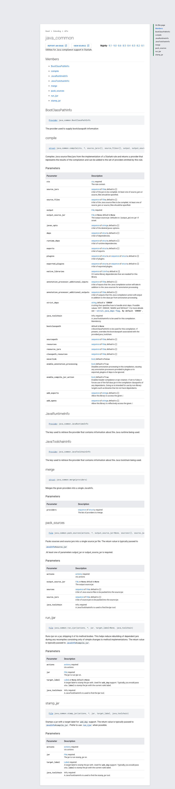 | 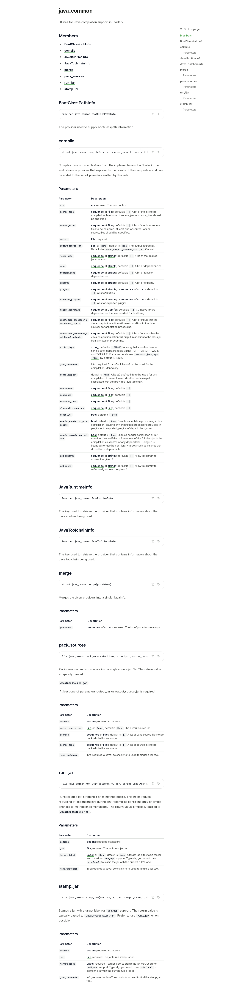 |

- In the parameter tables (e.g., under 'compile', 'pack_sources'), the parameter type and default value information is merged with the description text on the same line, whereas it was previously on its own line.
- Unnecessary spaces have been added before semicolons in parameter types, such as 'File ; or None ;' instead of 'File; or None;'.
- In the 'pack_sources' section description, there is a stray period at the beginning of the sentence: '.At least one of parameters output_jar or output_source_jar is required.'
- In the 'run_ijar' section description, the word 'recompiles' is incorrectly split into two parts ('recom piles') with the second part styled as a link.
- In the 'stamp_jar' section, there is an extra space before the period following 'JavaInfo#compile_jar'.
- In the 'compile' parameter table, the description for 'output_source_jar' is missing the single quotes around '{output_jar}-src.jar' that were present in the original.

## /rules/lib/toplevel/native

Old URL: https://bazel.build/rules/lib/toplevel/native
New URL: https://preview.bazel.build/rules/lib/toplevel/native

| Old | New |
| --- | --- |
| 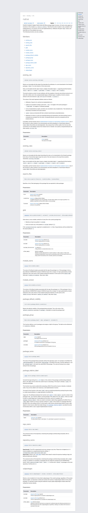 | 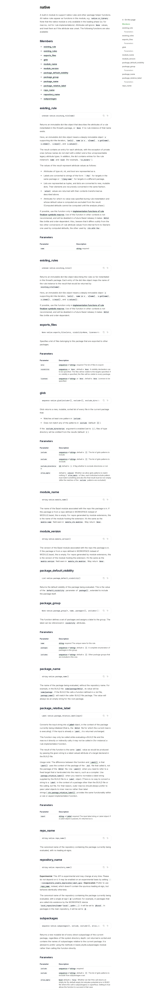 |

- In the "glob" parameters table, the parameter name "exclude_directories" is incorrectly word-wrapped across two lines.
- The "On this page" sidebar navigation is incomplete, missing the "repository_name" and "subpackages" sections.
- In the "repository_name" section, the "Experimental" and "Deprecated" notices are merged into a single paragraph and contain an extra dash character.
- In several parameter tables (such as for "glob", "package_relative_label", and "subpackages"), the default value or required status is merged into the same line as the description text, reducing readability.

## /rules/lib/toplevel/platform_common

Old URL: https://bazel.build/rules/lib/toplevel/platform_common
New URL: https://preview.bazel.build/rules/lib/toplevel/platform_common

OK

## /rules/lib/toplevel/proto

Old URL: https://bazel.build/rules/lib/toplevel/proto
New URL: https://preview.bazel.build/rules/lib/toplevel/proto

OK

## /rules/lib/toplevel/testing

Old URL: https://bazel.build/rules/lib/toplevel/testing
New URL: https://preview.bazel.build/rules/lib/toplevel/testing

| Old | New |
| --- | --- |
| 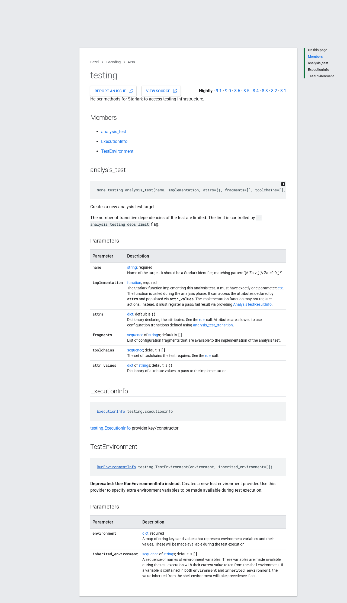 | 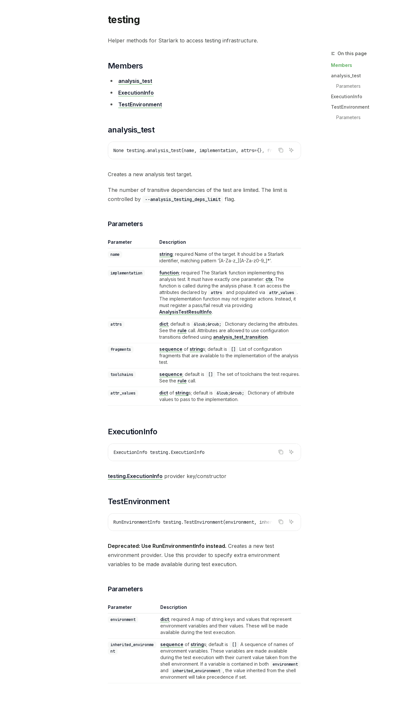 |

- HTML entities &lcub; and &rcub; are displayed instead of curly braces {} in the parameters table for analysis_test.
- The parameter name 'inherited_environment' in the TestEnvironment section is incorrectly wrapped, breaking the word into 'inherited_environme' and 'nt'.

## /rules/macro-tutorial

Old URL: https://bazel.build/rules/macro-tutorial
New URL: https://preview.bazel.build/rules/macro-tutorial

OK

## /rules/performance

Old URL: https://bazel.build/rules/performance
New URL: https://preview.bazel.build/rules/performance

| Old | New |
| --- | --- |
| 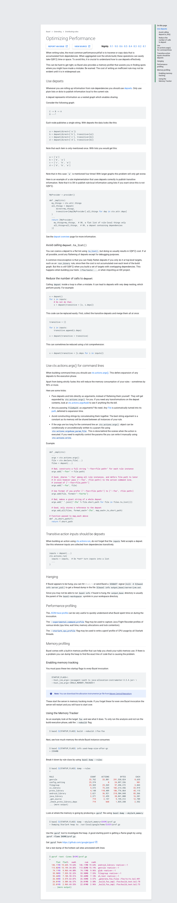 | 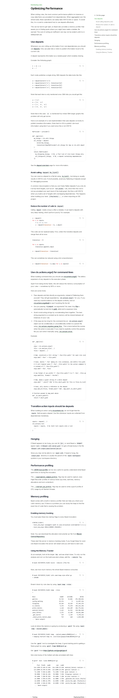 |

- The callout under the "Enabling memory tracking" section is unstyled, appearing as a plain paragraph instead of a highlighted admonition with a background and icon.

## /rules/rules-tutorial

Old URL: https://bazel.build/rules/rules-tutorial
New URL: https://preview.bazel.build/rules/rules-tutorial

OK

## /rules/testing

Old URL: https://bazel.build/rules/testing
New URL: https://preview.bazel.build/rules/testing

OK

## /rules/verbs-tutorial

Old URL: https://bazel.build/rules/verbs-tutorial
New URL: https://preview.bazel.build/rules/verbs-tutorial

OK

## /rules/windows

Old URL: https://bazel.build/rules/windows
New URL: https://preview.bazel.build/rules/windows

OK

## /run/bazelrc

Old URL: https://bazel.build/run/bazelrc
New URL: https://preview.bazel.build/run/bazelrc

| Old | New |
| --- | --- |
| 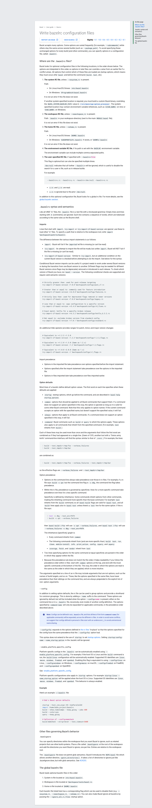 | 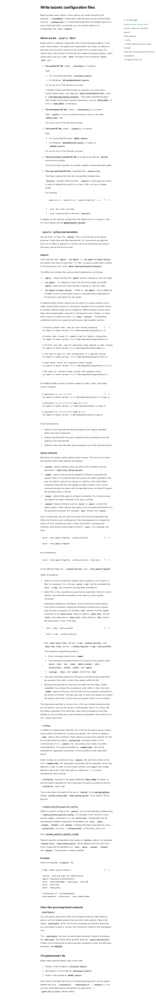 |

- The 'Note' admonition in the '--config' section is unstyled, lacking the blue background and star icon present in the original site.
- The 'Option precedence' heading is missing from the 'On this page' table of contents in the right sidebar.
- The list under 'The inheritance (specificity) graph is:' has a nesting error; the final bullet point beginning with 'coverage, fetch, and vendor' should be nested under the previous point.

## /run/build

Old URL: https://bazel.build/run/build
New URL: https://preview.bazel.build/run/build

OK

## /run/client-server

Old URL: https://bazel.build/run/client-server
New URL: https://preview.bazel.build/run/client-server

| Old | New |
| --- | --- |
| 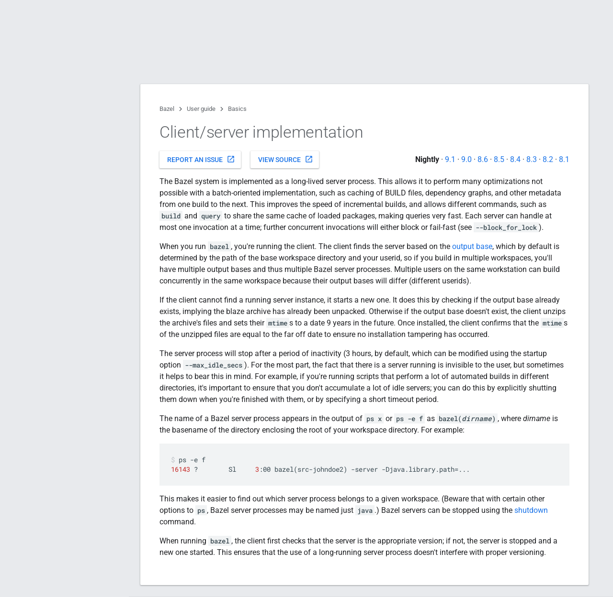 | 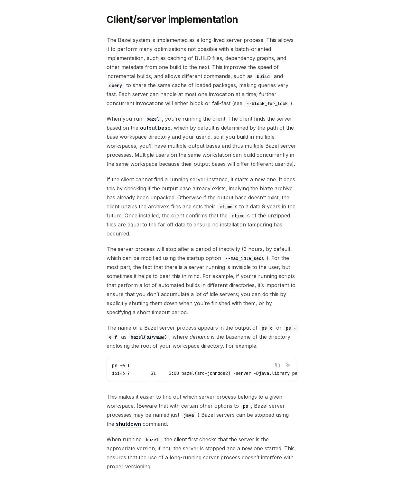 |

- Extra spaces are introduced between inline code blocks and subsequent punctuation marks (e.g., '`--block_for_lock` )', '`--max_idle_secs` )', '`ps` ,', '`java` .)', and '`bazel` ,').
- The plural word 'mtimes' is incorrectly rendered with a space between the code-styled 'mtime' and the letter 's'.
- The inline code snippet 'ps -e f' is incorrectly split into two separate code elements and broken across a line break.

## /run/scripts

Old URL: https://bazel.build/run/scripts
New URL: https://preview.bazel.build/run/scripts

OK

## /s/results

Old URL: https://bazel.build/s/results
New URL: https://preview.bazel.build/s/results

ERROR

## /start

Old URL: https://bazel.build/start
New URL: https://preview.bazel.build/start

| Old | New |
| --- | --- |
| 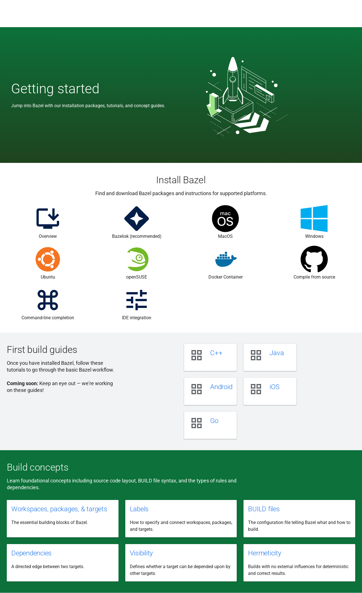 |  |

- The page content does not match; the 'Getting started' landing page from the old site has been replaced by a specific 'C++ Tutorial' page on the new site.
- Major portal sections from the old site, such as 'Install Bazel' and 'Build concepts', are missing on the new page.
- There are unrendered Markdown links in the 'Introduction' section, displaying raw syntax such as '[target](https://bazel.build/reference/glossary#target)' and '[package](https://bazel.build/reference/glossary#package)'.
- The 'On this page' sidebar navigation is inconsistent; some 'Summary' sections are missing entirely (e.g., 'Summary: stage 1'), while others are nested as sub-items despite being top-level headings in the main text.

## /start/android-app

Old URL: https://bazel.build/start/android-app
New URL: https://preview.bazel.build/start/android-app

OK

## /start/cpp

Old URL: https://bazel.build/start/cpp
New URL: https://preview.bazel.build/start/cpp

| Old | New |
| --- | --- |
| 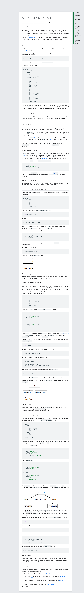 |  |

- Raw markdown link syntax is visible in several paragraphs instead of being rendered as functional links (e.g., "[target](...)", "[package](...)", "[rule](...)", "[cc_library rule](...)").

## /start/go

Old URL: https://bazel.build/start/go
New URL: https://preview.bazel.build/start/go

OK

## /start/ios-app

Old URL: https://bazel.build/start/ios-app
New URL: https://preview.bazel.build/start/ios-app

OK

## /start/java

Old URL: https://bazel.build/start/java
New URL: https://preview.bazel.build/start/java

OK

## /tutorials/ccp-toolchain-config

Old URL: https://bazel.build/tutorials/ccp-toolchain-config
New URL: https://preview.bazel.build/tutorials/ccp-toolchain-config

| Old | New |
| --- | --- |
| 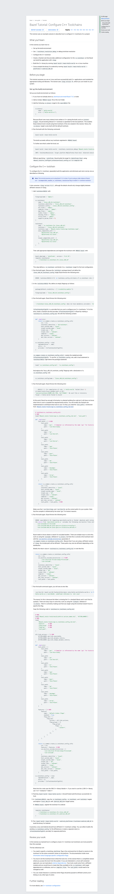 |  |

- The 'Note' callout at the beginning of the 'Configure the C++ toolchain' section is missing its admonition styling, such as the blue background and information icon found in the original.

## /tutorials/cpp-dependency

Old URL: https://bazel.build/tutorials/cpp-dependency
New URL: https://preview.bazel.build/tutorials/cpp-dependency

OK

## /tutorials/cpp-labels

Old URL: https://bazel.build/tutorials/cpp-labels
New URL: https://preview.bazel.build/tutorials/cpp-labels

OK

## /tutorials/cpp-use-cases

Old URL: https://bazel.build/tutorials/cpp-use-cases
New URL: https://preview.bazel.build/tutorials/cpp-use-cases

| Old | New |
| --- | --- |
| 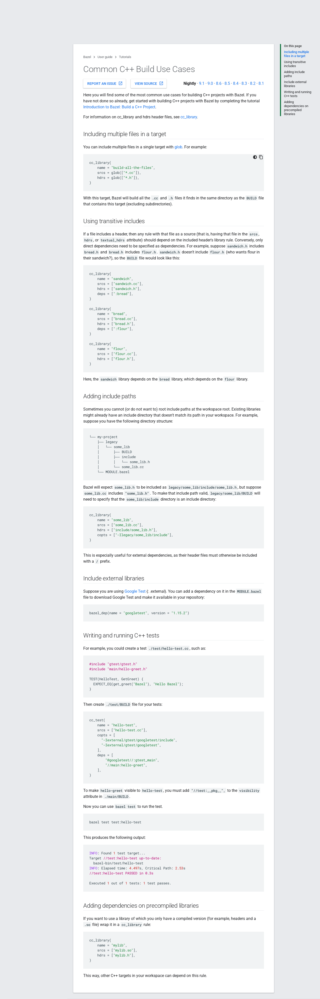 | 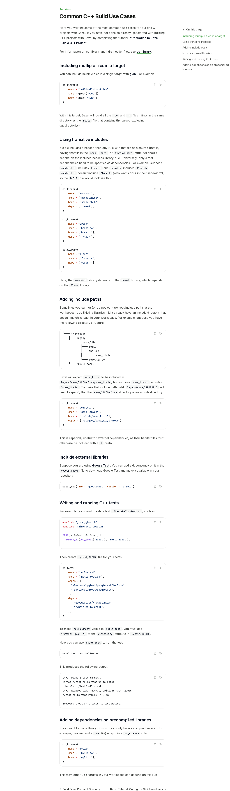 |

- Extra spaces before punctuation marks (periods and commas) that follow certain inline code blocks or links, such as after 'glob', 'Google Test', './test/hello-test.cc', '"//test:__pkg__"', and './main/BUILD'.
- Missing monospace formatting for some filenames and target names in the text that were formatted as code in the old site (e.g., 'some_lib.h' in the first sentence of a paragraph, 'hello-greet', and 'hello-test').

## /versions

Old URL: https://bazel.build/versions
New URL: https://preview.bazel.build/versions

OK

## /versions/6.0.0/about

Old URL: https://bazel.build/versions/6.0.0/about
New URL: https://preview.bazel.build/versions/6.0.0/about

ERROR

## /versions/6.0.0/about/faq

Old URL: https://bazel.build/versions/6.0.0/about/faq
New URL: https://preview.bazel.build/versions/6.0.0/about/faq

ERROR

## /versions/6.0.0/about/intro

Old URL: https://bazel.build/versions/6.0.0/about/intro
New URL: https://preview.bazel.build/versions/6.0.0/about/intro

ERROR

## /versions/6.0.0/about/roadmap

Old URL: https://bazel.build/versions/6.0.0/about/roadmap
New URL: https://preview.bazel.build/versions/6.0.0/about/roadmap

ERROR

## /versions/6.0.0/about/vision

Old URL: https://bazel.build/versions/6.0.0/about/vision
New URL: https://preview.bazel.build/versions/6.0.0/about/vision

ERROR

## /versions/6.0.0/basics

Old URL: https://bazel.build/versions/6.0.0/basics
New URL: https://preview.bazel.build/versions/6.0.0/basics

ERROR

## /versions/6.0.0/basics/hermeticity

Old URL: https://bazel.build/versions/6.0.0/basics/hermeticity
New URL: https://preview.bazel.build/versions/6.0.0/basics/hermeticity

ERROR

## /versions/6.0.0/build/bzlmod

Old URL: https://bazel.build/versions/6.0.0/build/bzlmod
New URL: https://preview.bazel.build/versions/6.0.0/build/bzlmod

ERROR

## /versions/6.0.0/build/external

Old URL: https://bazel.build/versions/6.0.0/build/external
New URL: https://preview.bazel.build/versions/6.0.0/build/external

ERROR

## /versions/6.0.0/build/share-variables

Old URL: https://bazel.build/versions/6.0.0/build/share-variables
New URL: https://preview.bazel.build/versions/6.0.0/build/share-variables

ERROR

## /versions/6.0.0/build/style-guide

Old URL: https://bazel.build/versions/6.0.0/build/style-guide
New URL: https://preview.bazel.build/versions/6.0.0/build/style-guide

ERROR

## /versions/6.0.0/community

Old URL: https://bazel.build/versions/6.0.0/community
New URL: https://preview.bazel.build/versions/6.0.0/community

ERROR

## /versions/6.0.0/community/recommended-rules

Old URL: https://bazel.build/versions/6.0.0/community/recommended-rules
New URL: https://preview.bazel.build/versions/6.0.0/community/recommended-rules

ERROR

## /versions/6.0.0/community/sig

Old URL: https://bazel.build/versions/6.0.0/community/sig
New URL: https://preview.bazel.build/versions/6.0.0/community/sig

ERROR

## /versions/6.0.0/community/update

Old URL: https://bazel.build/versions/6.0.0/community/update
New URL: https://preview.bazel.build/versions/6.0.0/community/update

ERROR

## /versions/6.0.0/community/users

Old URL: https://bazel.build/versions/6.0.0/community/users
New URL: https://preview.bazel.build/versions/6.0.0/community/users

ERROR

## /versions/6.0.0/concepts/build-files

Old URL: https://bazel.build/versions/6.0.0/concepts/build-files
New URL: https://preview.bazel.build/versions/6.0.0/concepts/build-files

ERROR

## /versions/6.0.0/concepts/build-ref

Old URL: https://bazel.build/versions/6.0.0/concepts/build-ref
New URL: https://preview.bazel.build/versions/6.0.0/concepts/build-ref

ERROR

## /versions/6.0.0/concepts/dependencies

Old URL: https://bazel.build/versions/6.0.0/concepts/dependencies
New URL: https://preview.bazel.build/versions/6.0.0/concepts/dependencies

ERROR

## /versions/6.0.0/concepts/labels

Old URL: https://bazel.build/versions/6.0.0/concepts/labels
New URL: https://preview.bazel.build/versions/6.0.0/concepts/labels

ERROR

## /versions/6.0.0/configure/attributes

Old URL: https://bazel.build/versions/6.0.0/configure/attributes
New URL: https://preview.bazel.build/versions/6.0.0/configure/attributes

ERROR

## /versions/6.0.0/configure/memory

Old URL: https://bazel.build/versions/6.0.0/configure/memory
New URL: https://preview.bazel.build/versions/6.0.0/configure/memory

ERROR

## /versions/6.0.0/contribute/design-documents

Old URL: https://bazel.build/versions/6.0.0/contribute/design-documents
New URL: https://preview.bazel.build/versions/6.0.0/contribute/design-documents

ERROR

## /versions/6.0.0/contribute/docs

Old URL: https://bazel.build/versions/6.0.0/contribute/docs
New URL: https://preview.bazel.build/versions/6.0.0/contribute/docs

ERROR

## /versions/6.0.0/contribute/policy

Old URL: https://bazel.build/versions/6.0.0/contribute/policy
New URL: https://preview.bazel.build/versions/6.0.0/contribute/policy

ERROR

## /versions/6.0.0/docs

Old URL: https://bazel.build/versions/6.0.0/docs
New URL: https://preview.bazel.build/versions/6.0.0/docs

ERROR

## /versions/6.0.0/docs/user-manual

Old URL: https://bazel.build/versions/6.0.0/docs/user-manual
New URL: https://preview.bazel.build/versions/6.0.0/docs/user-manual

ERROR

## /versions/6.0.0/extending

Old URL: https://bazel.build/versions/6.0.0/extending
New URL: https://preview.bazel.build/versions/6.0.0/extending

ERROR

## /versions/6.0.0/extending/aspects

Old URL: https://bazel.build/versions/6.0.0/extending/aspects
New URL: https://preview.bazel.build/versions/6.0.0/extending/aspects

ERROR

## /versions/6.0.0/extending/concepts

Old URL: https://bazel.build/versions/6.0.0/extending/concepts
New URL: https://preview.bazel.build/versions/6.0.0/extending/concepts

ERROR

## /versions/6.0.0/extending/config

Old URL: https://bazel.build/versions/6.0.0/extending/config
New URL: https://preview.bazel.build/versions/6.0.0/extending/config

ERROR

## /versions/6.0.0/extending/exec-groups

Old URL: https://bazel.build/versions/6.0.0/extending/exec-groups
New URL: https://preview.bazel.build/versions/6.0.0/extending/exec-groups

ERROR

## /versions/6.0.0/extending/macros

Old URL: https://bazel.build/versions/6.0.0/extending/macros
New URL: https://preview.bazel.build/versions/6.0.0/extending/macros

ERROR

## /versions/6.0.0/extending/repo

Old URL: https://bazel.build/versions/6.0.0/extending/repo
New URL: https://preview.bazel.build/versions/6.0.0/extending/repo

ERROR

## /versions/6.0.0/extending/rules

Old URL: https://bazel.build/versions/6.0.0/extending/rules
New URL: https://preview.bazel.build/versions/6.0.0/extending/rules

ERROR

## /versions/6.0.0/extending/toolchains

Old URL: https://bazel.build/versions/6.0.0/extending/toolchains
New URL: https://preview.bazel.build/versions/6.0.0/extending/toolchains

ERROR

## /versions/6.0.0/help

Old URL: https://bazel.build/versions/6.0.0/help
New URL: https://preview.bazel.build/versions/6.0.0/help

ERROR

## /versions/6.0.0/install

Old URL: https://bazel.build/versions/6.0.0/install
New URL: https://preview.bazel.build/versions/6.0.0/install

ERROR

## /versions/6.0.0/install/bazelisk

Old URL: https://bazel.build/versions/6.0.0/install/bazelisk
New URL: https://preview.bazel.build/versions/6.0.0/install/bazelisk

ERROR

## /versions/6.0.0/install/compile-source

Old URL: https://bazel.build/versions/6.0.0/install/compile-source
New URL: https://preview.bazel.build/versions/6.0.0/install/compile-source

ERROR

## /versions/6.0.0/install/ide

Old URL: https://bazel.build/versions/6.0.0/install/ide
New URL: https://preview.bazel.build/versions/6.0.0/install/ide

ERROR

## /versions/6.0.0/install/os-x

Old URL: https://bazel.build/versions/6.0.0/install/os-x
New URL: https://preview.bazel.build/versions/6.0.0/install/os-x

ERROR

## /versions/6.0.0/install/redhat

Old URL: https://bazel.build/versions/6.0.0/install/redhat
New URL: https://preview.bazel.build/versions/6.0.0/install/redhat

ERROR

## /versions/6.0.0/install/suse

Old URL: https://bazel.build/versions/6.0.0/install/suse
New URL: https://preview.bazel.build/versions/6.0.0/install/suse

ERROR

## /versions/6.0.0/install/ubuntu

Old URL: https://bazel.build/versions/6.0.0/install/ubuntu
New URL: https://preview.bazel.build/versions/6.0.0/install/ubuntu

ERROR

## /versions/6.0.0/migrate

Old URL: https://bazel.build/versions/6.0.0/migrate
New URL: https://preview.bazel.build/versions/6.0.0/migrate

ERROR

## /versions/6.0.0/migrate/maven

Old URL: https://bazel.build/versions/6.0.0/migrate/maven
New URL: https://preview.bazel.build/versions/6.0.0/migrate/maven

ERROR

## /versions/6.0.0/migrate/xcode

Old URL: https://bazel.build/versions/6.0.0/migrate/xcode
New URL: https://preview.bazel.build/versions/6.0.0/migrate/xcode

ERROR

## /versions/6.0.0/query/aquery

Old URL: https://bazel.build/versions/6.0.0/query/aquery
New URL: https://preview.bazel.build/versions/6.0.0/query/aquery

ERROR

## /versions/6.0.0/query/cquery

Old URL: https://bazel.build/versions/6.0.0/query/cquery
New URL: https://preview.bazel.build/versions/6.0.0/query/cquery

ERROR

## /versions/6.0.0/query/language

Old URL: https://bazel.build/versions/6.0.0/query/language
New URL: https://preview.bazel.build/versions/6.0.0/query/language

ERROR

## /versions/6.0.0/query/quickstart

Old URL: https://bazel.build/versions/6.0.0/query/quickstart
New URL: https://preview.bazel.build/versions/6.0.0/query/quickstart

ERROR

## /versions/6.0.0/reference

Old URL: https://bazel.build/versions/6.0.0/reference
New URL: https://preview.bazel.build/versions/6.0.0/reference

ERROR

## /versions/6.0.0/reference/be/overview

Old URL: https://bazel.build/versions/6.0.0/reference/be/overview
New URL: https://preview.bazel.build/versions/6.0.0/reference/be/overview

ERROR

## /versions/6.0.0/reference/command-line-reference

Old URL: https://bazel.build/versions/6.0.0/reference/command-line-reference
New URL: https://preview.bazel.build/versions/6.0.0/reference/command-line-reference

ERROR

## /versions/6.0.0/reference/glossary

Old URL: https://bazel.build/versions/6.0.0/reference/glossary
New URL: https://preview.bazel.build/versions/6.0.0/reference/glossary

ERROR

## /versions/6.0.0/release

Old URL: https://bazel.build/versions/6.0.0/release
New URL: https://preview.bazel.build/versions/6.0.0/release

ERROR

## /versions/6.0.0/release/versioning

Old URL: https://bazel.build/versions/6.0.0/release/versioning
New URL: https://preview.bazel.build/versions/6.0.0/release/versioning

ERROR

## /versions/6.0.0/remote/bep

Old URL: https://bazel.build/versions/6.0.0/remote/bep
New URL: https://preview.bazel.build/versions/6.0.0/remote/bep

ERROR

## /versions/6.0.0/remote/bep-examples

Old URL: https://bazel.build/versions/6.0.0/remote/bep-examples
New URL: https://preview.bazel.build/versions/6.0.0/remote/bep-examples

ERROR

## /versions/6.0.0/remote/caching

Old URL: https://bazel.build/versions/6.0.0/remote/caching
New URL: https://preview.bazel.build/versions/6.0.0/remote/caching

ERROR

## /versions/6.0.0/remote/ci

Old URL: https://bazel.build/versions/6.0.0/remote/ci
New URL: https://preview.bazel.build/versions/6.0.0/remote/ci

ERROR

## /versions/6.0.0/remote/dynamic

Old URL: https://bazel.build/versions/6.0.0/remote/dynamic
New URL: https://preview.bazel.build/versions/6.0.0/remote/dynamic

ERROR

## /versions/6.0.0/remote/multiplex

Old URL: https://bazel.build/versions/6.0.0/remote/multiplex
New URL: https://preview.bazel.build/versions/6.0.0/remote/multiplex

ERROR

## /versions/6.0.0/remote/output-directories

Old URL: https://bazel.build/versions/6.0.0/remote/output-directories
New URL: https://preview.bazel.build/versions/6.0.0/remote/output-directories

ERROR

## /versions/6.0.0/remote/persistent

Old URL: https://bazel.build/versions/6.0.0/remote/persistent
New URL: https://preview.bazel.build/versions/6.0.0/remote/persistent

ERROR

## /versions/6.0.0/remote/rbe

Old URL: https://bazel.build/versions/6.0.0/remote/rbe
New URL: https://preview.bazel.build/versions/6.0.0/remote/rbe

ERROR

## /versions/6.0.0/remote/rules

Old URL: https://bazel.build/versions/6.0.0/remote/rules
New URL: https://preview.bazel.build/versions/6.0.0/remote/rules

ERROR

## /versions/6.0.0/remote/sandbox

Old URL: https://bazel.build/versions/6.0.0/remote/sandbox
New URL: https://preview.bazel.build/versions/6.0.0/remote/sandbox

ERROR

## /versions/6.0.0/rules/deploying

Old URL: https://bazel.build/versions/6.0.0/rules/deploying
New URL: https://preview.bazel.build/versions/6.0.0/rules/deploying

ERROR

## /versions/6.0.0/rules/language

Old URL: https://bazel.build/versions/6.0.0/rules/language
New URL: https://preview.bazel.build/versions/6.0.0/rules/language

ERROR

## /versions/6.0.0/rules/lib/globals

Old URL: https://bazel.build/versions/6.0.0/rules/lib/globals
New URL: https://preview.bazel.build/versions/6.0.0/rules/lib/globals

ERROR

## /versions/6.0.0/rules/lib/starlark-overview

Old URL: https://bazel.build/versions/6.0.0/rules/lib/starlark-overview
New URL: https://preview.bazel.build/versions/6.0.0/rules/lib/starlark-overview

ERROR

## /versions/6.0.0/rules/performance

Old URL: https://bazel.build/versions/6.0.0/rules/performance
New URL: https://preview.bazel.build/versions/6.0.0/rules/performance

ERROR

## /versions/6.0.0/rules/rules-tutorial

Old URL: https://bazel.build/versions/6.0.0/rules/rules-tutorial
New URL: https://preview.bazel.build/versions/6.0.0/rules/rules-tutorial

ERROR

## /versions/6.0.0/rules/testing

Old URL: https://bazel.build/versions/6.0.0/rules/testing
New URL: https://preview.bazel.build/versions/6.0.0/rules/testing

ERROR

## /versions/6.0.0/run/bazelrc

Old URL: https://bazel.build/versions/6.0.0/run/bazelrc
New URL: https://preview.bazel.build/versions/6.0.0/run/bazelrc

ERROR

## /versions/6.0.0/run/build

Old URL: https://bazel.build/versions/6.0.0/run/build
New URL: https://preview.bazel.build/versions/6.0.0/run/build

ERROR

## /versions/6.0.0/run/client-server

Old URL: https://bazel.build/versions/6.0.0/run/client-server
New URL: https://preview.bazel.build/versions/6.0.0/run/client-server

ERROR

## /versions/6.0.0/start

Old URL: https://bazel.build/versions/6.0.0/start
New URL: https://preview.bazel.build/versions/6.0.0/start

ERROR

## /versions/6.0.0/start/android-app

Old URL: https://bazel.build/versions/6.0.0/start/android-app
New URL: https://preview.bazel.build/versions/6.0.0/start/android-app

ERROR

## /versions/6.0.0/start/cpp

Old URL: https://bazel.build/versions/6.0.0/start/cpp
New URL: https://preview.bazel.build/versions/6.0.0/start/cpp

ERROR

## /versions/6.0.0/start/ios-app

Old URL: https://bazel.build/versions/6.0.0/start/ios-app
New URL: https://preview.bazel.build/versions/6.0.0/start/ios-app

ERROR

## /versions/6.0.0/start/java

Old URL: https://bazel.build/versions/6.0.0/start/java
New URL: https://preview.bazel.build/versions/6.0.0/start/java

ERROR

## /versions/6.0.0/tutorials/cpp-use-cases

Old URL: https://bazel.build/versions/6.0.0/tutorials/cpp-use-cases
New URL: https://preview.bazel.build/versions/6.0.0/tutorials/cpp-use-cases

ERROR

## /versions/6.1.0/about

Old URL: https://bazel.build/versions/6.1.0/about
New URL: https://preview.bazel.build/versions/6.1.0/about

ERROR

## /versions/6.1.0/about/faq

Old URL: https://bazel.build/versions/6.1.0/about/faq
New URL: https://preview.bazel.build/versions/6.1.0/about/faq

ERROR

## /versions/6.1.0/about/intro

Old URL: https://bazel.build/versions/6.1.0/about/intro
New URL: https://preview.bazel.build/versions/6.1.0/about/intro

ERROR

## /versions/6.1.0/about/vision

Old URL: https://bazel.build/versions/6.1.0/about/vision
New URL: https://preview.bazel.build/versions/6.1.0/about/vision

ERROR

## /versions/6.1.0/build/bzlmod

Old URL: https://bazel.build/versions/6.1.0/build/bzlmod
New URL: https://preview.bazel.build/versions/6.1.0/build/bzlmod

ERROR

## /versions/6.1.0/build/external

Old URL: https://bazel.build/versions/6.1.0/build/external
New URL: https://preview.bazel.build/versions/6.1.0/build/external

ERROR

## /versions/6.1.0/build/style-guide

Old URL: https://bazel.build/versions/6.1.0/build/style-guide
New URL: https://preview.bazel.build/versions/6.1.0/build/style-guide

ERROR

## /versions/6.1.0/community

Old URL: https://bazel.build/versions/6.1.0/community
New URL: https://preview.bazel.build/versions/6.1.0/community

ERROR

## /versions/6.1.0/community/update

Old URL: https://bazel.build/versions/6.1.0/community/update
New URL: https://preview.bazel.build/versions/6.1.0/community/update

ERROR

## /versions/6.1.0/community/users

Old URL: https://bazel.build/versions/6.1.0/community/users
New URL: https://preview.bazel.build/versions/6.1.0/community/users

ERROR

## /versions/6.1.0/concepts/build-ref

Old URL: https://bazel.build/versions/6.1.0/concepts/build-ref
New URL: https://preview.bazel.build/versions/6.1.0/concepts/build-ref

ERROR

## /versions/6.1.0/concepts/dependencies

Old URL: https://bazel.build/versions/6.1.0/concepts/dependencies
New URL: https://preview.bazel.build/versions/6.1.0/concepts/dependencies

ERROR

## /versions/6.1.0/concepts/labels

Old URL: https://bazel.build/versions/6.1.0/concepts/labels
New URL: https://preview.bazel.build/versions/6.1.0/concepts/labels

ERROR

## /versions/6.1.0/configure/attributes

Old URL: https://bazel.build/versions/6.1.0/configure/attributes
New URL: https://preview.bazel.build/versions/6.1.0/configure/attributes

ERROR

## /versions/6.1.0/configure/toolchain-resolution

Old URL: https://bazel.build/versions/6.1.0/configure/toolchain-resolution
New URL: https://preview.bazel.build/versions/6.1.0/configure/toolchain-resolution

ERROR

## /versions/6.1.0/docs

Old URL: https://bazel.build/versions/6.1.0/docs
New URL: https://preview.bazel.build/versions/6.1.0/docs

ERROR

## /versions/6.1.0/docs/user-manual

Old URL: https://bazel.build/versions/6.1.0/docs/user-manual
New URL: https://preview.bazel.build/versions/6.1.0/docs/user-manual

ERROR

## /versions/6.1.0/extending

Old URL: https://bazel.build/versions/6.1.0/extending
New URL: https://preview.bazel.build/versions/6.1.0/extending

ERROR

## /versions/6.1.0/extending/concepts

Old URL: https://bazel.build/versions/6.1.0/extending/concepts
New URL: https://preview.bazel.build/versions/6.1.0/extending/concepts

ERROR

## /versions/6.1.0/extending/config

Old URL: https://bazel.build/versions/6.1.0/extending/config
New URL: https://preview.bazel.build/versions/6.1.0/extending/config

ERROR

## /versions/6.1.0/extending/platforms

Old URL: https://bazel.build/versions/6.1.0/extending/platforms
New URL: https://preview.bazel.build/versions/6.1.0/extending/platforms

ERROR

## /versions/6.1.0/extending/repo

Old URL: https://bazel.build/versions/6.1.0/extending/repo
New URL: https://preview.bazel.build/versions/6.1.0/extending/repo

ERROR

## /versions/6.1.0/install

Old URL: https://bazel.build/versions/6.1.0/install
New URL: https://preview.bazel.build/versions/6.1.0/install

ERROR

## /versions/6.1.0/install/docker-container

Old URL: https://bazel.build/versions/6.1.0/install/docker-container
New URL: https://preview.bazel.build/versions/6.1.0/install/docker-container

ERROR

## /versions/6.1.0/install/ide

Old URL: https://bazel.build/versions/6.1.0/install/ide
New URL: https://preview.bazel.build/versions/6.1.0/install/ide

ERROR

## /versions/6.1.0/install/os-x

Old URL: https://bazel.build/versions/6.1.0/install/os-x
New URL: https://preview.bazel.build/versions/6.1.0/install/os-x

ERROR

## /versions/6.1.0/install/redhat

Old URL: https://bazel.build/versions/6.1.0/install/redhat
New URL: https://preview.bazel.build/versions/6.1.0/install/redhat

ERROR

## /versions/6.1.0/install/suse

Old URL: https://bazel.build/versions/6.1.0/install/suse
New URL: https://preview.bazel.build/versions/6.1.0/install/suse

ERROR

## /versions/6.1.0/migrate/maven

Old URL: https://bazel.build/versions/6.1.0/migrate/maven
New URL: https://preview.bazel.build/versions/6.1.0/migrate/maven

ERROR

## /versions/6.1.0/migrate/xcode

Old URL: https://bazel.build/versions/6.1.0/migrate/xcode
New URL: https://preview.bazel.build/versions/6.1.0/migrate/xcode

ERROR

## /versions/6.1.0/query/aquery

Old URL: https://bazel.build/versions/6.1.0/query/aquery
New URL: https://preview.bazel.build/versions/6.1.0/query/aquery

ERROR

## /versions/6.1.0/reference

Old URL: https://bazel.build/versions/6.1.0/reference
New URL: https://preview.bazel.build/versions/6.1.0/reference

ERROR

## /versions/6.1.0/reference/be/c-cpp

Old URL: https://bazel.build/versions/6.1.0/reference/be/c-cpp
New URL: https://preview.bazel.build/versions/6.1.0/reference/be/c-cpp

ERROR

## /versions/6.1.0/reference/be/overview

Old URL: https://bazel.build/versions/6.1.0/reference/be/overview
New URL: https://preview.bazel.build/versions/6.1.0/reference/be/overview

ERROR

## /versions/6.1.0/remote/bep

Old URL: https://bazel.build/versions/6.1.0/remote/bep
New URL: https://preview.bazel.build/versions/6.1.0/remote/bep

ERROR

## /versions/6.1.0/remote/ci

Old URL: https://bazel.build/versions/6.1.0/remote/ci
New URL: https://preview.bazel.build/versions/6.1.0/remote/ci

ERROR

## /versions/6.1.0/remote/rbe

Old URL: https://bazel.build/versions/6.1.0/remote/rbe
New URL: https://preview.bazel.build/versions/6.1.0/remote/rbe

ERROR

## /versions/6.1.0/remote/rules

Old URL: https://bazel.build/versions/6.1.0/remote/rules
New URL: https://preview.bazel.build/versions/6.1.0/remote/rules

ERROR

## /versions/6.1.0/rules/lib/globals

Old URL: https://bazel.build/versions/6.1.0/rules/lib/globals
New URL: https://preview.bazel.build/versions/6.1.0/rules/lib/globals

ERROR

## /versions/6.1.0/rules/lib/starlark-overview

Old URL: https://bazel.build/versions/6.1.0/rules/lib/starlark-overview
New URL: https://preview.bazel.build/versions/6.1.0/rules/lib/starlark-overview

ERROR

## /versions/6.1.0/rules/performance

Old URL: https://bazel.build/versions/6.1.0/rules/performance
New URL: https://preview.bazel.build/versions/6.1.0/rules/performance

ERROR

## /versions/6.1.0/rules/rules-tutorial

Old URL: https://bazel.build/versions/6.1.0/rules/rules-tutorial
New URL: https://preview.bazel.build/versions/6.1.0/rules/rules-tutorial

ERROR

## /versions/6.1.0/run/bazelrc

Old URL: https://bazel.build/versions/6.1.0/run/bazelrc
New URL: https://preview.bazel.build/versions/6.1.0/run/bazelrc

ERROR

## /versions/6.1.0/run/build

Old URL: https://bazel.build/versions/6.1.0/run/build
New URL: https://preview.bazel.build/versions/6.1.0/run/build

ERROR

## /versions/6.1.0/start

Old URL: https://bazel.build/versions/6.1.0/start
New URL: https://preview.bazel.build/versions/6.1.0/start

ERROR

## /versions/6.1.0/start/cpp

Old URL: https://bazel.build/versions/6.1.0/start/cpp
New URL: https://preview.bazel.build/versions/6.1.0/start/cpp

ERROR

## /versions/6.1.0/start/java

Old URL: https://bazel.build/versions/6.1.0/start/java
New URL: https://preview.bazel.build/versions/6.1.0/start/java

ERROR

## /versions/6.2.0/about

Old URL: https://bazel.build/versions/6.2.0/about
New URL: https://preview.bazel.build/versions/6.2.0/about

ERROR

## /versions/6.2.0/about/faq

Old URL: https://bazel.build/versions/6.2.0/about/faq
New URL: https://preview.bazel.build/versions/6.2.0/about/faq

ERROR

## /versions/6.2.0/about/intro

Old URL: https://bazel.build/versions/6.2.0/about/intro
New URL: https://preview.bazel.build/versions/6.2.0/about/intro

ERROR

## /versions/6.2.0/about/vision

Old URL: https://bazel.build/versions/6.2.0/about/vision
New URL: https://preview.bazel.build/versions/6.2.0/about/vision

ERROR

## /versions/6.2.0/build/bzlmod

Old URL: https://bazel.build/versions/6.2.0/build/bzlmod
New URL: https://preview.bazel.build/versions/6.2.0/build/bzlmod

ERROR

## /versions/6.2.0/build/external

Old URL: https://bazel.build/versions/6.2.0/build/external
New URL: https://preview.bazel.build/versions/6.2.0/build/external

ERROR

## /versions/6.2.0/build/style-guide

Old URL: https://bazel.build/versions/6.2.0/build/style-guide
New URL: https://preview.bazel.build/versions/6.2.0/build/style-guide

ERROR

## /versions/6.2.0/community

Old URL: https://bazel.build/versions/6.2.0/community
New URL: https://preview.bazel.build/versions/6.2.0/community

ERROR

## /versions/6.2.0/community/sig

Old URL: https://bazel.build/versions/6.2.0/community/sig
New URL: https://preview.bazel.build/versions/6.2.0/community/sig

ERROR

## /versions/6.2.0/community/update

Old URL: https://bazel.build/versions/6.2.0/community/update
New URL: https://preview.bazel.build/versions/6.2.0/community/update

ERROR

## /versions/6.2.0/community/users

Old URL: https://bazel.build/versions/6.2.0/community/users
New URL: https://preview.bazel.build/versions/6.2.0/community/users

ERROR

## /versions/6.2.0/concepts/build-ref

Old URL: https://bazel.build/versions/6.2.0/concepts/build-ref
New URL: https://preview.bazel.build/versions/6.2.0/concepts/build-ref

ERROR

## /versions/6.2.0/concepts/dependencies

Old URL: https://bazel.build/versions/6.2.0/concepts/dependencies
New URL: https://preview.bazel.build/versions/6.2.0/concepts/dependencies

ERROR

## /versions/6.2.0/concepts/labels

Old URL: https://bazel.build/versions/6.2.0/concepts/labels
New URL: https://preview.bazel.build/versions/6.2.0/concepts/labels

ERROR

## /versions/6.2.0/configure/attributes

Old URL: https://bazel.build/versions/6.2.0/configure/attributes
New URL: https://preview.bazel.build/versions/6.2.0/configure/attributes

ERROR

## /versions/6.2.0/configure/coverage

Old URL: https://bazel.build/versions/6.2.0/configure/coverage
New URL: https://preview.bazel.build/versions/6.2.0/configure/coverage

ERROR

## /versions/6.2.0/configure/memory

Old URL: https://bazel.build/versions/6.2.0/configure/memory
New URL: https://preview.bazel.build/versions/6.2.0/configure/memory

ERROR

## /versions/6.2.0/contribute

Old URL: https://bazel.build/versions/6.2.0/contribute
New URL: https://preview.bazel.build/versions/6.2.0/contribute

ERROR

## /versions/6.2.0/contribute/docs

Old URL: https://bazel.build/versions/6.2.0/contribute/docs
New URL: https://preview.bazel.build/versions/6.2.0/contribute/docs

ERROR

## /versions/6.2.0/contribute/search

Old URL: https://bazel.build/versions/6.2.0/contribute/search
New URL: https://preview.bazel.build/versions/6.2.0/contribute/search

ERROR

## /versions/6.2.0/docs

Old URL: https://bazel.build/versions/6.2.0/docs
New URL: https://preview.bazel.build/versions/6.2.0/docs

ERROR

## /versions/6.2.0/docs/user-manual

Old URL: https://bazel.build/versions/6.2.0/docs/user-manual
New URL: https://preview.bazel.build/versions/6.2.0/docs/user-manual

ERROR

## /versions/6.2.0/extending

Old URL: https://bazel.build/versions/6.2.0/extending
New URL: https://preview.bazel.build/versions/6.2.0/extending

ERROR

## /versions/6.2.0/extending/concepts

Old URL: https://bazel.build/versions/6.2.0/extending/concepts
New URL: https://preview.bazel.build/versions/6.2.0/extending/concepts

ERROR

## /versions/6.2.0/extending/macros

Old URL: https://bazel.build/versions/6.2.0/extending/macros
New URL: https://preview.bazel.build/versions/6.2.0/extending/macros

ERROR

## /versions/6.2.0/extending/platforms

Old URL: https://bazel.build/versions/6.2.0/extending/platforms
New URL: https://preview.bazel.build/versions/6.2.0/extending/platforms

ERROR

## /versions/6.2.0/extending/repo

Old URL: https://bazel.build/versions/6.2.0/extending/repo
New URL: https://preview.bazel.build/versions/6.2.0/extending/repo

ERROR

## /versions/6.2.0/extending/rules

Old URL: https://bazel.build/versions/6.2.0/extending/rules
New URL: https://preview.bazel.build/versions/6.2.0/extending/rules

ERROR

## /versions/6.2.0/help

Old URL: https://bazel.build/versions/6.2.0/help
New URL: https://preview.bazel.build/versions/6.2.0/help

ERROR

## /versions/6.2.0/install

Old URL: https://bazel.build/versions/6.2.0/install
New URL: https://preview.bazel.build/versions/6.2.0/install

ERROR

## /versions/6.2.0/install/bazelisk

Old URL: https://bazel.build/versions/6.2.0/install/bazelisk
New URL: https://preview.bazel.build/versions/6.2.0/install/bazelisk

ERROR

## /versions/6.2.0/install/compile-source

Old URL: https://bazel.build/versions/6.2.0/install/compile-source
New URL: https://preview.bazel.build/versions/6.2.0/install/compile-source

ERROR

## /versions/6.2.0/install/docker-container

Old URL: https://bazel.build/versions/6.2.0/install/docker-container
New URL: https://preview.bazel.build/versions/6.2.0/install/docker-container

ERROR

## /versions/6.2.0/install/ide

Old URL: https://bazel.build/versions/6.2.0/install/ide
New URL: https://preview.bazel.build/versions/6.2.0/install/ide

ERROR

## /versions/6.2.0/install/os-x

Old URL: https://bazel.build/versions/6.2.0/install/os-x
New URL: https://preview.bazel.build/versions/6.2.0/install/os-x

ERROR

## /versions/6.2.0/install/redhat

Old URL: https://bazel.build/versions/6.2.0/install/redhat
New URL: https://preview.bazel.build/versions/6.2.0/install/redhat

ERROR

## /versions/6.2.0/install/suse

Old URL: https://bazel.build/versions/6.2.0/install/suse
New URL: https://preview.bazel.build/versions/6.2.0/install/suse

ERROR

## /versions/6.2.0/install/ubuntu

Old URL: https://bazel.build/versions/6.2.0/install/ubuntu
New URL: https://preview.bazel.build/versions/6.2.0/install/ubuntu

ERROR

## /versions/6.2.0/migrate

Old URL: https://bazel.build/versions/6.2.0/migrate
New URL: https://preview.bazel.build/versions/6.2.0/migrate

ERROR

## /versions/6.2.0/migrate/maven

Old URL: https://bazel.build/versions/6.2.0/migrate/maven
New URL: https://preview.bazel.build/versions/6.2.0/migrate/maven

ERROR

## /versions/6.2.0/migrate/xcode

Old URL: https://bazel.build/versions/6.2.0/migrate/xcode
New URL: https://preview.bazel.build/versions/6.2.0/migrate/xcode

ERROR

## /versions/6.2.0/query/aquery

Old URL: https://bazel.build/versions/6.2.0/query/aquery
New URL: https://preview.bazel.build/versions/6.2.0/query/aquery

ERROR

## /versions/6.2.0/query/cquery

Old URL: https://bazel.build/versions/6.2.0/query/cquery
New URL: https://preview.bazel.build/versions/6.2.0/query/cquery

ERROR

## /versions/6.2.0/query/language

Old URL: https://bazel.build/versions/6.2.0/query/language
New URL: https://preview.bazel.build/versions/6.2.0/query/language

ERROR

## /versions/6.2.0/query/quickstart

Old URL: https://bazel.build/versions/6.2.0/query/quickstart
New URL: https://preview.bazel.build/versions/6.2.0/query/quickstart

ERROR

## /versions/6.2.0/reference

Old URL: https://bazel.build/versions/6.2.0/reference
New URL: https://preview.bazel.build/versions/6.2.0/reference

ERROR

## /versions/6.2.0/reference/be/android

Old URL: https://bazel.build/versions/6.2.0/reference/be/android
New URL: https://preview.bazel.build/versions/6.2.0/reference/be/android

ERROR

## /versions/6.2.0/reference/be/c-cpp

Old URL: https://bazel.build/versions/6.2.0/reference/be/c-cpp
New URL: https://preview.bazel.build/versions/6.2.0/reference/be/c-cpp

ERROR

## /versions/6.2.0/reference/be/common-definitions

Old URL: https://bazel.build/versions/6.2.0/reference/be/common-definitions
New URL: https://preview.bazel.build/versions/6.2.0/reference/be/common-definitions

ERROR

## /versions/6.2.0/reference/be/overview

Old URL: https://bazel.build/versions/6.2.0/reference/be/overview
New URL: https://preview.bazel.build/versions/6.2.0/reference/be/overview

ERROR

## /versions/6.2.0/reference/be/protocol-buffer

Old URL: https://bazel.build/versions/6.2.0/reference/be/protocol-buffer
New URL: https://preview.bazel.build/versions/6.2.0/reference/be/protocol-buffer

ERROR

## /versions/6.2.0/reference/glossary

Old URL: https://bazel.build/versions/6.2.0/reference/glossary
New URL: https://preview.bazel.build/versions/6.2.0/reference/glossary

ERROR

## /versions/6.2.0/reference/test-encyclopedia

Old URL: https://bazel.build/versions/6.2.0/reference/test-encyclopedia
New URL: https://preview.bazel.build/versions/6.2.0/reference/test-encyclopedia

ERROR

## /versions/6.2.0/release

Old URL: https://bazel.build/versions/6.2.0/release
New URL: https://preview.bazel.build/versions/6.2.0/release

ERROR

## /versions/6.2.0/release/versioning

Old URL: https://bazel.build/versions/6.2.0/release/versioning
New URL: https://preview.bazel.build/versions/6.2.0/release/versioning

ERROR

## /versions/6.2.0/remote/bep

Old URL: https://bazel.build/versions/6.2.0/remote/bep
New URL: https://preview.bazel.build/versions/6.2.0/remote/bep

ERROR

## /versions/6.2.0/remote/caching

Old URL: https://bazel.build/versions/6.2.0/remote/caching
New URL: https://preview.bazel.build/versions/6.2.0/remote/caching

ERROR

## /versions/6.2.0/remote/ci

Old URL: https://bazel.build/versions/6.2.0/remote/ci
New URL: https://preview.bazel.build/versions/6.2.0/remote/ci

ERROR

## /versions/6.2.0/remote/dynamic

Old URL: https://bazel.build/versions/6.2.0/remote/dynamic
New URL: https://preview.bazel.build/versions/6.2.0/remote/dynamic

ERROR

## /versions/6.2.0/remote/rbe

Old URL: https://bazel.build/versions/6.2.0/remote/rbe
New URL: https://preview.bazel.build/versions/6.2.0/remote/rbe

ERROR

## /versions/6.2.0/remote/rules

Old URL: https://bazel.build/versions/6.2.0/remote/rules
New URL: https://preview.bazel.build/versions/6.2.0/remote/rules

ERROR

## /versions/6.2.0/rules/bzl-style

Old URL: https://bazel.build/versions/6.2.0/rules/bzl-style
New URL: https://preview.bazel.build/versions/6.2.0/rules/bzl-style

ERROR

## /versions/6.2.0/rules/language

Old URL: https://bazel.build/versions/6.2.0/rules/language
New URL: https://preview.bazel.build/versions/6.2.0/rules/language

ERROR

## /versions/6.2.0/rules/lib/cc_common

Old URL: https://bazel.build/versions/6.2.0/rules/lib/cc_common
New URL: https://preview.bazel.build/versions/6.2.0/rules/lib/cc_common

ERROR

## /versions/6.2.0/rules/lib/starlark-overview

Old URL: https://bazel.build/versions/6.2.0/rules/lib/starlark-overview
New URL: https://preview.bazel.build/versions/6.2.0/rules/lib/starlark-overview

ERROR

## /versions/6.2.0/rules/performance

Old URL: https://bazel.build/versions/6.2.0/rules/performance
New URL: https://preview.bazel.build/versions/6.2.0/rules/performance

ERROR

## /versions/6.2.0/rules/rules-tutorial

Old URL: https://bazel.build/versions/6.2.0/rules/rules-tutorial
New URL: https://preview.bazel.build/versions/6.2.0/rules/rules-tutorial

ERROR

## /versions/6.2.0/rules/testing

Old URL: https://bazel.build/versions/6.2.0/rules/testing
New URL: https://preview.bazel.build/versions/6.2.0/rules/testing

ERROR

## /versions/6.2.0/run/build

Old URL: https://bazel.build/versions/6.2.0/run/build
New URL: https://preview.bazel.build/versions/6.2.0/run/build

ERROR

## /versions/6.2.0/start

Old URL: https://bazel.build/versions/6.2.0/start
New URL: https://preview.bazel.build/versions/6.2.0/start

ERROR

## /versions/6.2.0/start/android-app

Old URL: https://bazel.build/versions/6.2.0/start/android-app
New URL: https://preview.bazel.build/versions/6.2.0/start/android-app

ERROR

## /versions/6.2.0/start/cpp

Old URL: https://bazel.build/versions/6.2.0/start/cpp
New URL: https://preview.bazel.build/versions/6.2.0/start/cpp

ERROR

## /versions/6.2.0/start/ios-app

Old URL: https://bazel.build/versions/6.2.0/start/ios-app
New URL: https://preview.bazel.build/versions/6.2.0/start/ios-app

ERROR

## /versions/6.2.0/start/java

Old URL: https://bazel.build/versions/6.2.0/start/java
New URL: https://preview.bazel.build/versions/6.2.0/start/java

ERROR

## /versions/6.2.0/tutorials/ccp-toolchain-config

Old URL: https://bazel.build/versions/6.2.0/tutorials/ccp-toolchain-config
New URL: https://preview.bazel.build/versions/6.2.0/tutorials/ccp-toolchain-config

ERROR

## /versions/6.2.0/tutorials/cpp-use-cases

Old URL: https://bazel.build/versions/6.2.0/tutorials/cpp-use-cases
New URL: https://preview.bazel.build/versions/6.2.0/tutorials/cpp-use-cases

ERROR

## /versions/6.3.0/about

Old URL: https://bazel.build/versions/6.3.0/about
New URL: https://preview.bazel.build/versions/6.3.0/about

ERROR

## /versions/6.3.0/about/faq

Old URL: https://bazel.build/versions/6.3.0/about/faq
New URL: https://preview.bazel.build/versions/6.3.0/about/faq

ERROR

## /versions/6.3.0/about/intro

Old URL: https://bazel.build/versions/6.3.0/about/intro
New URL: https://preview.bazel.build/versions/6.3.0/about/intro

ERROR

## /versions/6.3.0/build/style-guide

Old URL: https://bazel.build/versions/6.3.0/build/style-guide
New URL: https://preview.bazel.build/versions/6.3.0/build/style-guide

ERROR

## /versions/6.3.0/community/update

Old URL: https://bazel.build/versions/6.3.0/community/update
New URL: https://preview.bazel.build/versions/6.3.0/community/update

ERROR

## /versions/6.3.0/community/users

Old URL: https://bazel.build/versions/6.3.0/community/users
New URL: https://preview.bazel.build/versions/6.3.0/community/users

ERROR

## /versions/6.3.0/concepts/build-ref

Old URL: https://bazel.build/versions/6.3.0/concepts/build-ref
New URL: https://preview.bazel.build/versions/6.3.0/concepts/build-ref

ERROR

## /versions/6.3.0/concepts/dependencies

Old URL: https://bazel.build/versions/6.3.0/concepts/dependencies
New URL: https://preview.bazel.build/versions/6.3.0/concepts/dependencies

ERROR

## /versions/6.3.0/concepts/labels

Old URL: https://bazel.build/versions/6.3.0/concepts/labels
New URL: https://preview.bazel.build/versions/6.3.0/concepts/labels

ERROR

## /versions/6.3.0/configure/windows

Old URL: https://bazel.build/versions/6.3.0/configure/windows
New URL: https://preview.bazel.build/versions/6.3.0/configure/windows

ERROR

## /versions/6.3.0/docs

Old URL: https://bazel.build/versions/6.3.0/docs
New URL: https://preview.bazel.build/versions/6.3.0/docs

ERROR

## /versions/6.3.0/extending

Old URL: https://bazel.build/versions/6.3.0/extending
New URL: https://preview.bazel.build/versions/6.3.0/extending

ERROR

## /versions/6.3.0/extending/rules

Old URL: https://bazel.build/versions/6.3.0/extending/rules
New URL: https://preview.bazel.build/versions/6.3.0/extending/rules

ERROR

## /versions/6.3.0/install/bazelisk

Old URL: https://bazel.build/versions/6.3.0/install/bazelisk
New URL: https://preview.bazel.build/versions/6.3.0/install/bazelisk

ERROR

## /versions/6.3.0/install/os-x

Old URL: https://bazel.build/versions/6.3.0/install/os-x
New URL: https://preview.bazel.build/versions/6.3.0/install/os-x

ERROR

## /versions/6.3.0/install/redhat

Old URL: https://bazel.build/versions/6.3.0/install/redhat
New URL: https://preview.bazel.build/versions/6.3.0/install/redhat

ERROR

## /versions/6.3.0/install/windows

Old URL: https://bazel.build/versions/6.3.0/install/windows
New URL: https://preview.bazel.build/versions/6.3.0/install/windows

ERROR

## /versions/6.3.0/reference

Old URL: https://bazel.build/versions/6.3.0/reference
New URL: https://preview.bazel.build/versions/6.3.0/reference

ERROR

## /versions/6.3.0/reference/be/overview

Old URL: https://bazel.build/versions/6.3.0/reference/be/overview
New URL: https://preview.bazel.build/versions/6.3.0/reference/be/overview

ERROR

## /versions/6.3.0/remote/caching

Old URL: https://bazel.build/versions/6.3.0/remote/caching
New URL: https://preview.bazel.build/versions/6.3.0/remote/caching

ERROR

## /versions/6.3.0/remote/ci

Old URL: https://bazel.build/versions/6.3.0/remote/ci
New URL: https://preview.bazel.build/versions/6.3.0/remote/ci

ERROR

## /versions/6.3.0/remote/rbe

Old URL: https://bazel.build/versions/6.3.0/remote/rbe
New URL: https://preview.bazel.build/versions/6.3.0/remote/rbe

ERROR

## /versions/6.3.0/rules/lib/JavaInfo

Old URL: https://bazel.build/versions/6.3.0/rules/lib/JavaInfo
New URL: https://preview.bazel.build/versions/6.3.0/rules/lib/JavaInfo

ERROR

## /versions/6.3.0/rules/lib/starlark-overview

Old URL: https://bazel.build/versions/6.3.0/rules/lib/starlark-overview
New URL: https://preview.bazel.build/versions/6.3.0/rules/lib/starlark-overview

ERROR

## /versions/6.3.0/run/build

Old URL: https://bazel.build/versions/6.3.0/run/build
New URL: https://preview.bazel.build/versions/6.3.0/run/build

ERROR

## /versions/6.3.0/start

Old URL: https://bazel.build/versions/6.3.0/start
New URL: https://preview.bazel.build/versions/6.3.0/start

ERROR

## /versions/6.3.0/start/cpp

Old URL: https://bazel.build/versions/6.3.0/start/cpp
New URL: https://preview.bazel.build/versions/6.3.0/start/cpp

ERROR

## /versions/6.3.0/start/java

Old URL: https://bazel.build/versions/6.3.0/start/java
New URL: https://preview.bazel.build/versions/6.3.0/start/java

ERROR

## /versions/6.3.0/tutorials/cpp-use-cases

Old URL: https://bazel.build/versions/6.3.0/tutorials/cpp-use-cases
New URL: https://preview.bazel.build/versions/6.3.0/tutorials/cpp-use-cases

ERROR

## /versions/6.4.0/about

Old URL: https://bazel.build/versions/6.4.0/about
New URL: https://preview.bazel.build/versions/6.4.0/about

ERROR

## /versions/6.4.0/about/intro

Old URL: https://bazel.build/versions/6.4.0/about/intro
New URL: https://preview.bazel.build/versions/6.4.0/about/intro

ERROR

## /versions/6.4.0/build/style-guide

Old URL: https://bazel.build/versions/6.4.0/build/style-guide
New URL: https://preview.bazel.build/versions/6.4.0/build/style-guide

ERROR

## /versions/6.4.0/community

Old URL: https://bazel.build/versions/6.4.0/community
New URL: https://preview.bazel.build/versions/6.4.0/community

ERROR

## /versions/6.4.0/community/update

Old URL: https://bazel.build/versions/6.4.0/community/update
New URL: https://preview.bazel.build/versions/6.4.0/community/update

ERROR

## /versions/6.4.0/community/users

Old URL: https://bazel.build/versions/6.4.0/community/users
New URL: https://preview.bazel.build/versions/6.4.0/community/users

ERROR

## /versions/6.4.0/concepts/build-ref

Old URL: https://bazel.build/versions/6.4.0/concepts/build-ref
New URL: https://preview.bazel.build/versions/6.4.0/concepts/build-ref

ERROR

## /versions/6.4.0/concepts/platforms

Old URL: https://bazel.build/versions/6.4.0/concepts/platforms
New URL: https://preview.bazel.build/versions/6.4.0/concepts/platforms

ERROR

## /versions/6.4.0/docs

Old URL: https://bazel.build/versions/6.4.0/docs
New URL: https://preview.bazel.build/versions/6.4.0/docs

ERROR

## /versions/6.4.0/docs/user-manual

Old URL: https://bazel.build/versions/6.4.0/docs/user-manual
New URL: https://preview.bazel.build/versions/6.4.0/docs/user-manual

ERROR

## /versions/6.4.0/extending

Old URL: https://bazel.build/versions/6.4.0/extending
New URL: https://preview.bazel.build/versions/6.4.0/extending

ERROR

## /versions/6.4.0/extending/platforms

Old URL: https://bazel.build/versions/6.4.0/extending/platforms
New URL: https://preview.bazel.build/versions/6.4.0/extending/platforms

ERROR

## /versions/6.4.0/extending/toolchains

Old URL: https://bazel.build/versions/6.4.0/extending/toolchains
New URL: https://preview.bazel.build/versions/6.4.0/extending/toolchains

ERROR

## /versions/6.4.0/install

Old URL: https://bazel.build/versions/6.4.0/install
New URL: https://preview.bazel.build/versions/6.4.0/install

ERROR

## /versions/6.4.0/install/ide

Old URL: https://bazel.build/versions/6.4.0/install/ide
New URL: https://preview.bazel.build/versions/6.4.0/install/ide

ERROR

## /versions/6.4.0/install/os-x

Old URL: https://bazel.build/versions/6.4.0/install/os-x
New URL: https://preview.bazel.build/versions/6.4.0/install/os-x

ERROR

## /versions/6.4.0/install/redhat

Old URL: https://bazel.build/versions/6.4.0/install/redhat
New URL: https://preview.bazel.build/versions/6.4.0/install/redhat

ERROR

## /versions/6.4.0/install/suse

Old URL: https://bazel.build/versions/6.4.0/install/suse
New URL: https://preview.bazel.build/versions/6.4.0/install/suse

ERROR

## /versions/6.4.0/install/ubuntu

Old URL: https://bazel.build/versions/6.4.0/install/ubuntu
New URL: https://preview.bazel.build/versions/6.4.0/install/ubuntu

ERROR

## /versions/6.4.0/migrate

Old URL: https://bazel.build/versions/6.4.0/migrate
New URL: https://preview.bazel.build/versions/6.4.0/migrate

ERROR

## /versions/6.4.0/migrate/xcode

Old URL: https://bazel.build/versions/6.4.0/migrate/xcode
New URL: https://preview.bazel.build/versions/6.4.0/migrate/xcode

ERROR

## /versions/6.4.0/query/language

Old URL: https://bazel.build/versions/6.4.0/query/language
New URL: https://preview.bazel.build/versions/6.4.0/query/language

ERROR

## /versions/6.4.0/reference

Old URL: https://bazel.build/versions/6.4.0/reference
New URL: https://preview.bazel.build/versions/6.4.0/reference

ERROR

## /versions/6.4.0/reference/be/overview

Old URL: https://bazel.build/versions/6.4.0/reference/be/overview
New URL: https://preview.bazel.build/versions/6.4.0/reference/be/overview

ERROR

## /versions/6.4.0/reference/command-line-reference

Old URL: https://bazel.build/versions/6.4.0/reference/command-line-reference
New URL: https://preview.bazel.build/versions/6.4.0/reference/command-line-reference

ERROR

## /versions/6.4.0/remote/ci

Old URL: https://bazel.build/versions/6.4.0/remote/ci
New URL: https://preview.bazel.build/versions/6.4.0/remote/ci

ERROR

## /versions/6.4.0/remote/rbe

Old URL: https://bazel.build/versions/6.4.0/remote/rbe
New URL: https://preview.bazel.build/versions/6.4.0/remote/rbe

ERROR

## /versions/6.4.0/remote/rules

Old URL: https://bazel.build/versions/6.4.0/remote/rules
New URL: https://preview.bazel.build/versions/6.4.0/remote/rules

ERROR

## /versions/6.4.0/rules/lib/starlark-overview

Old URL: https://bazel.build/versions/6.4.0/rules/lib/starlark-overview
New URL: https://preview.bazel.build/versions/6.4.0/rules/lib/starlark-overview

ERROR

## /versions/6.4.0/run/build

Old URL: https://bazel.build/versions/6.4.0/run/build
New URL: https://preview.bazel.build/versions/6.4.0/run/build

ERROR

## /versions/6.4.0/start

Old URL: https://bazel.build/versions/6.4.0/start
New URL: https://preview.bazel.build/versions/6.4.0/start

ERROR

## /versions/6.4.0/start/cpp

Old URL: https://bazel.build/versions/6.4.0/start/cpp
New URL: https://preview.bazel.build/versions/6.4.0/start/cpp

ERROR

## /versions/6.4.0/start/ios-app

Old URL: https://bazel.build/versions/6.4.0/start/ios-app
New URL: https://preview.bazel.build/versions/6.4.0/start/ios-app

ERROR

## /versions/6.4.0/tutorials/cpp-use-cases

Old URL: https://bazel.build/versions/6.4.0/tutorials/cpp-use-cases
New URL: https://preview.bazel.build/versions/6.4.0/tutorials/cpp-use-cases

ERROR

## /versions/6.5.0

Old URL: https://bazel.build/versions/6.5.0
New URL: https://preview.bazel.build/versions/6.5.0

| Old | New |
| --- | --- |
| 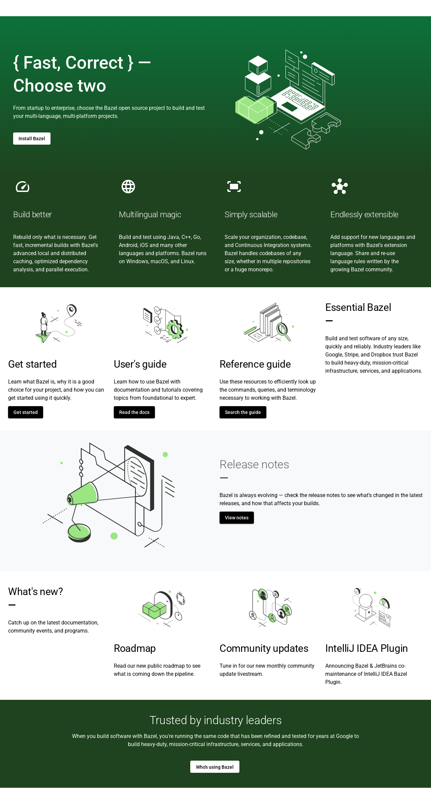 | 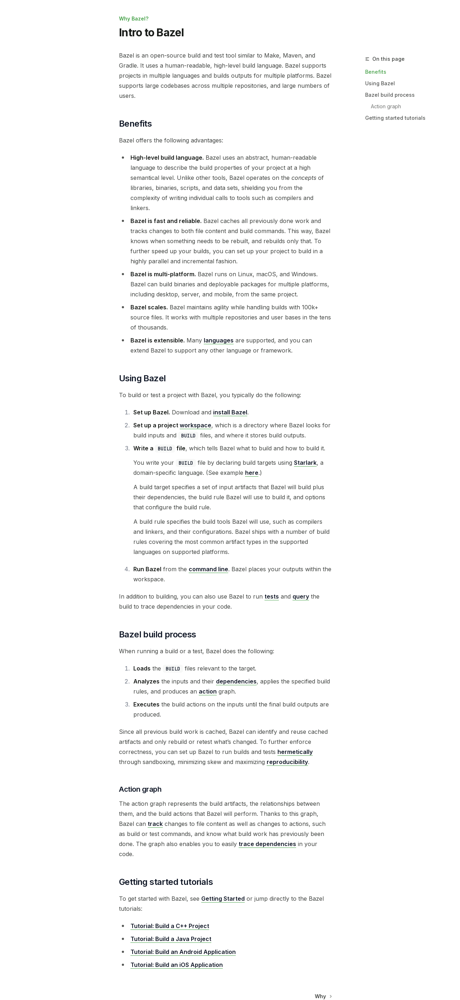 |

- The 'Action graph' heading is indented in the 'On this page' sidebar as if it were a sub-topic, but it is styled as a top-level H2 heading in the main body of the document.
- In the 'Using Bazel' section, the paragraphs within the third list item are not indented to align with the list item's leading text, which disrupts the visual structure of the numbered list.

## /versions/6.5.0/about

Old URL: https://bazel.build/versions/6.5.0/about
New URL: https://preview.bazel.build/versions/6.5.0/about

| Old | New |
| --- | --- |
| 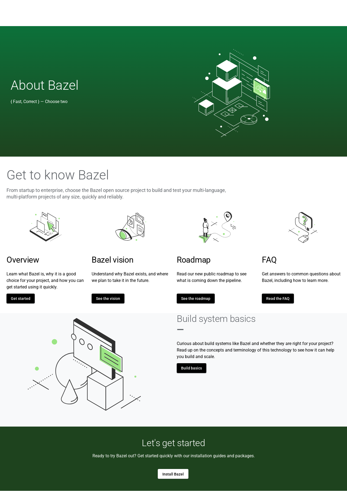 |  |

- All illustrations, icons, and the decorative green header from the original page are missing in the new version.
- Several content sections from the original page, including 'Overview', 'Bazel vision', 'Roadmap', and 'FAQ', have not been migrated.
- Inconsistent link styling: some links in the body text are green (e.g., 'languages', 'action'), while others are black (e.g., 'reproducibility', 'tests').
- Inconsistent link underlining: some links are underlined (e.g., 'action', 'reproducibility') while others are not (e.g., 'languages').
- Inconsistent vertical spacing between list items across different sections; the 'Benefits' list items are much more spaced out than those in 'Using Bazel'.
- Inconsistent punctuation following bolded item headers in the 'Using Bazel' list (e.g., steps 1 and 4 use periods, while steps 2 and 3 use commas).

## /versions/6.5.0/about/faq

Old URL: https://bazel.build/versions/6.5.0/about/faq
New URL: https://preview.bazel.build/versions/6.5.0/about/faq

| Old | New |
| --- | --- |
| 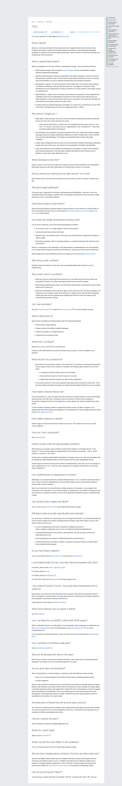 | 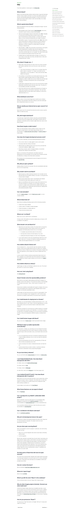 |

- The 'On this page' navigation sidebar in the new site is incomplete and does not include all the headings present in the document.

## /versions/6.5.0/about/intro

Old URL: https://bazel.build/versions/6.5.0/about/intro
New URL: https://preview.bazel.build/versions/6.5.0/about/intro

OK

## /versions/6.5.0/about/roadmap

Old URL: https://bazel.build/versions/6.5.0/about/roadmap
New URL: https://preview.bazel.build/versions/6.5.0/about/roadmap

| Old | New |
| --- | --- |
| 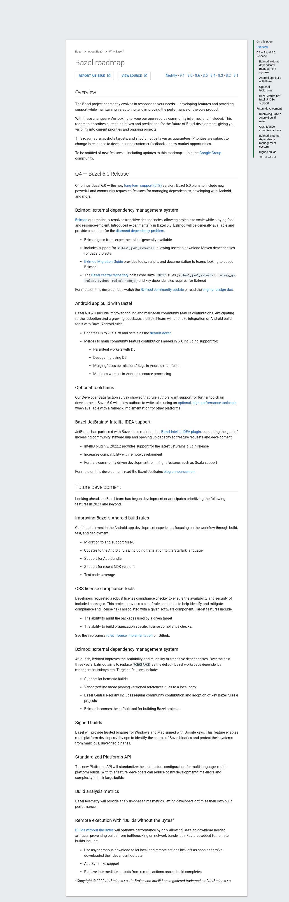 | 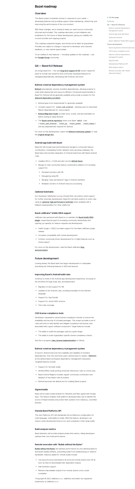 |

- Missing horizontal rules that were previously used to separate major sections like 'Overview', 'Q4 — Bazel 6.0 Release', and 'Future development'.
- Incorrect spacing around inline code blocks in the first 'Bzlmod: external dependency management system' section, resulting in extra spaces before commas and inside parentheses (e.g., '( rules\_jvm\_external , rules\_go ... )' instead of '(rules\_jvm\_external, rules\_go...)').

## /versions/6.5.0/about/vision

Old URL: https://bazel.build/versions/6.5.0/about/vision
New URL: https://preview.bazel.build/versions/6.5.0/about/vision

OK

## /versions/6.5.0/basics

Old URL: https://bazel.build/versions/6.5.0/basics
New URL: https://preview.bazel.build/versions/6.5.0/basics

| Old | New |
| --- | --- |
| 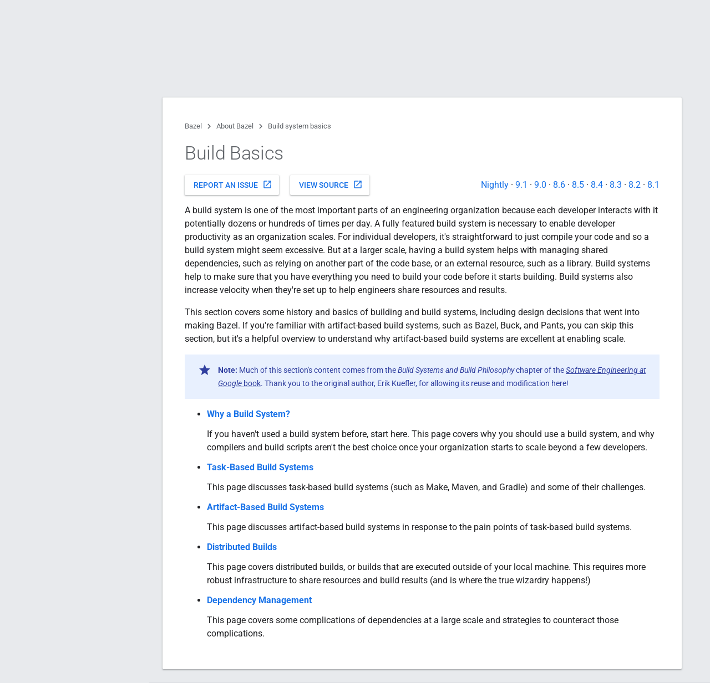 | 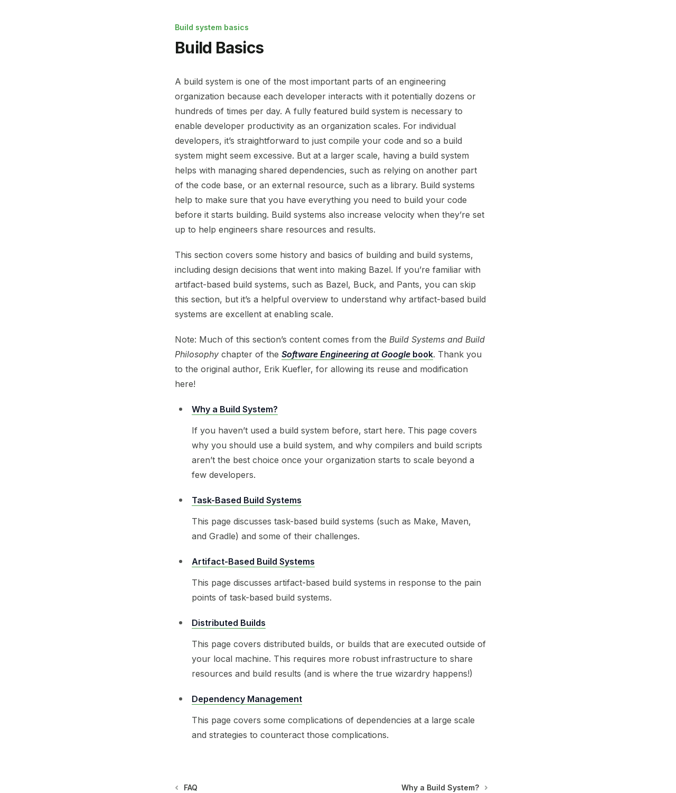 |

- The "Note" callout is unstyled and missing its icon and background color.

## /versions/6.5.0/build/share-variables

Old URL: https://bazel.build/versions/6.5.0/build/share-variables
New URL: https://preview.bazel.build/versions/6.5.0/build/share-variables

OK

## /versions/6.5.0/build/style-guide

Old URL: https://bazel.build/versions/6.5.0/build/style-guide
New URL: https://preview.bazel.build/versions/6.5.0/build/style-guide

OK

## /versions/6.5.0/community

Old URL: https://bazel.build/versions/6.5.0/community
New URL: https://preview.bazel.build/versions/6.5.0/community

OK

## /versions/6.5.0/community/experts

Old URL: https://bazel.build/versions/6.5.0/community/experts
New URL: https://preview.bazel.build/versions/6.5.0/community/experts

ERROR

## /versions/6.5.0/community/recommended-rules

Old URL: https://bazel.build/versions/6.5.0/community/recommended-rules
New URL: https://preview.bazel.build/versions/6.5.0/community/recommended-rules

OK

## /versions/6.5.0/community/remote-execution-services

Old URL: https://bazel.build/versions/6.5.0/community/remote-execution-services
New URL: https://preview.bazel.build/versions/6.5.0/community/remote-execution-services

OK

## /versions/6.5.0/community/sig

Old URL: https://bazel.build/versions/6.5.0/community/sig
New URL: https://preview.bazel.build/versions/6.5.0/community/sig

| Old | New |
| --- | --- |
| 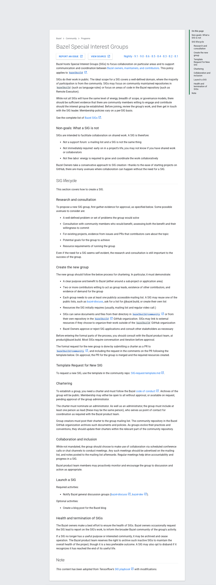 | 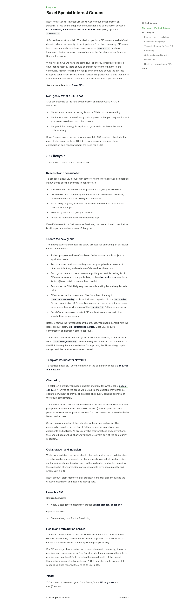 |

- Several links have lost their link formatting and appear only as bold text, likely losing their functionality: 'Bazel owners, maintainers, and contributors' in the first paragraph, 'Bazel SIGs' in the third paragraph, the first occurrence of 'bazelbuild' in the fifth bullet point of 'Create the new group', and 'product@bazel.build' in the following paragraph.
- Technical terms and links that were previously styled as monospace code (e.g., 'bazelbuild', 'bazel-discuss', 'bazelbuild/community', 'SIG-request-template.md') are now displayed in the standard sans-serif font.
- There is an unnecessary extra space before the period following the term 'bazelbuild' at the end of the first paragraph.

## /versions/6.5.0/community/update

Old URL: https://bazel.build/versions/6.5.0/community/update
New URL: https://preview.bazel.build/versions/6.5.0/community/update

| Old | New |
| --- | --- |
| 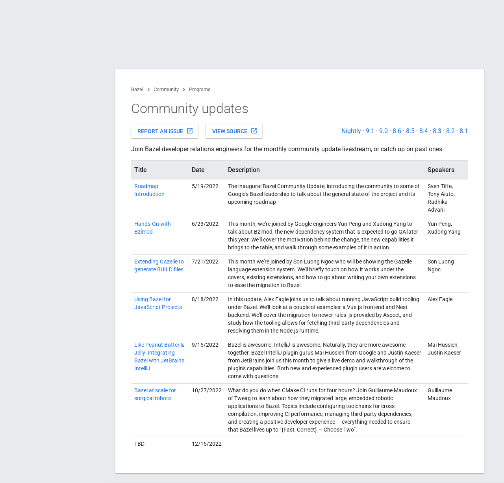 | 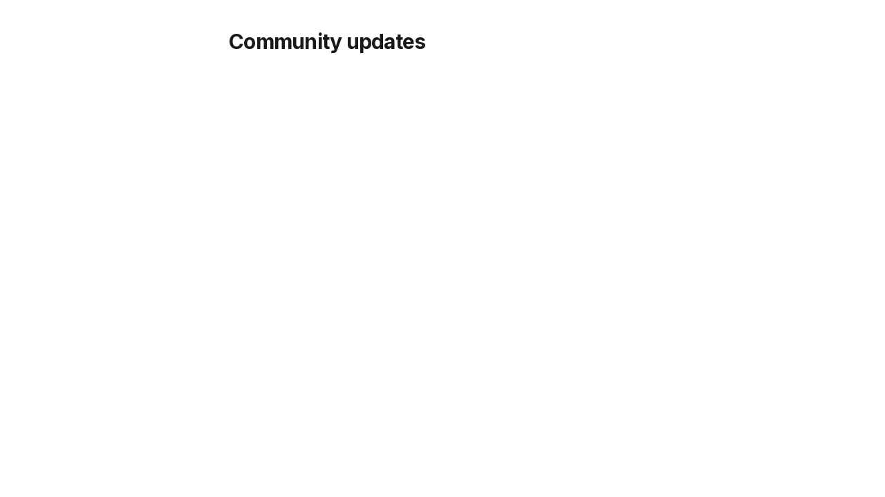 |

- The table containing the community updates is missing.
- The 'REPORT AN ISSUE' and 'VIEW SOURCE' buttons are missing.
- The breadcrumb navigation (Bazel > Community > Programs) is missing.
- The version selector links are missing.
- The introductory text 'Join Bazel developer relations engineers for the monthly community update livestream, or catch up on past ones.' is missing.

## /versions/6.5.0/community/users

Old URL: https://bazel.build/versions/6.5.0/community/users
New URL: https://preview.bazel.build/versions/6.5.0/community/users

| Old | New |
| --- | --- |
|  |  |

- The logo for the GRAKN.AI entry in the 'Companies using Bazel' section incorrectly displays the alt text 'GRAKN.AI Logo' next to the logo icon.

## /versions/6.5.0/concepts/build-files

Old URL: https://bazel.build/versions/6.5.0/concepts/build-files
New URL: https://preview.bazel.build/versions/6.5.0/concepts/build-files

| Old | New |
| --- | --- |
| 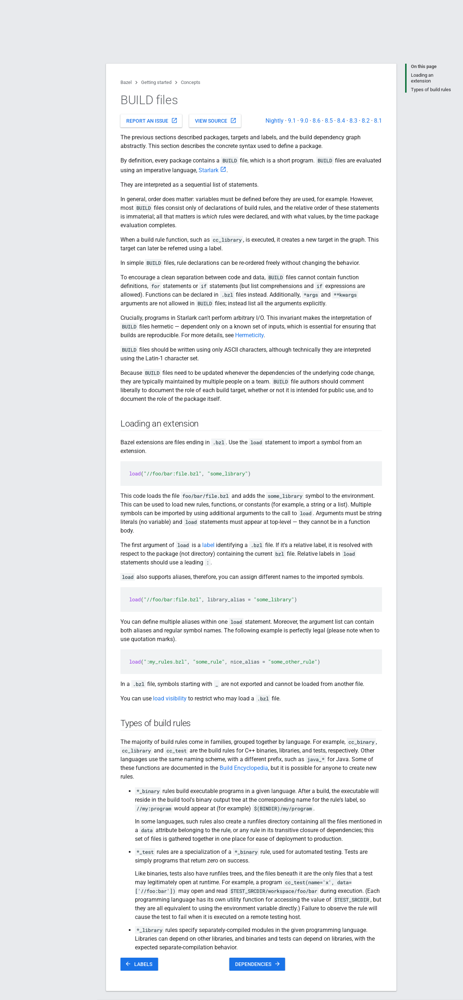 | 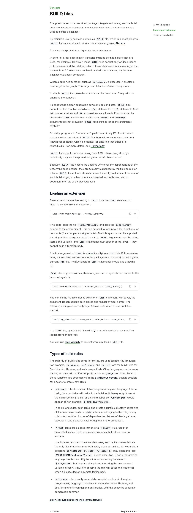 |

- The bottom navigation contains raw text "arrow_backLabelsDependenciesarrow_forward" which appears to be unrendered icon names concatenated with button labels.

## /versions/6.5.0/concepts/build-ref

Old URL: https://bazel.build/versions/6.5.0/concepts/build-ref
New URL: https://preview.bazel.build/versions/6.5.0/concepts/build-ref

| Old | New |
| --- | --- |
| 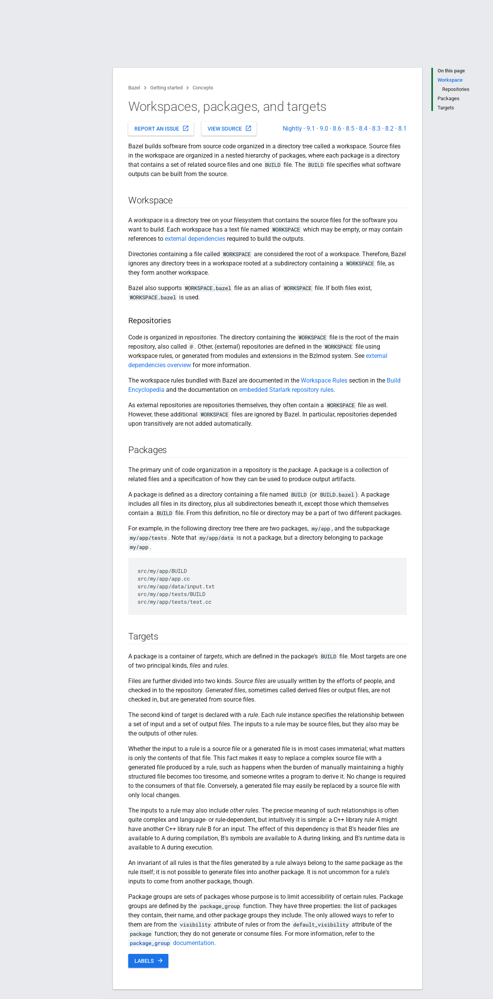 | 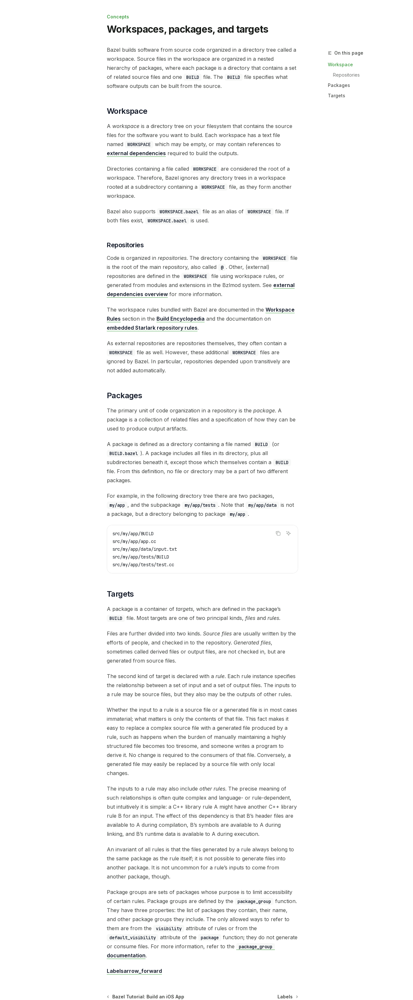 |

- The footer link 'Labelsarrow_forward' contains the literal text 'arrow_forward' instead of rendering an icon.

## /versions/6.5.0/concepts/dependencies

Old URL: https://bazel.build/versions/6.5.0/concepts/dependencies
New URL: https://preview.bazel.build/versions/6.5.0/concepts/dependencies

| Old | New |
| --- | --- |
|  | 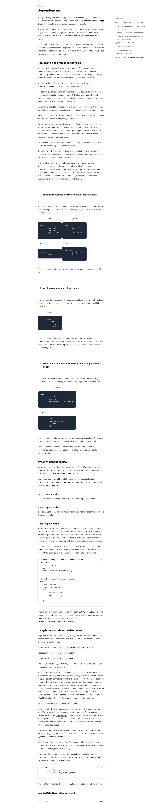 |

- The "Important" and "Note" callout boxes are unstyled and missing their respective icons.
- Raw "<strong>" HTML tags are visible inside the code block under the "3. Divergence between declared and actual dependency graphs" section.
- The "Not recommended" and "Recommended" list items in the "Using labels to reference directories" section are missing their thumbs-down and thumbs-up icons.
- The bottom navigation links at the end of the page are incorrectly formatted, displaying raw icon text strings like "arrow_back" and "arrow_forward".

## /versions/6.5.0/concepts/labels

Old URL: https://bazel.build/versions/6.5.0/concepts/labels
New URL: https://preview.bazel.build/versions/6.5.0/concepts/labels

| Old | New |
| --- | --- |
| 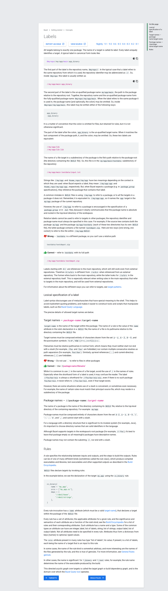 | 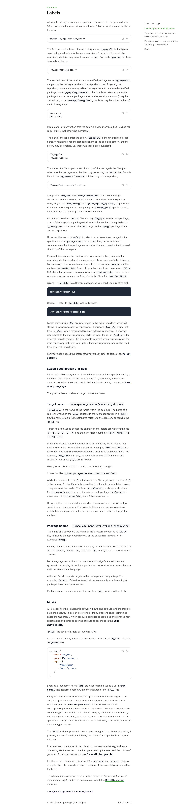 |

- The styling for the 'Wrong' and 'Correct' callouts is missing in the new site; the icons and color-coding from the old site have not been preserved.
- The navigation text at the bottom of the page is incorrectly rendered, displaying raw icon names as text: 'arrow_backTargets BUILD filesarrow_forward'.

## /versions/6.5.0/configure/attributes

Old URL: https://bazel.build/versions/6.5.0/configure/attributes
New URL: https://preview.bazel.build/versions/6.5.0/configure/attributes

ERROR

## /versions/6.5.0/configure/best-practices

Old URL: https://bazel.build/versions/6.5.0/configure/best-practices
New URL: https://preview.bazel.build/versions/6.5.0/configure/best-practices

| Old | New |
| --- | --- |
| 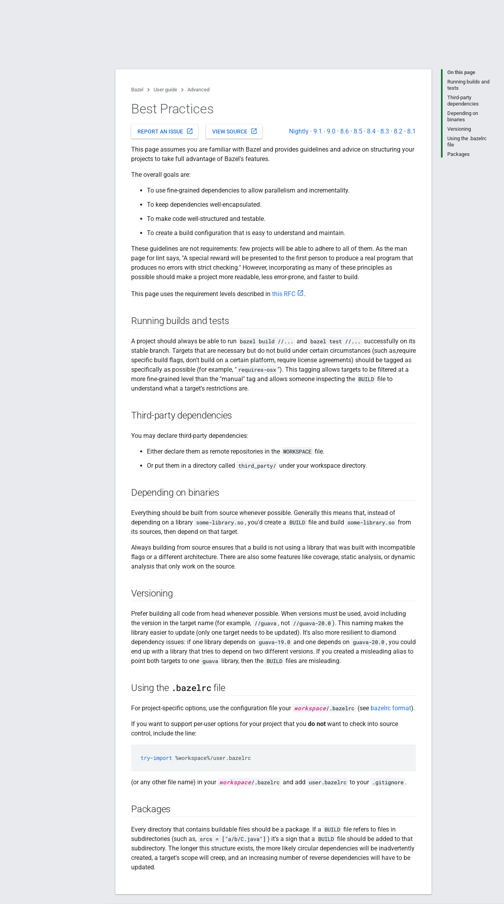 | 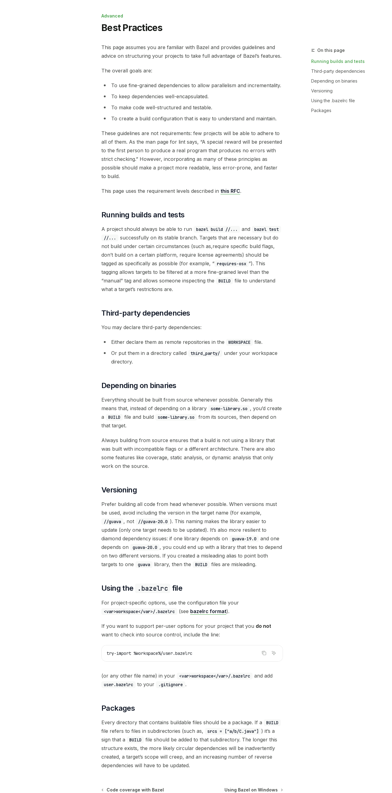 |

- Literal HTML tags (<var>) are visible in the text under the 'Using the .bazelrc file' section.

## /versions/6.5.0/configure/coverage

Old URL: https://bazel.build/versions/6.5.0/configure/coverage
New URL: https://preview.bazel.build/versions/6.5.0/configure/coverage

| Old | New |
| --- | --- |
| 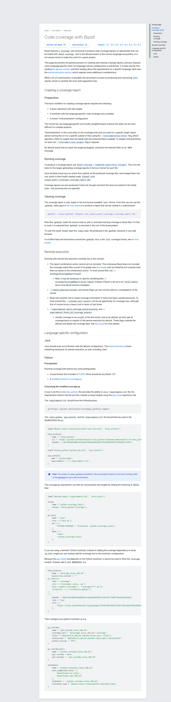 | 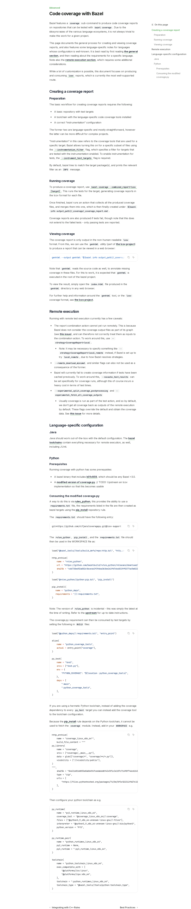 |

- In the 'Python' section under 'Prerequisites', the second bullet point includes an internal comment ('// TODO: Upstream an lcov implementation so that this becomes usable') that was not present on the original site.

## /versions/6.5.0/configure/memory

Old URL: https://bazel.build/versions/6.5.0/configure/memory
New URL: https://preview.bazel.build/versions/6.5.0/configure/memory

| Old | New |
| --- | --- |
| 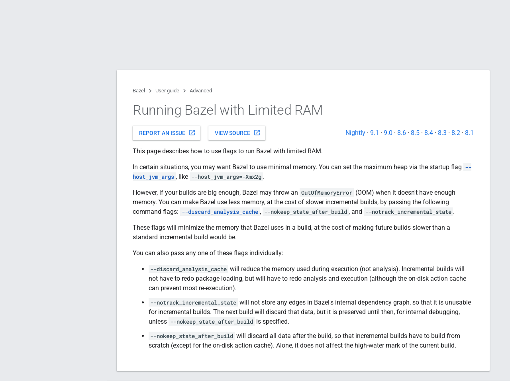 | 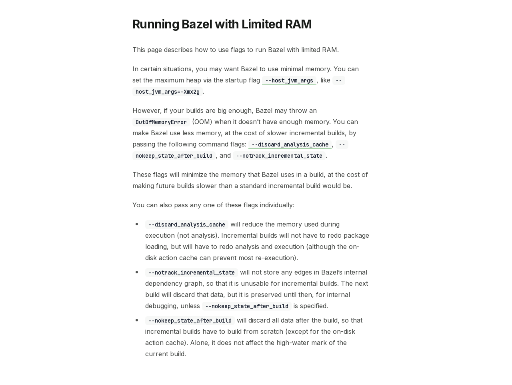 |

- The inline code blocks have extra whitespace around them, causing awkward gaps in the text before punctuation like commas and periods.
- The code snippet 'host_jvm_args=-Xmx2g' in the first paragraph is missing its leading double-dash ('--') prefix.

## /versions/6.5.0/configure/windows

Old URL: https://bazel.build/versions/6.5.0/configure/windows
New URL: https://preview.bazel.build/versions/6.5.0/configure/windows

| Old | New |
| --- | --- |
| 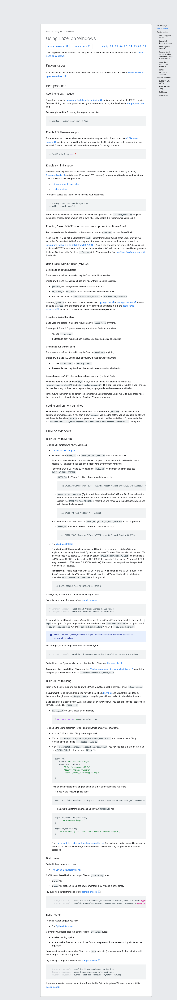 | 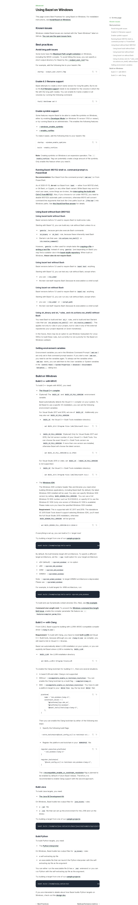 |

- The 'Best practices' section heading is missing from the main content area in the new site.
- The admonition starting with 'Note: --cpu=x64_arm64_windows' in the 'Build C++ with MSVC' section is unstyled and appears as plain text.
- Multiple code blocks (specifically in the C++, Java, and Python example sections) have had their separate command and output lines merged into a single line, and the shell prompts have been removed.

## /versions/6.5.0/contribute

Old URL: https://bazel.build/versions/6.5.0/contribute
New URL: https://preview.bazel.build/versions/6.5.0/contribute

| Old | New |
| --- | --- |
| 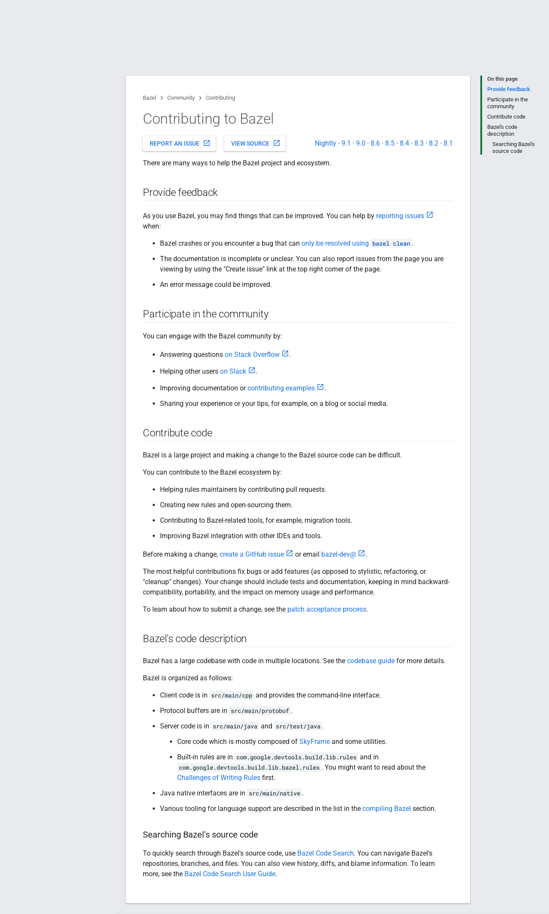 |  |

- Extra spaces have been introduced before punctuation marks (specifically periods) following links and inline code blocks (e.g., "bazel clean .", "on Slack .", "src/main/protobuf .", "src/test/java .", etc.).

## /versions/6.5.0/contribute/codebase

Old URL: https://bazel.build/versions/6.5.0/contribute/codebase
New URL: https://preview.bazel.build/versions/6.5.0/contribute/codebase

OK

## /versions/6.5.0/contribute/design-documents

Old URL: https://bazel.build/versions/6.5.0/contribute/design-documents
New URL: https://preview.bazel.build/versions/6.5.0/contribute/design-documents

OK

## /versions/6.5.0/contribute/docs

Old URL: https://bazel.build/versions/6.5.0/contribute/docs
New URL: https://preview.bazel.build/versions/6.5.0/contribute/docs

OK

## /versions/6.5.0/contribute/docs-style-guide

Old URL: https://bazel.build/versions/6.5.0/contribute/docs-style-guide
New URL: https://preview.bazel.build/versions/6.5.0/contribute/docs-style-guide

| Old | New |
| --- | --- |
| 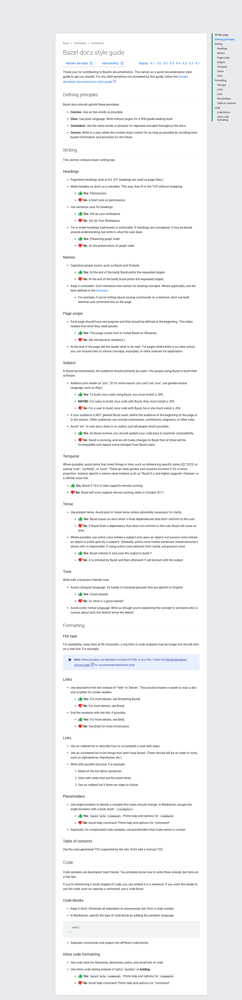 | 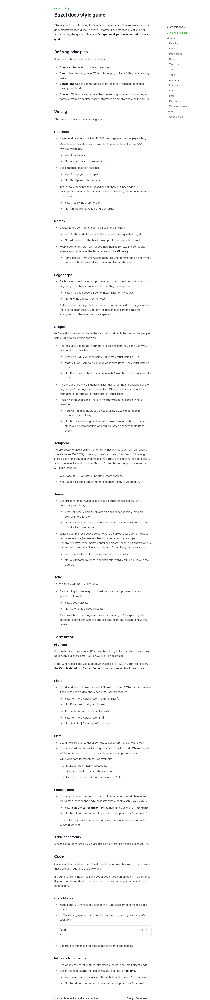 |

- The thumbs up and thumbs down icons for 'Yes', 'No', and 'Maybe' examples are missing throughout the page.
- The info callout in the 'File type' section has lost its blue background styling and icon.

## /versions/6.5.0/contribute/patch-acceptance

Old URL: https://bazel.build/versions/6.5.0/contribute/patch-acceptance
New URL: https://preview.bazel.build/versions/6.5.0/contribute/patch-acceptance

OK

## /versions/6.5.0/contribute/policy

Old URL: https://bazel.build/versions/6.5.0/contribute/policy
New URL: https://preview.bazel.build/versions/6.5.0/contribute/policy

| Old | New |
| --- | --- |
| 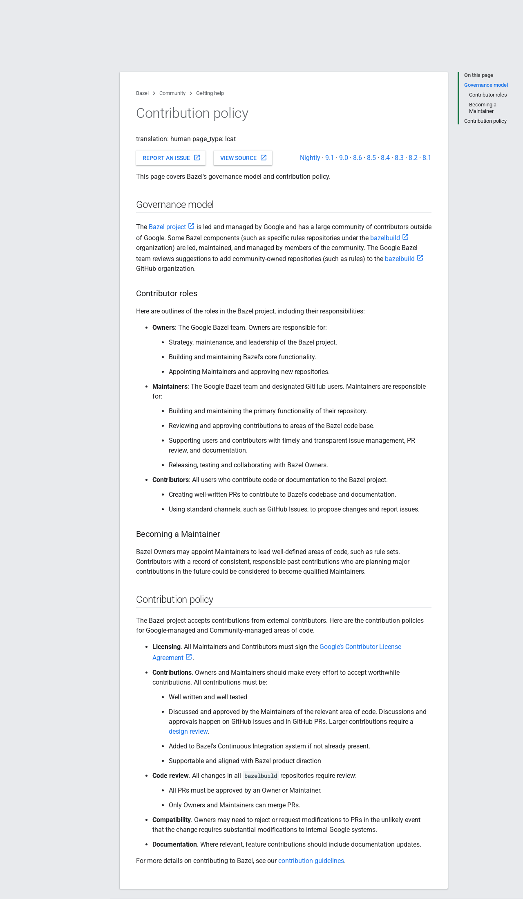 | 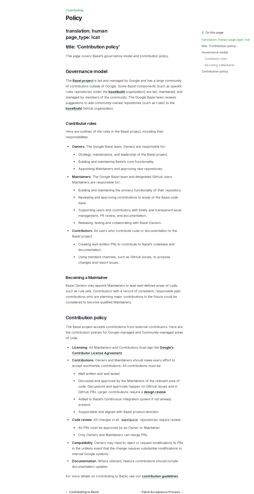 |

- The page title has been incorrectly changed from 'Contribution policy' to 'Policy'.
- Metadata fields (translation: human, page_type: lcat, title: 'Contribution policy') are being rendered as plain text content on the page.
- The 'On this page' navigation sidebar incorrectly includes entries for the leaked metadata fields.

## /versions/6.5.0/contribute/search

Old URL: https://bazel.build/versions/6.5.0/contribute/search
New URL: https://preview.bazel.build/versions/6.5.0/contribute/search

ERROR

## /versions/6.5.0/docs

Old URL: https://bazel.build/versions/6.5.0/docs
New URL: https://preview.bazel.build/versions/6.5.0/docs

ERROR

## /versions/6.5.0/docs/user-manual

Old URL: https://bazel.build/versions/6.5.0/docs/user-manual
New URL: https://preview.bazel.build/versions/6.5.0/docs/user-manual

| Old | New |
| --- | --- |
|  | 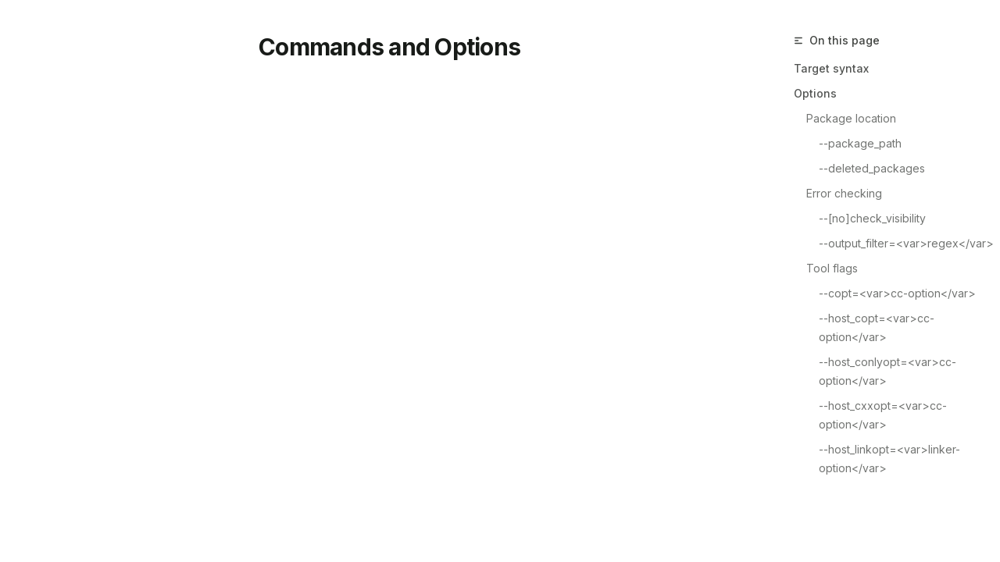 |

- The main content area of the new website is missing nearly all of the text, code blocks, and headings that are present in the original version, resulting in a mostly blank page.

## /versions/6.5.0/extending

Old URL: https://bazel.build/versions/6.5.0/extending
New URL: https://preview.bazel.build/versions/6.5.0/extending

| Old | New |
| --- | --- |
| 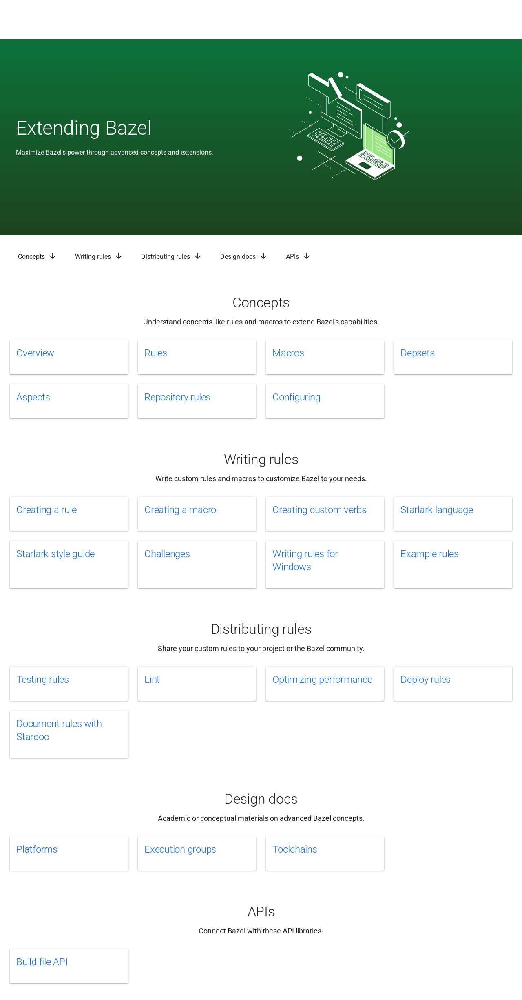 | 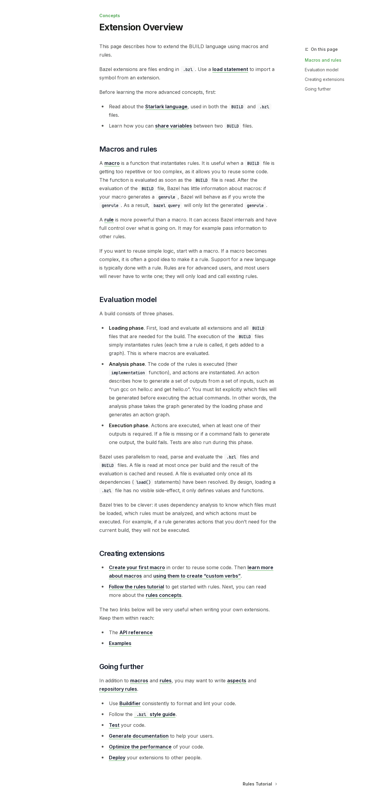 |

- The hero image and green header background from the original 'Extending Bazel' page are missing.
- The card-based dashboard layout from the original site has been replaced by a long-form article, significantly changing the page's structure and usability as a landing page.
- Several major documentation sections and their links are missing from the new page, including 'Depsets', 'Configuring', 'Challenges', 'Writing rules for Windows', 'Platforms', 'Execution groups', and 'Toolchains'.
- There are extraneous spaces before punctuation marks (periods and commas) that follow monospaced code blocks, such as in '.bzl .', 'genrule ,', and 'genrule .'.
- In the 'Evaluation model' section, there is an extraneous space after an opening parenthesis: '( load() statements)'.

## /versions/6.5.0/extending/aspects

Old URL: https://bazel.build/versions/6.5.0/extending/aspects
New URL: https://preview.bazel.build/versions/6.5.0/extending/aspects

OK

## /versions/6.5.0/extending/concepts

Old URL: https://bazel.build/versions/6.5.0/extending/concepts
New URL: https://preview.bazel.build/versions/6.5.0/extending/concepts

| Old | New |
| --- | --- |
| 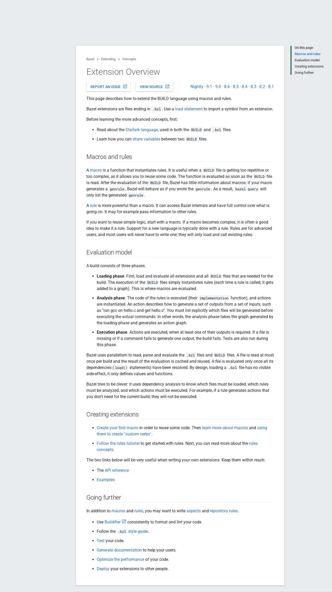 |  |

- Extra whitespace is incorrectly inserted before punctuation marks (periods and commas) that follow inline code blocks or links (e.g., after 'genrule', 'custom verbs', 'rules concepts', 'repository rules', and '.bzl style guide').
- Unwanted leading whitespace inside the parentheses for the inline code element '( load() statements)'.

## /versions/6.5.0/extending/config

Old URL: https://bazel.build/versions/6.5.0/extending/config
New URL: https://preview.bazel.build/versions/6.5.0/extending/config

| Old | New |
| --- | --- |
|  |  |

- The 'On this page' table of contents is incomplete and stops after 'Defining 12+ transitions', missing the remaining half of the page sections.
- The TOC entry 'Defining 12+ transitions' contains a typo (missing colon), it should be 'Defining 1:2+ transitions' to match the corresponding section header.
- There is a stray 'E.' character appearing before the 'On this page' heading in the right sidebar navigation.

## /versions/6.5.0/extending/macros

Old URL: https://bazel.build/versions/6.5.0/extending/macros
New URL: https://preview.bazel.build/versions/6.5.0/extending/macros

| Old | New |
| --- | --- |
| 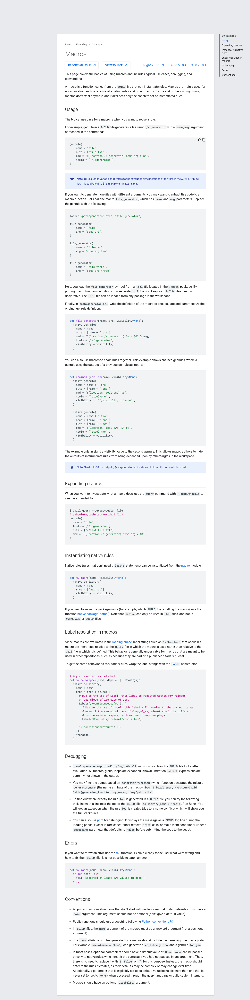 | 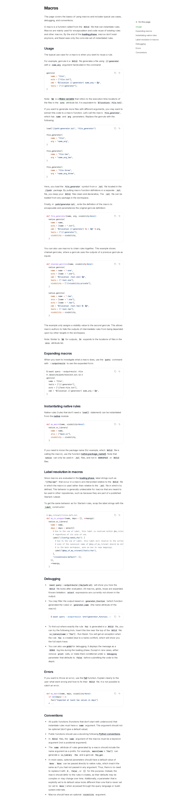 |

- The Note callouts (admonitions) are unstyled on the new website; they are missing their background colors and icons.

## /versions/6.5.0/extending/platforms

Old URL: https://bazel.build/versions/6.5.0/extending/platforms
New URL: https://preview.bazel.build/versions/6.5.0/extending/platforms

| Old | New |
| --- | --- |
| 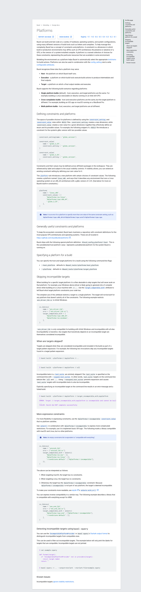 | 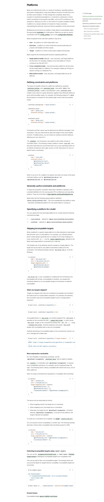 |

- Unstyled callouts (admonitions) for notes. Specifically, the blue boxed notes with star icons in the old site have lost their distinctive styling in the new site.

## /versions/6.5.0/extending/repo

Old URL: https://bazel.build/versions/6.5.0/extending/repo
New URL: https://preview.bazel.build/versions/6.5.0/extending/repo

| Old | New |
| --- | --- |
| 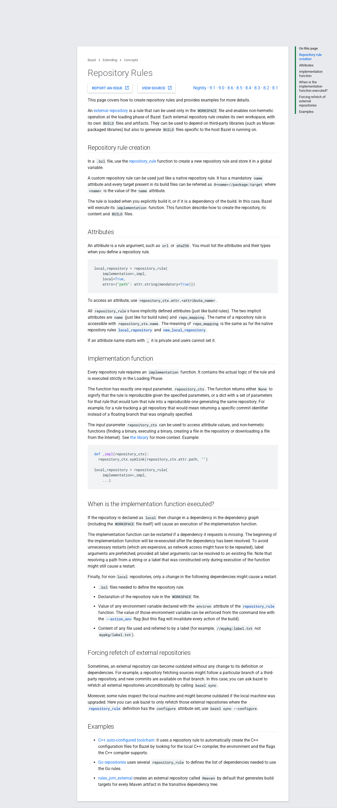 | 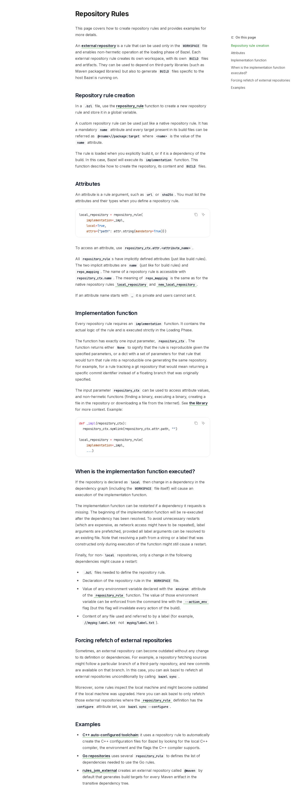 |

- The first code block in the 'Attributes' section is missing indentation for its parameters.
- Extra whitespace has been incorrectly introduced before closing punctuation (periods and parentheses) in several locations throughout the document, particularly following inline code or links (e.g., 'WORKSPACE file .', 'new_local_repository .', 'bazel sync --configure .', and 'mypkg/label.txt ) .').
- An extra word 'and' was added to the text in the final bullet point of the 'When is the implementation function executed?' section ('...//mypkg:label.txt and not mypkg/label.txt').

## /versions/6.5.0/extending/rules

Old URL: https://bazel.build/versions/6.5.0/extending/rules
New URL: https://preview.bazel.build/versions/6.5.0/extending/rules

OK

## /versions/6.5.0/help

Old URL: https://bazel.build/versions/6.5.0/help
New URL: https://preview.bazel.build/versions/6.5.0/help

OK

## /versions/6.5.0/install

Old URL: https://bazel.build/versions/6.5.0/install
New URL: https://preview.bazel.build/versions/6.5.0/install

OK

## /versions/6.5.0/install/bazelisk

Old URL: https://bazel.build/versions/6.5.0/install/bazelisk
New URL: https://preview.bazel.build/versions/6.5.0/install/bazelisk

| Old | New |
| --- | --- |
| 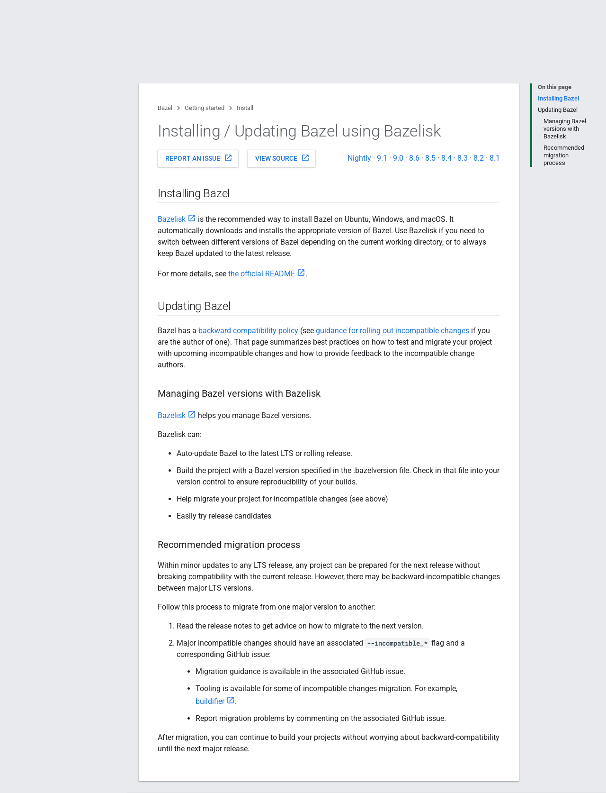 |  |

- The inline code '--incompatible_*' in the 'Recommended migration process' section is incorrectly split into two separate code spans and broken across two lines.

## /versions/6.5.0/install/compile-source

Old URL: https://bazel.build/versions/6.5.0/install/compile-source
New URL: https://preview.bazel.build/versions/6.5.0/install/compile-source

| Old | New |
| --- | --- |
| 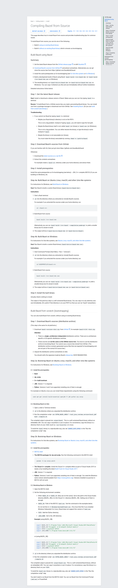 | 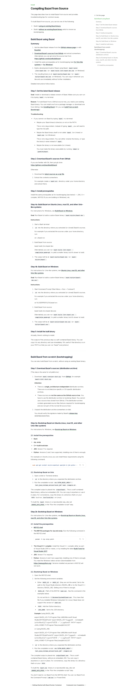 |

- The 'Attention:' callout in the 'Step 1: Download Bazel's sources (distribution archive)' section is unstyled, losing its background color and left border from the original site.

## /versions/6.5.0/install/completion

Old URL: https://bazel.build/versions/6.5.0/install/completion
New URL: https://preview.bazel.build/versions/6.5.0/install/completion

OK

## /versions/6.5.0/install/docker-container

Old URL: https://bazel.build/versions/6.5.0/install/docker-container
New URL: https://preview.bazel.build/versions/6.5.0/install/docker-container

| Old | New |
| --- | --- |
| 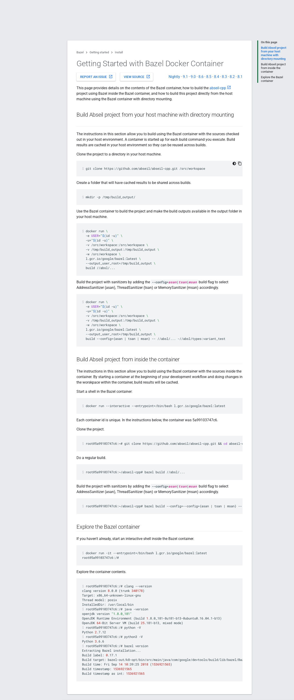 | 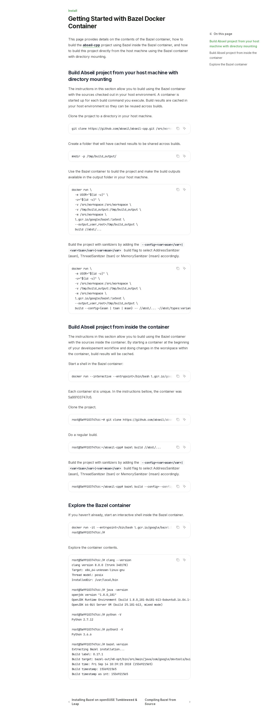 |

- Literal HTML tags (<var> and </var>) are visible as text in the descriptions for build flags instead of being rendered correctly.
- A typo was introduced in the 'Build Abseil project from inside the container' section: 'development' is misspelled as 'developement'.
- A typo was introduced in the 'Build Abseil project from inside the container' section: 'below' is misspelled as 'bellow'.

## /versions/6.5.0/install/ide

Old URL: https://bazel.build/versions/6.5.0/install/ide
New URL: https://preview.bazel.build/versions/6.5.0/install/ide

OK

## /versions/6.5.0/install/os-x

Old URL: https://bazel.build/versions/6.5.0/install/os-x
New URL: https://preview.bazel.build/versions/6.5.0/install/os-x

| Old | New |
| --- | --- |
| 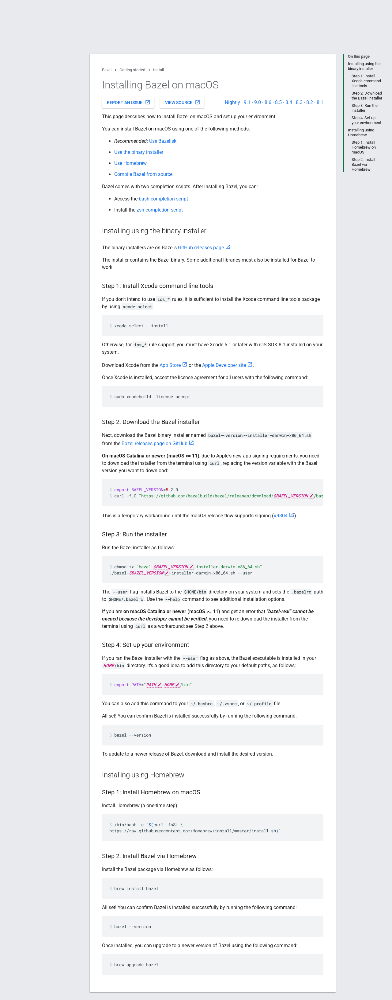 | 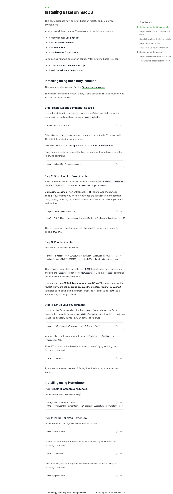 |

- Code blocks in Step 2, Step 3, and Step 4 contain unrendered and literal <var> tags around variable names.

## /versions/6.5.0/install/redhat

Old URL: https://bazel.build/versions/6.5.0/install/redhat
New URL: https://preview.bazel.build/versions/6.5.0/install/redhat

OK

## /versions/6.5.0/install/suse

Old URL: https://bazel.build/versions/6.5.0/install/suse
New URL: https://preview.bazel.build/versions/6.5.0/install/suse

| Old | New |
| --- | --- |
| 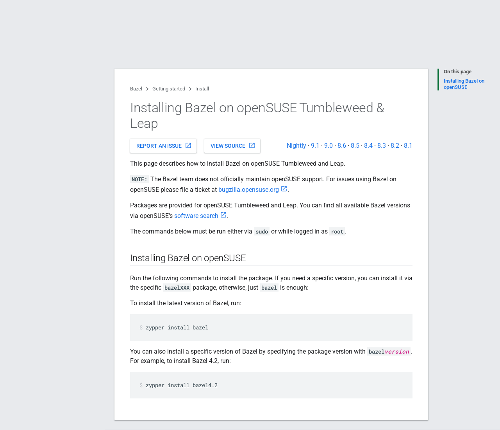 |  |

- Raw HTML tags <var> and </var> are visible in the text instead of being rendered.

## /versions/6.5.0/install/ubuntu

Old URL: https://bazel.build/versions/6.5.0/install/ubuntu
New URL: https://preview.bazel.build/versions/6.5.0/install/ubuntu

| Old | New |
| --- | --- |
| 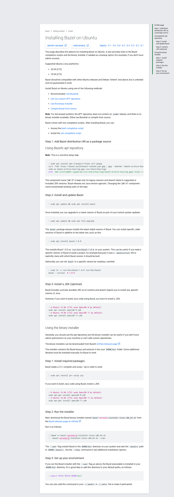 | 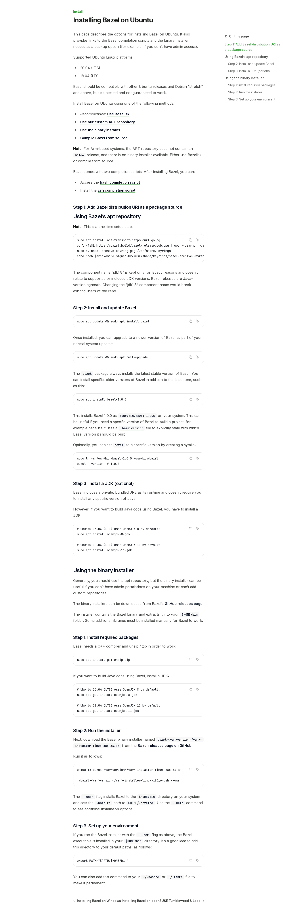 |

- Literal HTML tags (<var> and </var>) are visible in the 'Step 2: Run the installer' section, appearing in both the body text and the code block.

## /versions/6.5.0/install/windows

Old URL: https://bazel.build/versions/6.5.0/install/windows
New URL: https://preview.bazel.build/versions/6.5.0/install/windows

| Old | New |
| --- | --- |
| 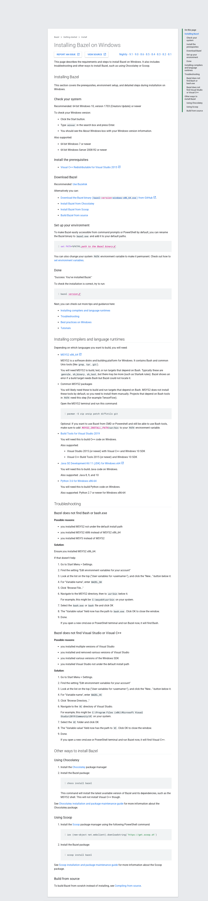 | 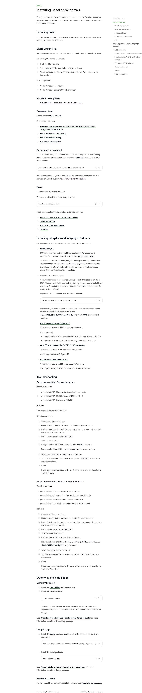 |

- Raw HTML <var> tags are visible instead of being rendered in the 'Download Bazel' section, multiple code blocks, and the 'Installing compilers and language runtimes' section.

## /versions/6.5.0/migrate

Old URL: https://bazel.build/versions/6.5.0/migrate
New URL: https://preview.bazel.build/versions/6.5.0/migrate

OK

## /versions/6.5.0/migrate/maven

Old URL: https://bazel.build/versions/6.5.0/migrate/maven
New URL: https://preview.bazel.build/versions/6.5.0/migrate/maven

| Old | New |
| --- | --- |
| 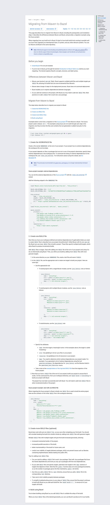 | 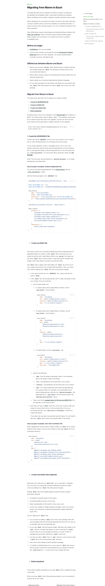 |

- Unstyled callouts

## /versions/6.5.0/migrate/xcode

Old URL: https://bazel.build/versions/6.5.0/migrate/xcode
New URL: https://preview.bazel.build/versions/6.5.0/migrate/xcode

| Old | New |
| --- | --- |
| 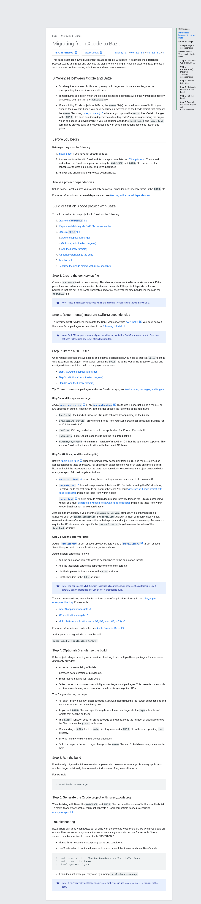 | 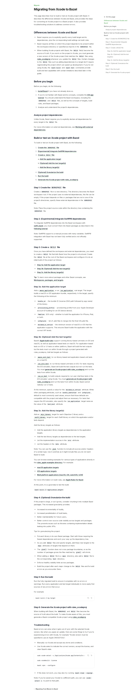 |

- Unstyled callouts i.e. admonitions

## /versions/6.5.0/query/aquery

Old URL: https://bazel.build/versions/6.5.0/query/aquery
New URL: https://preview.bazel.build/versions/6.5.0/query/aquery

| Old | New |
| --- | --- |
| 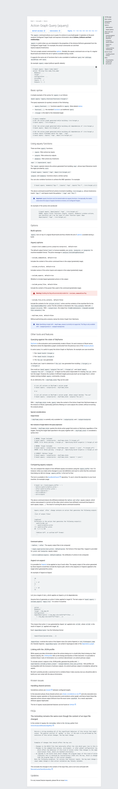 | 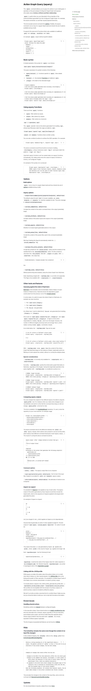 |

- Unstyled 'Important' callout under the 'Using aquery functions' section.
- Unstyled 'Warning' callout under the 'Aquery options' section.
- Unstyled 'Note' callout under the 'Aquery options' section.

## /versions/6.5.0/query/cquery

Old URL: https://bazel.build/versions/6.5.0/query/cquery
New URL: https://preview.bazel.build/versions/6.5.0/query/cquery

| Old | New |
| --- | --- |
|  |  |

- In several code blocks, the '<' character is incorrectly rendered as the HTML entity '&lt;'. This can be seen in the introductory example under 'Configurable query (cquery)', the 'Using cquery options' section, and the 'Non-deterministic output' section.
- In some genrule examples, such as those under 'Using cquery options' and 'Non-deterministic output', the '$<' variable is incorrectly rendered as '&lt;', resulting in the loss of the '$' character.

## /versions/6.5.0/query/language

Old URL: https://bazel.build/versions/6.5.0/query/language
New URL: https://preview.bazel.build/versions/6.5.0/query/language

OK

## /versions/6.5.0/query/quickstart

Old URL: https://bazel.build/versions/6.5.0/query/quickstart
New URL: https://preview.bazel.build/versions/6.5.0/query/quickstart

| Old | New |
| --- | --- |
| 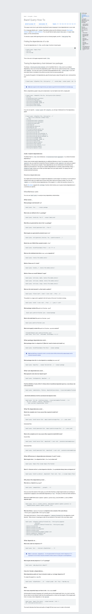 | 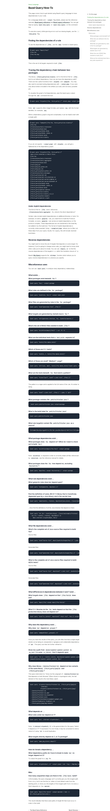 |

- Several callouts (admonitions) that had a blue star icon and distinct styling in the original version (e.g., under the sections 'Tracing the dependency chain between two packages', 'What package dependencies exist...', and 'What depends on...') have lost their formatting and appear as plain text in the new version.

## /versions/6.5.0/reference

Old URL: https://bazel.build/versions/6.5.0/reference
New URL: https://preview.bazel.build/versions/6.5.0/reference

ERROR

## /versions/6.5.0/reference/be/c-cpp

Old URL: https://bazel.build/versions/6.5.0/reference/be/c-cpp
New URL: https://preview.bazel.build/versions/6.5.0/reference/be/c-cpp

ERROR

## /versions/6.5.0/reference/be/common-definitions

Old URL: https://bazel.build/versions/6.5.0/reference/be/common-definitions
New URL: https://preview.bazel.build/versions/6.5.0/reference/be/common-definitions

ERROR

## /versions/6.5.0/reference/be/general

Old URL: https://bazel.build/versions/6.5.0/reference/be/general
New URL: https://preview.bazel.build/versions/6.5.0/reference/be/general

ERROR

## /versions/6.5.0/reference/be/overview

Old URL: https://bazel.build/versions/6.5.0/reference/be/overview
New URL: https://preview.bazel.build/versions/6.5.0/reference/be/overview

ERROR

## /versions/6.5.0/reference/be/python

Old URL: https://bazel.build/versions/6.5.0/reference/be/python
New URL: https://preview.bazel.build/versions/6.5.0/reference/be/python

ERROR

## /versions/6.5.0/reference/command-line-reference

Old URL: https://bazel.build/versions/6.5.0/reference/command-line-reference
New URL: https://preview.bazel.build/versions/6.5.0/reference/command-line-reference

ERROR

## /versions/6.5.0/reference/glossary

Old URL: https://bazel.build/versions/6.5.0/reference/glossary
New URL: https://preview.bazel.build/versions/6.5.0/reference/glossary

| Old | New |
| --- | --- |
|  |  |

- Presence of internal TODO comments such as '// TODO: ### Build event protocol' and '// TODO: ### Build flag' under the '.bzl file' section.
- Presence of an internal TODO comment '// TODO: ### Configuration fragment' under the 'Configuration' section.
- Presence of an internal TODO comment '// TODO: ### Install base' under the 'Incremental build' section.
- Presence of an internal TODO comment '// TODO: ### Repository rule' under the 'Repository cache' section.
- Presence of an internal TODO comment '// TODO: ### Spawn strategy' under the 'Skyframe' section.
- Presence of internal TODO comments '// TODO: ### Starlark rules' and '// TODO: ### Starlark rule sandwich' under the 'Starlark' section.

## /versions/6.5.0/reference/test-encyclopedia

Old URL: https://bazel.build/versions/6.5.0/reference/test-encyclopedia
New URL: https://preview.bazel.build/versions/6.5.0/reference/test-encyclopedia

| Old | New |
| --- | --- |
|  |  |

- The callout/admonition at the end of the 'Tag conventions' section is unstyled in the new site; it is missing its blue background and star icon.

## /versions/6.5.0/release

Old URL: https://bazel.build/versions/6.5.0/release
New URL: https://preview.bazel.build/versions/6.5.0/release

OK

## /versions/6.5.0/release/backward-compatibility

Old URL: https://bazel.build/versions/6.5.0/release/backward-compatibility
New URL: https://preview.bazel.build/versions/6.5.0/release/backward-compatibility

OK

## /versions/6.5.0/release/versioning

Old URL: https://bazel.build/versions/6.5.0/release/versioning
New URL: https://preview.bazel.build/versions/6.5.0/release/versioning

| Old | New |
| --- | --- |
| 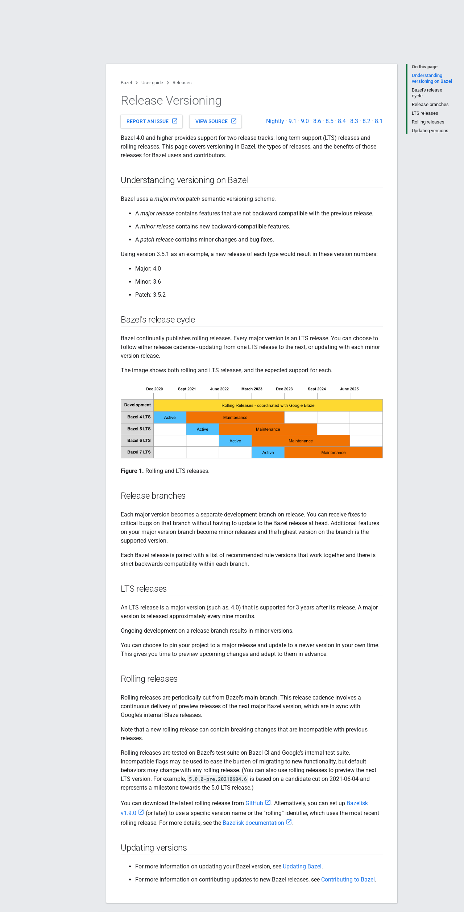 | 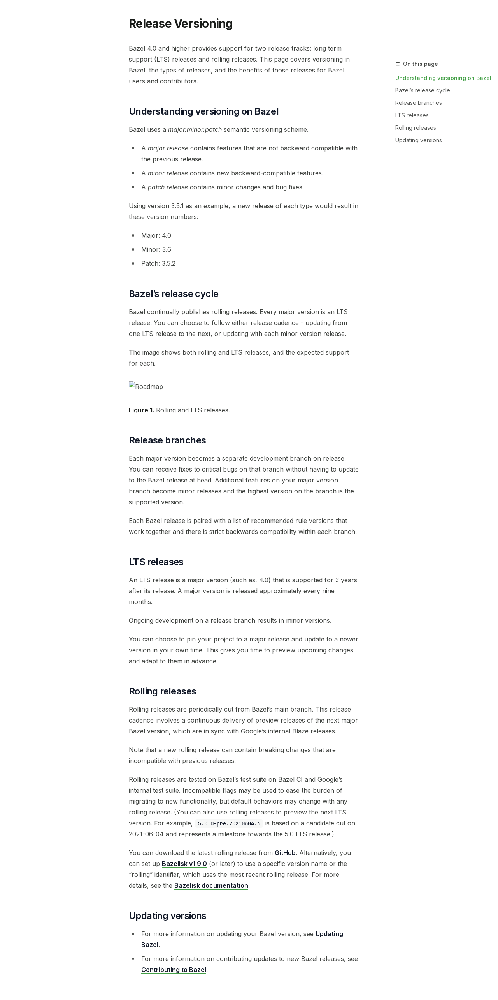 |

- The roadmap diagram (Figure 1) is missing and replaced by the text placeholder '[Roadmap]' in the new version.

## /versions/6.5.0/remote/bep

Old URL: https://bazel.build/versions/6.5.0/remote/bep
New URL: https://preview.bazel.build/versions/6.5.0/remote/bep

OK

## /versions/6.5.0/remote/bep-examples

Old URL: https://bazel.build/versions/6.5.0/remote/bep-examples
New URL: https://preview.bazel.build/versions/6.5.0/remote/bep-examples

| Old | New |
| --- | --- |
|  |  |

- The 'Note' callout in the 'Aspect Results in BEP' section is unstyled in the new website; it appears as plain text instead of being contained within a colored callout box with an icon as it was in the original site.

## /versions/6.5.0/remote/bep-glossary

Old URL: https://bazel.build/versions/6.5.0/remote/bep-glossary
New URL: https://preview.bazel.build/versions/6.5.0/remote/bep-glossary

| Old | New |
| --- | --- |
| 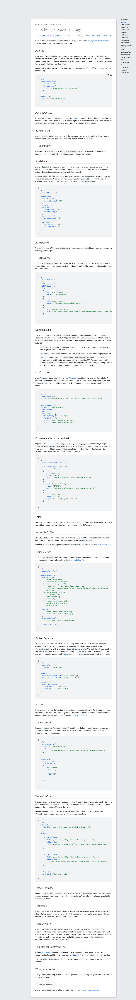 |  |

- The 'On this page' table of contents sidebar is truncated and missing several items that are present in the original page (TargetSummary, TestResult, TestSummary, UnstructuredCommandLine, WorkspaceConfig, and WorkspaceStatus).

## /versions/6.5.0/remote/caching

Old URL: https://bazel.build/versions/6.5.0/remote/caching
New URL: https://preview.bazel.build/versions/6.5.0/remote/caching

| Old | New |
| --- | --- |
| 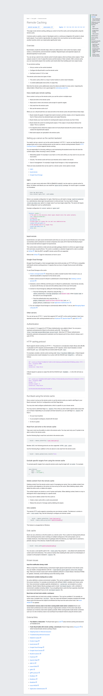 |  |

- Literal HTML tags (<var> and </var>) are visible as unrendered text in multiple code blocks and inline code snippets (e.g., in the 'Google Cloud Storage', 'Read from and write to the remote cache', 'Unix sockets', and 'Disk cache' sections).

## /versions/6.5.0/remote/ci

Old URL: https://bazel.build/versions/6.5.0/remote/ci
New URL: https://preview.bazel.build/versions/6.5.0/remote/ci

| Old | New |
| --- | --- |
|  | 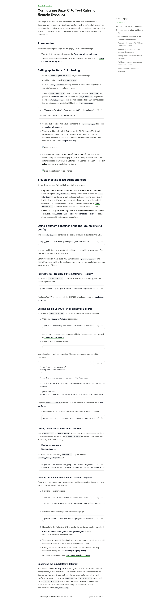 |

- Images are missing in the 'Setting up the Bazel CI for testing' section (replaced by placeholder text like 'Example results' and 'Branch protection rules settings').
- In the 'Building the rbe-ubuntu16-04 container from source' section, the command 'gcloud docker -- pull ...' is rendered as unformatted text outside of a code block.
- Raw HTML and Markdown syntax is visible in the 'Running the custom container' section, such as '### Running the custom container' and 'posix-terminal'.
- Literal HTML '<var>' tags are visible in several code blocks and within body text throughout the document, rather than being rendered correctly as placeholders.

## /versions/6.5.0/remote/dynamic

Old URL: https://bazel.build/versions/6.5.0/remote/dynamic
New URL: https://preview.bazel.build/versions/6.5.0/remote/dynamic

| Old | New |
| --- | --- |
| 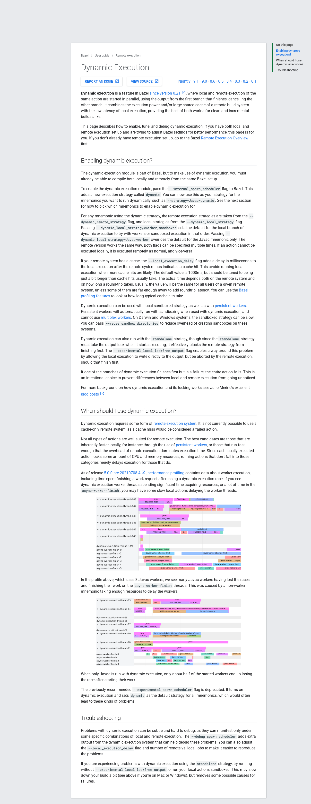 | 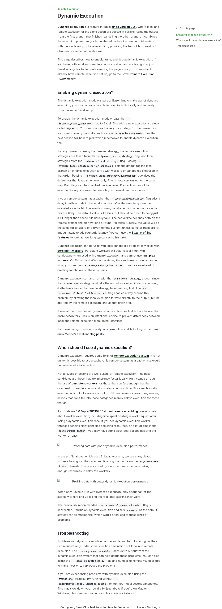 |

- The execution profile images in the 'When should I use dynamic execution?' section are missing and appear as broken image icons with alt text.
- Multiple command-line flags (such as --internal_spawn_scheduler and --dynamic_remote_strategy) are incorrectly wrapped, causing the leading double-dashes to be separated from the flag name across two lines.

## /versions/6.5.0/remote/multiplex

Old URL: https://bazel.build/versions/6.5.0/remote/multiplex
New URL: https://preview.bazel.build/versions/6.5.0/remote/multiplex

| Old | New |
| --- | --- |
| 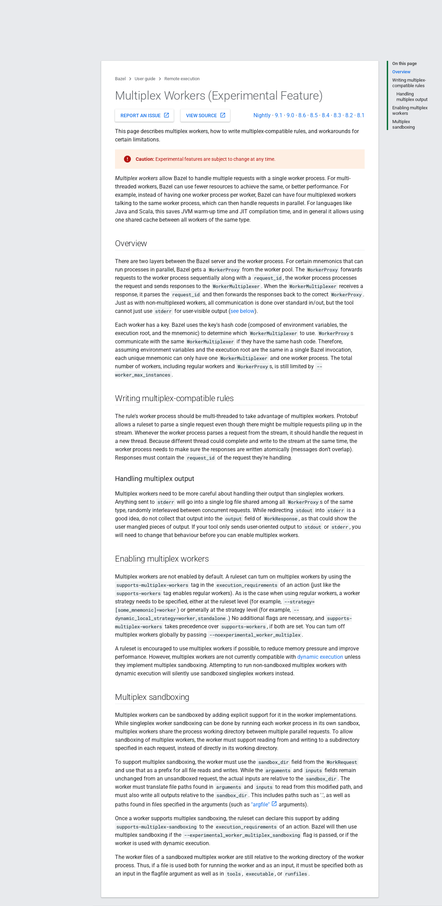 |  |

- The caution callout is unstyled in the new site.

## /versions/6.5.0/remote/output-directories

Old URL: https://bazel.build/versions/6.5.0/remote/output-directories
New URL: https://preview.bazel.build/versions/6.5.0/remote/output-directories

| Old | New |
| --- | --- |
| 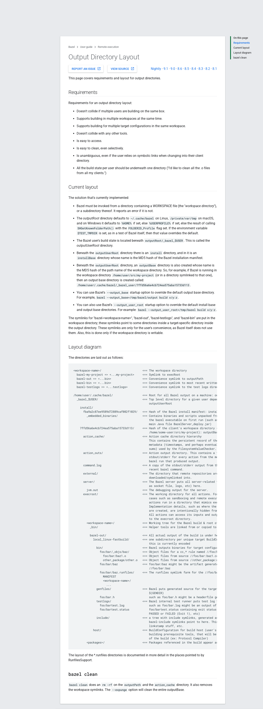 | 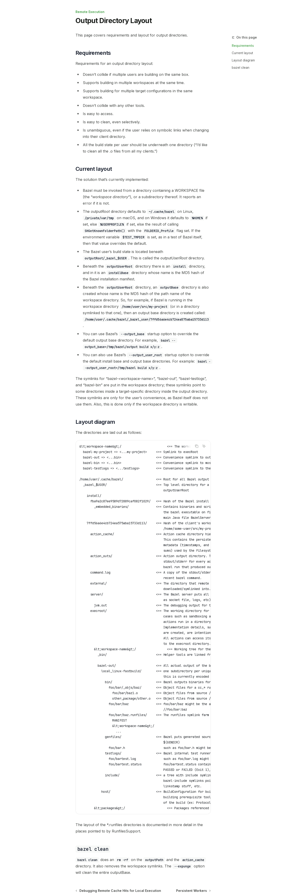 |

- In the 'Layout diagram' section, the directory tree contains escaped HTML entities (&lt; and &gt;) instead of angle brackets for placeholders such as <workspace-name> and <packages>.

## /versions/6.5.0/remote/persistent

Old URL: https://bazel.build/versions/6.5.0/remote/persistent
New URL: https://preview.bazel.build/versions/6.5.0/remote/persistent

| Old | New |
| --- | --- |
| 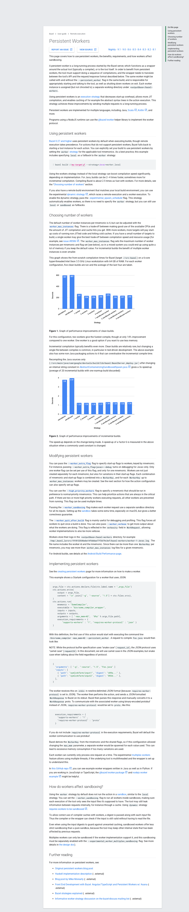 | 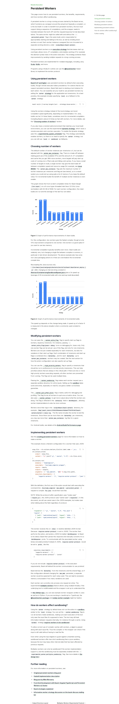 |

- The first code block under the "Using persistent workers" section contains unrendered HTML tags: 'bazel build //<var>my:target</var> --strategy=Javac=worker,local'.

## /versions/6.5.0/remote/rbe

Old URL: https://bazel.build/versions/6.5.0/remote/rbe
New URL: https://preview.bazel.build/versions/6.5.0/remote/rbe

OK

## /versions/6.5.0/remote/rules

Old URL: https://bazel.build/versions/6.5.0/remote/rules
New URL: https://preview.bazel.build/versions/6.5.0/remote/rules

| Old | New |
| --- | --- |
| 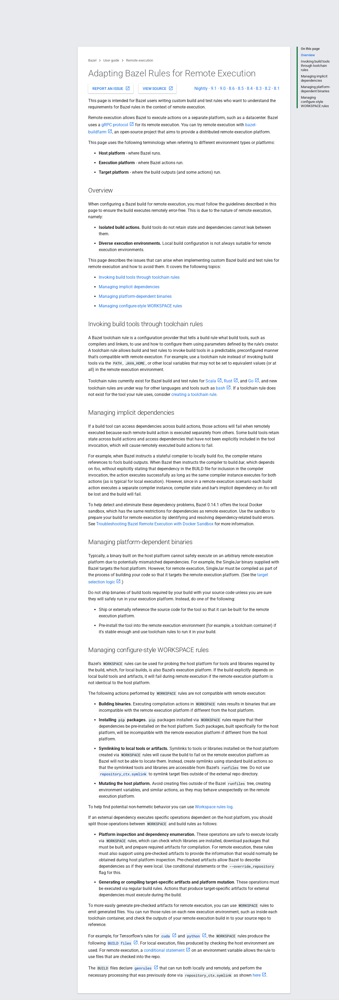 | 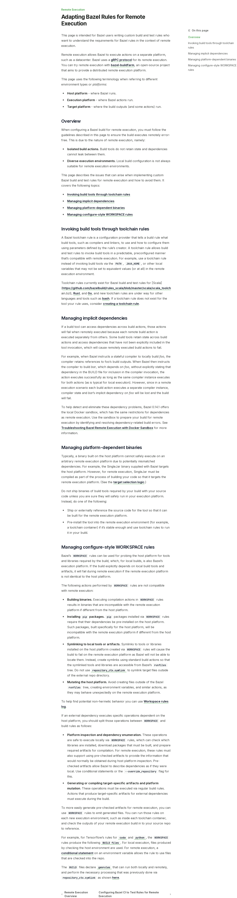 |

- The link for 'Scala' in the 'Invoking build tools through toolchain rules' section is not rendered correctly and appears as raw Markdown text.
- Multiple links that were present in the old version (Rust, Go, bash, cuda, python, and BUILD FILES) are missing in the new version, appearing as plain text instead.

## /versions/6.5.0/remote/sandbox

Old URL: https://bazel.build/versions/6.5.0/remote/sandbox
New URL: https://preview.bazel.build/versions/6.5.0/remote/sandbox

| Old | New |
| --- | --- |
| 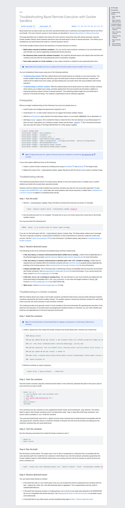 | 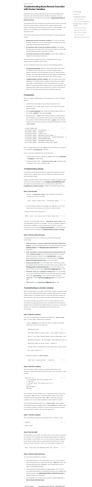 |

- The admonitions (Note callouts) have lost their blue background and star icon styling, appearing as regular text.
- Placeholders within code blocks, such as 'target' and 'your source code directory', have lost their distinctive pink background highlighting.
- Syntax highlighting for comments and keywords is missing in several code blocks, such as the .bazelrc configuration block.

## /versions/6.5.0/rules/bzl-style

Old URL: https://bazel.build/versions/6.5.0/rules/bzl-style
New URL: https://preview.bazel.build/versions/6.5.0/rules/bzl-style

| Old | New |
| --- | --- |
| 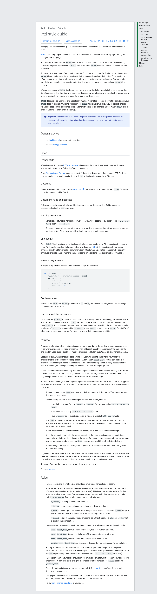 | 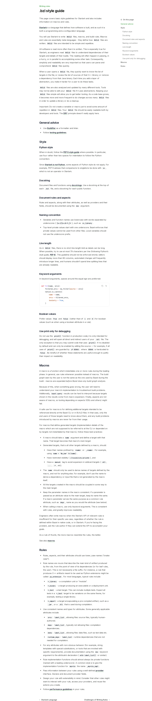 |

- The 'Important' admonition is unstyled; it has lost its background color, border, and icon, making it indistinguishable from regular paragraph text.

## /versions/6.5.0/rules/deploying

Old URL: https://bazel.build/versions/6.5.0/rules/deploying
New URL: https://preview.bazel.build/versions/6.5.0/rules/deploying

| Old | New |
| --- | --- |
| 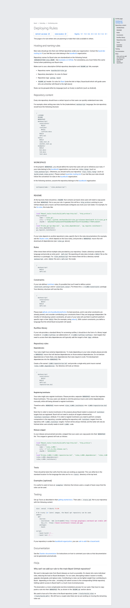 | 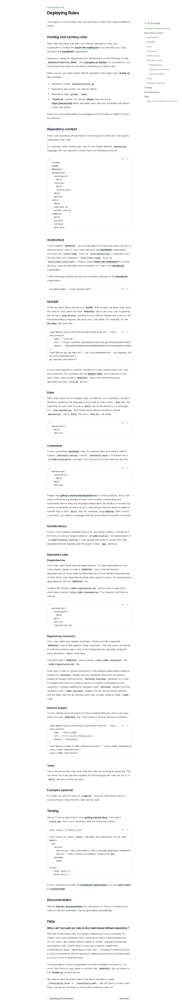 |

- The 'On this page' sidebar has incorrect nesting: headings from 'WORKSPACE' through 'FAQs' are incorrectly nested as sub-items of 'Repository content', and the 'Why can't we add our rule to the main Bazel GitHub repository?' sub-heading is incorrectly displayed as a top-level item.

## /versions/6.5.0/rules/language

Old URL: https://bazel.build/versions/6.5.0/rules/language
New URL: https://preview.bazel.build/versions/6.5.0/rules/language

OK

## /versions/6.5.0/rules/lib/JavaInfo

Old URL: https://bazel.build/versions/6.5.0/rules/lib/JavaInfo
New URL: https://preview.bazel.build/versions/6.5.0/rules/lib/JavaInfo

ERROR

## /versions/6.5.0/rules/lib/ProtoInfo

Old URL: https://bazel.build/versions/6.5.0/rules/lib/ProtoInfo
New URL: https://preview.bazel.build/versions/6.5.0/rules/lib/ProtoInfo

ERROR

## /versions/6.5.0/rules/lib/actions

Old URL: https://bazel.build/versions/6.5.0/rules/lib/actions
New URL: https://preview.bazel.build/versions/6.5.0/rules/lib/actions

ERROR

## /versions/6.5.0/rules/lib/attr

Old URL: https://bazel.build/versions/6.5.0/rules/lib/attr
New URL: https://preview.bazel.build/versions/6.5.0/rules/lib/attr

ERROR

## /versions/6.5.0/rules/lib/ctx

Old URL: https://bazel.build/versions/6.5.0/rules/lib/ctx
New URL: https://preview.bazel.build/versions/6.5.0/rules/lib/ctx

ERROR

## /versions/6.5.0/rules/lib/globals

Old URL: https://bazel.build/versions/6.5.0/rules/lib/globals
New URL: https://preview.bazel.build/versions/6.5.0/rules/lib/globals

ERROR

## /versions/6.5.0/rules/lib/repository_ctx

Old URL: https://bazel.build/versions/6.5.0/rules/lib/repository_ctx
New URL: https://preview.bazel.build/versions/6.5.0/rules/lib/repository_ctx

ERROR

## /versions/6.5.0/rules/lib/starlark-overview

Old URL: https://bazel.build/versions/6.5.0/rules/lib/starlark-overview
New URL: https://preview.bazel.build/versions/6.5.0/rules/lib/starlark-overview

ERROR

## /versions/6.5.0/rules/macro-tutorial

Old URL: https://bazel.build/versions/6.5.0/rules/macro-tutorial
New URL: https://preview.bazel.build/versions/6.5.0/rules/macro-tutorial

| Old | New |
| --- | --- |
| 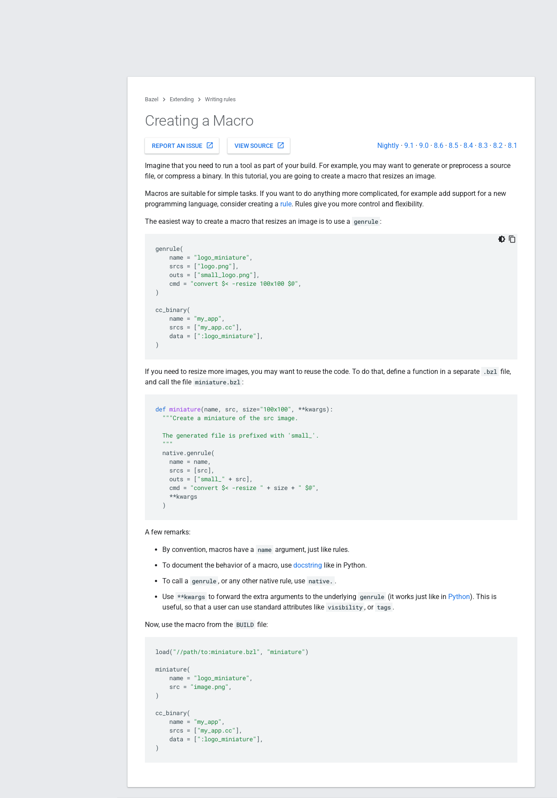 | 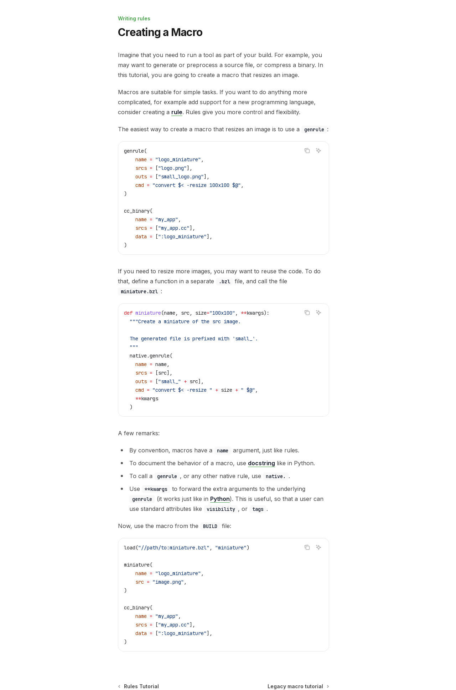 |

- In the 'A few remarks' section, inline code styling (monospace font and background highlight) is inconsistently applied; it is missing for terms like 'name', 'genrule', and 'native.' but present for others like 'visibility' and 'tags'.
- The syntax highlighting in the 'miniature.bzl' code block is inconsistent, as the second line of the docstring ('The generated file...') is rendered in black while the surrounding lines are blue.

## /versions/6.5.0/rules/performance

Old URL: https://bazel.build/versions/6.5.0/rules/performance
New URL: https://preview.bazel.build/versions/6.5.0/rules/performance

| Old | New |
| --- | --- |
| 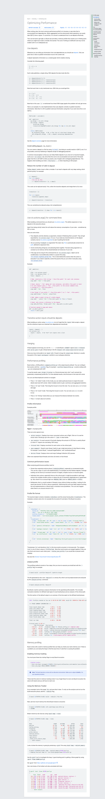 |  |

- The callout in the 'Enabling memory tracking' section is unstyled, appearing as plain text between two horizontal rules rather than the original blue-boxed admonition with a star icon.

## /versions/6.5.0/rules/rules-tutorial

Old URL: https://bazel.build/versions/6.5.0/rules/rules-tutorial
New URL: https://preview.bazel.build/versions/6.5.0/rules/rules-tutorial

OK

## /versions/6.5.0/rules/testing

Old URL: https://bazel.build/versions/6.5.0/rules/testing
New URL: https://preview.bazel.build/versions/6.5.0/rules/testing

OK

## /versions/6.5.0/rules/windows

Old URL: https://bazel.build/versions/6.5.0/rules/windows
New URL: https://preview.bazel.build/versions/6.5.0/rules/windows

OK

## /versions/6.5.0/run/bazelrc

Old URL: https://bazel.build/versions/6.5.0/run/bazelrc
New URL: https://preview.bazel.build/versions/6.5.0/run/bazelrc

| Old | New |
| --- | --- |
| 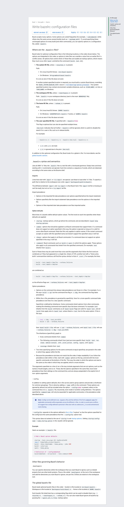 | 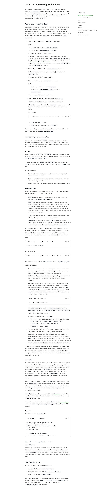 |

- Unstyled callout: The 'Note' section towards the bottom of the page is missing its visual styling (blue box and star icon) from the original site and is now rendered as plain text.

## /versions/6.5.0/run/build

Old URL: https://bazel.build/versions/6.5.0/run/build
New URL: https://preview.bazel.build/versions/6.5.0/run/build

| Old | New |
| --- | --- |
|  |  |

- Unstyled callouts i.e. admonitions

## /versions/6.5.0/run/client-server

Old URL: https://bazel.build/versions/6.5.0/run/client-server
New URL: https://preview.bazel.build/versions/6.5.0/run/client-server

| Old | New |
| --- | --- |
| 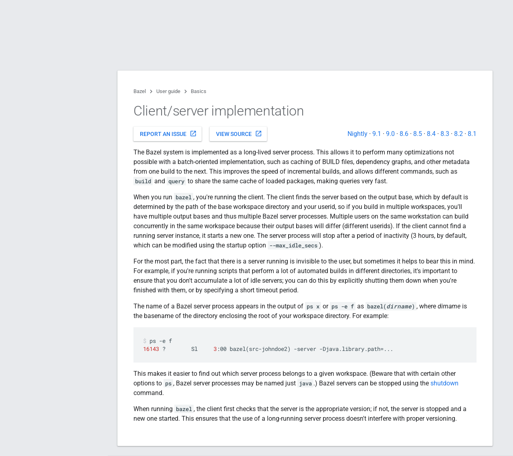 | 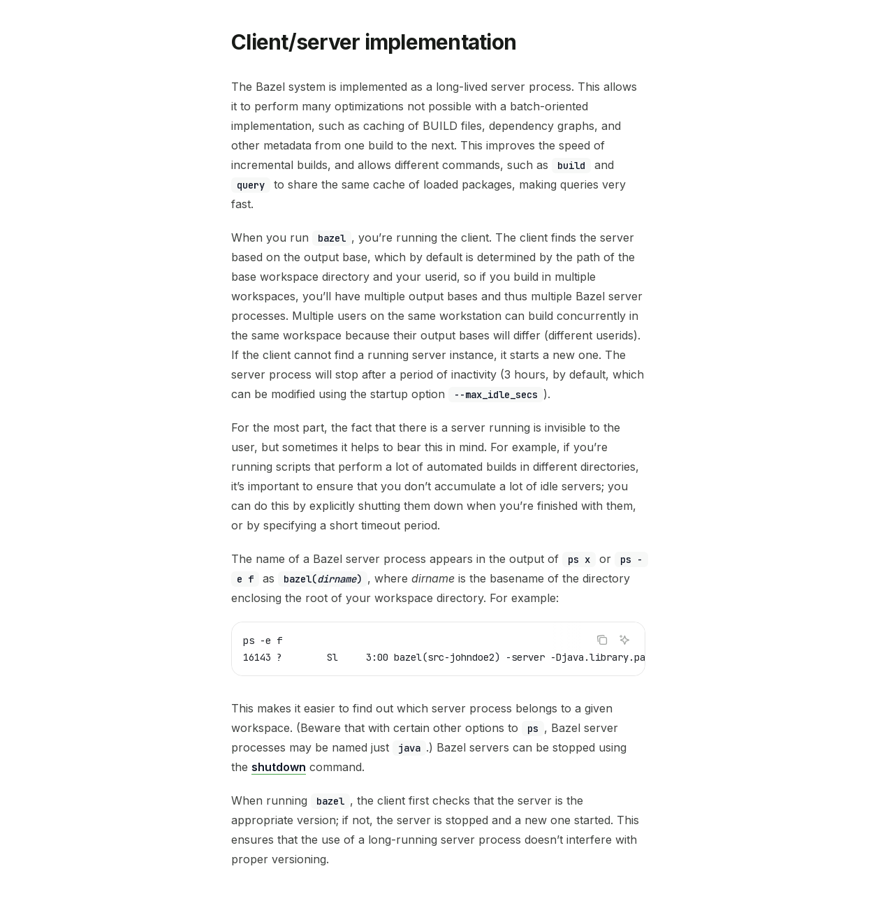 |

- The command prompt ($) is missing from the code block.
- The code block is missing syntax highlighting (red text for PID and time).
- There is incorrect extra spacing within inline code snippets, such as 'ps - e f' instead of 'ps -e f' and 'bazel ( dirname )' instead of 'bazel(dirname)'.
- There are extra spaces before punctuation marks, such as in ') .' and ') ,'.
- The placeholder word 'dirname' is missing its italicization.

## /versions/6.5.0/run/scripts

Old URL: https://bazel.build/versions/6.5.0/run/scripts
New URL: https://preview.bazel.build/versions/6.5.0/run/scripts

OK

## /versions/6.5.0/start

Old URL: https://bazel.build/versions/6.5.0/start
New URL: https://preview.bazel.build/versions/6.5.0/start

| Old | New |
| --- | --- |
| 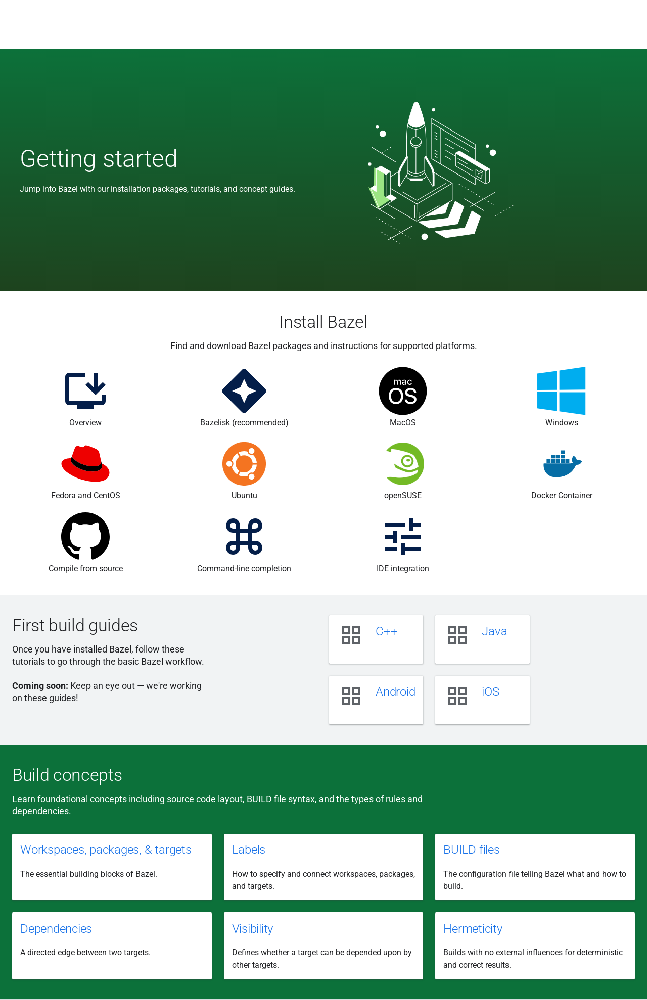 |  |

- Markdown links are not being correctly parsed throughout the page, leaving raw markdown syntax (brackets and parentheses) visible to the user.
- Markdown image syntax is not being rendered in the 'Summary: stage 1' section, leaving the raw source text visible instead of an image.

## /versions/6.5.0/start/android-app

Old URL: https://bazel.build/versions/6.5.0/start/android-app
New URL: https://preview.bazel.build/versions/6.5.0/start/android-app

OK

## /versions/6.5.0/start/cpp

Old URL: https://bazel.build/versions/6.5.0/start/cpp
New URL: https://preview.bazel.build/versions/6.5.0/start/cpp

| Old | New |
| --- | --- |
| 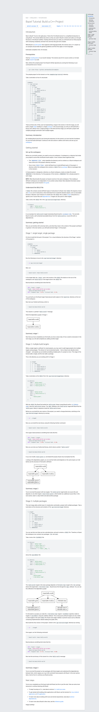 |  |

- Under the 'Stage 1: single target, single package' heading, the dependency graph image is not rendered, and raw Markdown syntax is displayed instead.
- Multiple links within the text in 'Stage 1', 'Stage 2', and 'Stage 3' sections are not rendered correctly, appearing as raw Markdown (e.g., '[target](...)', '[package](...)', '[cc_library rule](...)', '[deps](...)', and '[visibility](...)').

## /versions/6.5.0/start/ios-app

Old URL: https://bazel.build/versions/6.5.0/start/ios-app
New URL: https://preview.bazel.build/versions/6.5.0/start/ios-app

| Old | New |
| --- | --- |
| 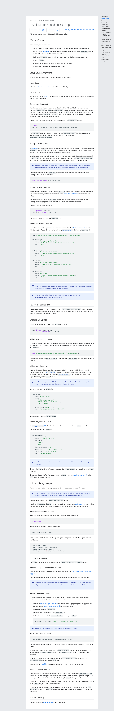 | 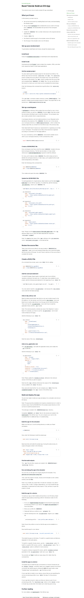 |

- Unstyled callouts

## /versions/6.5.0/start/java

Old URL: https://bazel.build/versions/6.5.0/start/java
New URL: https://preview.bazel.build/versions/6.5.0/start/java

OK

## /versions/6.5.0/tutorials/ccp-toolchain-config

Old URL: https://bazel.build/versions/6.5.0/tutorials/ccp-toolchain-config
New URL: https://preview.bazel.build/versions/6.5.0/tutorials/ccp-toolchain-config

OK

## /versions/6.5.0/tutorials/cpp-dependency

Old URL: https://bazel.build/versions/6.5.0/tutorials/cpp-dependency
New URL: https://preview.bazel.build/versions/6.5.0/tutorials/cpp-dependency

OK

## /versions/6.5.0/tutorials/cpp-labels

Old URL: https://bazel.build/versions/6.5.0/tutorials/cpp-labels
New URL: https://preview.bazel.build/versions/6.5.0/tutorials/cpp-labels

| Old | New |
| --- | --- |
| 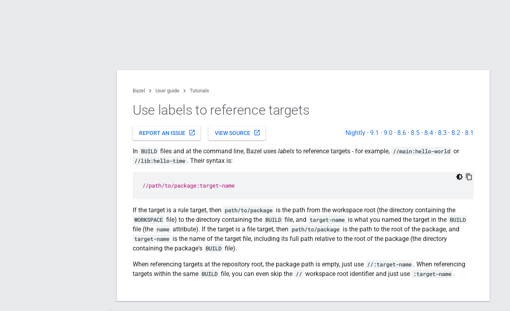 | 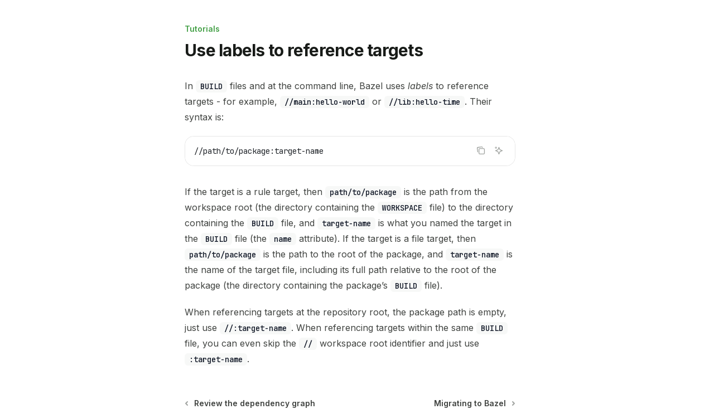 |

- Extra whitespace is present before punctuation marks following inline code blocks in several instances (e.g., at the end of the first and third paragraphs).

## /versions/6.5.0/tutorials/cpp-use-cases

Old URL: https://bazel.build/versions/6.5.0/tutorials/cpp-use-cases
New URL: https://preview.bazel.build/versions/6.5.0/tutorials/cpp-use-cases

| Old | New |
| --- | --- |
| 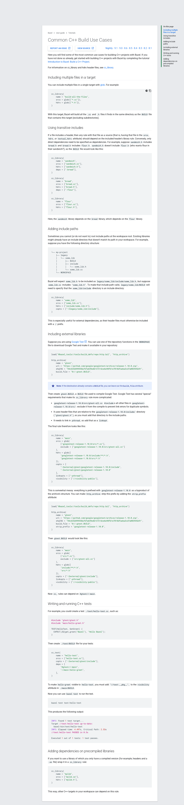 | 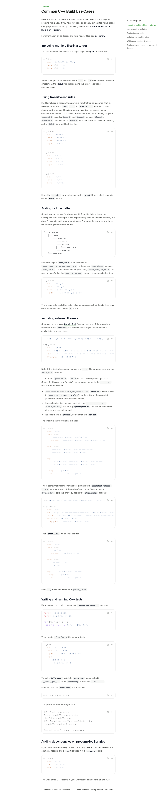 |

- The 'Note' callout in the 'Including external libraries' section has lost its distinct styling (the blue box and star icon) from the original site and now appears as plain text, which makes it an unstyled admonition.

## /versions/6.6.0

Old URL: https://bazel.build/versions/6.6.0
New URL: https://preview.bazel.build/versions/6.6.0

ERROR

## /versions/7.0.0/about

Old URL: https://bazel.build/versions/7.0.0/about
New URL: https://preview.bazel.build/versions/7.0.0/about

ERROR

## /versions/7.0.0/about/faq

Old URL: https://bazel.build/versions/7.0.0/about/faq
New URL: https://preview.bazel.build/versions/7.0.0/about/faq

ERROR

## /versions/7.0.0/about/intro

Old URL: https://bazel.build/versions/7.0.0/about/intro
New URL: https://preview.bazel.build/versions/7.0.0/about/intro

ERROR

## /versions/7.0.0/about/vision

Old URL: https://bazel.build/versions/7.0.0/about/vision
New URL: https://preview.bazel.build/versions/7.0.0/about/vision

ERROR

## /versions/7.0.0/advanced/performance/json-trace-profile

Old URL: https://bazel.build/versions/7.0.0/advanced/performance/json-trace-profile
New URL: https://preview.bazel.build/versions/7.0.0/advanced/performance/json-trace-profile

ERROR

## /versions/7.0.0/advanced/performance/memory

Old URL: https://bazel.build/versions/7.0.0/advanced/performance/memory
New URL: https://preview.bazel.build/versions/7.0.0/advanced/performance/memory

ERROR

## /versions/7.0.0/basics

Old URL: https://bazel.build/versions/7.0.0/basics
New URL: https://preview.bazel.build/versions/7.0.0/basics

ERROR

## /versions/7.0.0/build/style-guide

Old URL: https://bazel.build/versions/7.0.0/build/style-guide
New URL: https://preview.bazel.build/versions/7.0.0/build/style-guide

ERROR

## /versions/7.0.0/community

Old URL: https://bazel.build/versions/7.0.0/community
New URL: https://preview.bazel.build/versions/7.0.0/community

ERROR

## /versions/7.0.0/community/experts

Old URL: https://bazel.build/versions/7.0.0/community/experts
New URL: https://preview.bazel.build/versions/7.0.0/community/experts

ERROR

## /versions/7.0.0/community/update

Old URL: https://bazel.build/versions/7.0.0/community/update
New URL: https://preview.bazel.build/versions/7.0.0/community/update

ERROR

## /versions/7.0.0/community/users

Old URL: https://bazel.build/versions/7.0.0/community/users
New URL: https://preview.bazel.build/versions/7.0.0/community/users

ERROR

## /versions/7.0.0/concepts/build-files

Old URL: https://bazel.build/versions/7.0.0/concepts/build-files
New URL: https://preview.bazel.build/versions/7.0.0/concepts/build-files

ERROR

## /versions/7.0.0/concepts/build-ref

Old URL: https://bazel.build/versions/7.0.0/concepts/build-ref
New URL: https://preview.bazel.build/versions/7.0.0/concepts/build-ref

ERROR

## /versions/7.0.0/concepts/dependencies

Old URL: https://bazel.build/versions/7.0.0/concepts/dependencies
New URL: https://preview.bazel.build/versions/7.0.0/concepts/dependencies

ERROR

## /versions/7.0.0/concepts/labels

Old URL: https://bazel.build/versions/7.0.0/concepts/labels
New URL: https://preview.bazel.build/versions/7.0.0/concepts/labels

ERROR

## /versions/7.0.0/configure/attributes

Old URL: https://bazel.build/versions/7.0.0/configure/attributes
New URL: https://preview.bazel.build/versions/7.0.0/configure/attributes

ERROR

## /versions/7.0.0/contribute

Old URL: https://bazel.build/versions/7.0.0/contribute
New URL: https://preview.bazel.build/versions/7.0.0/contribute

ERROR

## /versions/7.0.0/contribute/patch-acceptance

Old URL: https://bazel.build/versions/7.0.0/contribute/patch-acceptance
New URL: https://preview.bazel.build/versions/7.0.0/contribute/patch-acceptance

ERROR

## /versions/7.0.0/docs

Old URL: https://bazel.build/versions/7.0.0/docs
New URL: https://preview.bazel.build/versions/7.0.0/docs

ERROR

## /versions/7.0.0/docs/user-manual

Old URL: https://bazel.build/versions/7.0.0/docs/user-manual
New URL: https://preview.bazel.build/versions/7.0.0/docs/user-manual

ERROR

## /versions/7.0.0/extending

Old URL: https://bazel.build/versions/7.0.0/extending
New URL: https://preview.bazel.build/versions/7.0.0/extending

ERROR

## /versions/7.0.0/extending/aspects

Old URL: https://bazel.build/versions/7.0.0/extending/aspects
New URL: https://preview.bazel.build/versions/7.0.0/extending/aspects

ERROR

## /versions/7.0.0/extending/concepts

Old URL: https://bazel.build/versions/7.0.0/extending/concepts
New URL: https://preview.bazel.build/versions/7.0.0/extending/concepts

ERROR

## /versions/7.0.0/extending/config

Old URL: https://bazel.build/versions/7.0.0/extending/config
New URL: https://preview.bazel.build/versions/7.0.0/extending/config

ERROR

## /versions/7.0.0/extending/macros

Old URL: https://bazel.build/versions/7.0.0/extending/macros
New URL: https://preview.bazel.build/versions/7.0.0/extending/macros

ERROR

## /versions/7.0.0/extending/platforms

Old URL: https://bazel.build/versions/7.0.0/extending/platforms
New URL: https://preview.bazel.build/versions/7.0.0/extending/platforms

ERROR

## /versions/7.0.0/extending/rules

Old URL: https://bazel.build/versions/7.0.0/extending/rules
New URL: https://preview.bazel.build/versions/7.0.0/extending/rules

ERROR

## /versions/7.0.0/install

Old URL: https://bazel.build/versions/7.0.0/install
New URL: https://preview.bazel.build/versions/7.0.0/install

ERROR

## /versions/7.0.0/install/bazelisk

Old URL: https://bazel.build/versions/7.0.0/install/bazelisk
New URL: https://preview.bazel.build/versions/7.0.0/install/bazelisk

ERROR

## /versions/7.0.0/install/docker-container

Old URL: https://bazel.build/versions/7.0.0/install/docker-container
New URL: https://preview.bazel.build/versions/7.0.0/install/docker-container

ERROR

## /versions/7.0.0/install/ide

Old URL: https://bazel.build/versions/7.0.0/install/ide
New URL: https://preview.bazel.build/versions/7.0.0/install/ide

ERROR

## /versions/7.0.0/install/os-x

Old URL: https://bazel.build/versions/7.0.0/install/os-x
New URL: https://preview.bazel.build/versions/7.0.0/install/os-x

ERROR

## /versions/7.0.0/install/ubuntu

Old URL: https://bazel.build/versions/7.0.0/install/ubuntu
New URL: https://preview.bazel.build/versions/7.0.0/install/ubuntu

ERROR

## /versions/7.0.0/migrate

Old URL: https://bazel.build/versions/7.0.0/migrate
New URL: https://preview.bazel.build/versions/7.0.0/migrate

ERROR

## /versions/7.0.0/migrate/xcode

Old URL: https://bazel.build/versions/7.0.0/migrate/xcode
New URL: https://preview.bazel.build/versions/7.0.0/migrate/xcode

ERROR

## /versions/7.0.0/query/aquery

Old URL: https://bazel.build/versions/7.0.0/query/aquery
New URL: https://preview.bazel.build/versions/7.0.0/query/aquery

ERROR

## /versions/7.0.0/query/cquery

Old URL: https://bazel.build/versions/7.0.0/query/cquery
New URL: https://preview.bazel.build/versions/7.0.0/query/cquery

ERROR

## /versions/7.0.0/query/guide

Old URL: https://bazel.build/versions/7.0.0/query/guide
New URL: https://preview.bazel.build/versions/7.0.0/query/guide

ERROR

## /versions/7.0.0/query/language

Old URL: https://bazel.build/versions/7.0.0/query/language
New URL: https://preview.bazel.build/versions/7.0.0/query/language

ERROR

## /versions/7.0.0/reference

Old URL: https://bazel.build/versions/7.0.0/reference
New URL: https://preview.bazel.build/versions/7.0.0/reference

ERROR

## /versions/7.0.0/reference/be/c-cpp

Old URL: https://bazel.build/versions/7.0.0/reference/be/c-cpp
New URL: https://preview.bazel.build/versions/7.0.0/reference/be/c-cpp

ERROR

## /versions/7.0.0/reference/be/common-definitions

Old URL: https://bazel.build/versions/7.0.0/reference/be/common-definitions
New URL: https://preview.bazel.build/versions/7.0.0/reference/be/common-definitions

ERROR

## /versions/7.0.0/reference/be/general

Old URL: https://bazel.build/versions/7.0.0/reference/be/general
New URL: https://preview.bazel.build/versions/7.0.0/reference/be/general

ERROR

## /versions/7.0.0/reference/be/overview

Old URL: https://bazel.build/versions/7.0.0/reference/be/overview
New URL: https://preview.bazel.build/versions/7.0.0/reference/be/overview

ERROR

## /versions/7.0.0/reference/command-line-reference

Old URL: https://bazel.build/versions/7.0.0/reference/command-line-reference
New URL: https://preview.bazel.build/versions/7.0.0/reference/command-line-reference

ERROR

## /versions/7.0.0/reference/glossary

Old URL: https://bazel.build/versions/7.0.0/reference/glossary
New URL: https://preview.bazel.build/versions/7.0.0/reference/glossary

ERROR

## /versions/7.0.0/reference/test-encyclopedia

Old URL: https://bazel.build/versions/7.0.0/reference/test-encyclopedia
New URL: https://preview.bazel.build/versions/7.0.0/reference/test-encyclopedia

ERROR

## /versions/7.0.0/release

Old URL: https://bazel.build/versions/7.0.0/release
New URL: https://preview.bazel.build/versions/7.0.0/release

ERROR

## /versions/7.0.0/remote/dynamic

Old URL: https://bazel.build/versions/7.0.0/remote/dynamic
New URL: https://preview.bazel.build/versions/7.0.0/remote/dynamic

ERROR

## /versions/7.0.0/remote/rbe

Old URL: https://bazel.build/versions/7.0.0/remote/rbe
New URL: https://preview.bazel.build/versions/7.0.0/remote/rbe

ERROR

## /versions/7.0.0/remote/rules

Old URL: https://bazel.build/versions/7.0.0/remote/rules
New URL: https://preview.bazel.build/versions/7.0.0/remote/rules

ERROR

## /versions/7.0.0/rules/lib/builtins/File

Old URL: https://bazel.build/versions/7.0.0/rules/lib/builtins/File
New URL: https://preview.bazel.build/versions/7.0.0/rules/lib/builtins/File

ERROR

## /versions/7.0.0/rules/lib/builtins/ctx

Old URL: https://bazel.build/versions/7.0.0/rules/lib/builtins/ctx
New URL: https://preview.bazel.build/versions/7.0.0/rules/lib/builtins/ctx

ERROR

## /versions/7.0.0/rules/lib/core/dict

Old URL: https://bazel.build/versions/7.0.0/rules/lib/core/dict
New URL: https://preview.bazel.build/versions/7.0.0/rules/lib/core/dict

ERROR

## /versions/7.0.0/rules/lib/core/string

Old URL: https://bazel.build/versions/7.0.0/rules/lib/core/string
New URL: https://preview.bazel.build/versions/7.0.0/rules/lib/core/string

ERROR

## /versions/7.0.0/rules/lib/globals/all

Old URL: https://bazel.build/versions/7.0.0/rules/lib/globals/all
New URL: https://preview.bazel.build/versions/7.0.0/rules/lib/globals/all

ERROR

## /versions/7.0.0/rules/lib/globals/bzl

Old URL: https://bazel.build/versions/7.0.0/rules/lib/globals/bzl
New URL: https://preview.bazel.build/versions/7.0.0/rules/lib/globals/bzl

ERROR

## /versions/7.0.0/rules/lib/overview

Old URL: https://bazel.build/versions/7.0.0/rules/lib/overview
New URL: https://preview.bazel.build/versions/7.0.0/rules/lib/overview

ERROR

## /versions/7.0.0/rules/rules-tutorial

Old URL: https://bazel.build/versions/7.0.0/rules/rules-tutorial
New URL: https://preview.bazel.build/versions/7.0.0/rules/rules-tutorial

ERROR

## /versions/7.0.0/rules/testing

Old URL: https://bazel.build/versions/7.0.0/rules/testing
New URL: https://preview.bazel.build/versions/7.0.0/rules/testing

ERROR

## /versions/7.0.0/run/build

Old URL: https://bazel.build/versions/7.0.0/run/build
New URL: https://preview.bazel.build/versions/7.0.0/run/build

ERROR

## /versions/7.0.0/start

Old URL: https://bazel.build/versions/7.0.0/start
New URL: https://preview.bazel.build/versions/7.0.0/start

ERROR

## /versions/7.0.0/start/cpp

Old URL: https://bazel.build/versions/7.0.0/start/cpp
New URL: https://preview.bazel.build/versions/7.0.0/start/cpp

ERROR

## /versions/7.0.0/start/java

Old URL: https://bazel.build/versions/7.0.0/start/java
New URL: https://preview.bazel.build/versions/7.0.0/start/java

ERROR

## /versions/7.0.0/tutorials/cpp-use-cases

Old URL: https://bazel.build/versions/7.0.0/tutorials/cpp-use-cases
New URL: https://preview.bazel.build/versions/7.0.0/tutorials/cpp-use-cases

ERROR

## /versions/7.1.0/about

Old URL: https://bazel.build/versions/7.1.0/about
New URL: https://preview.bazel.build/versions/7.1.0/about

ERROR

## /versions/7.1.0/about/faq

Old URL: https://bazel.build/versions/7.1.0/about/faq
New URL: https://preview.bazel.build/versions/7.1.0/about/faq

ERROR

## /versions/7.1.0/about/intro

Old URL: https://bazel.build/versions/7.1.0/about/intro
New URL: https://preview.bazel.build/versions/7.1.0/about/intro

ERROR

## /versions/7.1.0/about/roadmap

Old URL: https://bazel.build/versions/7.1.0/about/roadmap
New URL: https://preview.bazel.build/versions/7.1.0/about/roadmap

ERROR

## /versions/7.1.0/about/vision

Old URL: https://bazel.build/versions/7.1.0/about/vision
New URL: https://preview.bazel.build/versions/7.1.0/about/vision

ERROR

## /versions/7.1.0/advanced/performance/iteration-speed

Old URL: https://bazel.build/versions/7.1.0/advanced/performance/iteration-speed
New URL: https://preview.bazel.build/versions/7.1.0/advanced/performance/iteration-speed

ERROR

## /versions/7.1.0/advanced/performance/json-trace-profile

Old URL: https://bazel.build/versions/7.1.0/advanced/performance/json-trace-profile
New URL: https://preview.bazel.build/versions/7.1.0/advanced/performance/json-trace-profile

ERROR

## /versions/7.1.0/advanced/performance/memory

Old URL: https://bazel.build/versions/7.1.0/advanced/performance/memory
New URL: https://preview.bazel.build/versions/7.1.0/advanced/performance/memory

ERROR

## /versions/7.1.0/basics

Old URL: https://bazel.build/versions/7.1.0/basics
New URL: https://preview.bazel.build/versions/7.1.0/basics

ERROR

## /versions/7.1.0/build/style-guide

Old URL: https://bazel.build/versions/7.1.0/build/style-guide
New URL: https://preview.bazel.build/versions/7.1.0/build/style-guide

ERROR

## /versions/7.1.0/community

Old URL: https://bazel.build/versions/7.1.0/community
New URL: https://preview.bazel.build/versions/7.1.0/community

ERROR

## /versions/7.1.0/community/experts

Old URL: https://bazel.build/versions/7.1.0/community/experts
New URL: https://preview.bazel.build/versions/7.1.0/community/experts

ERROR

## /versions/7.1.0/community/sig

Old URL: https://bazel.build/versions/7.1.0/community/sig
New URL: https://preview.bazel.build/versions/7.1.0/community/sig

ERROR

## /versions/7.1.0/community/update

Old URL: https://bazel.build/versions/7.1.0/community/update
New URL: https://preview.bazel.build/versions/7.1.0/community/update

ERROR

## /versions/7.1.0/community/users

Old URL: https://bazel.build/versions/7.1.0/community/users
New URL: https://preview.bazel.build/versions/7.1.0/community/users

ERROR

## /versions/7.1.0/concepts/build-ref

Old URL: https://bazel.build/versions/7.1.0/concepts/build-ref
New URL: https://preview.bazel.build/versions/7.1.0/concepts/build-ref

ERROR

## /versions/7.1.0/concepts/dependencies

Old URL: https://bazel.build/versions/7.1.0/concepts/dependencies
New URL: https://preview.bazel.build/versions/7.1.0/concepts/dependencies

ERROR

## /versions/7.1.0/concepts/labels

Old URL: https://bazel.build/versions/7.1.0/concepts/labels
New URL: https://preview.bazel.build/versions/7.1.0/concepts/labels

ERROR

## /versions/7.1.0/configure/attributes

Old URL: https://bazel.build/versions/7.1.0/configure/attributes
New URL: https://preview.bazel.build/versions/7.1.0/configure/attributes

ERROR

## /versions/7.1.0/contribute

Old URL: https://bazel.build/versions/7.1.0/contribute
New URL: https://preview.bazel.build/versions/7.1.0/contribute

ERROR

## /versions/7.1.0/contribute/codebase

Old URL: https://bazel.build/versions/7.1.0/contribute/codebase
New URL: https://preview.bazel.build/versions/7.1.0/contribute/codebase

ERROR

## /versions/7.1.0/contribute/docs

Old URL: https://bazel.build/versions/7.1.0/contribute/docs
New URL: https://preview.bazel.build/versions/7.1.0/contribute/docs

ERROR

## /versions/7.1.0/docs

Old URL: https://bazel.build/versions/7.1.0/docs
New URL: https://preview.bazel.build/versions/7.1.0/docs

ERROR

## /versions/7.1.0/docs/configurable-attributes

Old URL: https://bazel.build/versions/7.1.0/docs/configurable-attributes
New URL: https://preview.bazel.build/versions/7.1.0/docs/configurable-attributes

ERROR

## /versions/7.1.0/docs/user-manual

Old URL: https://bazel.build/versions/7.1.0/docs/user-manual
New URL: https://preview.bazel.build/versions/7.1.0/docs/user-manual

ERROR

## /versions/7.1.0/extending

Old URL: https://bazel.build/versions/7.1.0/extending
New URL: https://preview.bazel.build/versions/7.1.0/extending

ERROR

## /versions/7.1.0/extending/aspects

Old URL: https://bazel.build/versions/7.1.0/extending/aspects
New URL: https://preview.bazel.build/versions/7.1.0/extending/aspects

ERROR

## /versions/7.1.0/extending/concepts

Old URL: https://bazel.build/versions/7.1.0/extending/concepts
New URL: https://preview.bazel.build/versions/7.1.0/extending/concepts

ERROR

## /versions/7.1.0/extending/config

Old URL: https://bazel.build/versions/7.1.0/extending/config
New URL: https://preview.bazel.build/versions/7.1.0/extending/config

ERROR

## /versions/7.1.0/extending/macros

Old URL: https://bazel.build/versions/7.1.0/extending/macros
New URL: https://preview.bazel.build/versions/7.1.0/extending/macros

ERROR

## /versions/7.1.0/extending/rules

Old URL: https://bazel.build/versions/7.1.0/extending/rules
New URL: https://preview.bazel.build/versions/7.1.0/extending/rules

ERROR

## /versions/7.1.0/external/overview

Old URL: https://bazel.build/versions/7.1.0/external/overview
New URL: https://preview.bazel.build/versions/7.1.0/external/overview

ERROR

## /versions/7.1.0/help

Old URL: https://bazel.build/versions/7.1.0/help
New URL: https://preview.bazel.build/versions/7.1.0/help

ERROR

## /versions/7.1.0/install

Old URL: https://bazel.build/versions/7.1.0/install
New URL: https://preview.bazel.build/versions/7.1.0/install

ERROR

## /versions/7.1.0/install/bazelisk

Old URL: https://bazel.build/versions/7.1.0/install/bazelisk
New URL: https://preview.bazel.build/versions/7.1.0/install/bazelisk

ERROR

## /versions/7.1.0/install/compile-source

Old URL: https://bazel.build/versions/7.1.0/install/compile-source
New URL: https://preview.bazel.build/versions/7.1.0/install/compile-source

ERROR

## /versions/7.1.0/install/ide

Old URL: https://bazel.build/versions/7.1.0/install/ide
New URL: https://preview.bazel.build/versions/7.1.0/install/ide

ERROR

## /versions/7.1.0/install/os-x

Old URL: https://bazel.build/versions/7.1.0/install/os-x
New URL: https://preview.bazel.build/versions/7.1.0/install/os-x

ERROR

## /versions/7.1.0/install/suse

Old URL: https://bazel.build/versions/7.1.0/install/suse
New URL: https://preview.bazel.build/versions/7.1.0/install/suse

ERROR

## /versions/7.1.0/install/ubuntu

Old URL: https://bazel.build/versions/7.1.0/install/ubuntu
New URL: https://preview.bazel.build/versions/7.1.0/install/ubuntu

ERROR

## /versions/7.1.0/install/windows

Old URL: https://bazel.build/versions/7.1.0/install/windows
New URL: https://preview.bazel.build/versions/7.1.0/install/windows

ERROR

## /versions/7.1.0/migrate

Old URL: https://bazel.build/versions/7.1.0/migrate
New URL: https://preview.bazel.build/versions/7.1.0/migrate

ERROR

## /versions/7.1.0/migrate/maven

Old URL: https://bazel.build/versions/7.1.0/migrate/maven
New URL: https://preview.bazel.build/versions/7.1.0/migrate/maven

ERROR

## /versions/7.1.0/migrate/xcode

Old URL: https://bazel.build/versions/7.1.0/migrate/xcode
New URL: https://preview.bazel.build/versions/7.1.0/migrate/xcode

ERROR

## /versions/7.1.0/query/aquery

Old URL: https://bazel.build/versions/7.1.0/query/aquery
New URL: https://preview.bazel.build/versions/7.1.0/query/aquery

ERROR

## /versions/7.1.0/query/cquery

Old URL: https://bazel.build/versions/7.1.0/query/cquery
New URL: https://preview.bazel.build/versions/7.1.0/query/cquery

ERROR

## /versions/7.1.0/query/guide

Old URL: https://bazel.build/versions/7.1.0/query/guide
New URL: https://preview.bazel.build/versions/7.1.0/query/guide

ERROR

## /versions/7.1.0/query/language

Old URL: https://bazel.build/versions/7.1.0/query/language
New URL: https://preview.bazel.build/versions/7.1.0/query/language

ERROR

## /versions/7.1.0/query/quickstart

Old URL: https://bazel.build/versions/7.1.0/query/quickstart
New URL: https://preview.bazel.build/versions/7.1.0/query/quickstart

ERROR

## /versions/7.1.0/reference

Old URL: https://bazel.build/versions/7.1.0/reference
New URL: https://preview.bazel.build/versions/7.1.0/reference

ERROR

## /versions/7.1.0/reference/be/common-definitions

Old URL: https://bazel.build/versions/7.1.0/reference/be/common-definitions
New URL: https://preview.bazel.build/versions/7.1.0/reference/be/common-definitions

ERROR

## /versions/7.1.0/reference/be/overview

Old URL: https://bazel.build/versions/7.1.0/reference/be/overview
New URL: https://preview.bazel.build/versions/7.1.0/reference/be/overview

ERROR

## /versions/7.1.0/reference/glossary

Old URL: https://bazel.build/versions/7.1.0/reference/glossary
New URL: https://preview.bazel.build/versions/7.1.0/reference/glossary

ERROR

## /versions/7.1.0/reference/test-encyclopedia

Old URL: https://bazel.build/versions/7.1.0/reference/test-encyclopedia
New URL: https://preview.bazel.build/versions/7.1.0/reference/test-encyclopedia

ERROR

## /versions/7.1.0/release

Old URL: https://bazel.build/versions/7.1.0/release
New URL: https://preview.bazel.build/versions/7.1.0/release

ERROR

## /versions/7.1.0/remote/bep

Old URL: https://bazel.build/versions/7.1.0/remote/bep
New URL: https://preview.bazel.build/versions/7.1.0/remote/bep

ERROR

## /versions/7.1.0/remote/caching

Old URL: https://bazel.build/versions/7.1.0/remote/caching
New URL: https://preview.bazel.build/versions/7.1.0/remote/caching

ERROR

## /versions/7.1.0/remote/ci

Old URL: https://bazel.build/versions/7.1.0/remote/ci
New URL: https://preview.bazel.build/versions/7.1.0/remote/ci

ERROR

## /versions/7.1.0/remote/dynamic

Old URL: https://bazel.build/versions/7.1.0/remote/dynamic
New URL: https://preview.bazel.build/versions/7.1.0/remote/dynamic

ERROR

## /versions/7.1.0/remote/output-directories

Old URL: https://bazel.build/versions/7.1.0/remote/output-directories
New URL: https://preview.bazel.build/versions/7.1.0/remote/output-directories

ERROR

## /versions/7.1.0/remote/rbe

Old URL: https://bazel.build/versions/7.1.0/remote/rbe
New URL: https://preview.bazel.build/versions/7.1.0/remote/rbe

ERROR

## /versions/7.1.0/remote/rules

Old URL: https://bazel.build/versions/7.1.0/remote/rules
New URL: https://preview.bazel.build/versions/7.1.0/remote/rules

ERROR

## /versions/7.1.0/rules/deploying

Old URL: https://bazel.build/versions/7.1.0/rules/deploying
New URL: https://preview.bazel.build/versions/7.1.0/rules/deploying

ERROR

## /versions/7.1.0/rules/language

Old URL: https://bazel.build/versions/7.1.0/rules/language
New URL: https://preview.bazel.build/versions/7.1.0/rules/language

ERROR

## /versions/7.1.0/rules/lib/builtins/runfiles

Old URL: https://bazel.build/versions/7.1.0/rules/lib/builtins/runfiles
New URL: https://preview.bazel.build/versions/7.1.0/rules/lib/builtins/runfiles

ERROR

## /versions/7.1.0/rules/lib/core/string

Old URL: https://bazel.build/versions/7.1.0/rules/lib/core/string
New URL: https://preview.bazel.build/versions/7.1.0/rules/lib/core/string

ERROR

## /versions/7.1.0/rules/lib/globals/all

Old URL: https://bazel.build/versions/7.1.0/rules/lib/globals/all
New URL: https://preview.bazel.build/versions/7.1.0/rules/lib/globals/all

ERROR

## /versions/7.1.0/rules/lib/overview

Old URL: https://bazel.build/versions/7.1.0/rules/lib/overview
New URL: https://preview.bazel.build/versions/7.1.0/rules/lib/overview

ERROR

## /versions/7.1.0/rules/lib/providers/DefaultInfo

Old URL: https://bazel.build/versions/7.1.0/rules/lib/providers/DefaultInfo
New URL: https://preview.bazel.build/versions/7.1.0/rules/lib/providers/DefaultInfo

ERROR

## /versions/7.1.0/rules/performance

Old URL: https://bazel.build/versions/7.1.0/rules/performance
New URL: https://preview.bazel.build/versions/7.1.0/rules/performance

ERROR

## /versions/7.1.0/rules/rules-tutorial

Old URL: https://bazel.build/versions/7.1.0/rules/rules-tutorial
New URL: https://preview.bazel.build/versions/7.1.0/rules/rules-tutorial

ERROR

## /versions/7.1.0/rules/testing

Old URL: https://bazel.build/versions/7.1.0/rules/testing
New URL: https://preview.bazel.build/versions/7.1.0/rules/testing

ERROR

## /versions/7.1.0/run/build

Old URL: https://bazel.build/versions/7.1.0/run/build
New URL: https://preview.bazel.build/versions/7.1.0/run/build

ERROR

## /versions/7.1.0/start

Old URL: https://bazel.build/versions/7.1.0/start
New URL: https://preview.bazel.build/versions/7.1.0/start

ERROR

## /versions/7.1.0/start/cpp

Old URL: https://bazel.build/versions/7.1.0/start/cpp
New URL: https://preview.bazel.build/versions/7.1.0/start/cpp

ERROR

## /versions/7.1.0/start/ios-app

Old URL: https://bazel.build/versions/7.1.0/start/ios-app
New URL: https://preview.bazel.build/versions/7.1.0/start/ios-app

ERROR

## /versions/7.1.0/start/java

Old URL: https://bazel.build/versions/7.1.0/start/java
New URL: https://preview.bazel.build/versions/7.1.0/start/java

ERROR

## /versions/7.1.0/tutorials/ccp-toolchain-config

Old URL: https://bazel.build/versions/7.1.0/tutorials/ccp-toolchain-config
New URL: https://preview.bazel.build/versions/7.1.0/tutorials/ccp-toolchain-config

ERROR

## /versions/7.1.0/tutorials/cpp-dependency

Old URL: https://bazel.build/versions/7.1.0/tutorials/cpp-dependency
New URL: https://preview.bazel.build/versions/7.1.0/tutorials/cpp-dependency

ERROR

## /versions/7.1.0/tutorials/cpp-use-cases

Old URL: https://bazel.build/versions/7.1.0/tutorials/cpp-use-cases
New URL: https://preview.bazel.build/versions/7.1.0/tutorials/cpp-use-cases

ERROR

## /versions/7.2.0/about

Old URL: https://bazel.build/versions/7.2.0/about
New URL: https://preview.bazel.build/versions/7.2.0/about

ERROR

## /versions/7.2.0/about/faq

Old URL: https://bazel.build/versions/7.2.0/about/faq
New URL: https://preview.bazel.build/versions/7.2.0/about/faq

ERROR

## /versions/7.2.0/about/intro

Old URL: https://bazel.build/versions/7.2.0/about/intro
New URL: https://preview.bazel.build/versions/7.2.0/about/intro

ERROR

## /versions/7.2.0/advanced/performance/json-trace-profile

Old URL: https://bazel.build/versions/7.2.0/advanced/performance/json-trace-profile
New URL: https://preview.bazel.build/versions/7.2.0/advanced/performance/json-trace-profile

ERROR

## /versions/7.2.0/advanced/performance/memory

Old URL: https://bazel.build/versions/7.2.0/advanced/performance/memory
New URL: https://preview.bazel.build/versions/7.2.0/advanced/performance/memory

ERROR

## /versions/7.2.0/basics

Old URL: https://bazel.build/versions/7.2.0/basics
New URL: https://preview.bazel.build/versions/7.2.0/basics

ERROR

## /versions/7.2.0/build/style-guide

Old URL: https://bazel.build/versions/7.2.0/build/style-guide
New URL: https://preview.bazel.build/versions/7.2.0/build/style-guide

ERROR

## /versions/7.2.0/community

Old URL: https://bazel.build/versions/7.2.0/community
New URL: https://preview.bazel.build/versions/7.2.0/community

ERROR

## /versions/7.2.0/community/update

Old URL: https://bazel.build/versions/7.2.0/community/update
New URL: https://preview.bazel.build/versions/7.2.0/community/update

ERROR

## /versions/7.2.0/community/users

Old URL: https://bazel.build/versions/7.2.0/community/users
New URL: https://preview.bazel.build/versions/7.2.0/community/users

ERROR

## /versions/7.2.0/concepts/build-ref

Old URL: https://bazel.build/versions/7.2.0/concepts/build-ref
New URL: https://preview.bazel.build/versions/7.2.0/concepts/build-ref

ERROR

## /versions/7.2.0/concepts/dependencies

Old URL: https://bazel.build/versions/7.2.0/concepts/dependencies
New URL: https://preview.bazel.build/versions/7.2.0/concepts/dependencies

ERROR

## /versions/7.2.0/concepts/labels

Old URL: https://bazel.build/versions/7.2.0/concepts/labels
New URL: https://preview.bazel.build/versions/7.2.0/concepts/labels

ERROR

## /versions/7.2.0/configure/attributes

Old URL: https://bazel.build/versions/7.2.0/configure/attributes
New URL: https://preview.bazel.build/versions/7.2.0/configure/attributes

ERROR

## /versions/7.2.0/contribute

Old URL: https://bazel.build/versions/7.2.0/contribute
New URL: https://preview.bazel.build/versions/7.2.0/contribute

ERROR

## /versions/7.2.0/contribute/codebase

Old URL: https://bazel.build/versions/7.2.0/contribute/codebase
New URL: https://preview.bazel.build/versions/7.2.0/contribute/codebase

ERROR

## /versions/7.2.0/contribute/search

Old URL: https://bazel.build/versions/7.2.0/contribute/search
New URL: https://preview.bazel.build/versions/7.2.0/contribute/search

ERROR

## /versions/7.2.0/docs

Old URL: https://bazel.build/versions/7.2.0/docs
New URL: https://preview.bazel.build/versions/7.2.0/docs

ERROR

## /versions/7.2.0/docs/user-manual

Old URL: https://bazel.build/versions/7.2.0/docs/user-manual
New URL: https://preview.bazel.build/versions/7.2.0/docs/user-manual

ERROR

## /versions/7.2.0/extending

Old URL: https://bazel.build/versions/7.2.0/extending
New URL: https://preview.bazel.build/versions/7.2.0/extending

ERROR

## /versions/7.2.0/extending/aspects

Old URL: https://bazel.build/versions/7.2.0/extending/aspects
New URL: https://preview.bazel.build/versions/7.2.0/extending/aspects

ERROR

## /versions/7.2.0/extending/concepts

Old URL: https://bazel.build/versions/7.2.0/extending/concepts
New URL: https://preview.bazel.build/versions/7.2.0/extending/concepts

ERROR

## /versions/7.2.0/extending/config

Old URL: https://bazel.build/versions/7.2.0/extending/config
New URL: https://preview.bazel.build/versions/7.2.0/extending/config

ERROR

## /versions/7.2.0/extending/depsets

Old URL: https://bazel.build/versions/7.2.0/extending/depsets
New URL: https://preview.bazel.build/versions/7.2.0/extending/depsets

ERROR

## /versions/7.2.0/extending/macros

Old URL: https://bazel.build/versions/7.2.0/extending/macros
New URL: https://preview.bazel.build/versions/7.2.0/extending/macros

ERROR

## /versions/7.2.0/extending/platforms

Old URL: https://bazel.build/versions/7.2.0/extending/platforms
New URL: https://preview.bazel.build/versions/7.2.0/extending/platforms

ERROR

## /versions/7.2.0/extending/repo

Old URL: https://bazel.build/versions/7.2.0/extending/repo
New URL: https://preview.bazel.build/versions/7.2.0/extending/repo

ERROR

## /versions/7.2.0/extending/rules

Old URL: https://bazel.build/versions/7.2.0/extending/rules
New URL: https://preview.bazel.build/versions/7.2.0/extending/rules

ERROR

## /versions/7.2.0/extending/toolchains

Old URL: https://bazel.build/versions/7.2.0/extending/toolchains
New URL: https://preview.bazel.build/versions/7.2.0/extending/toolchains

ERROR

## /versions/7.2.0/help

Old URL: https://bazel.build/versions/7.2.0/help
New URL: https://preview.bazel.build/versions/7.2.0/help

ERROR

## /versions/7.2.0/install

Old URL: https://bazel.build/versions/7.2.0/install
New URL: https://preview.bazel.build/versions/7.2.0/install

ERROR

## /versions/7.2.0/install/bazelisk

Old URL: https://bazel.build/versions/7.2.0/install/bazelisk
New URL: https://preview.bazel.build/versions/7.2.0/install/bazelisk

ERROR

## /versions/7.2.0/install/compile-source

Old URL: https://bazel.build/versions/7.2.0/install/compile-source
New URL: https://preview.bazel.build/versions/7.2.0/install/compile-source

ERROR

## /versions/7.2.0/install/ide

Old URL: https://bazel.build/versions/7.2.0/install/ide
New URL: https://preview.bazel.build/versions/7.2.0/install/ide

ERROR

## /versions/7.2.0/install/os-x

Old URL: https://bazel.build/versions/7.2.0/install/os-x
New URL: https://preview.bazel.build/versions/7.2.0/install/os-x

ERROR

## /versions/7.2.0/install/suse

Old URL: https://bazel.build/versions/7.2.0/install/suse
New URL: https://preview.bazel.build/versions/7.2.0/install/suse

ERROR

## /versions/7.2.0/install/ubuntu

Old URL: https://bazel.build/versions/7.2.0/install/ubuntu
New URL: https://preview.bazel.build/versions/7.2.0/install/ubuntu

ERROR

## /versions/7.2.0/install/windows

Old URL: https://bazel.build/versions/7.2.0/install/windows
New URL: https://preview.bazel.build/versions/7.2.0/install/windows

ERROR

## /versions/7.2.0/migrate

Old URL: https://bazel.build/versions/7.2.0/migrate
New URL: https://preview.bazel.build/versions/7.2.0/migrate

ERROR

## /versions/7.2.0/migrate/maven

Old URL: https://bazel.build/versions/7.2.0/migrate/maven
New URL: https://preview.bazel.build/versions/7.2.0/migrate/maven

ERROR

## /versions/7.2.0/query/aquery

Old URL: https://bazel.build/versions/7.2.0/query/aquery
New URL: https://preview.bazel.build/versions/7.2.0/query/aquery

ERROR

## /versions/7.2.0/query/cquery

Old URL: https://bazel.build/versions/7.2.0/query/cquery
New URL: https://preview.bazel.build/versions/7.2.0/query/cquery

ERROR

## /versions/7.2.0/query/guide

Old URL: https://bazel.build/versions/7.2.0/query/guide
New URL: https://preview.bazel.build/versions/7.2.0/query/guide

ERROR

## /versions/7.2.0/query/language

Old URL: https://bazel.build/versions/7.2.0/query/language
New URL: https://preview.bazel.build/versions/7.2.0/query/language

ERROR

## /versions/7.2.0/reference

Old URL: https://bazel.build/versions/7.2.0/reference
New URL: https://preview.bazel.build/versions/7.2.0/reference

ERROR

## /versions/7.2.0/reference/be/overview

Old URL: https://bazel.build/versions/7.2.0/reference/be/overview
New URL: https://preview.bazel.build/versions/7.2.0/reference/be/overview

ERROR

## /versions/7.2.0/reference/be/shell

Old URL: https://bazel.build/versions/7.2.0/reference/be/shell
New URL: https://preview.bazel.build/versions/7.2.0/reference/be/shell

ERROR

## /versions/7.2.0/release

Old URL: https://bazel.build/versions/7.2.0/release
New URL: https://preview.bazel.build/versions/7.2.0/release

ERROR

## /versions/7.2.0/remote/ci

Old URL: https://bazel.build/versions/7.2.0/remote/ci
New URL: https://preview.bazel.build/versions/7.2.0/remote/ci

ERROR

## /versions/7.2.0/remote/dynamic

Old URL: https://bazel.build/versions/7.2.0/remote/dynamic
New URL: https://preview.bazel.build/versions/7.2.0/remote/dynamic

ERROR

## /versions/7.2.0/remote/output-directories

Old URL: https://bazel.build/versions/7.2.0/remote/output-directories
New URL: https://preview.bazel.build/versions/7.2.0/remote/output-directories

ERROR

## /versions/7.2.0/remote/rbe

Old URL: https://bazel.build/versions/7.2.0/remote/rbe
New URL: https://preview.bazel.build/versions/7.2.0/remote/rbe

ERROR

## /versions/7.2.0/remote/rules

Old URL: https://bazel.build/versions/7.2.0/remote/rules
New URL: https://preview.bazel.build/versions/7.2.0/remote/rules

ERROR

## /versions/7.2.0/rules/bzl-style

Old URL: https://bazel.build/versions/7.2.0/rules/bzl-style
New URL: https://preview.bazel.build/versions/7.2.0/rules/bzl-style

ERROR

## /versions/7.2.0/rules/language

Old URL: https://bazel.build/versions/7.2.0/rules/language
New URL: https://preview.bazel.build/versions/7.2.0/rules/language

ERROR

## /versions/7.2.0/rules/lib/builtins/depset

Old URL: https://bazel.build/versions/7.2.0/rules/lib/builtins/depset
New URL: https://preview.bazel.build/versions/7.2.0/rules/lib/builtins/depset

ERROR

## /versions/7.2.0/rules/lib/builtins/struct

Old URL: https://bazel.build/versions/7.2.0/rules/lib/builtins/struct
New URL: https://preview.bazel.build/versions/7.2.0/rules/lib/builtins/struct

ERROR

## /versions/7.2.0/rules/lib/globals/all

Old URL: https://bazel.build/versions/7.2.0/rules/lib/globals/all
New URL: https://preview.bazel.build/versions/7.2.0/rules/lib/globals/all

ERROR

## /versions/7.2.0/rules/lib/globals/bzl

Old URL: https://bazel.build/versions/7.2.0/rules/lib/globals/bzl
New URL: https://preview.bazel.build/versions/7.2.0/rules/lib/globals/bzl

ERROR

## /versions/7.2.0/rules/lib/globals/workspace

Old URL: https://bazel.build/versions/7.2.0/rules/lib/globals/workspace
New URL: https://preview.bazel.build/versions/7.2.0/rules/lib/globals/workspace

ERROR

## /versions/7.2.0/rules/lib/overview

Old URL: https://bazel.build/versions/7.2.0/rules/lib/overview
New URL: https://preview.bazel.build/versions/7.2.0/rules/lib/overview

ERROR

## /versions/7.2.0/rules/lib/providers/PyInfo

Old URL: https://bazel.build/versions/7.2.0/rules/lib/providers/PyInfo
New URL: https://preview.bazel.build/versions/7.2.0/rules/lib/providers/PyInfo

ERROR

## /versions/7.2.0/rules/rules-tutorial

Old URL: https://bazel.build/versions/7.2.0/rules/rules-tutorial
New URL: https://preview.bazel.build/versions/7.2.0/rules/rules-tutorial

ERROR

## /versions/7.2.0/rules/testing

Old URL: https://bazel.build/versions/7.2.0/rules/testing
New URL: https://preview.bazel.build/versions/7.2.0/rules/testing

ERROR

## /versions/7.2.0/run/build

Old URL: https://bazel.build/versions/7.2.0/run/build
New URL: https://preview.bazel.build/versions/7.2.0/run/build

ERROR

## /versions/7.2.0/start

Old URL: https://bazel.build/versions/7.2.0/start
New URL: https://preview.bazel.build/versions/7.2.0/start

ERROR

## /versions/7.2.0/start/cpp

Old URL: https://bazel.build/versions/7.2.0/start/cpp
New URL: https://preview.bazel.build/versions/7.2.0/start/cpp

ERROR

## /versions/7.2.0/start/java

Old URL: https://bazel.build/versions/7.2.0/start/java
New URL: https://preview.bazel.build/versions/7.2.0/start/java

ERROR

## /versions/7.2.0/tutorials/cpp-use-cases

Old URL: https://bazel.build/versions/7.2.0/tutorials/cpp-use-cases
New URL: https://preview.bazel.build/versions/7.2.0/tutorials/cpp-use-cases

ERROR

## /versions/7.3.0/about

Old URL: https://bazel.build/versions/7.3.0/about
New URL: https://preview.bazel.build/versions/7.3.0/about

ERROR

## /versions/7.3.0/about/faq

Old URL: https://bazel.build/versions/7.3.0/about/faq
New URL: https://preview.bazel.build/versions/7.3.0/about/faq

ERROR

## /versions/7.3.0/about/intro

Old URL: https://bazel.build/versions/7.3.0/about/intro
New URL: https://preview.bazel.build/versions/7.3.0/about/intro

ERROR

## /versions/7.3.0/about/vision

Old URL: https://bazel.build/versions/7.3.0/about/vision
New URL: https://preview.bazel.build/versions/7.3.0/about/vision

ERROR

## /versions/7.3.0/advanced/performance/json-trace-profile

Old URL: https://bazel.build/versions/7.3.0/advanced/performance/json-trace-profile
New URL: https://preview.bazel.build/versions/7.3.0/advanced/performance/json-trace-profile

ERROR

## /versions/7.3.0/advanced/performance/memory

Old URL: https://bazel.build/versions/7.3.0/advanced/performance/memory
New URL: https://preview.bazel.build/versions/7.3.0/advanced/performance/memory

ERROR

## /versions/7.3.0/basics

Old URL: https://bazel.build/versions/7.3.0/basics
New URL: https://preview.bazel.build/versions/7.3.0/basics

ERROR

## /versions/7.3.0/build/style-guide

Old URL: https://bazel.build/versions/7.3.0/build/style-guide
New URL: https://preview.bazel.build/versions/7.3.0/build/style-guide

ERROR

## /versions/7.3.0/community

Old URL: https://bazel.build/versions/7.3.0/community
New URL: https://preview.bazel.build/versions/7.3.0/community

ERROR

## /versions/7.3.0/community/update

Old URL: https://bazel.build/versions/7.3.0/community/update
New URL: https://preview.bazel.build/versions/7.3.0/community/update

ERROR

## /versions/7.3.0/community/users

Old URL: https://bazel.build/versions/7.3.0/community/users
New URL: https://preview.bazel.build/versions/7.3.0/community/users

ERROR

## /versions/7.3.0/concepts/build-ref

Old URL: https://bazel.build/versions/7.3.0/concepts/build-ref
New URL: https://preview.bazel.build/versions/7.3.0/concepts/build-ref

ERROR

## /versions/7.3.0/concepts/dependencies

Old URL: https://bazel.build/versions/7.3.0/concepts/dependencies
New URL: https://preview.bazel.build/versions/7.3.0/concepts/dependencies

ERROR

## /versions/7.3.0/concepts/labels

Old URL: https://bazel.build/versions/7.3.0/concepts/labels
New URL: https://preview.bazel.build/versions/7.3.0/concepts/labels

ERROR

## /versions/7.3.0/concepts/visibility

Old URL: https://bazel.build/versions/7.3.0/concepts/visibility
New URL: https://preview.bazel.build/versions/7.3.0/concepts/visibility

ERROR

## /versions/7.3.0/configure/attributes

Old URL: https://bazel.build/versions/7.3.0/configure/attributes
New URL: https://preview.bazel.build/versions/7.3.0/configure/attributes

ERROR

## /versions/7.3.0/contribute/docs

Old URL: https://bazel.build/versions/7.3.0/contribute/docs
New URL: https://preview.bazel.build/versions/7.3.0/contribute/docs

ERROR

## /versions/7.3.0/docs

Old URL: https://bazel.build/versions/7.3.0/docs
New URL: https://preview.bazel.build/versions/7.3.0/docs

ERROR

## /versions/7.3.0/docs/user-manual

Old URL: https://bazel.build/versions/7.3.0/docs/user-manual
New URL: https://preview.bazel.build/versions/7.3.0/docs/user-manual

ERROR

## /versions/7.3.0/extending

Old URL: https://bazel.build/versions/7.3.0/extending
New URL: https://preview.bazel.build/versions/7.3.0/extending

ERROR

## /versions/7.3.0/extending/aspects

Old URL: https://bazel.build/versions/7.3.0/extending/aspects
New URL: https://preview.bazel.build/versions/7.3.0/extending/aspects

ERROR

## /versions/7.3.0/extending/concepts

Old URL: https://bazel.build/versions/7.3.0/extending/concepts
New URL: https://preview.bazel.build/versions/7.3.0/extending/concepts

ERROR

## /versions/7.3.0/extending/macros

Old URL: https://bazel.build/versions/7.3.0/extending/macros
New URL: https://preview.bazel.build/versions/7.3.0/extending/macros

ERROR

## /versions/7.3.0/extending/platforms

Old URL: https://bazel.build/versions/7.3.0/extending/platforms
New URL: https://preview.bazel.build/versions/7.3.0/extending/platforms

ERROR

## /versions/7.3.0/extending/repo

Old URL: https://bazel.build/versions/7.3.0/extending/repo
New URL: https://preview.bazel.build/versions/7.3.0/extending/repo

ERROR

## /versions/7.3.0/extending/rules

Old URL: https://bazel.build/versions/7.3.0/extending/rules
New URL: https://preview.bazel.build/versions/7.3.0/extending/rules

ERROR

## /versions/7.3.0/help

Old URL: https://bazel.build/versions/7.3.0/help
New URL: https://preview.bazel.build/versions/7.3.0/help

ERROR

## /versions/7.3.0/install

Old URL: https://bazel.build/versions/7.3.0/install
New URL: https://preview.bazel.build/versions/7.3.0/install

ERROR

## /versions/7.3.0/install/bazelisk

Old URL: https://bazel.build/versions/7.3.0/install/bazelisk
New URL: https://preview.bazel.build/versions/7.3.0/install/bazelisk

ERROR

## /versions/7.3.0/install/ide

Old URL: https://bazel.build/versions/7.3.0/install/ide
New URL: https://preview.bazel.build/versions/7.3.0/install/ide

ERROR

## /versions/7.3.0/install/os-x

Old URL: https://bazel.build/versions/7.3.0/install/os-x
New URL: https://preview.bazel.build/versions/7.3.0/install/os-x

ERROR

## /versions/7.3.0/install/suse

Old URL: https://bazel.build/versions/7.3.0/install/suse
New URL: https://preview.bazel.build/versions/7.3.0/install/suse

ERROR

## /versions/7.3.0/install/ubuntu

Old URL: https://bazel.build/versions/7.3.0/install/ubuntu
New URL: https://preview.bazel.build/versions/7.3.0/install/ubuntu

ERROR

## /versions/7.3.0/install/windows

Old URL: https://bazel.build/versions/7.3.0/install/windows
New URL: https://preview.bazel.build/versions/7.3.0/install/windows

ERROR

## /versions/7.3.0/migrate

Old URL: https://bazel.build/versions/7.3.0/migrate
New URL: https://preview.bazel.build/versions/7.3.0/migrate

ERROR

## /versions/7.3.0/query/aquery

Old URL: https://bazel.build/versions/7.3.0/query/aquery
New URL: https://preview.bazel.build/versions/7.3.0/query/aquery

ERROR

## /versions/7.3.0/query/cquery

Old URL: https://bazel.build/versions/7.3.0/query/cquery
New URL: https://preview.bazel.build/versions/7.3.0/query/cquery

ERROR

## /versions/7.3.0/query/guide

Old URL: https://bazel.build/versions/7.3.0/query/guide
New URL: https://preview.bazel.build/versions/7.3.0/query/guide

ERROR

## /versions/7.3.0/query/language

Old URL: https://bazel.build/versions/7.3.0/query/language
New URL: https://preview.bazel.build/versions/7.3.0/query/language

ERROR

## /versions/7.3.0/reference

Old URL: https://bazel.build/versions/7.3.0/reference
New URL: https://preview.bazel.build/versions/7.3.0/reference

ERROR

## /versions/7.3.0/reference/be/overview

Old URL: https://bazel.build/versions/7.3.0/reference/be/overview
New URL: https://preview.bazel.build/versions/7.3.0/reference/be/overview

ERROR

## /versions/7.3.0/reference/be/python

Old URL: https://bazel.build/versions/7.3.0/reference/be/python
New URL: https://preview.bazel.build/versions/7.3.0/reference/be/python

ERROR

## /versions/7.3.0/reference/be/workspace

Old URL: https://bazel.build/versions/7.3.0/reference/be/workspace
New URL: https://preview.bazel.build/versions/7.3.0/reference/be/workspace

ERROR

## /versions/7.3.0/reference/glossary

Old URL: https://bazel.build/versions/7.3.0/reference/glossary
New URL: https://preview.bazel.build/versions/7.3.0/reference/glossary

ERROR

## /versions/7.3.0/release

Old URL: https://bazel.build/versions/7.3.0/release
New URL: https://preview.bazel.build/versions/7.3.0/release

ERROR

## /versions/7.3.0/remote/caching

Old URL: https://bazel.build/versions/7.3.0/remote/caching
New URL: https://preview.bazel.build/versions/7.3.0/remote/caching

ERROR

## /versions/7.3.0/remote/ci

Old URL: https://bazel.build/versions/7.3.0/remote/ci
New URL: https://preview.bazel.build/versions/7.3.0/remote/ci

ERROR

## /versions/7.3.0/remote/persistent

Old URL: https://bazel.build/versions/7.3.0/remote/persistent
New URL: https://preview.bazel.build/versions/7.3.0/remote/persistent

ERROR

## /versions/7.3.0/remote/rbe

Old URL: https://bazel.build/versions/7.3.0/remote/rbe
New URL: https://preview.bazel.build/versions/7.3.0/remote/rbe

ERROR

## /versions/7.3.0/remote/rules

Old URL: https://bazel.build/versions/7.3.0/remote/rules
New URL: https://preview.bazel.build/versions/7.3.0/remote/rules

ERROR

## /versions/7.3.0/rules/language

Old URL: https://bazel.build/versions/7.3.0/rules/language
New URL: https://preview.bazel.build/versions/7.3.0/rules/language

ERROR

## /versions/7.3.0/rules/lib/globals/all

Old URL: https://bazel.build/versions/7.3.0/rules/lib/globals/all
New URL: https://preview.bazel.build/versions/7.3.0/rules/lib/globals/all

ERROR

## /versions/7.3.0/rules/lib/globals/bzl

Old URL: https://bazel.build/versions/7.3.0/rules/lib/globals/bzl
New URL: https://preview.bazel.build/versions/7.3.0/rules/lib/globals/bzl

ERROR

## /versions/7.3.0/rules/lib/globals/module

Old URL: https://bazel.build/versions/7.3.0/rules/lib/globals/module
New URL: https://preview.bazel.build/versions/7.3.0/rules/lib/globals/module

ERROR

## /versions/7.3.0/rules/lib/overview

Old URL: https://bazel.build/versions/7.3.0/rules/lib/overview
New URL: https://preview.bazel.build/versions/7.3.0/rules/lib/overview

ERROR

## /versions/7.3.0/rules/lib/repo/http

Old URL: https://bazel.build/versions/7.3.0/rules/lib/repo/http
New URL: https://preview.bazel.build/versions/7.3.0/rules/lib/repo/http

ERROR

## /versions/7.3.0/rules/lib/toplevel/attr

Old URL: https://bazel.build/versions/7.3.0/rules/lib/toplevel/attr
New URL: https://preview.bazel.build/versions/7.3.0/rules/lib/toplevel/attr

ERROR

## /versions/7.3.0/rules/rules-tutorial

Old URL: https://bazel.build/versions/7.3.0/rules/rules-tutorial
New URL: https://preview.bazel.build/versions/7.3.0/rules/rules-tutorial

ERROR

## /versions/7.3.0/rules/testing

Old URL: https://bazel.build/versions/7.3.0/rules/testing
New URL: https://preview.bazel.build/versions/7.3.0/rules/testing

ERROR

## /versions/7.3.0/run/bazelrc

Old URL: https://bazel.build/versions/7.3.0/run/bazelrc
New URL: https://preview.bazel.build/versions/7.3.0/run/bazelrc

ERROR

## /versions/7.3.0/run/build

Old URL: https://bazel.build/versions/7.3.0/run/build
New URL: https://preview.bazel.build/versions/7.3.0/run/build

ERROR

## /versions/7.3.0/start

Old URL: https://bazel.build/versions/7.3.0/start
New URL: https://preview.bazel.build/versions/7.3.0/start

ERROR

## /versions/7.3.0/start/cpp

Old URL: https://bazel.build/versions/7.3.0/start/cpp
New URL: https://preview.bazel.build/versions/7.3.0/start/cpp

ERROR

## /versions/7.3.0/start/java

Old URL: https://bazel.build/versions/7.3.0/start/java
New URL: https://preview.bazel.build/versions/7.3.0/start/java

ERROR

## /versions/7.3.0/tutorials/cpp-use-cases

Old URL: https://bazel.build/versions/7.3.0/tutorials/cpp-use-cases
New URL: https://preview.bazel.build/versions/7.3.0/tutorials/cpp-use-cases

ERROR

## /versions/7.4.0/about

Old URL: https://bazel.build/versions/7.4.0/about
New URL: https://preview.bazel.build/versions/7.4.0/about

ERROR

## /versions/7.4.0/about/intro

Old URL: https://bazel.build/versions/7.4.0/about/intro
New URL: https://preview.bazel.build/versions/7.4.0/about/intro

ERROR

## /versions/7.4.0/basics

Old URL: https://bazel.build/versions/7.4.0/basics
New URL: https://preview.bazel.build/versions/7.4.0/basics

ERROR

## /versions/7.4.0/build/style-guide

Old URL: https://bazel.build/versions/7.4.0/build/style-guide
New URL: https://preview.bazel.build/versions/7.4.0/build/style-guide

ERROR

## /versions/7.4.0/concepts/build-ref

Old URL: https://bazel.build/versions/7.4.0/concepts/build-ref
New URL: https://preview.bazel.build/versions/7.4.0/concepts/build-ref

ERROR

## /versions/7.4.0/docs

Old URL: https://bazel.build/versions/7.4.0/docs
New URL: https://preview.bazel.build/versions/7.4.0/docs

ERROR

## /versions/7.4.0/extending

Old URL: https://bazel.build/versions/7.4.0/extending
New URL: https://preview.bazel.build/versions/7.4.0/extending

ERROR

## /versions/7.4.0/extending/concepts

Old URL: https://bazel.build/versions/7.4.0/extending/concepts
New URL: https://preview.bazel.build/versions/7.4.0/extending/concepts

ERROR

## /versions/7.4.0/extending/config

Old URL: https://bazel.build/versions/7.4.0/extending/config
New URL: https://preview.bazel.build/versions/7.4.0/extending/config

ERROR

## /versions/7.4.0/extending/repo

Old URL: https://bazel.build/versions/7.4.0/extending/repo
New URL: https://preview.bazel.build/versions/7.4.0/extending/repo

ERROR

## /versions/7.4.0/install

Old URL: https://bazel.build/versions/7.4.0/install
New URL: https://preview.bazel.build/versions/7.4.0/install

ERROR

## /versions/7.4.0/migrate

Old URL: https://bazel.build/versions/7.4.0/migrate
New URL: https://preview.bazel.build/versions/7.4.0/migrate

ERROR

## /versions/7.4.0/reference

Old URL: https://bazel.build/versions/7.4.0/reference
New URL: https://preview.bazel.build/versions/7.4.0/reference

ERROR

## /versions/7.4.0/reference/be/overview

Old URL: https://bazel.build/versions/7.4.0/reference/be/overview
New URL: https://preview.bazel.build/versions/7.4.0/reference/be/overview

ERROR

## /versions/7.4.0/reference/command-line-reference

Old URL: https://bazel.build/versions/7.4.0/reference/command-line-reference
New URL: https://preview.bazel.build/versions/7.4.0/reference/command-line-reference

ERROR

## /versions/7.4.0/reference/glossary

Old URL: https://bazel.build/versions/7.4.0/reference/glossary
New URL: https://preview.bazel.build/versions/7.4.0/reference/glossary

ERROR

## /versions/7.4.0/release

Old URL: https://bazel.build/versions/7.4.0/release
New URL: https://preview.bazel.build/versions/7.4.0/release

ERROR

## /versions/7.4.0/remote/rbe

Old URL: https://bazel.build/versions/7.4.0/remote/rbe
New URL: https://preview.bazel.build/versions/7.4.0/remote/rbe

ERROR

## /versions/7.4.0/rules/lib/builtins/ctx

Old URL: https://bazel.build/versions/7.4.0/rules/lib/builtins/ctx
New URL: https://preview.bazel.build/versions/7.4.0/rules/lib/builtins/ctx

ERROR

## /versions/7.4.0/rules/lib/builtins/path

Old URL: https://bazel.build/versions/7.4.0/rules/lib/builtins/path
New URL: https://preview.bazel.build/versions/7.4.0/rules/lib/builtins/path

ERROR

## /versions/7.4.0/rules/lib/globals/bzl

Old URL: https://bazel.build/versions/7.4.0/rules/lib/globals/bzl
New URL: https://preview.bazel.build/versions/7.4.0/rules/lib/globals/bzl

ERROR

## /versions/7.4.0/rules/lib/overview

Old URL: https://bazel.build/versions/7.4.0/rules/lib/overview
New URL: https://preview.bazel.build/versions/7.4.0/rules/lib/overview

ERROR

## /versions/7.4.0/rules/lib/toplevel/attr

Old URL: https://bazel.build/versions/7.4.0/rules/lib/toplevel/attr
New URL: https://preview.bazel.build/versions/7.4.0/rules/lib/toplevel/attr

ERROR

## /versions/7.4.0/rules/rules-tutorial

Old URL: https://bazel.build/versions/7.4.0/rules/rules-tutorial
New URL: https://preview.bazel.build/versions/7.4.0/rules/rules-tutorial

ERROR

## /versions/7.4.0/rules/testing

Old URL: https://bazel.build/versions/7.4.0/rules/testing
New URL: https://preview.bazel.build/versions/7.4.0/rules/testing

ERROR

## /versions/7.4.0/start

Old URL: https://bazel.build/versions/7.4.0/start
New URL: https://preview.bazel.build/versions/7.4.0/start

ERROR

## /versions/7.4.0/start/cpp

Old URL: https://bazel.build/versions/7.4.0/start/cpp
New URL: https://preview.bazel.build/versions/7.4.0/start/cpp

ERROR

## /versions/7.4.0/tutorials/cpp-use-cases

Old URL: https://bazel.build/versions/7.4.0/tutorials/cpp-use-cases
New URL: https://preview.bazel.build/versions/7.4.0/tutorials/cpp-use-cases

ERROR

## /versions/7.5.0/about/intro

Old URL: https://bazel.build/versions/7.5.0/about/intro
New URL: https://preview.bazel.build/versions/7.5.0/about/intro

ERROR

## /versions/7.5.0/build/style-guide

Old URL: https://bazel.build/versions/7.5.0/build/style-guide
New URL: https://preview.bazel.build/versions/7.5.0/build/style-guide

ERROR

## /versions/7.5.0/community/update

Old URL: https://bazel.build/versions/7.5.0/community/update
New URL: https://preview.bazel.build/versions/7.5.0/community/update

ERROR

## /versions/7.5.0/concepts/build-ref

Old URL: https://bazel.build/versions/7.5.0/concepts/build-ref
New URL: https://preview.bazel.build/versions/7.5.0/concepts/build-ref

ERROR

## /versions/7.5.0/configure/attributes

Old URL: https://bazel.build/versions/7.5.0/configure/attributes
New URL: https://preview.bazel.build/versions/7.5.0/configure/attributes

ERROR

## /versions/7.5.0/docs

Old URL: https://bazel.build/versions/7.5.0/docs
New URL: https://preview.bazel.build/versions/7.5.0/docs

ERROR

## /versions/7.5.0/docs/user-manual

Old URL: https://bazel.build/versions/7.5.0/docs/user-manual
New URL: https://preview.bazel.build/versions/7.5.0/docs/user-manual

ERROR

## /versions/7.5.0/extending

Old URL: https://bazel.build/versions/7.5.0/extending
New URL: https://preview.bazel.build/versions/7.5.0/extending

ERROR

## /versions/7.5.0/extending/concepts

Old URL: https://bazel.build/versions/7.5.0/extending/concepts
New URL: https://preview.bazel.build/versions/7.5.0/extending/concepts

ERROR

## /versions/7.5.0/install

Old URL: https://bazel.build/versions/7.5.0/install
New URL: https://preview.bazel.build/versions/7.5.0/install

ERROR

## /versions/7.5.0/migrate

Old URL: https://bazel.build/versions/7.5.0/migrate
New URL: https://preview.bazel.build/versions/7.5.0/migrate

ERROR

## /versions/7.5.0/query/language

Old URL: https://bazel.build/versions/7.5.0/query/language
New URL: https://preview.bazel.build/versions/7.5.0/query/language

ERROR

## /versions/7.5.0/reference

Old URL: https://bazel.build/versions/7.5.0/reference
New URL: https://preview.bazel.build/versions/7.5.0/reference

ERROR

## /versions/7.5.0/reference/be/overview

Old URL: https://bazel.build/versions/7.5.0/reference/be/overview
New URL: https://preview.bazel.build/versions/7.5.0/reference/be/overview

ERROR

## /versions/7.5.0/reference/command-line-reference

Old URL: https://bazel.build/versions/7.5.0/reference/command-line-reference
New URL: https://preview.bazel.build/versions/7.5.0/reference/command-line-reference

ERROR

## /versions/7.5.0/reference/glossary

Old URL: https://bazel.build/versions/7.5.0/reference/glossary
New URL: https://preview.bazel.build/versions/7.5.0/reference/glossary

ERROR

## /versions/7.5.0/release

Old URL: https://bazel.build/versions/7.5.0/release
New URL: https://preview.bazel.build/versions/7.5.0/release

ERROR

## /versions/7.5.0/remote/rbe

Old URL: https://bazel.build/versions/7.5.0/remote/rbe
New URL: https://preview.bazel.build/versions/7.5.0/remote/rbe

ERROR

## /versions/7.5.0/rules/lib/builtins/ctx

Old URL: https://bazel.build/versions/7.5.0/rules/lib/builtins/ctx
New URL: https://preview.bazel.build/versions/7.5.0/rules/lib/builtins/ctx

ERROR

## /versions/7.5.0/rules/lib/core/string

Old URL: https://bazel.build/versions/7.5.0/rules/lib/core/string
New URL: https://preview.bazel.build/versions/7.5.0/rules/lib/core/string

ERROR

## /versions/7.5.0/rules/lib/globals/bzl

Old URL: https://bazel.build/versions/7.5.0/rules/lib/globals/bzl
New URL: https://preview.bazel.build/versions/7.5.0/rules/lib/globals/bzl

ERROR

## /versions/7.5.0/rules/lib/overview

Old URL: https://bazel.build/versions/7.5.0/rules/lib/overview
New URL: https://preview.bazel.build/versions/7.5.0/rules/lib/overview

ERROR

## /versions/7.5.0/rules/rules-tutorial

Old URL: https://bazel.build/versions/7.5.0/rules/rules-tutorial
New URL: https://preview.bazel.build/versions/7.5.0/rules/rules-tutorial

ERROR

## /versions/7.5.0/rules/testing

Old URL: https://bazel.build/versions/7.5.0/rules/testing
New URL: https://preview.bazel.build/versions/7.5.0/rules/testing

ERROR

## /versions/7.5.0/start

Old URL: https://bazel.build/versions/7.5.0/start
New URL: https://preview.bazel.build/versions/7.5.0/start

ERROR

## /versions/7.5.0/start/cpp

Old URL: https://bazel.build/versions/7.5.0/start/cpp
New URL: https://preview.bazel.build/versions/7.5.0/start/cpp

ERROR

## /versions/7.5.0/tutorials/cpp-use-cases

Old URL: https://bazel.build/versions/7.5.0/tutorials/cpp-use-cases
New URL: https://preview.bazel.build/versions/7.5.0/tutorials/cpp-use-cases

ERROR

## /versions/7.6.0

Old URL: https://bazel.build/versions/7.6.0
New URL: https://preview.bazel.build/versions/7.6.0

ERROR

## /versions/7.6.0/about

Old URL: https://bazel.build/versions/7.6.0/about
New URL: https://preview.bazel.build/versions/7.6.0/about

ERROR

## /versions/7.6.0/about/faq

Old URL: https://bazel.build/versions/7.6.0/about/faq
New URL: https://preview.bazel.build/versions/7.6.0/about/faq

ERROR

## /versions/7.6.0/about/intro

Old URL: https://bazel.build/versions/7.6.0/about/intro
New URL: https://preview.bazel.build/versions/7.6.0/about/intro

ERROR

## /versions/7.6.0/about/roadmap

Old URL: https://bazel.build/versions/7.6.0/about/roadmap
New URL: https://preview.bazel.build/versions/7.6.0/about/roadmap

ERROR

## /versions/7.6.0/about/vision

Old URL: https://bazel.build/versions/7.6.0/about/vision
New URL: https://preview.bazel.build/versions/7.6.0/about/vision

ERROR

## /versions/7.6.0/advanced/performance/build-performance-metrics

Old URL: https://bazel.build/versions/7.6.0/advanced/performance/build-performance-metrics
New URL: https://preview.bazel.build/versions/7.6.0/advanced/performance/build-performance-metrics

ERROR

## /versions/7.6.0/advanced/performance/iteration-speed

Old URL: https://bazel.build/versions/7.6.0/advanced/performance/iteration-speed
New URL: https://preview.bazel.build/versions/7.6.0/advanced/performance/iteration-speed

ERROR

## /versions/7.6.0/advanced/performance/json-trace-profile

Old URL: https://bazel.build/versions/7.6.0/advanced/performance/json-trace-profile
New URL: https://preview.bazel.build/versions/7.6.0/advanced/performance/json-trace-profile

ERROR

## /versions/7.6.0/advanced/performance/memory

Old URL: https://bazel.build/versions/7.6.0/advanced/performance/memory
New URL: https://preview.bazel.build/versions/7.6.0/advanced/performance/memory

ERROR

## /versions/7.6.0/basics

Old URL: https://bazel.build/versions/7.6.0/basics
New URL: https://preview.bazel.build/versions/7.6.0/basics

ERROR

## /versions/7.6.0/basics/hermeticity

Old URL: https://bazel.build/versions/7.6.0/basics/hermeticity
New URL: https://preview.bazel.build/versions/7.6.0/basics/hermeticity

ERROR

## /versions/7.6.0/build/share-variables

Old URL: https://bazel.build/versions/7.6.0/build/share-variables
New URL: https://preview.bazel.build/versions/7.6.0/build/share-variables

ERROR

## /versions/7.6.0/build/style-guide

Old URL: https://bazel.build/versions/7.6.0/build/style-guide
New URL: https://preview.bazel.build/versions/7.6.0/build/style-guide

ERROR

## /versions/7.6.0/community

Old URL: https://bazel.build/versions/7.6.0/community
New URL: https://preview.bazel.build/versions/7.6.0/community

ERROR

## /versions/7.6.0/community/experts

Old URL: https://bazel.build/versions/7.6.0/community/experts
New URL: https://preview.bazel.build/versions/7.6.0/community/experts

ERROR

## /versions/7.6.0/community/recommended-rules

Old URL: https://bazel.build/versions/7.6.0/community/recommended-rules
New URL: https://preview.bazel.build/versions/7.6.0/community/recommended-rules

ERROR

## /versions/7.6.0/community/sig

Old URL: https://bazel.build/versions/7.6.0/community/sig
New URL: https://preview.bazel.build/versions/7.6.0/community/sig

ERROR

## /versions/7.6.0/community/update

Old URL: https://bazel.build/versions/7.6.0/community/update
New URL: https://preview.bazel.build/versions/7.6.0/community/update

ERROR

## /versions/7.6.0/community/users

Old URL: https://bazel.build/versions/7.6.0/community/users
New URL: https://preview.bazel.build/versions/7.6.0/community/users

ERROR

## /versions/7.6.0/concepts/build-ref

Old URL: https://bazel.build/versions/7.6.0/concepts/build-ref
New URL: https://preview.bazel.build/versions/7.6.0/concepts/build-ref

ERROR

## /versions/7.6.0/concepts/dependencies

Old URL: https://bazel.build/versions/7.6.0/concepts/dependencies
New URL: https://preview.bazel.build/versions/7.6.0/concepts/dependencies

ERROR

## /versions/7.6.0/concepts/labels

Old URL: https://bazel.build/versions/7.6.0/concepts/labels
New URL: https://preview.bazel.build/versions/7.6.0/concepts/labels

ERROR

## /versions/7.6.0/configure/attributes

Old URL: https://bazel.build/versions/7.6.0/configure/attributes
New URL: https://preview.bazel.build/versions/7.6.0/configure/attributes

ERROR

## /versions/7.6.0/configure/coverage

Old URL: https://bazel.build/versions/7.6.0/configure/coverage
New URL: https://preview.bazel.build/versions/7.6.0/configure/coverage

ERROR

## /versions/7.6.0/configure/integrate-cpp

Old URL: https://bazel.build/versions/7.6.0/configure/integrate-cpp
New URL: https://preview.bazel.build/versions/7.6.0/configure/integrate-cpp

ERROR

## /versions/7.6.0/configure/windows

Old URL: https://bazel.build/versions/7.6.0/configure/windows
New URL: https://preview.bazel.build/versions/7.6.0/configure/windows

ERROR

## /versions/7.6.0/contribute

Old URL: https://bazel.build/versions/7.6.0/contribute
New URL: https://preview.bazel.build/versions/7.6.0/contribute

ERROR

## /versions/7.6.0/contribute/docs

Old URL: https://bazel.build/versions/7.6.0/contribute/docs
New URL: https://preview.bazel.build/versions/7.6.0/contribute/docs

ERROR

## /versions/7.6.0/contribute/maintainers-guide

Old URL: https://bazel.build/versions/7.6.0/contribute/maintainers-guide
New URL: https://preview.bazel.build/versions/7.6.0/contribute/maintainers-guide

ERROR

## /versions/7.6.0/contribute/patch-acceptance

Old URL: https://bazel.build/versions/7.6.0/contribute/patch-acceptance
New URL: https://preview.bazel.build/versions/7.6.0/contribute/patch-acceptance

ERROR

## /versions/7.6.0/contribute/policy

Old URL: https://bazel.build/versions/7.6.0/contribute/policy
New URL: https://preview.bazel.build/versions/7.6.0/contribute/policy

ERROR

## /versions/7.6.0/contribute/search

Old URL: https://bazel.build/versions/7.6.0/contribute/search
New URL: https://preview.bazel.build/versions/7.6.0/contribute/search

ERROR

## /versions/7.6.0/docs

Old URL: https://bazel.build/versions/7.6.0/docs
New URL: https://preview.bazel.build/versions/7.6.0/docs

ERROR

## /versions/7.6.0/docs/user-manual

Old URL: https://bazel.build/versions/7.6.0/docs/user-manual
New URL: https://preview.bazel.build/versions/7.6.0/docs/user-manual

ERROR

## /versions/7.6.0/extending

Old URL: https://bazel.build/versions/7.6.0/extending
New URL: https://preview.bazel.build/versions/7.6.0/extending

ERROR

## /versions/7.6.0/extending/aspects

Old URL: https://bazel.build/versions/7.6.0/extending/aspects
New URL: https://preview.bazel.build/versions/7.6.0/extending/aspects

ERROR

## /versions/7.6.0/extending/concepts

Old URL: https://bazel.build/versions/7.6.0/extending/concepts
New URL: https://preview.bazel.build/versions/7.6.0/extending/concepts

ERROR

## /versions/7.6.0/extending/config

Old URL: https://bazel.build/versions/7.6.0/extending/config
New URL: https://preview.bazel.build/versions/7.6.0/extending/config

ERROR

## /versions/7.6.0/extending/macros

Old URL: https://bazel.build/versions/7.6.0/extending/macros
New URL: https://preview.bazel.build/versions/7.6.0/extending/macros

ERROR

## /versions/7.6.0/extending/platforms

Old URL: https://bazel.build/versions/7.6.0/extending/platforms
New URL: https://preview.bazel.build/versions/7.6.0/extending/platforms

ERROR

## /versions/7.6.0/extending/repo

Old URL: https://bazel.build/versions/7.6.0/extending/repo
New URL: https://preview.bazel.build/versions/7.6.0/extending/repo

ERROR

## /versions/7.6.0/extending/rules

Old URL: https://bazel.build/versions/7.6.0/extending/rules
New URL: https://preview.bazel.build/versions/7.6.0/extending/rules

ERROR

## /versions/7.6.0/extending/toolchains

Old URL: https://bazel.build/versions/7.6.0/extending/toolchains
New URL: https://preview.bazel.build/versions/7.6.0/extending/toolchains

ERROR

## /versions/7.6.0/external/overview

Old URL: https://bazel.build/versions/7.6.0/external/overview
New URL: https://preview.bazel.build/versions/7.6.0/external/overview

ERROR

## /versions/7.6.0/help

Old URL: https://bazel.build/versions/7.6.0/help
New URL: https://preview.bazel.build/versions/7.6.0/help

ERROR

## /versions/7.6.0/install

Old URL: https://bazel.build/versions/7.6.0/install
New URL: https://preview.bazel.build/versions/7.6.0/install

ERROR

## /versions/7.6.0/install/bazelisk

Old URL: https://bazel.build/versions/7.6.0/install/bazelisk
New URL: https://preview.bazel.build/versions/7.6.0/install/bazelisk

ERROR

## /versions/7.6.0/install/compile-source

Old URL: https://bazel.build/versions/7.6.0/install/compile-source
New URL: https://preview.bazel.build/versions/7.6.0/install/compile-source

ERROR

## /versions/7.6.0/install/completion

Old URL: https://bazel.build/versions/7.6.0/install/completion
New URL: https://preview.bazel.build/versions/7.6.0/install/completion

ERROR

## /versions/7.6.0/install/docker-container

Old URL: https://bazel.build/versions/7.6.0/install/docker-container
New URL: https://preview.bazel.build/versions/7.6.0/install/docker-container

ERROR

## /versions/7.6.0/install/ide

Old URL: https://bazel.build/versions/7.6.0/install/ide
New URL: https://preview.bazel.build/versions/7.6.0/install/ide

ERROR

## /versions/7.6.0/install/os-x

Old URL: https://bazel.build/versions/7.6.0/install/os-x
New URL: https://preview.bazel.build/versions/7.6.0/install/os-x

ERROR

## /versions/7.6.0/install/suse

Old URL: https://bazel.build/versions/7.6.0/install/suse
New URL: https://preview.bazel.build/versions/7.6.0/install/suse

ERROR

## /versions/7.6.0/install/ubuntu

Old URL: https://bazel.build/versions/7.6.0/install/ubuntu
New URL: https://preview.bazel.build/versions/7.6.0/install/ubuntu

ERROR

## /versions/7.6.0/install/windows

Old URL: https://bazel.build/versions/7.6.0/install/windows
New URL: https://preview.bazel.build/versions/7.6.0/install/windows

ERROR

## /versions/7.6.0/migrate

Old URL: https://bazel.build/versions/7.6.0/migrate
New URL: https://preview.bazel.build/versions/7.6.0/migrate

ERROR

## /versions/7.6.0/migrate/maven

Old URL: https://bazel.build/versions/7.6.0/migrate/maven
New URL: https://preview.bazel.build/versions/7.6.0/migrate/maven

ERROR

## /versions/7.6.0/migrate/xcode

Old URL: https://bazel.build/versions/7.6.0/migrate/xcode
New URL: https://preview.bazel.build/versions/7.6.0/migrate/xcode

ERROR

## /versions/7.6.0/query/aquery

Old URL: https://bazel.build/versions/7.6.0/query/aquery
New URL: https://preview.bazel.build/versions/7.6.0/query/aquery

ERROR

## /versions/7.6.0/query/cquery

Old URL: https://bazel.build/versions/7.6.0/query/cquery
New URL: https://preview.bazel.build/versions/7.6.0/query/cquery

ERROR

## /versions/7.6.0/query/guide

Old URL: https://bazel.build/versions/7.6.0/query/guide
New URL: https://preview.bazel.build/versions/7.6.0/query/guide

ERROR

## /versions/7.6.0/query/language

Old URL: https://bazel.build/versions/7.6.0/query/language
New URL: https://preview.bazel.build/versions/7.6.0/query/language

ERROR

## /versions/7.6.0/query/quickstart

Old URL: https://bazel.build/versions/7.6.0/query/quickstart
New URL: https://preview.bazel.build/versions/7.6.0/query/quickstart

ERROR

## /versions/7.6.0/reference

Old URL: https://bazel.build/versions/7.6.0/reference
New URL: https://preview.bazel.build/versions/7.6.0/reference

ERROR

## /versions/7.6.0/reference/be/c-cpp

Old URL: https://bazel.build/versions/7.6.0/reference/be/c-cpp
New URL: https://preview.bazel.build/versions/7.6.0/reference/be/c-cpp

ERROR

## /versions/7.6.0/reference/be/common-definitions

Old URL: https://bazel.build/versions/7.6.0/reference/be/common-definitions
New URL: https://preview.bazel.build/versions/7.6.0/reference/be/common-definitions

ERROR

## /versions/7.6.0/reference/be/functions

Old URL: https://bazel.build/versions/7.6.0/reference/be/functions
New URL: https://preview.bazel.build/versions/7.6.0/reference/be/functions

ERROR

## /versions/7.6.0/reference/be/overview

Old URL: https://bazel.build/versions/7.6.0/reference/be/overview
New URL: https://preview.bazel.build/versions/7.6.0/reference/be/overview

ERROR

## /versions/7.6.0/reference/command-line-reference

Old URL: https://bazel.build/versions/7.6.0/reference/command-line-reference
New URL: https://preview.bazel.build/versions/7.6.0/reference/command-line-reference

ERROR

## /versions/7.6.0/reference/glossary

Old URL: https://bazel.build/versions/7.6.0/reference/glossary
New URL: https://preview.bazel.build/versions/7.6.0/reference/glossary

ERROR

## /versions/7.6.0/reference/test-encyclopedia

Old URL: https://bazel.build/versions/7.6.0/reference/test-encyclopedia
New URL: https://preview.bazel.build/versions/7.6.0/reference/test-encyclopedia

ERROR

## /versions/7.6.0/release

Old URL: https://bazel.build/versions/7.6.0/release
New URL: https://preview.bazel.build/versions/7.6.0/release

ERROR

## /versions/7.6.0/remote/bep

Old URL: https://bazel.build/versions/7.6.0/remote/bep
New URL: https://preview.bazel.build/versions/7.6.0/remote/bep

ERROR

## /versions/7.6.0/remote/bep-glossary

Old URL: https://bazel.build/versions/7.6.0/remote/bep-glossary
New URL: https://preview.bazel.build/versions/7.6.0/remote/bep-glossary

ERROR

## /versions/7.6.0/remote/caching

Old URL: https://bazel.build/versions/7.6.0/remote/caching
New URL: https://preview.bazel.build/versions/7.6.0/remote/caching

ERROR

## /versions/7.6.0/remote/ci

Old URL: https://bazel.build/versions/7.6.0/remote/ci
New URL: https://preview.bazel.build/versions/7.6.0/remote/ci

ERROR

## /versions/7.6.0/remote/dynamic

Old URL: https://bazel.build/versions/7.6.0/remote/dynamic
New URL: https://preview.bazel.build/versions/7.6.0/remote/dynamic

ERROR

## /versions/7.6.0/remote/multiplex

Old URL: https://bazel.build/versions/7.6.0/remote/multiplex
New URL: https://preview.bazel.build/versions/7.6.0/remote/multiplex

ERROR

## /versions/7.6.0/remote/output-directories

Old URL: https://bazel.build/versions/7.6.0/remote/output-directories
New URL: https://preview.bazel.build/versions/7.6.0/remote/output-directories

ERROR

## /versions/7.6.0/remote/persistent

Old URL: https://bazel.build/versions/7.6.0/remote/persistent
New URL: https://preview.bazel.build/versions/7.6.0/remote/persistent

ERROR

## /versions/7.6.0/remote/rbe

Old URL: https://bazel.build/versions/7.6.0/remote/rbe
New URL: https://preview.bazel.build/versions/7.6.0/remote/rbe

ERROR

## /versions/7.6.0/remote/rules

Old URL: https://bazel.build/versions/7.6.0/remote/rules
New URL: https://preview.bazel.build/versions/7.6.0/remote/rules

ERROR

## /versions/7.6.0/remote/sandbox

Old URL: https://bazel.build/versions/7.6.0/remote/sandbox
New URL: https://preview.bazel.build/versions/7.6.0/remote/sandbox

ERROR

## /versions/7.6.0/rules/language

Old URL: https://bazel.build/versions/7.6.0/rules/language
New URL: https://preview.bazel.build/versions/7.6.0/rules/language

ERROR

## /versions/7.6.0/rules/lib/builtins/File

Old URL: https://bazel.build/versions/7.6.0/rules/lib/builtins/File
New URL: https://preview.bazel.build/versions/7.6.0/rules/lib/builtins/File

ERROR

## /versions/7.6.0/rules/lib/builtins/Label

Old URL: https://bazel.build/versions/7.6.0/rules/lib/builtins/Label
New URL: https://preview.bazel.build/versions/7.6.0/rules/lib/builtins/Label

ERROR

## /versions/7.6.0/rules/lib/builtins/Provider

Old URL: https://bazel.build/versions/7.6.0/rules/lib/builtins/Provider
New URL: https://preview.bazel.build/versions/7.6.0/rules/lib/builtins/Provider

ERROR

## /versions/7.6.0/rules/lib/builtins/Target

Old URL: https://bazel.build/versions/7.6.0/rules/lib/builtins/Target
New URL: https://preview.bazel.build/versions/7.6.0/rules/lib/builtins/Target

ERROR

## /versions/7.6.0/rules/lib/builtins/actions

Old URL: https://bazel.build/versions/7.6.0/rules/lib/builtins/actions
New URL: https://preview.bazel.build/versions/7.6.0/rules/lib/builtins/actions

ERROR

## /versions/7.6.0/rules/lib/builtins/ctx

Old URL: https://bazel.build/versions/7.6.0/rules/lib/builtins/ctx
New URL: https://preview.bazel.build/versions/7.6.0/rules/lib/builtins/ctx

ERROR

## /versions/7.6.0/rules/lib/builtins/depset

Old URL: https://bazel.build/versions/7.6.0/rules/lib/builtins/depset
New URL: https://preview.bazel.build/versions/7.6.0/rules/lib/builtins/depset

ERROR

## /versions/7.6.0/rules/lib/builtins/path

Old URL: https://bazel.build/versions/7.6.0/rules/lib/builtins/path
New URL: https://preview.bazel.build/versions/7.6.0/rules/lib/builtins/path

ERROR

## /versions/7.6.0/rules/lib/builtins/repository_ctx

Old URL: https://bazel.build/versions/7.6.0/rules/lib/builtins/repository_ctx
New URL: https://preview.bazel.build/versions/7.6.0/rules/lib/builtins/repository_ctx

ERROR

## /versions/7.6.0/rules/lib/builtins/runfiles

Old URL: https://bazel.build/versions/7.6.0/rules/lib/builtins/runfiles
New URL: https://preview.bazel.build/versions/7.6.0/rules/lib/builtins/runfiles

ERROR

## /versions/7.6.0/rules/lib/builtins/struct

Old URL: https://bazel.build/versions/7.6.0/rules/lib/builtins/struct
New URL: https://preview.bazel.build/versions/7.6.0/rules/lib/builtins/struct

ERROR

## /versions/7.6.0/rules/lib/core/bool

Old URL: https://bazel.build/versions/7.6.0/rules/lib/core/bool
New URL: https://preview.bazel.build/versions/7.6.0/rules/lib/core/bool

ERROR

## /versions/7.6.0/rules/lib/core/dict

Old URL: https://bazel.build/versions/7.6.0/rules/lib/core/dict
New URL: https://preview.bazel.build/versions/7.6.0/rules/lib/core/dict

ERROR

## /versions/7.6.0/rules/lib/core/int

Old URL: https://bazel.build/versions/7.6.0/rules/lib/core/int
New URL: https://preview.bazel.build/versions/7.6.0/rules/lib/core/int

ERROR

## /versions/7.6.0/rules/lib/core/list

Old URL: https://bazel.build/versions/7.6.0/rules/lib/core/list
New URL: https://preview.bazel.build/versions/7.6.0/rules/lib/core/list

ERROR

## /versions/7.6.0/rules/lib/core/string

Old URL: https://bazel.build/versions/7.6.0/rules/lib/core/string
New URL: https://preview.bazel.build/versions/7.6.0/rules/lib/core/string

ERROR

## /versions/7.6.0/rules/lib/globals/all

Old URL: https://bazel.build/versions/7.6.0/rules/lib/globals/all
New URL: https://preview.bazel.build/versions/7.6.0/rules/lib/globals/all

ERROR

## /versions/7.6.0/rules/lib/globals/bzl

Old URL: https://bazel.build/versions/7.6.0/rules/lib/globals/bzl
New URL: https://preview.bazel.build/versions/7.6.0/rules/lib/globals/bzl

ERROR

## /versions/7.6.0/rules/lib/globals/module

Old URL: https://bazel.build/versions/7.6.0/rules/lib/globals/module
New URL: https://preview.bazel.build/versions/7.6.0/rules/lib/globals/module

ERROR

## /versions/7.6.0/rules/lib/overview

Old URL: https://bazel.build/versions/7.6.0/rules/lib/overview
New URL: https://preview.bazel.build/versions/7.6.0/rules/lib/overview

ERROR

## /versions/7.6.0/rules/lib/providers/CcInfo

Old URL: https://bazel.build/versions/7.6.0/rules/lib/providers/CcInfo
New URL: https://preview.bazel.build/versions/7.6.0/rules/lib/providers/CcInfo

ERROR

## /versions/7.6.0/rules/lib/providers/DefaultInfo

Old URL: https://bazel.build/versions/7.6.0/rules/lib/providers/DefaultInfo
New URL: https://preview.bazel.build/versions/7.6.0/rules/lib/providers/DefaultInfo

ERROR

## /versions/7.6.0/rules/lib/repo/git

Old URL: https://bazel.build/versions/7.6.0/rules/lib/repo/git
New URL: https://preview.bazel.build/versions/7.6.0/rules/lib/repo/git

ERROR

## /versions/7.6.0/rules/lib/repo/http

Old URL: https://bazel.build/versions/7.6.0/rules/lib/repo/http
New URL: https://preview.bazel.build/versions/7.6.0/rules/lib/repo/http

ERROR

## /versions/7.6.0/rules/lib/toplevel/attr

Old URL: https://bazel.build/versions/7.6.0/rules/lib/toplevel/attr
New URL: https://preview.bazel.build/versions/7.6.0/rules/lib/toplevel/attr

ERROR

## /versions/7.6.0/rules/lib/toplevel/native

Old URL: https://bazel.build/versions/7.6.0/rules/lib/toplevel/native
New URL: https://preview.bazel.build/versions/7.6.0/rules/lib/toplevel/native

ERROR

## /versions/7.6.0/rules/performance

Old URL: https://bazel.build/versions/7.6.0/rules/performance
New URL: https://preview.bazel.build/versions/7.6.0/rules/performance

ERROR

## /versions/7.6.0/rules/rules-tutorial

Old URL: https://bazel.build/versions/7.6.0/rules/rules-tutorial
New URL: https://preview.bazel.build/versions/7.6.0/rules/rules-tutorial

ERROR

## /versions/7.6.0/rules/testing

Old URL: https://bazel.build/versions/7.6.0/rules/testing
New URL: https://preview.bazel.build/versions/7.6.0/rules/testing

ERROR

## /versions/7.6.0/run/bazelrc

Old URL: https://bazel.build/versions/7.6.0/run/bazelrc
New URL: https://preview.bazel.build/versions/7.6.0/run/bazelrc

ERROR

## /versions/7.6.0/run/build

Old URL: https://bazel.build/versions/7.6.0/run/build
New URL: https://preview.bazel.build/versions/7.6.0/run/build

ERROR

## /versions/7.6.0/run/client-server

Old URL: https://bazel.build/versions/7.6.0/run/client-server
New URL: https://preview.bazel.build/versions/7.6.0/run/client-server

ERROR

## /versions/7.6.0/run/scripts

Old URL: https://bazel.build/versions/7.6.0/run/scripts
New URL: https://preview.bazel.build/versions/7.6.0/run/scripts

ERROR

## /versions/7.6.0/start

Old URL: https://bazel.build/versions/7.6.0/start
New URL: https://preview.bazel.build/versions/7.6.0/start

ERROR

## /versions/7.6.0/start/android-app

Old URL: https://bazel.build/versions/7.6.0/start/android-app
New URL: https://preview.bazel.build/versions/7.6.0/start/android-app

ERROR

## /versions/7.6.0/start/cpp

Old URL: https://bazel.build/versions/7.6.0/start/cpp
New URL: https://preview.bazel.build/versions/7.6.0/start/cpp

ERROR

## /versions/7.6.0/start/ios-app

Old URL: https://bazel.build/versions/7.6.0/start/ios-app
New URL: https://preview.bazel.build/versions/7.6.0/start/ios-app

ERROR

## /versions/7.6.0/start/java

Old URL: https://bazel.build/versions/7.6.0/start/java
New URL: https://preview.bazel.build/versions/7.6.0/start/java

ERROR

## /versions/7.6.0/tutorials/ccp-toolchain-config

Old URL: https://bazel.build/versions/7.6.0/tutorials/ccp-toolchain-config
New URL: https://preview.bazel.build/versions/7.6.0/tutorials/ccp-toolchain-config

ERROR

## /versions/7.6.0/tutorials/cpp-use-cases

Old URL: https://bazel.build/versions/7.6.0/tutorials/cpp-use-cases
New URL: https://preview.bazel.build/versions/7.6.0/tutorials/cpp-use-cases

ERROR

## /versions/7.7.0

Old URL: https://bazel.build/versions/7.7.0
New URL: https://preview.bazel.build/versions/7.7.0

ERROR

## /versions/7.7.0/about

Old URL: https://bazel.build/versions/7.7.0/about
New URL: https://preview.bazel.build/versions/7.7.0/about

ERROR

## /versions/7.7.0/about/faq

Old URL: https://bazel.build/versions/7.7.0/about/faq
New URL: https://preview.bazel.build/versions/7.7.0/about/faq

ERROR

## /versions/7.7.0/about/intro

Old URL: https://bazel.build/versions/7.7.0/about/intro
New URL: https://preview.bazel.build/versions/7.7.0/about/intro

ERROR

## /versions/7.7.0/about/roadmap

Old URL: https://bazel.build/versions/7.7.0/about/roadmap
New URL: https://preview.bazel.build/versions/7.7.0/about/roadmap

ERROR

## /versions/7.7.0/about/vision

Old URL: https://bazel.build/versions/7.7.0/about/vision
New URL: https://preview.bazel.build/versions/7.7.0/about/vision

ERROR

## /versions/7.7.0/advanced/performance/build-performance-metrics

Old URL: https://bazel.build/versions/7.7.0/advanced/performance/build-performance-metrics
New URL: https://preview.bazel.build/versions/7.7.0/advanced/performance/build-performance-metrics

ERROR

## /versions/7.7.0/advanced/performance/json-trace-profile

Old URL: https://bazel.build/versions/7.7.0/advanced/performance/json-trace-profile
New URL: https://preview.bazel.build/versions/7.7.0/advanced/performance/json-trace-profile

ERROR

## /versions/7.7.0/advanced/performance/memory

Old URL: https://bazel.build/versions/7.7.0/advanced/performance/memory
New URL: https://preview.bazel.build/versions/7.7.0/advanced/performance/memory

ERROR

## /versions/7.7.0/basics

Old URL: https://bazel.build/versions/7.7.0/basics
New URL: https://preview.bazel.build/versions/7.7.0/basics

ERROR

## /versions/7.7.0/basics/hermeticity

Old URL: https://bazel.build/versions/7.7.0/basics/hermeticity
New URL: https://preview.bazel.build/versions/7.7.0/basics/hermeticity

ERROR

## /versions/7.7.0/build/share-variables

Old URL: https://bazel.build/versions/7.7.0/build/share-variables
New URL: https://preview.bazel.build/versions/7.7.0/build/share-variables

ERROR

## /versions/7.7.0/build/style-guide

Old URL: https://bazel.build/versions/7.7.0/build/style-guide
New URL: https://preview.bazel.build/versions/7.7.0/build/style-guide

ERROR

## /versions/7.7.0/community

Old URL: https://bazel.build/versions/7.7.0/community
New URL: https://preview.bazel.build/versions/7.7.0/community

ERROR

## /versions/7.7.0/community/experts

Old URL: https://bazel.build/versions/7.7.0/community/experts
New URL: https://preview.bazel.build/versions/7.7.0/community/experts

ERROR

## /versions/7.7.0/community/partners

Old URL: https://bazel.build/versions/7.7.0/community/partners
New URL: https://preview.bazel.build/versions/7.7.0/community/partners

ERROR

## /versions/7.7.0/community/recommended-rules

Old URL: https://bazel.build/versions/7.7.0/community/recommended-rules
New URL: https://preview.bazel.build/versions/7.7.0/community/recommended-rules

ERROR

## /versions/7.7.0/community/remote-execution-services

Old URL: https://bazel.build/versions/7.7.0/community/remote-execution-services
New URL: https://preview.bazel.build/versions/7.7.0/community/remote-execution-services

ERROR

## /versions/7.7.0/community/sig

Old URL: https://bazel.build/versions/7.7.0/community/sig
New URL: https://preview.bazel.build/versions/7.7.0/community/sig

ERROR

## /versions/7.7.0/community/update

Old URL: https://bazel.build/versions/7.7.0/community/update
New URL: https://preview.bazel.build/versions/7.7.0/community/update

ERROR

## /versions/7.7.0/community/users

Old URL: https://bazel.build/versions/7.7.0/community/users
New URL: https://preview.bazel.build/versions/7.7.0/community/users

ERROR

## /versions/7.7.0/concepts/build-files

Old URL: https://bazel.build/versions/7.7.0/concepts/build-files
New URL: https://preview.bazel.build/versions/7.7.0/concepts/build-files

ERROR

## /versions/7.7.0/concepts/build-ref

Old URL: https://bazel.build/versions/7.7.0/concepts/build-ref
New URL: https://preview.bazel.build/versions/7.7.0/concepts/build-ref

ERROR

## /versions/7.7.0/concepts/dependencies

Old URL: https://bazel.build/versions/7.7.0/concepts/dependencies
New URL: https://preview.bazel.build/versions/7.7.0/concepts/dependencies

ERROR

## /versions/7.7.0/concepts/labels

Old URL: https://bazel.build/versions/7.7.0/concepts/labels
New URL: https://preview.bazel.build/versions/7.7.0/concepts/labels

ERROR

## /versions/7.7.0/concepts/visibility

Old URL: https://bazel.build/versions/7.7.0/concepts/visibility
New URL: https://preview.bazel.build/versions/7.7.0/concepts/visibility

ERROR

## /versions/7.7.0/configure/attributes

Old URL: https://bazel.build/versions/7.7.0/configure/attributes
New URL: https://preview.bazel.build/versions/7.7.0/configure/attributes

ERROR

## /versions/7.7.0/configure/best-practices

Old URL: https://bazel.build/versions/7.7.0/configure/best-practices
New URL: https://preview.bazel.build/versions/7.7.0/configure/best-practices

ERROR

## /versions/7.7.0/configure/coverage

Old URL: https://bazel.build/versions/7.7.0/configure/coverage
New URL: https://preview.bazel.build/versions/7.7.0/configure/coverage

ERROR

## /versions/7.7.0/configure/integrate-cpp

Old URL: https://bazel.build/versions/7.7.0/configure/integrate-cpp
New URL: https://preview.bazel.build/versions/7.7.0/configure/integrate-cpp

ERROR

## /versions/7.7.0/configure/windows

Old URL: https://bazel.build/versions/7.7.0/configure/windows
New URL: https://preview.bazel.build/versions/7.7.0/configure/windows

ERROR

## /versions/7.7.0/contribute

Old URL: https://bazel.build/versions/7.7.0/contribute
New URL: https://preview.bazel.build/versions/7.7.0/contribute

ERROR

## /versions/7.7.0/contribute/codebase

Old URL: https://bazel.build/versions/7.7.0/contribute/codebase
New URL: https://preview.bazel.build/versions/7.7.0/contribute/codebase

ERROR

## /versions/7.7.0/contribute/design-documents

Old URL: https://bazel.build/versions/7.7.0/contribute/design-documents
New URL: https://preview.bazel.build/versions/7.7.0/contribute/design-documents

ERROR

## /versions/7.7.0/contribute/docs

Old URL: https://bazel.build/versions/7.7.0/contribute/docs
New URL: https://preview.bazel.build/versions/7.7.0/contribute/docs

ERROR

## /versions/7.7.0/contribute/docs-style-guide

Old URL: https://bazel.build/versions/7.7.0/contribute/docs-style-guide
New URL: https://preview.bazel.build/versions/7.7.0/contribute/docs-style-guide

ERROR

## /versions/7.7.0/contribute/maintainers-guide

Old URL: https://bazel.build/versions/7.7.0/contribute/maintainers-guide
New URL: https://preview.bazel.build/versions/7.7.0/contribute/maintainers-guide

ERROR

## /versions/7.7.0/contribute/patch-acceptance

Old URL: https://bazel.build/versions/7.7.0/contribute/patch-acceptance
New URL: https://preview.bazel.build/versions/7.7.0/contribute/patch-acceptance

ERROR

## /versions/7.7.0/contribute/policy

Old URL: https://bazel.build/versions/7.7.0/contribute/policy
New URL: https://preview.bazel.build/versions/7.7.0/contribute/policy

ERROR

## /versions/7.7.0/contribute/release-notes

Old URL: https://bazel.build/versions/7.7.0/contribute/release-notes
New URL: https://preview.bazel.build/versions/7.7.0/contribute/release-notes

ERROR

## /versions/7.7.0/contribute/search

Old URL: https://bazel.build/versions/7.7.0/contribute/search
New URL: https://preview.bazel.build/versions/7.7.0/contribute/search

ERROR

## /versions/7.7.0/docs

Old URL: https://bazel.build/versions/7.7.0/docs
New URL: https://preview.bazel.build/versions/7.7.0/docs

ERROR

## /versions/7.7.0/docs/user-manual

Old URL: https://bazel.build/versions/7.7.0/docs/user-manual
New URL: https://preview.bazel.build/versions/7.7.0/docs/user-manual

ERROR

## /versions/7.7.0/extending

Old URL: https://bazel.build/versions/7.7.0/extending
New URL: https://preview.bazel.build/versions/7.7.0/extending

ERROR

## /versions/7.7.0/extending/aspects

Old URL: https://bazel.build/versions/7.7.0/extending/aspects
New URL: https://preview.bazel.build/versions/7.7.0/extending/aspects

ERROR

## /versions/7.7.0/extending/concepts

Old URL: https://bazel.build/versions/7.7.0/extending/concepts
New URL: https://preview.bazel.build/versions/7.7.0/extending/concepts

ERROR

## /versions/7.7.0/extending/config

Old URL: https://bazel.build/versions/7.7.0/extending/config
New URL: https://preview.bazel.build/versions/7.7.0/extending/config

ERROR

## /versions/7.7.0/extending/depsets

Old URL: https://bazel.build/versions/7.7.0/extending/depsets
New URL: https://preview.bazel.build/versions/7.7.0/extending/depsets

ERROR

## /versions/7.7.0/extending/exec-groups

Old URL: https://bazel.build/versions/7.7.0/extending/exec-groups
New URL: https://preview.bazel.build/versions/7.7.0/extending/exec-groups

ERROR

## /versions/7.7.0/extending/macros

Old URL: https://bazel.build/versions/7.7.0/extending/macros
New URL: https://preview.bazel.build/versions/7.7.0/extending/macros

ERROR

## /versions/7.7.0/extending/platforms

Old URL: https://bazel.build/versions/7.7.0/extending/platforms
New URL: https://preview.bazel.build/versions/7.7.0/extending/platforms

ERROR

## /versions/7.7.0/extending/repo

Old URL: https://bazel.build/versions/7.7.0/extending/repo
New URL: https://preview.bazel.build/versions/7.7.0/extending/repo

ERROR

## /versions/7.7.0/extending/rules

Old URL: https://bazel.build/versions/7.7.0/extending/rules
New URL: https://preview.bazel.build/versions/7.7.0/extending/rules

ERROR

## /versions/7.7.0/extending/toolchains

Old URL: https://bazel.build/versions/7.7.0/extending/toolchains
New URL: https://preview.bazel.build/versions/7.7.0/extending/toolchains

ERROR

## /versions/7.7.0/help

Old URL: https://bazel.build/versions/7.7.0/help
New URL: https://preview.bazel.build/versions/7.7.0/help

ERROR

## /versions/7.7.0/install

Old URL: https://bazel.build/versions/7.7.0/install
New URL: https://preview.bazel.build/versions/7.7.0/install

ERROR

## /versions/7.7.0/install/bazelisk

Old URL: https://bazel.build/versions/7.7.0/install/bazelisk
New URL: https://preview.bazel.build/versions/7.7.0/install/bazelisk

ERROR

## /versions/7.7.0/install/compile-source

Old URL: https://bazel.build/versions/7.7.0/install/compile-source
New URL: https://preview.bazel.build/versions/7.7.0/install/compile-source

ERROR

## /versions/7.7.0/install/completion

Old URL: https://bazel.build/versions/7.7.0/install/completion
New URL: https://preview.bazel.build/versions/7.7.0/install/completion

ERROR

## /versions/7.7.0/install/docker-container

Old URL: https://bazel.build/versions/7.7.0/install/docker-container
New URL: https://preview.bazel.build/versions/7.7.0/install/docker-container

ERROR

## /versions/7.7.0/install/ide

Old URL: https://bazel.build/versions/7.7.0/install/ide
New URL: https://preview.bazel.build/versions/7.7.0/install/ide

ERROR

## /versions/7.7.0/install/os-x

Old URL: https://bazel.build/versions/7.7.0/install/os-x
New URL: https://preview.bazel.build/versions/7.7.0/install/os-x

ERROR

## /versions/7.7.0/install/suse

Old URL: https://bazel.build/versions/7.7.0/install/suse
New URL: https://preview.bazel.build/versions/7.7.0/install/suse

ERROR

## /versions/7.7.0/install/ubuntu

Old URL: https://bazel.build/versions/7.7.0/install/ubuntu
New URL: https://preview.bazel.build/versions/7.7.0/install/ubuntu

ERROR

## /versions/7.7.0/install/windows

Old URL: https://bazel.build/versions/7.7.0/install/windows
New URL: https://preview.bazel.build/versions/7.7.0/install/windows

ERROR

## /versions/7.7.0/migrate

Old URL: https://bazel.build/versions/7.7.0/migrate
New URL: https://preview.bazel.build/versions/7.7.0/migrate

ERROR

## /versions/7.7.0/migrate/maven

Old URL: https://bazel.build/versions/7.7.0/migrate/maven
New URL: https://preview.bazel.build/versions/7.7.0/migrate/maven

ERROR

## /versions/7.7.0/migrate/xcode

Old URL: https://bazel.build/versions/7.7.0/migrate/xcode
New URL: https://preview.bazel.build/versions/7.7.0/migrate/xcode

ERROR

## /versions/7.7.0/query/aquery

Old URL: https://bazel.build/versions/7.7.0/query/aquery
New URL: https://preview.bazel.build/versions/7.7.0/query/aquery

ERROR

## /versions/7.7.0/query/cquery

Old URL: https://bazel.build/versions/7.7.0/query/cquery
New URL: https://preview.bazel.build/versions/7.7.0/query/cquery

ERROR

## /versions/7.7.0/query/guide

Old URL: https://bazel.build/versions/7.7.0/query/guide
New URL: https://preview.bazel.build/versions/7.7.0/query/guide

ERROR

## /versions/7.7.0/query/language

Old URL: https://bazel.build/versions/7.7.0/query/language
New URL: https://preview.bazel.build/versions/7.7.0/query/language

ERROR

## /versions/7.7.0/query/quickstart

Old URL: https://bazel.build/versions/7.7.0/query/quickstart
New URL: https://preview.bazel.build/versions/7.7.0/query/quickstart

ERROR

## /versions/7.7.0/reference

Old URL: https://bazel.build/versions/7.7.0/reference
New URL: https://preview.bazel.build/versions/7.7.0/reference

ERROR

## /versions/7.7.0/reference/be/c-cpp

Old URL: https://bazel.build/versions/7.7.0/reference/be/c-cpp
New URL: https://preview.bazel.build/versions/7.7.0/reference/be/c-cpp

ERROR

## /versions/7.7.0/reference/be/common-definitions

Old URL: https://bazel.build/versions/7.7.0/reference/be/common-definitions
New URL: https://preview.bazel.build/versions/7.7.0/reference/be/common-definitions

ERROR

## /versions/7.7.0/reference/be/general

Old URL: https://bazel.build/versions/7.7.0/reference/be/general
New URL: https://preview.bazel.build/versions/7.7.0/reference/be/general

ERROR

## /versions/7.7.0/reference/be/overview

Old URL: https://bazel.build/versions/7.7.0/reference/be/overview
New URL: https://preview.bazel.build/versions/7.7.0/reference/be/overview

ERROR

## /versions/7.7.0/reference/be/python

Old URL: https://bazel.build/versions/7.7.0/reference/be/python
New URL: https://preview.bazel.build/versions/7.7.0/reference/be/python

ERROR

## /versions/7.7.0/reference/command-line-reference

Old URL: https://bazel.build/versions/7.7.0/reference/command-line-reference
New URL: https://preview.bazel.build/versions/7.7.0/reference/command-line-reference

ERROR

## /versions/7.7.0/reference/glossary

Old URL: https://bazel.build/versions/7.7.0/reference/glossary
New URL: https://preview.bazel.build/versions/7.7.0/reference/glossary

ERROR

## /versions/7.7.0/reference/test-encyclopedia

Old URL: https://bazel.build/versions/7.7.0/reference/test-encyclopedia
New URL: https://preview.bazel.build/versions/7.7.0/reference/test-encyclopedia

ERROR

## /versions/7.7.0/release

Old URL: https://bazel.build/versions/7.7.0/release
New URL: https://preview.bazel.build/versions/7.7.0/release

ERROR

## /versions/7.7.0/release/backward-compatibility

Old URL: https://bazel.build/versions/7.7.0/release/backward-compatibility
New URL: https://preview.bazel.build/versions/7.7.0/release/backward-compatibility

ERROR

## /versions/7.7.0/release/rule-compatibility

Old URL: https://bazel.build/versions/7.7.0/release/rule-compatibility
New URL: https://preview.bazel.build/versions/7.7.0/release/rule-compatibility

ERROR

## /versions/7.7.0/remote/bep

Old URL: https://bazel.build/versions/7.7.0/remote/bep
New URL: https://preview.bazel.build/versions/7.7.0/remote/bep

ERROR

## /versions/7.7.0/remote/bep-examples

Old URL: https://bazel.build/versions/7.7.0/remote/bep-examples
New URL: https://preview.bazel.build/versions/7.7.0/remote/bep-examples

ERROR

## /versions/7.7.0/remote/bep-glossary

Old URL: https://bazel.build/versions/7.7.0/remote/bep-glossary
New URL: https://preview.bazel.build/versions/7.7.0/remote/bep-glossary

ERROR

## /versions/7.7.0/remote/cache-local

Old URL: https://bazel.build/versions/7.7.0/remote/cache-local
New URL: https://preview.bazel.build/versions/7.7.0/remote/cache-local

ERROR

## /versions/7.7.0/remote/cache-remote

Old URL: https://bazel.build/versions/7.7.0/remote/cache-remote
New URL: https://preview.bazel.build/versions/7.7.0/remote/cache-remote

ERROR

## /versions/7.7.0/remote/caching

Old URL: https://bazel.build/versions/7.7.0/remote/caching
New URL: https://preview.bazel.build/versions/7.7.0/remote/caching

ERROR

## /versions/7.7.0/remote/ci

Old URL: https://bazel.build/versions/7.7.0/remote/ci
New URL: https://preview.bazel.build/versions/7.7.0/remote/ci

ERROR

## /versions/7.7.0/remote/creating

Old URL: https://bazel.build/versions/7.7.0/remote/creating
New URL: https://preview.bazel.build/versions/7.7.0/remote/creating

ERROR

## /versions/7.7.0/remote/dynamic

Old URL: https://bazel.build/versions/7.7.0/remote/dynamic
New URL: https://preview.bazel.build/versions/7.7.0/remote/dynamic

ERROR

## /versions/7.7.0/remote/multiplex

Old URL: https://bazel.build/versions/7.7.0/remote/multiplex
New URL: https://preview.bazel.build/versions/7.7.0/remote/multiplex

ERROR

## /versions/7.7.0/remote/output-directories

Old URL: https://bazel.build/versions/7.7.0/remote/output-directories
New URL: https://preview.bazel.build/versions/7.7.0/remote/output-directories

ERROR

## /versions/7.7.0/remote/persistent

Old URL: https://bazel.build/versions/7.7.0/remote/persistent
New URL: https://preview.bazel.build/versions/7.7.0/remote/persistent

ERROR

## /versions/7.7.0/remote/rbe

Old URL: https://bazel.build/versions/7.7.0/remote/rbe
New URL: https://preview.bazel.build/versions/7.7.0/remote/rbe

ERROR

## /versions/7.7.0/remote/rules

Old URL: https://bazel.build/versions/7.7.0/remote/rules
New URL: https://preview.bazel.build/versions/7.7.0/remote/rules

ERROR

## /versions/7.7.0/remote/sandbox

Old URL: https://bazel.build/versions/7.7.0/remote/sandbox
New URL: https://preview.bazel.build/versions/7.7.0/remote/sandbox

ERROR

## /versions/7.7.0/remote/workspace

Old URL: https://bazel.build/versions/7.7.0/remote/workspace
New URL: https://preview.bazel.build/versions/7.7.0/remote/workspace

ERROR

## /versions/7.7.0/rules

Old URL: https://bazel.build/versions/7.7.0/rules
New URL: https://preview.bazel.build/versions/7.7.0/rules

ERROR

## /versions/7.7.0/rules/bzl-style

Old URL: https://bazel.build/versions/7.7.0/rules/bzl-style
New URL: https://preview.bazel.build/versions/7.7.0/rules/bzl-style

ERROR

## /versions/7.7.0/rules/challenges

Old URL: https://bazel.build/versions/7.7.0/rules/challenges
New URL: https://preview.bazel.build/versions/7.7.0/rules/challenges

ERROR

## /versions/7.7.0/rules/deploying

Old URL: https://bazel.build/versions/7.7.0/rules/deploying
New URL: https://preview.bazel.build/versions/7.7.0/rules/deploying

ERROR

## /versions/7.7.0/rules/language

Old URL: https://bazel.build/versions/7.7.0/rules/language
New URL: https://preview.bazel.build/versions/7.7.0/rules/language

ERROR

## /versions/7.7.0/rules/lib/builtins/Action

Old URL: https://bazel.build/versions/7.7.0/rules/lib/builtins/Action
New URL: https://preview.bazel.build/versions/7.7.0/rules/lib/builtins/Action

ERROR

## /versions/7.7.0/rules/lib/builtins/Args

Old URL: https://bazel.build/versions/7.7.0/rules/lib/builtins/Args
New URL: https://preview.bazel.build/versions/7.7.0/rules/lib/builtins/Args

ERROR

## /versions/7.7.0/rules/lib/builtins/Aspect

Old URL: https://bazel.build/versions/7.7.0/rules/lib/builtins/Aspect
New URL: https://preview.bazel.build/versions/7.7.0/rules/lib/builtins/Aspect

ERROR

## /versions/7.7.0/rules/lib/builtins/Attribute

Old URL: https://bazel.build/versions/7.7.0/rules/lib/builtins/Attribute
New URL: https://preview.bazel.build/versions/7.7.0/rules/lib/builtins/Attribute

ERROR

## /versions/7.7.0/rules/lib/builtins/BuildSetting

Old URL: https://bazel.build/versions/7.7.0/rules/lib/builtins/BuildSetting
New URL: https://preview.bazel.build/versions/7.7.0/rules/lib/builtins/BuildSetting

ERROR

## /versions/7.7.0/rules/lib/builtins/CompilationContext

Old URL: https://bazel.build/versions/7.7.0/rules/lib/builtins/CompilationContext
New URL: https://preview.bazel.build/versions/7.7.0/rules/lib/builtins/CompilationContext

ERROR

## /versions/7.7.0/rules/lib/builtins/File

Old URL: https://bazel.build/versions/7.7.0/rules/lib/builtins/File
New URL: https://preview.bazel.build/versions/7.7.0/rules/lib/builtins/File

ERROR

## /versions/7.7.0/rules/lib/builtins/Label

Old URL: https://bazel.build/versions/7.7.0/rules/lib/builtins/Label
New URL: https://preview.bazel.build/versions/7.7.0/rules/lib/builtins/Label

ERROR

## /versions/7.7.0/rules/lib/builtins/LibraryToLink

Old URL: https://bazel.build/versions/7.7.0/rules/lib/builtins/LibraryToLink
New URL: https://preview.bazel.build/versions/7.7.0/rules/lib/builtins/LibraryToLink

ERROR

## /versions/7.7.0/rules/lib/builtins/Provider

Old URL: https://bazel.build/versions/7.7.0/rules/lib/builtins/Provider
New URL: https://preview.bazel.build/versions/7.7.0/rules/lib/builtins/Provider

ERROR

## /versions/7.7.0/rules/lib/builtins/Subrule

Old URL: https://bazel.build/versions/7.7.0/rules/lib/builtins/Subrule
New URL: https://preview.bazel.build/versions/7.7.0/rules/lib/builtins/Subrule

ERROR

## /versions/7.7.0/rules/lib/builtins/SymlinkEntry

Old URL: https://bazel.build/versions/7.7.0/rules/lib/builtins/SymlinkEntry
New URL: https://preview.bazel.build/versions/7.7.0/rules/lib/builtins/SymlinkEntry

ERROR

## /versions/7.7.0/rules/lib/builtins/Target

Old URL: https://bazel.build/versions/7.7.0/rules/lib/builtins/Target
New URL: https://preview.bazel.build/versions/7.7.0/rules/lib/builtins/Target

ERROR

## /versions/7.7.0/rules/lib/builtins/ToolchainContext

Old URL: https://bazel.build/versions/7.7.0/rules/lib/builtins/ToolchainContext
New URL: https://preview.bazel.build/versions/7.7.0/rules/lib/builtins/ToolchainContext

ERROR

## /versions/7.7.0/rules/lib/builtins/actions

Old URL: https://bazel.build/versions/7.7.0/rules/lib/builtins/actions
New URL: https://preview.bazel.build/versions/7.7.0/rules/lib/builtins/actions

ERROR

## /versions/7.7.0/rules/lib/builtins/bazel_module_tags

Old URL: https://bazel.build/versions/7.7.0/rules/lib/builtins/bazel_module_tags
New URL: https://preview.bazel.build/versions/7.7.0/rules/lib/builtins/bazel_module_tags

ERROR

## /versions/7.7.0/rules/lib/builtins/configuration

Old URL: https://bazel.build/versions/7.7.0/rules/lib/builtins/configuration
New URL: https://preview.bazel.build/versions/7.7.0/rules/lib/builtins/configuration

ERROR

## /versions/7.7.0/rules/lib/builtins/ctx

Old URL: https://bazel.build/versions/7.7.0/rules/lib/builtins/ctx
New URL: https://preview.bazel.build/versions/7.7.0/rules/lib/builtins/ctx

ERROR

## /versions/7.7.0/rules/lib/builtins/depset

Old URL: https://bazel.build/versions/7.7.0/rules/lib/builtins/depset
New URL: https://preview.bazel.build/versions/7.7.0/rules/lib/builtins/depset

ERROR

## /versions/7.7.0/rules/lib/builtins/exec_result

Old URL: https://bazel.build/versions/7.7.0/rules/lib/builtins/exec_result
New URL: https://preview.bazel.build/versions/7.7.0/rules/lib/builtins/exec_result

ERROR

## /versions/7.7.0/rules/lib/builtins/fragments

Old URL: https://bazel.build/versions/7.7.0/rules/lib/builtins/fragments
New URL: https://preview.bazel.build/versions/7.7.0/rules/lib/builtins/fragments

ERROR

## /versions/7.7.0/rules/lib/builtins/module_ctx

Old URL: https://bazel.build/versions/7.7.0/rules/lib/builtins/module_ctx
New URL: https://preview.bazel.build/versions/7.7.0/rules/lib/builtins/module_ctx

ERROR

## /versions/7.7.0/rules/lib/builtins/path

Old URL: https://bazel.build/versions/7.7.0/rules/lib/builtins/path
New URL: https://preview.bazel.build/versions/7.7.0/rules/lib/builtins/path

ERROR

## /versions/7.7.0/rules/lib/builtins/repository_ctx

Old URL: https://bazel.build/versions/7.7.0/rules/lib/builtins/repository_ctx
New URL: https://preview.bazel.build/versions/7.7.0/rules/lib/builtins/repository_ctx

ERROR

## /versions/7.7.0/rules/lib/builtins/repository_os

Old URL: https://bazel.build/versions/7.7.0/rules/lib/builtins/repository_os
New URL: https://preview.bazel.build/versions/7.7.0/rules/lib/builtins/repository_os

ERROR

## /versions/7.7.0/rules/lib/builtins/root

Old URL: https://bazel.build/versions/7.7.0/rules/lib/builtins/root
New URL: https://preview.bazel.build/versions/7.7.0/rules/lib/builtins/root

ERROR

## /versions/7.7.0/rules/lib/builtins/rule_attributes

Old URL: https://bazel.build/versions/7.7.0/rules/lib/builtins/rule_attributes
New URL: https://preview.bazel.build/versions/7.7.0/rules/lib/builtins/rule_attributes

ERROR

## /versions/7.7.0/rules/lib/builtins/runfiles

Old URL: https://bazel.build/versions/7.7.0/rules/lib/builtins/runfiles
New URL: https://preview.bazel.build/versions/7.7.0/rules/lib/builtins/runfiles

ERROR

## /versions/7.7.0/rules/lib/builtins/struct

Old URL: https://bazel.build/versions/7.7.0/rules/lib/builtins/struct
New URL: https://preview.bazel.build/versions/7.7.0/rules/lib/builtins/struct

ERROR

## /versions/7.7.0/rules/lib/builtins/tag_class

Old URL: https://bazel.build/versions/7.7.0/rules/lib/builtins/tag_class
New URL: https://preview.bazel.build/versions/7.7.0/rules/lib/builtins/tag_class

ERROR

## /versions/7.7.0/rules/lib/builtins/transition

Old URL: https://bazel.build/versions/7.7.0/rules/lib/builtins/transition
New URL: https://preview.bazel.build/versions/7.7.0/rules/lib/builtins/transition

ERROR

## /versions/7.7.0/rules/lib/core/bool

Old URL: https://bazel.build/versions/7.7.0/rules/lib/core/bool
New URL: https://preview.bazel.build/versions/7.7.0/rules/lib/core/bool

ERROR

## /versions/7.7.0/rules/lib/core/dict

Old URL: https://bazel.build/versions/7.7.0/rules/lib/core/dict
New URL: https://preview.bazel.build/versions/7.7.0/rules/lib/core/dict

ERROR

## /versions/7.7.0/rules/lib/core/float

Old URL: https://bazel.build/versions/7.7.0/rules/lib/core/float
New URL: https://preview.bazel.build/versions/7.7.0/rules/lib/core/float

ERROR

## /versions/7.7.0/rules/lib/core/function

Old URL: https://bazel.build/versions/7.7.0/rules/lib/core/function
New URL: https://preview.bazel.build/versions/7.7.0/rules/lib/core/function

ERROR

## /versions/7.7.0/rules/lib/core/int

Old URL: https://bazel.build/versions/7.7.0/rules/lib/core/int
New URL: https://preview.bazel.build/versions/7.7.0/rules/lib/core/int

ERROR

## /versions/7.7.0/rules/lib/core/list

Old URL: https://bazel.build/versions/7.7.0/rules/lib/core/list
New URL: https://preview.bazel.build/versions/7.7.0/rules/lib/core/list

ERROR

## /versions/7.7.0/rules/lib/core/string

Old URL: https://bazel.build/versions/7.7.0/rules/lib/core/string
New URL: https://preview.bazel.build/versions/7.7.0/rules/lib/core/string

ERROR

## /versions/7.7.0/rules/lib/core/tuple

Old URL: https://bazel.build/versions/7.7.0/rules/lib/core/tuple
New URL: https://preview.bazel.build/versions/7.7.0/rules/lib/core/tuple

ERROR

## /versions/7.7.0/rules/lib/fragments/apple

Old URL: https://bazel.build/versions/7.7.0/rules/lib/fragments/apple
New URL: https://preview.bazel.build/versions/7.7.0/rules/lib/fragments/apple

ERROR

## /versions/7.7.0/rules/lib/globals/all

Old URL: https://bazel.build/versions/7.7.0/rules/lib/globals/all
New URL: https://preview.bazel.build/versions/7.7.0/rules/lib/globals/all

ERROR

## /versions/7.7.0/rules/lib/globals/bzl

Old URL: https://bazel.build/versions/7.7.0/rules/lib/globals/bzl
New URL: https://preview.bazel.build/versions/7.7.0/rules/lib/globals/bzl

ERROR

## /versions/7.7.0/rules/lib/globals/module

Old URL: https://bazel.build/versions/7.7.0/rules/lib/globals/module
New URL: https://preview.bazel.build/versions/7.7.0/rules/lib/globals/module

ERROR

## /versions/7.7.0/rules/lib/overview

Old URL: https://bazel.build/versions/7.7.0/rules/lib/overview
New URL: https://preview.bazel.build/versions/7.7.0/rules/lib/overview

ERROR

## /versions/7.7.0/rules/lib/providers/CcInfo

Old URL: https://bazel.build/versions/7.7.0/rules/lib/providers/CcInfo
New URL: https://preview.bazel.build/versions/7.7.0/rules/lib/providers/CcInfo

ERROR

## /versions/7.7.0/rules/lib/providers/DebugPackageInfo

Old URL: https://bazel.build/versions/7.7.0/rules/lib/providers/DebugPackageInfo
New URL: https://preview.bazel.build/versions/7.7.0/rules/lib/providers/DebugPackageInfo

ERROR

## /versions/7.7.0/rules/lib/providers/DefaultInfo

Old URL: https://bazel.build/versions/7.7.0/rules/lib/providers/DefaultInfo
New URL: https://preview.bazel.build/versions/7.7.0/rules/lib/providers/DefaultInfo

ERROR

## /versions/7.7.0/rules/lib/providers/ExecutionInfo

Old URL: https://bazel.build/versions/7.7.0/rules/lib/providers/ExecutionInfo
New URL: https://preview.bazel.build/versions/7.7.0/rules/lib/providers/ExecutionInfo

ERROR

## /versions/7.7.0/rules/lib/providers/FilesToRunProvider

Old URL: https://bazel.build/versions/7.7.0/rules/lib/providers/FilesToRunProvider
New URL: https://preview.bazel.build/versions/7.7.0/rules/lib/providers/FilesToRunProvider

ERROR

## /versions/7.7.0/rules/lib/providers/ObjcProvider

Old URL: https://bazel.build/versions/7.7.0/rules/lib/providers/ObjcProvider
New URL: https://preview.bazel.build/versions/7.7.0/rules/lib/providers/ObjcProvider

ERROR

## /versions/7.7.0/rules/lib/providers/PyInfo

Old URL: https://bazel.build/versions/7.7.0/rules/lib/providers/PyInfo
New URL: https://preview.bazel.build/versions/7.7.0/rules/lib/providers/PyInfo

ERROR

## /versions/7.7.0/rules/lib/repo

Old URL: https://bazel.build/versions/7.7.0/rules/lib/repo
New URL: https://preview.bazel.build/versions/7.7.0/rules/lib/repo

ERROR

## /versions/7.7.0/rules/lib/repo/git

Old URL: https://bazel.build/versions/7.7.0/rules/lib/repo/git
New URL: https://preview.bazel.build/versions/7.7.0/rules/lib/repo/git

ERROR

## /versions/7.7.0/rules/lib/repo/http

Old URL: https://bazel.build/versions/7.7.0/rules/lib/repo/http
New URL: https://preview.bazel.build/versions/7.7.0/rules/lib/repo/http

ERROR

## /versions/7.7.0/rules/lib/toplevel/apple_common

Old URL: https://bazel.build/versions/7.7.0/rules/lib/toplevel/apple_common
New URL: https://preview.bazel.build/versions/7.7.0/rules/lib/toplevel/apple_common

ERROR

## /versions/7.7.0/rules/lib/toplevel/attr

Old URL: https://bazel.build/versions/7.7.0/rules/lib/toplevel/attr
New URL: https://preview.bazel.build/versions/7.7.0/rules/lib/toplevel/attr

ERROR

## /versions/7.7.0/rules/lib/toplevel/config

Old URL: https://bazel.build/versions/7.7.0/rules/lib/toplevel/config
New URL: https://preview.bazel.build/versions/7.7.0/rules/lib/toplevel/config

ERROR

## /versions/7.7.0/rules/lib/toplevel/native

Old URL: https://bazel.build/versions/7.7.0/rules/lib/toplevel/native
New URL: https://preview.bazel.build/versions/7.7.0/rules/lib/toplevel/native

ERROR

## /versions/7.7.0/rules/macro-tutorial

Old URL: https://bazel.build/versions/7.7.0/rules/macro-tutorial
New URL: https://preview.bazel.build/versions/7.7.0/rules/macro-tutorial

ERROR

## /versions/7.7.0/rules/performance

Old URL: https://bazel.build/versions/7.7.0/rules/performance
New URL: https://preview.bazel.build/versions/7.7.0/rules/performance

ERROR

## /versions/7.7.0/rules/rules-tutorial

Old URL: https://bazel.build/versions/7.7.0/rules/rules-tutorial
New URL: https://preview.bazel.build/versions/7.7.0/rules/rules-tutorial

ERROR

## /versions/7.7.0/rules/testing

Old URL: https://bazel.build/versions/7.7.0/rules/testing
New URL: https://preview.bazel.build/versions/7.7.0/rules/testing

ERROR

## /versions/7.7.0/rules/verbs-tutorial

Old URL: https://bazel.build/versions/7.7.0/rules/verbs-tutorial
New URL: https://preview.bazel.build/versions/7.7.0/rules/verbs-tutorial

ERROR

## /versions/7.7.0/rules/windows

Old URL: https://bazel.build/versions/7.7.0/rules/windows
New URL: https://preview.bazel.build/versions/7.7.0/rules/windows

ERROR

## /versions/7.7.0/run/bazelrc

Old URL: https://bazel.build/versions/7.7.0/run/bazelrc
New URL: https://preview.bazel.build/versions/7.7.0/run/bazelrc

ERROR

## /versions/7.7.0/run/build

Old URL: https://bazel.build/versions/7.7.0/run/build
New URL: https://preview.bazel.build/versions/7.7.0/run/build

ERROR

## /versions/7.7.0/run/client-server

Old URL: https://bazel.build/versions/7.7.0/run/client-server
New URL: https://preview.bazel.build/versions/7.7.0/run/client-server

ERROR

## /versions/7.7.0/run/scripts

Old URL: https://bazel.build/versions/7.7.0/run/scripts
New URL: https://preview.bazel.build/versions/7.7.0/run/scripts

ERROR

## /versions/7.7.0/start

Old URL: https://bazel.build/versions/7.7.0/start
New URL: https://preview.bazel.build/versions/7.7.0/start

ERROR

## /versions/7.7.0/start/android-app

Old URL: https://bazel.build/versions/7.7.0/start/android-app
New URL: https://preview.bazel.build/versions/7.7.0/start/android-app

ERROR

## /versions/7.7.0/start/cpp

Old URL: https://bazel.build/versions/7.7.0/start/cpp
New URL: https://preview.bazel.build/versions/7.7.0/start/cpp

ERROR

## /versions/7.7.0/start/ios-app

Old URL: https://bazel.build/versions/7.7.0/start/ios-app
New URL: https://preview.bazel.build/versions/7.7.0/start/ios-app

ERROR

## /versions/7.7.0/start/java

Old URL: https://bazel.build/versions/7.7.0/start/java
New URL: https://preview.bazel.build/versions/7.7.0/start/java

ERROR

## /versions/7.7.0/tutorials/ccp-toolchain-config

Old URL: https://bazel.build/versions/7.7.0/tutorials/ccp-toolchain-config
New URL: https://preview.bazel.build/versions/7.7.0/tutorials/ccp-toolchain-config

ERROR

## /versions/7.7.0/tutorials/cpp-dependency

Old URL: https://bazel.build/versions/7.7.0/tutorials/cpp-dependency
New URL: https://preview.bazel.build/versions/7.7.0/tutorials/cpp-dependency

ERROR

## /versions/7.7.0/tutorials/cpp-labels

Old URL: https://bazel.build/versions/7.7.0/tutorials/cpp-labels
New URL: https://preview.bazel.build/versions/7.7.0/tutorials/cpp-labels

ERROR

## /versions/7.7.0/tutorials/cpp-use-cases

Old URL: https://bazel.build/versions/7.7.0/tutorials/cpp-use-cases
New URL: https://preview.bazel.build/versions/7.7.0/tutorials/cpp-use-cases

ERROR

## /versions/8.0.0

Old URL: https://bazel.build/versions/8.0.0
New URL: https://preview.bazel.build/versions/8.0.0

ERROR

## /versions/8.0.0/about

Old URL: https://bazel.build/versions/8.0.0/about
New URL: https://preview.bazel.build/versions/8.0.0/about

ERROR

## /versions/8.0.0/about/intro

Old URL: https://bazel.build/versions/8.0.0/about/intro
New URL: https://preview.bazel.build/versions/8.0.0/about/intro

ERROR

## /versions/8.0.0/about/roadmap

Old URL: https://bazel.build/versions/8.0.0/about/roadmap
New URL: https://preview.bazel.build/versions/8.0.0/about/roadmap

ERROR

## /versions/8.0.0/basics

Old URL: https://bazel.build/versions/8.0.0/basics
New URL: https://preview.bazel.build/versions/8.0.0/basics

ERROR

## /versions/8.0.0/build/style-guide

Old URL: https://bazel.build/versions/8.0.0/build/style-guide
New URL: https://preview.bazel.build/versions/8.0.0/build/style-guide

ERROR

## /versions/8.0.0/community

Old URL: https://bazel.build/versions/8.0.0/community
New URL: https://preview.bazel.build/versions/8.0.0/community

ERROR

## /versions/8.0.0/community/update

Old URL: https://bazel.build/versions/8.0.0/community/update
New URL: https://preview.bazel.build/versions/8.0.0/community/update

ERROR

## /versions/8.0.0/community/users

Old URL: https://bazel.build/versions/8.0.0/community/users
New URL: https://preview.bazel.build/versions/8.0.0/community/users

ERROR

## /versions/8.0.0/concepts/build-ref

Old URL: https://bazel.build/versions/8.0.0/concepts/build-ref
New URL: https://preview.bazel.build/versions/8.0.0/concepts/build-ref

ERROR

## /versions/8.0.0/configure/attributes

Old URL: https://bazel.build/versions/8.0.0/configure/attributes
New URL: https://preview.bazel.build/versions/8.0.0/configure/attributes

ERROR

## /versions/8.0.0/configure/integrate-cpp

Old URL: https://bazel.build/versions/8.0.0/configure/integrate-cpp
New URL: https://preview.bazel.build/versions/8.0.0/configure/integrate-cpp

ERROR

## /versions/8.0.0/contribute

Old URL: https://bazel.build/versions/8.0.0/contribute
New URL: https://preview.bazel.build/versions/8.0.0/contribute

ERROR

## /versions/8.0.0/docs

Old URL: https://bazel.build/versions/8.0.0/docs
New URL: https://preview.bazel.build/versions/8.0.0/docs

ERROR

## /versions/8.0.0/docs/user-manual

Old URL: https://bazel.build/versions/8.0.0/docs/user-manual
New URL: https://preview.bazel.build/versions/8.0.0/docs/user-manual

ERROR

## /versions/8.0.0/extending

Old URL: https://bazel.build/versions/8.0.0/extending
New URL: https://preview.bazel.build/versions/8.0.0/extending

ERROR

## /versions/8.0.0/extending/aspects

Old URL: https://bazel.build/versions/8.0.0/extending/aspects
New URL: https://preview.bazel.build/versions/8.0.0/extending/aspects

ERROR

## /versions/8.0.0/extending/concepts

Old URL: https://bazel.build/versions/8.0.0/extending/concepts
New URL: https://preview.bazel.build/versions/8.0.0/extending/concepts

ERROR

## /versions/8.0.0/extending/macros

Old URL: https://bazel.build/versions/8.0.0/extending/macros
New URL: https://preview.bazel.build/versions/8.0.0/extending/macros

ERROR

## /versions/8.0.0/extending/rules

Old URL: https://bazel.build/versions/8.0.0/extending/rules
New URL: https://preview.bazel.build/versions/8.0.0/extending/rules

ERROR

## /versions/8.0.0/external/overview

Old URL: https://bazel.build/versions/8.0.0/external/overview
New URL: https://preview.bazel.build/versions/8.0.0/external/overview

ERROR

## /versions/8.0.0/external/registry

Old URL: https://bazel.build/versions/8.0.0/external/registry
New URL: https://preview.bazel.build/versions/8.0.0/external/registry

ERROR

## /versions/8.0.0/help

Old URL: https://bazel.build/versions/8.0.0/help
New URL: https://preview.bazel.build/versions/8.0.0/help

ERROR

## /versions/8.0.0/install

Old URL: https://bazel.build/versions/8.0.0/install
New URL: https://preview.bazel.build/versions/8.0.0/install

ERROR

## /versions/8.0.0/install/bazelisk

Old URL: https://bazel.build/versions/8.0.0/install/bazelisk
New URL: https://preview.bazel.build/versions/8.0.0/install/bazelisk

ERROR

## /versions/8.0.0/install/ubuntu

Old URL: https://bazel.build/versions/8.0.0/install/ubuntu
New URL: https://preview.bazel.build/versions/8.0.0/install/ubuntu

ERROR

## /versions/8.0.0/migrate

Old URL: https://bazel.build/versions/8.0.0/migrate
New URL: https://preview.bazel.build/versions/8.0.0/migrate

ERROR

## /versions/8.0.0/query/language

Old URL: https://bazel.build/versions/8.0.0/query/language
New URL: https://preview.bazel.build/versions/8.0.0/query/language

ERROR

## /versions/8.0.0/reference

Old URL: https://bazel.build/versions/8.0.0/reference
New URL: https://preview.bazel.build/versions/8.0.0/reference

ERROR

## /versions/8.0.0/reference/be/c-cpp

Old URL: https://bazel.build/versions/8.0.0/reference/be/c-cpp
New URL: https://preview.bazel.build/versions/8.0.0/reference/be/c-cpp

ERROR

## /versions/8.0.0/reference/be/common-definitions

Old URL: https://bazel.build/versions/8.0.0/reference/be/common-definitions
New URL: https://preview.bazel.build/versions/8.0.0/reference/be/common-definitions

ERROR

## /versions/8.0.0/reference/be/overview

Old URL: https://bazel.build/versions/8.0.0/reference/be/overview
New URL: https://preview.bazel.build/versions/8.0.0/reference/be/overview

ERROR

## /versions/8.0.0/reference/be/python

Old URL: https://bazel.build/versions/8.0.0/reference/be/python
New URL: https://preview.bazel.build/versions/8.0.0/reference/be/python

ERROR

## /versions/8.0.0/reference/be/shell

Old URL: https://bazel.build/versions/8.0.0/reference/be/shell
New URL: https://preview.bazel.build/versions/8.0.0/reference/be/shell

ERROR

## /versions/8.0.0/reference/be/workspace

Old URL: https://bazel.build/versions/8.0.0/reference/be/workspace
New URL: https://preview.bazel.build/versions/8.0.0/reference/be/workspace

ERROR

## /versions/8.0.0/reference/command-line-reference

Old URL: https://bazel.build/versions/8.0.0/reference/command-line-reference
New URL: https://preview.bazel.build/versions/8.0.0/reference/command-line-reference

ERROR

## /versions/8.0.0/reference/flag-cheatsheet

Old URL: https://bazel.build/versions/8.0.0/reference/flag-cheatsheet
New URL: https://preview.bazel.build/versions/8.0.0/reference/flag-cheatsheet

ERROR

## /versions/8.0.0/reference/glossary

Old URL: https://bazel.build/versions/8.0.0/reference/glossary
New URL: https://preview.bazel.build/versions/8.0.0/reference/glossary

ERROR

## /versions/8.0.0/release

Old URL: https://bazel.build/versions/8.0.0/release
New URL: https://preview.bazel.build/versions/8.0.0/release

ERROR

## /versions/8.0.0/remote/rbe

Old URL: https://bazel.build/versions/8.0.0/remote/rbe
New URL: https://preview.bazel.build/versions/8.0.0/remote/rbe

ERROR

## /versions/8.0.0/rules

Old URL: https://bazel.build/versions/8.0.0/rules
New URL: https://preview.bazel.build/versions/8.0.0/rules

ERROR

## /versions/8.0.0/rules/lib/builtins/Action

Old URL: https://bazel.build/versions/8.0.0/rules/lib/builtins/Action
New URL: https://preview.bazel.build/versions/8.0.0/rules/lib/builtins/Action

ERROR

## /versions/8.0.0/rules/lib/builtins/Args

Old URL: https://bazel.build/versions/8.0.0/rules/lib/builtins/Args
New URL: https://preview.bazel.build/versions/8.0.0/rules/lib/builtins/Args

ERROR

## /versions/8.0.0/rules/lib/builtins/Aspect

Old URL: https://bazel.build/versions/8.0.0/rules/lib/builtins/Aspect
New URL: https://preview.bazel.build/versions/8.0.0/rules/lib/builtins/Aspect

ERROR

## /versions/8.0.0/rules/lib/builtins/Attribute

Old URL: https://bazel.build/versions/8.0.0/rules/lib/builtins/Attribute
New URL: https://preview.bazel.build/versions/8.0.0/rules/lib/builtins/Attribute

ERROR

## /versions/8.0.0/rules/lib/builtins/BuildSetting

Old URL: https://bazel.build/versions/8.0.0/rules/lib/builtins/BuildSetting
New URL: https://preview.bazel.build/versions/8.0.0/rules/lib/builtins/BuildSetting

ERROR

## /versions/8.0.0/rules/lib/builtins/CcLinkingOutputs

Old URL: https://bazel.build/versions/8.0.0/rules/lib/builtins/CcLinkingOutputs
New URL: https://preview.bazel.build/versions/8.0.0/rules/lib/builtins/CcLinkingOutputs

ERROR

## /versions/8.0.0/rules/lib/builtins/CompilationContext

Old URL: https://bazel.build/versions/8.0.0/rules/lib/builtins/CompilationContext
New URL: https://preview.bazel.build/versions/8.0.0/rules/lib/builtins/CompilationContext

ERROR

## /versions/8.0.0/rules/lib/builtins/DirectoryExpander

Old URL: https://bazel.build/versions/8.0.0/rules/lib/builtins/DirectoryExpander
New URL: https://preview.bazel.build/versions/8.0.0/rules/lib/builtins/DirectoryExpander

ERROR

## /versions/8.0.0/rules/lib/builtins/DottedVersion

Old URL: https://bazel.build/versions/8.0.0/rules/lib/builtins/DottedVersion
New URL: https://preview.bazel.build/versions/8.0.0/rules/lib/builtins/DottedVersion

ERROR

## /versions/8.0.0/rules/lib/builtins/ExecGroupCollection

Old URL: https://bazel.build/versions/8.0.0/rules/lib/builtins/ExecGroupCollection
New URL: https://preview.bazel.build/versions/8.0.0/rules/lib/builtins/ExecGroupCollection

ERROR

## /versions/8.0.0/rules/lib/builtins/File

Old URL: https://bazel.build/versions/8.0.0/rules/lib/builtins/File
New URL: https://preview.bazel.build/versions/8.0.0/rules/lib/builtins/File

ERROR

## /versions/8.0.0/rules/lib/builtins/Label

Old URL: https://bazel.build/versions/8.0.0/rules/lib/builtins/Label
New URL: https://preview.bazel.build/versions/8.0.0/rules/lib/builtins/Label

ERROR

## /versions/8.0.0/rules/lib/builtins/LinkerInput

Old URL: https://bazel.build/versions/8.0.0/rules/lib/builtins/LinkerInput
New URL: https://preview.bazel.build/versions/8.0.0/rules/lib/builtins/LinkerInput

ERROR

## /versions/8.0.0/rules/lib/builtins/Provider

Old URL: https://bazel.build/versions/8.0.0/rules/lib/builtins/Provider
New URL: https://preview.bazel.build/versions/8.0.0/rules/lib/builtins/Provider

ERROR

## /versions/8.0.0/rules/lib/builtins/Subrule

Old URL: https://bazel.build/versions/8.0.0/rules/lib/builtins/Subrule
New URL: https://preview.bazel.build/versions/8.0.0/rules/lib/builtins/Subrule

ERROR

## /versions/8.0.0/rules/lib/builtins/SymlinkEntry

Old URL: https://bazel.build/versions/8.0.0/rules/lib/builtins/SymlinkEntry
New URL: https://preview.bazel.build/versions/8.0.0/rules/lib/builtins/SymlinkEntry

ERROR

## /versions/8.0.0/rules/lib/builtins/Target

Old URL: https://bazel.build/versions/8.0.0/rules/lib/builtins/Target
New URL: https://preview.bazel.build/versions/8.0.0/rules/lib/builtins/Target

ERROR

## /versions/8.0.0/rules/lib/builtins/TemplateDict

Old URL: https://bazel.build/versions/8.0.0/rules/lib/builtins/TemplateDict
New URL: https://preview.bazel.build/versions/8.0.0/rules/lib/builtins/TemplateDict

ERROR

## /versions/8.0.0/rules/lib/builtins/ToolchainContext

Old URL: https://bazel.build/versions/8.0.0/rules/lib/builtins/ToolchainContext
New URL: https://preview.bazel.build/versions/8.0.0/rules/lib/builtins/ToolchainContext

ERROR

## /versions/8.0.0/rules/lib/builtins/actions

Old URL: https://bazel.build/versions/8.0.0/rules/lib/builtins/actions
New URL: https://preview.bazel.build/versions/8.0.0/rules/lib/builtins/actions

ERROR

## /versions/8.0.0/rules/lib/builtins/bazel_module

Old URL: https://bazel.build/versions/8.0.0/rules/lib/builtins/bazel_module
New URL: https://preview.bazel.build/versions/8.0.0/rules/lib/builtins/bazel_module

ERROR

## /versions/8.0.0/rules/lib/builtins/configuration

Old URL: https://bazel.build/versions/8.0.0/rules/lib/builtins/configuration
New URL: https://preview.bazel.build/versions/8.0.0/rules/lib/builtins/configuration

ERROR

## /versions/8.0.0/rules/lib/builtins/ctx

Old URL: https://bazel.build/versions/8.0.0/rules/lib/builtins/ctx
New URL: https://preview.bazel.build/versions/8.0.0/rules/lib/builtins/ctx

ERROR

## /versions/8.0.0/rules/lib/builtins/depset

Old URL: https://bazel.build/versions/8.0.0/rules/lib/builtins/depset
New URL: https://preview.bazel.build/versions/8.0.0/rules/lib/builtins/depset

ERROR

## /versions/8.0.0/rules/lib/builtins/fragments

Old URL: https://bazel.build/versions/8.0.0/rules/lib/builtins/fragments
New URL: https://preview.bazel.build/versions/8.0.0/rules/lib/builtins/fragments

ERROR

## /versions/8.0.0/rules/lib/builtins/macro

Old URL: https://bazel.build/versions/8.0.0/rules/lib/builtins/macro
New URL: https://preview.bazel.build/versions/8.0.0/rules/lib/builtins/macro

ERROR

## /versions/8.0.0/rules/lib/builtins/path

Old URL: https://bazel.build/versions/8.0.0/rules/lib/builtins/path
New URL: https://preview.bazel.build/versions/8.0.0/rules/lib/builtins/path

ERROR

## /versions/8.0.0/rules/lib/builtins/repository_ctx

Old URL: https://bazel.build/versions/8.0.0/rules/lib/builtins/repository_ctx
New URL: https://preview.bazel.build/versions/8.0.0/rules/lib/builtins/repository_ctx

ERROR

## /versions/8.0.0/rules/lib/builtins/root

Old URL: https://bazel.build/versions/8.0.0/rules/lib/builtins/root
New URL: https://preview.bazel.build/versions/8.0.0/rules/lib/builtins/root

ERROR

## /versions/8.0.0/rules/lib/builtins/rule

Old URL: https://bazel.build/versions/8.0.0/rules/lib/builtins/rule
New URL: https://preview.bazel.build/versions/8.0.0/rules/lib/builtins/rule

ERROR

## /versions/8.0.0/rules/lib/builtins/rule_attributes

Old URL: https://bazel.build/versions/8.0.0/rules/lib/builtins/rule_attributes
New URL: https://preview.bazel.build/versions/8.0.0/rules/lib/builtins/rule_attributes

ERROR

## /versions/8.0.0/rules/lib/builtins/runfiles

Old URL: https://bazel.build/versions/8.0.0/rules/lib/builtins/runfiles
New URL: https://preview.bazel.build/versions/8.0.0/rules/lib/builtins/runfiles

ERROR

## /versions/8.0.0/rules/lib/builtins/struct

Old URL: https://bazel.build/versions/8.0.0/rules/lib/builtins/struct
New URL: https://preview.bazel.build/versions/8.0.0/rules/lib/builtins/struct

ERROR

## /versions/8.0.0/rules/lib/builtins/tag_class

Old URL: https://bazel.build/versions/8.0.0/rules/lib/builtins/tag_class
New URL: https://preview.bazel.build/versions/8.0.0/rules/lib/builtins/tag_class

ERROR

## /versions/8.0.0/rules/lib/builtins/toolchain_type

Old URL: https://bazel.build/versions/8.0.0/rules/lib/builtins/toolchain_type
New URL: https://preview.bazel.build/versions/8.0.0/rules/lib/builtins/toolchain_type

ERROR

## /versions/8.0.0/rules/lib/builtins/transition

Old URL: https://bazel.build/versions/8.0.0/rules/lib/builtins/transition
New URL: https://preview.bazel.build/versions/8.0.0/rules/lib/builtins/transition

ERROR

## /versions/8.0.0/rules/lib/core/bool

Old URL: https://bazel.build/versions/8.0.0/rules/lib/core/bool
New URL: https://preview.bazel.build/versions/8.0.0/rules/lib/core/bool

ERROR

## /versions/8.0.0/rules/lib/core/dict

Old URL: https://bazel.build/versions/8.0.0/rules/lib/core/dict
New URL: https://preview.bazel.build/versions/8.0.0/rules/lib/core/dict

ERROR

## /versions/8.0.0/rules/lib/core/float

Old URL: https://bazel.build/versions/8.0.0/rules/lib/core/float
New URL: https://preview.bazel.build/versions/8.0.0/rules/lib/core/float

ERROR

## /versions/8.0.0/rules/lib/core/function

Old URL: https://bazel.build/versions/8.0.0/rules/lib/core/function
New URL: https://preview.bazel.build/versions/8.0.0/rules/lib/core/function

ERROR

## /versions/8.0.0/rules/lib/core/int

Old URL: https://bazel.build/versions/8.0.0/rules/lib/core/int
New URL: https://preview.bazel.build/versions/8.0.0/rules/lib/core/int

ERROR

## /versions/8.0.0/rules/lib/core/list

Old URL: https://bazel.build/versions/8.0.0/rules/lib/core/list
New URL: https://preview.bazel.build/versions/8.0.0/rules/lib/core/list

ERROR

## /versions/8.0.0/rules/lib/core/string

Old URL: https://bazel.build/versions/8.0.0/rules/lib/core/string
New URL: https://preview.bazel.build/versions/8.0.0/rules/lib/core/string

ERROR

## /versions/8.0.0/rules/lib/core/tuple

Old URL: https://bazel.build/versions/8.0.0/rules/lib/core/tuple
New URL: https://preview.bazel.build/versions/8.0.0/rules/lib/core/tuple

ERROR

## /versions/8.0.0/rules/lib/fragments/apple

Old URL: https://bazel.build/versions/8.0.0/rules/lib/fragments/apple
New URL: https://preview.bazel.build/versions/8.0.0/rules/lib/fragments/apple

ERROR

## /versions/8.0.0/rules/lib/globals/all

Old URL: https://bazel.build/versions/8.0.0/rules/lib/globals/all
New URL: https://preview.bazel.build/versions/8.0.0/rules/lib/globals/all

ERROR

## /versions/8.0.0/rules/lib/globals/bzl

Old URL: https://bazel.build/versions/8.0.0/rules/lib/globals/bzl
New URL: https://preview.bazel.build/versions/8.0.0/rules/lib/globals/bzl

ERROR

## /versions/8.0.0/rules/lib/globals/module

Old URL: https://bazel.build/versions/8.0.0/rules/lib/globals/module
New URL: https://preview.bazel.build/versions/8.0.0/rules/lib/globals/module

ERROR

## /versions/8.0.0/rules/lib/globals/repo

Old URL: https://bazel.build/versions/8.0.0/rules/lib/globals/repo
New URL: https://preview.bazel.build/versions/8.0.0/rules/lib/globals/repo

ERROR

## /versions/8.0.0/rules/lib/globals/workspace

Old URL: https://bazel.build/versions/8.0.0/rules/lib/globals/workspace
New URL: https://preview.bazel.build/versions/8.0.0/rules/lib/globals/workspace

ERROR

## /versions/8.0.0/rules/lib/overview

Old URL: https://bazel.build/versions/8.0.0/rules/lib/overview
New URL: https://preview.bazel.build/versions/8.0.0/rules/lib/overview

ERROR

## /versions/8.0.0/rules/lib/providers/CcInfo

Old URL: https://bazel.build/versions/8.0.0/rules/lib/providers/CcInfo
New URL: https://preview.bazel.build/versions/8.0.0/rules/lib/providers/CcInfo

ERROR

## /versions/8.0.0/rules/lib/providers/ConstraintValueInfo

Old URL: https://bazel.build/versions/8.0.0/rules/lib/providers/ConstraintValueInfo
New URL: https://preview.bazel.build/versions/8.0.0/rules/lib/providers/ConstraintValueInfo

ERROR

## /versions/8.0.0/rules/lib/providers/DefaultInfo

Old URL: https://bazel.build/versions/8.0.0/rules/lib/providers/DefaultInfo
New URL: https://preview.bazel.build/versions/8.0.0/rules/lib/providers/DefaultInfo

ERROR

## /versions/8.0.0/rules/lib/providers/ExecutionInfo

Old URL: https://bazel.build/versions/8.0.0/rules/lib/providers/ExecutionInfo
New URL: https://preview.bazel.build/versions/8.0.0/rules/lib/providers/ExecutionInfo

ERROR

## /versions/8.0.0/rules/lib/providers/FilesToRunProvider

Old URL: https://bazel.build/versions/8.0.0/rules/lib/providers/FilesToRunProvider
New URL: https://preview.bazel.build/versions/8.0.0/rules/lib/providers/FilesToRunProvider

ERROR

## /versions/8.0.0/rules/lib/providers/OutputGroupInfo

Old URL: https://bazel.build/versions/8.0.0/rules/lib/providers/OutputGroupInfo
New URL: https://preview.bazel.build/versions/8.0.0/rules/lib/providers/OutputGroupInfo

ERROR

## /versions/8.0.0/rules/lib/repo

Old URL: https://bazel.build/versions/8.0.0/rules/lib/repo
New URL: https://preview.bazel.build/versions/8.0.0/rules/lib/repo

ERROR

## /versions/8.0.0/rules/lib/toplevel/attr

Old URL: https://bazel.build/versions/8.0.0/rules/lib/toplevel/attr
New URL: https://preview.bazel.build/versions/8.0.0/rules/lib/toplevel/attr

ERROR

## /versions/8.0.0/rules/lib/toplevel/config

Old URL: https://bazel.build/versions/8.0.0/rules/lib/toplevel/config
New URL: https://preview.bazel.build/versions/8.0.0/rules/lib/toplevel/config

ERROR

## /versions/8.0.0/rules/lib/toplevel/native

Old URL: https://bazel.build/versions/8.0.0/rules/lib/toplevel/native
New URL: https://preview.bazel.build/versions/8.0.0/rules/lib/toplevel/native

ERROR

## /versions/8.0.0/rules/macro-tutorial

Old URL: https://bazel.build/versions/8.0.0/rules/macro-tutorial
New URL: https://preview.bazel.build/versions/8.0.0/rules/macro-tutorial

ERROR

## /versions/8.0.0/rules/rules-tutorial

Old URL: https://bazel.build/versions/8.0.0/rules/rules-tutorial
New URL: https://preview.bazel.build/versions/8.0.0/rules/rules-tutorial

ERROR

## /versions/8.0.0/rules/testing

Old URL: https://bazel.build/versions/8.0.0/rules/testing
New URL: https://preview.bazel.build/versions/8.0.0/rules/testing

ERROR

## /versions/8.0.0/run/bazelrc

Old URL: https://bazel.build/versions/8.0.0/run/bazelrc
New URL: https://preview.bazel.build/versions/8.0.0/run/bazelrc

ERROR

## /versions/8.0.0/run/build

Old URL: https://bazel.build/versions/8.0.0/run/build
New URL: https://preview.bazel.build/versions/8.0.0/run/build

ERROR

## /versions/8.0.0/start

Old URL: https://bazel.build/versions/8.0.0/start
New URL: https://preview.bazel.build/versions/8.0.0/start

ERROR

## /versions/8.0.0/start/cpp

Old URL: https://bazel.build/versions/8.0.0/start/cpp
New URL: https://preview.bazel.build/versions/8.0.0/start/cpp

ERROR

## /versions/8.0.0/tutorials/cpp-use-cases

Old URL: https://bazel.build/versions/8.0.0/tutorials/cpp-use-cases
New URL: https://preview.bazel.build/versions/8.0.0/tutorials/cpp-use-cases

ERROR

## /versions/8.1.0

Old URL: https://bazel.build/versions/8.1.0
New URL: https://preview.bazel.build/versions/8.1.0

ERROR

## /versions/8.1.0/about

Old URL: https://bazel.build/versions/8.1.0/about
New URL: https://preview.bazel.build/versions/8.1.0/about

ERROR

## /versions/8.1.0/about/intro

Old URL: https://bazel.build/versions/8.1.0/about/intro
New URL: https://preview.bazel.build/versions/8.1.0/about/intro

ERROR

## /versions/8.1.0/basics

Old URL: https://bazel.build/versions/8.1.0/basics
New URL: https://preview.bazel.build/versions/8.1.0/basics

ERROR

## /versions/8.1.0/build/style-guide

Old URL: https://bazel.build/versions/8.1.0/build/style-guide
New URL: https://preview.bazel.build/versions/8.1.0/build/style-guide

ERROR

## /versions/8.1.0/community

Old URL: https://bazel.build/versions/8.1.0/community
New URL: https://preview.bazel.build/versions/8.1.0/community

ERROR

## /versions/8.1.0/community/update

Old URL: https://bazel.build/versions/8.1.0/community/update
New URL: https://preview.bazel.build/versions/8.1.0/community/update

ERROR

## /versions/8.1.0/concepts/build-ref

Old URL: https://bazel.build/versions/8.1.0/concepts/build-ref
New URL: https://preview.bazel.build/versions/8.1.0/concepts/build-ref

ERROR

## /versions/8.1.0/configure/attributes

Old URL: https://bazel.build/versions/8.1.0/configure/attributes
New URL: https://preview.bazel.build/versions/8.1.0/configure/attributes

ERROR

## /versions/8.1.0/contribute

Old URL: https://bazel.build/versions/8.1.0/contribute
New URL: https://preview.bazel.build/versions/8.1.0/contribute

ERROR

## /versions/8.1.0/docs

Old URL: https://bazel.build/versions/8.1.0/docs
New URL: https://preview.bazel.build/versions/8.1.0/docs

ERROR

## /versions/8.1.0/extending

Old URL: https://bazel.build/versions/8.1.0/extending
New URL: https://preview.bazel.build/versions/8.1.0/extending

ERROR

## /versions/8.1.0/extending/aspects

Old URL: https://bazel.build/versions/8.1.0/extending/aspects
New URL: https://preview.bazel.build/versions/8.1.0/extending/aspects

ERROR

## /versions/8.1.0/extending/concepts

Old URL: https://bazel.build/versions/8.1.0/extending/concepts
New URL: https://preview.bazel.build/versions/8.1.0/extending/concepts

ERROR

## /versions/8.1.0/extending/rules

Old URL: https://bazel.build/versions/8.1.0/extending/rules
New URL: https://preview.bazel.build/versions/8.1.0/extending/rules

ERROR

## /versions/8.1.0/help

Old URL: https://bazel.build/versions/8.1.0/help
New URL: https://preview.bazel.build/versions/8.1.0/help

ERROR

## /versions/8.1.0/install

Old URL: https://bazel.build/versions/8.1.0/install
New URL: https://preview.bazel.build/versions/8.1.0/install

ERROR

## /versions/8.1.0/install/bazelisk

Old URL: https://bazel.build/versions/8.1.0/install/bazelisk
New URL: https://preview.bazel.build/versions/8.1.0/install/bazelisk

ERROR

## /versions/8.1.0/migrate

Old URL: https://bazel.build/versions/8.1.0/migrate
New URL: https://preview.bazel.build/versions/8.1.0/migrate

ERROR

## /versions/8.1.0/query/language

Old URL: https://bazel.build/versions/8.1.0/query/language
New URL: https://preview.bazel.build/versions/8.1.0/query/language

ERROR

## /versions/8.1.0/reference

Old URL: https://bazel.build/versions/8.1.0/reference
New URL: https://preview.bazel.build/versions/8.1.0/reference

ERROR

## /versions/8.1.0/reference/be/overview

Old URL: https://bazel.build/versions/8.1.0/reference/be/overview
New URL: https://preview.bazel.build/versions/8.1.0/reference/be/overview

ERROR

## /versions/8.1.0/reference/command-line-reference

Old URL: https://bazel.build/versions/8.1.0/reference/command-line-reference
New URL: https://preview.bazel.build/versions/8.1.0/reference/command-line-reference

ERROR

## /versions/8.1.0/reference/flag-cheatsheet

Old URL: https://bazel.build/versions/8.1.0/reference/flag-cheatsheet
New URL: https://preview.bazel.build/versions/8.1.0/reference/flag-cheatsheet

ERROR

## /versions/8.1.0/reference/glossary

Old URL: https://bazel.build/versions/8.1.0/reference/glossary
New URL: https://preview.bazel.build/versions/8.1.0/reference/glossary

ERROR

## /versions/8.1.0/release

Old URL: https://bazel.build/versions/8.1.0/release
New URL: https://preview.bazel.build/versions/8.1.0/release

ERROR

## /versions/8.1.0/remote/rbe

Old URL: https://bazel.build/versions/8.1.0/remote/rbe
New URL: https://preview.bazel.build/versions/8.1.0/remote/rbe

ERROR

## /versions/8.1.0/rules

Old URL: https://bazel.build/versions/8.1.0/rules
New URL: https://preview.bazel.build/versions/8.1.0/rules

ERROR

## /versions/8.1.0/rules/lib/builtins/Action

Old URL: https://bazel.build/versions/8.1.0/rules/lib/builtins/Action
New URL: https://preview.bazel.build/versions/8.1.0/rules/lib/builtins/Action

ERROR

## /versions/8.1.0/rules/lib/builtins/Args

Old URL: https://bazel.build/versions/8.1.0/rules/lib/builtins/Args
New URL: https://preview.bazel.build/versions/8.1.0/rules/lib/builtins/Args

ERROR

## /versions/8.1.0/rules/lib/builtins/Aspect

Old URL: https://bazel.build/versions/8.1.0/rules/lib/builtins/Aspect
New URL: https://preview.bazel.build/versions/8.1.0/rules/lib/builtins/Aspect

ERROR

## /versions/8.1.0/rules/lib/builtins/Attribute

Old URL: https://bazel.build/versions/8.1.0/rules/lib/builtins/Attribute
New URL: https://preview.bazel.build/versions/8.1.0/rules/lib/builtins/Attribute

ERROR

## /versions/8.1.0/rules/lib/builtins/BuildSetting

Old URL: https://bazel.build/versions/8.1.0/rules/lib/builtins/BuildSetting
New URL: https://preview.bazel.build/versions/8.1.0/rules/lib/builtins/BuildSetting

ERROR

## /versions/8.1.0/rules/lib/builtins/CcLinkingOutputs

Old URL: https://bazel.build/versions/8.1.0/rules/lib/builtins/CcLinkingOutputs
New URL: https://preview.bazel.build/versions/8.1.0/rules/lib/builtins/CcLinkingOutputs

ERROR

## /versions/8.1.0/rules/lib/builtins/File

Old URL: https://bazel.build/versions/8.1.0/rules/lib/builtins/File
New URL: https://preview.bazel.build/versions/8.1.0/rules/lib/builtins/File

ERROR

## /versions/8.1.0/rules/lib/builtins/Label

Old URL: https://bazel.build/versions/8.1.0/rules/lib/builtins/Label
New URL: https://preview.bazel.build/versions/8.1.0/rules/lib/builtins/Label

ERROR

## /versions/8.1.0/rules/lib/builtins/LateBoundDefault

Old URL: https://bazel.build/versions/8.1.0/rules/lib/builtins/LateBoundDefault
New URL: https://preview.bazel.build/versions/8.1.0/rules/lib/builtins/LateBoundDefault

ERROR

## /versions/8.1.0/rules/lib/builtins/LinkingContext

Old URL: https://bazel.build/versions/8.1.0/rules/lib/builtins/LinkingContext
New URL: https://preview.bazel.build/versions/8.1.0/rules/lib/builtins/LinkingContext

ERROR

## /versions/8.1.0/rules/lib/builtins/Provider

Old URL: https://bazel.build/versions/8.1.0/rules/lib/builtins/Provider
New URL: https://preview.bazel.build/versions/8.1.0/rules/lib/builtins/Provider

ERROR

## /versions/8.1.0/rules/lib/builtins/Subrule

Old URL: https://bazel.build/versions/8.1.0/rules/lib/builtins/Subrule
New URL: https://preview.bazel.build/versions/8.1.0/rules/lib/builtins/Subrule

ERROR

## /versions/8.1.0/rules/lib/builtins/SymlinkEntry

Old URL: https://bazel.build/versions/8.1.0/rules/lib/builtins/SymlinkEntry
New URL: https://preview.bazel.build/versions/8.1.0/rules/lib/builtins/SymlinkEntry

ERROR

## /versions/8.1.0/rules/lib/builtins/Target

Old URL: https://bazel.build/versions/8.1.0/rules/lib/builtins/Target
New URL: https://preview.bazel.build/versions/8.1.0/rules/lib/builtins/Target

ERROR

## /versions/8.1.0/rules/lib/builtins/TemplateDict

Old URL: https://bazel.build/versions/8.1.0/rules/lib/builtins/TemplateDict
New URL: https://preview.bazel.build/versions/8.1.0/rules/lib/builtins/TemplateDict

ERROR

## /versions/8.1.0/rules/lib/builtins/ToolchainContext

Old URL: https://bazel.build/versions/8.1.0/rules/lib/builtins/ToolchainContext
New URL: https://preview.bazel.build/versions/8.1.0/rules/lib/builtins/ToolchainContext

ERROR

## /versions/8.1.0/rules/lib/builtins/actions

Old URL: https://bazel.build/versions/8.1.0/rules/lib/builtins/actions
New URL: https://preview.bazel.build/versions/8.1.0/rules/lib/builtins/actions

ERROR

## /versions/8.1.0/rules/lib/builtins/configuration

Old URL: https://bazel.build/versions/8.1.0/rules/lib/builtins/configuration
New URL: https://preview.bazel.build/versions/8.1.0/rules/lib/builtins/configuration

ERROR

## /versions/8.1.0/rules/lib/builtins/ctx

Old URL: https://bazel.build/versions/8.1.0/rules/lib/builtins/ctx
New URL: https://preview.bazel.build/versions/8.1.0/rules/lib/builtins/ctx

ERROR

## /versions/8.1.0/rules/lib/builtins/depset

Old URL: https://bazel.build/versions/8.1.0/rules/lib/builtins/depset
New URL: https://preview.bazel.build/versions/8.1.0/rules/lib/builtins/depset

ERROR

## /versions/8.1.0/rules/lib/builtins/exec_result

Old URL: https://bazel.build/versions/8.1.0/rules/lib/builtins/exec_result
New URL: https://preview.bazel.build/versions/8.1.0/rules/lib/builtins/exec_result

ERROR

## /versions/8.1.0/rules/lib/builtins/fragments

Old URL: https://bazel.build/versions/8.1.0/rules/lib/builtins/fragments
New URL: https://preview.bazel.build/versions/8.1.0/rules/lib/builtins/fragments

ERROR

## /versions/8.1.0/rules/lib/builtins/macro

Old URL: https://bazel.build/versions/8.1.0/rules/lib/builtins/macro
New URL: https://preview.bazel.build/versions/8.1.0/rules/lib/builtins/macro

ERROR

## /versions/8.1.0/rules/lib/builtins/path

Old URL: https://bazel.build/versions/8.1.0/rules/lib/builtins/path
New URL: https://preview.bazel.build/versions/8.1.0/rules/lib/builtins/path

ERROR

## /versions/8.1.0/rules/lib/builtins/root

Old URL: https://bazel.build/versions/8.1.0/rules/lib/builtins/root
New URL: https://preview.bazel.build/versions/8.1.0/rules/lib/builtins/root

ERROR

## /versions/8.1.0/rules/lib/builtins/rule

Old URL: https://bazel.build/versions/8.1.0/rules/lib/builtins/rule
New URL: https://preview.bazel.build/versions/8.1.0/rules/lib/builtins/rule

ERROR

## /versions/8.1.0/rules/lib/builtins/rule_attributes

Old URL: https://bazel.build/versions/8.1.0/rules/lib/builtins/rule_attributes
New URL: https://preview.bazel.build/versions/8.1.0/rules/lib/builtins/rule_attributes

ERROR

## /versions/8.1.0/rules/lib/builtins/runfiles

Old URL: https://bazel.build/versions/8.1.0/rules/lib/builtins/runfiles
New URL: https://preview.bazel.build/versions/8.1.0/rules/lib/builtins/runfiles

ERROR

## /versions/8.1.0/rules/lib/builtins/struct

Old URL: https://bazel.build/versions/8.1.0/rules/lib/builtins/struct
New URL: https://preview.bazel.build/versions/8.1.0/rules/lib/builtins/struct

ERROR

## /versions/8.1.0/rules/lib/builtins/tag_class

Old URL: https://bazel.build/versions/8.1.0/rules/lib/builtins/tag_class
New URL: https://preview.bazel.build/versions/8.1.0/rules/lib/builtins/tag_class

ERROR

## /versions/8.1.0/rules/lib/builtins/transition

Old URL: https://bazel.build/versions/8.1.0/rules/lib/builtins/transition
New URL: https://preview.bazel.build/versions/8.1.0/rules/lib/builtins/transition

ERROR

## /versions/8.1.0/rules/lib/core/bool

Old URL: https://bazel.build/versions/8.1.0/rules/lib/core/bool
New URL: https://preview.bazel.build/versions/8.1.0/rules/lib/core/bool

ERROR

## /versions/8.1.0/rules/lib/core/dict

Old URL: https://bazel.build/versions/8.1.0/rules/lib/core/dict
New URL: https://preview.bazel.build/versions/8.1.0/rules/lib/core/dict

ERROR

## /versions/8.1.0/rules/lib/core/float

Old URL: https://bazel.build/versions/8.1.0/rules/lib/core/float
New URL: https://preview.bazel.build/versions/8.1.0/rules/lib/core/float

ERROR

## /versions/8.1.0/rules/lib/core/function

Old URL: https://bazel.build/versions/8.1.0/rules/lib/core/function
New URL: https://preview.bazel.build/versions/8.1.0/rules/lib/core/function

ERROR

## /versions/8.1.0/rules/lib/core/int

Old URL: https://bazel.build/versions/8.1.0/rules/lib/core/int
New URL: https://preview.bazel.build/versions/8.1.0/rules/lib/core/int

ERROR

## /versions/8.1.0/rules/lib/core/list

Old URL: https://bazel.build/versions/8.1.0/rules/lib/core/list
New URL: https://preview.bazel.build/versions/8.1.0/rules/lib/core/list

ERROR

## /versions/8.1.0/rules/lib/core/set

Old URL: https://bazel.build/versions/8.1.0/rules/lib/core/set
New URL: https://preview.bazel.build/versions/8.1.0/rules/lib/core/set

ERROR

## /versions/8.1.0/rules/lib/core/string

Old URL: https://bazel.build/versions/8.1.0/rules/lib/core/string
New URL: https://preview.bazel.build/versions/8.1.0/rules/lib/core/string

ERROR

## /versions/8.1.0/rules/lib/core/tuple

Old URL: https://bazel.build/versions/8.1.0/rules/lib/core/tuple
New URL: https://preview.bazel.build/versions/8.1.0/rules/lib/core/tuple

ERROR

## /versions/8.1.0/rules/lib/fragments/apple

Old URL: https://bazel.build/versions/8.1.0/rules/lib/fragments/apple
New URL: https://preview.bazel.build/versions/8.1.0/rules/lib/fragments/apple

ERROR

## /versions/8.1.0/rules/lib/globals/all

Old URL: https://bazel.build/versions/8.1.0/rules/lib/globals/all
New URL: https://preview.bazel.build/versions/8.1.0/rules/lib/globals/all

ERROR

## /versions/8.1.0/rules/lib/globals/bzl

Old URL: https://bazel.build/versions/8.1.0/rules/lib/globals/bzl
New URL: https://preview.bazel.build/versions/8.1.0/rules/lib/globals/bzl

ERROR

## /versions/8.1.0/rules/lib/globals/module

Old URL: https://bazel.build/versions/8.1.0/rules/lib/globals/module
New URL: https://preview.bazel.build/versions/8.1.0/rules/lib/globals/module

ERROR

## /versions/8.1.0/rules/lib/overview

Old URL: https://bazel.build/versions/8.1.0/rules/lib/overview
New URL: https://preview.bazel.build/versions/8.1.0/rules/lib/overview

ERROR

## /versions/8.1.0/rules/lib/providers/AnalysisTestResultInfo

Old URL: https://bazel.build/versions/8.1.0/rules/lib/providers/AnalysisTestResultInfo
New URL: https://preview.bazel.build/versions/8.1.0/rules/lib/providers/AnalysisTestResultInfo

ERROR

## /versions/8.1.0/rules/lib/providers/CcInfo

Old URL: https://bazel.build/versions/8.1.0/rules/lib/providers/CcInfo
New URL: https://preview.bazel.build/versions/8.1.0/rules/lib/providers/CcInfo

ERROR

## /versions/8.1.0/rules/lib/providers/ConstraintValueInfo

Old URL: https://bazel.build/versions/8.1.0/rules/lib/providers/ConstraintValueInfo
New URL: https://preview.bazel.build/versions/8.1.0/rules/lib/providers/ConstraintValueInfo

ERROR

## /versions/8.1.0/rules/lib/providers/DefaultInfo

Old URL: https://bazel.build/versions/8.1.0/rules/lib/providers/DefaultInfo
New URL: https://preview.bazel.build/versions/8.1.0/rules/lib/providers/DefaultInfo

ERROR

## /versions/8.1.0/rules/lib/providers/ExecutionInfo

Old URL: https://bazel.build/versions/8.1.0/rules/lib/providers/ExecutionInfo
New URL: https://preview.bazel.build/versions/8.1.0/rules/lib/providers/ExecutionInfo

ERROR

## /versions/8.1.0/rules/lib/repo

Old URL: https://bazel.build/versions/8.1.0/rules/lib/repo
New URL: https://preview.bazel.build/versions/8.1.0/rules/lib/repo

ERROR

## /versions/8.1.0/rules/lib/repo/http

Old URL: https://bazel.build/versions/8.1.0/rules/lib/repo/http
New URL: https://preview.bazel.build/versions/8.1.0/rules/lib/repo/http

ERROR

## /versions/8.1.0/rules/lib/toplevel/attr

Old URL: https://bazel.build/versions/8.1.0/rules/lib/toplevel/attr
New URL: https://preview.bazel.build/versions/8.1.0/rules/lib/toplevel/attr

ERROR

## /versions/8.1.0/rules/lib/toplevel/config

Old URL: https://bazel.build/versions/8.1.0/rules/lib/toplevel/config
New URL: https://preview.bazel.build/versions/8.1.0/rules/lib/toplevel/config

ERROR

## /versions/8.1.0/rules/lib/toplevel/native

Old URL: https://bazel.build/versions/8.1.0/rules/lib/toplevel/native
New URL: https://preview.bazel.build/versions/8.1.0/rules/lib/toplevel/native

ERROR

## /versions/8.1.0/rules/rules-tutorial

Old URL: https://bazel.build/versions/8.1.0/rules/rules-tutorial
New URL: https://preview.bazel.build/versions/8.1.0/rules/rules-tutorial

ERROR

## /versions/8.1.0/rules/testing

Old URL: https://bazel.build/versions/8.1.0/rules/testing
New URL: https://preview.bazel.build/versions/8.1.0/rules/testing

ERROR

## /versions/8.1.0/start

Old URL: https://bazel.build/versions/8.1.0/start
New URL: https://preview.bazel.build/versions/8.1.0/start

ERROR

## /versions/8.1.0/start/cpp

Old URL: https://bazel.build/versions/8.1.0/start/cpp
New URL: https://preview.bazel.build/versions/8.1.0/start/cpp

ERROR

## /versions/8.1.0/tutorials/cpp-use-cases

Old URL: https://bazel.build/versions/8.1.0/tutorials/cpp-use-cases
New URL: https://preview.bazel.build/versions/8.1.0/tutorials/cpp-use-cases

ERROR

## /versions/8.2.0

Old URL: https://bazel.build/versions/8.2.0
New URL: https://preview.bazel.build/versions/8.2.0

ERROR

## /versions/8.2.0/about

Old URL: https://bazel.build/versions/8.2.0/about
New URL: https://preview.bazel.build/versions/8.2.0/about

ERROR

## /versions/8.2.0/about/faq

Old URL: https://bazel.build/versions/8.2.0/about/faq
New URL: https://preview.bazel.build/versions/8.2.0/about/faq

ERROR

## /versions/8.2.0/about/intro

Old URL: https://bazel.build/versions/8.2.0/about/intro
New URL: https://preview.bazel.build/versions/8.2.0/about/intro

ERROR

## /versions/8.2.0/about/roadmap

Old URL: https://bazel.build/versions/8.2.0/about/roadmap
New URL: https://preview.bazel.build/versions/8.2.0/about/roadmap

ERROR

## /versions/8.2.0/about/why

Old URL: https://bazel.build/versions/8.2.0/about/why
New URL: https://preview.bazel.build/versions/8.2.0/about/why

ERROR

## /versions/8.2.0/advanced/performance/build-performance-breakdown

Old URL: https://bazel.build/versions/8.2.0/advanced/performance/build-performance-breakdown
New URL: https://preview.bazel.build/versions/8.2.0/advanced/performance/build-performance-breakdown

ERROR

## /versions/8.2.0/advanced/performance/build-performance-metrics

Old URL: https://bazel.build/versions/8.2.0/advanced/performance/build-performance-metrics
New URL: https://preview.bazel.build/versions/8.2.0/advanced/performance/build-performance-metrics

ERROR

## /versions/8.2.0/advanced/performance/iteration-speed

Old URL: https://bazel.build/versions/8.2.0/advanced/performance/iteration-speed
New URL: https://preview.bazel.build/versions/8.2.0/advanced/performance/iteration-speed

ERROR

## /versions/8.2.0/advanced/performance/json-trace-profile

Old URL: https://bazel.build/versions/8.2.0/advanced/performance/json-trace-profile
New URL: https://preview.bazel.build/versions/8.2.0/advanced/performance/json-trace-profile

ERROR

## /versions/8.2.0/advanced/performance/memory

Old URL: https://bazel.build/versions/8.2.0/advanced/performance/memory
New URL: https://preview.bazel.build/versions/8.2.0/advanced/performance/memory

ERROR

## /versions/8.2.0/basics

Old URL: https://bazel.build/versions/8.2.0/basics
New URL: https://preview.bazel.build/versions/8.2.0/basics

ERROR

## /versions/8.2.0/basics/hermeticity

Old URL: https://bazel.build/versions/8.2.0/basics/hermeticity
New URL: https://preview.bazel.build/versions/8.2.0/basics/hermeticity

ERROR

## /versions/8.2.0/build/share-variables

Old URL: https://bazel.build/versions/8.2.0/build/share-variables
New URL: https://preview.bazel.build/versions/8.2.0/build/share-variables

ERROR

## /versions/8.2.0/build/style-guide

Old URL: https://bazel.build/versions/8.2.0/build/style-guide
New URL: https://preview.bazel.build/versions/8.2.0/build/style-guide

ERROR

## /versions/8.2.0/community

Old URL: https://bazel.build/versions/8.2.0/community
New URL: https://preview.bazel.build/versions/8.2.0/community

ERROR

## /versions/8.2.0/community/experts

Old URL: https://bazel.build/versions/8.2.0/community/experts
New URL: https://preview.bazel.build/versions/8.2.0/community/experts

ERROR

## /versions/8.2.0/community/partners

Old URL: https://bazel.build/versions/8.2.0/community/partners
New URL: https://preview.bazel.build/versions/8.2.0/community/partners

ERROR

## /versions/8.2.0/community/recommended-rules

Old URL: https://bazel.build/versions/8.2.0/community/recommended-rules
New URL: https://preview.bazel.build/versions/8.2.0/community/recommended-rules

ERROR

## /versions/8.2.0/community/remote-execution-services

Old URL: https://bazel.build/versions/8.2.0/community/remote-execution-services
New URL: https://preview.bazel.build/versions/8.2.0/community/remote-execution-services

ERROR

## /versions/8.2.0/community/sig

Old URL: https://bazel.build/versions/8.2.0/community/sig
New URL: https://preview.bazel.build/versions/8.2.0/community/sig

ERROR

## /versions/8.2.0/community/update

Old URL: https://bazel.build/versions/8.2.0/community/update
New URL: https://preview.bazel.build/versions/8.2.0/community/update

ERROR

## /versions/8.2.0/community/users

Old URL: https://bazel.build/versions/8.2.0/community/users
New URL: https://preview.bazel.build/versions/8.2.0/community/users

ERROR

## /versions/8.2.0/concepts/build-files

Old URL: https://bazel.build/versions/8.2.0/concepts/build-files
New URL: https://preview.bazel.build/versions/8.2.0/concepts/build-files

ERROR

## /versions/8.2.0/concepts/build-ref

Old URL: https://bazel.build/versions/8.2.0/concepts/build-ref
New URL: https://preview.bazel.build/versions/8.2.0/concepts/build-ref

ERROR

## /versions/8.2.0/concepts/dependencies

Old URL: https://bazel.build/versions/8.2.0/concepts/dependencies
New URL: https://preview.bazel.build/versions/8.2.0/concepts/dependencies

ERROR

## /versions/8.2.0/concepts/labels

Old URL: https://bazel.build/versions/8.2.0/concepts/labels
New URL: https://preview.bazel.build/versions/8.2.0/concepts/labels

ERROR

## /versions/8.2.0/concepts/visibility

Old URL: https://bazel.build/versions/8.2.0/concepts/visibility
New URL: https://preview.bazel.build/versions/8.2.0/concepts/visibility

ERROR

## /versions/8.2.0/configure/attributes

Old URL: https://bazel.build/versions/8.2.0/configure/attributes
New URL: https://preview.bazel.build/versions/8.2.0/configure/attributes

ERROR

## /versions/8.2.0/configure/best-practices

Old URL: https://bazel.build/versions/8.2.0/configure/best-practices
New URL: https://preview.bazel.build/versions/8.2.0/configure/best-practices

ERROR

## /versions/8.2.0/configure/coverage

Old URL: https://bazel.build/versions/8.2.0/configure/coverage
New URL: https://preview.bazel.build/versions/8.2.0/configure/coverage

ERROR

## /versions/8.2.0/configure/integrate-cpp

Old URL: https://bazel.build/versions/8.2.0/configure/integrate-cpp
New URL: https://preview.bazel.build/versions/8.2.0/configure/integrate-cpp

ERROR

## /versions/8.2.0/configure/windows

Old URL: https://bazel.build/versions/8.2.0/configure/windows
New URL: https://preview.bazel.build/versions/8.2.0/configure/windows

ERROR

## /versions/8.2.0/contribute

Old URL: https://bazel.build/versions/8.2.0/contribute
New URL: https://preview.bazel.build/versions/8.2.0/contribute

ERROR

## /versions/8.2.0/contribute/codebase

Old URL: https://bazel.build/versions/8.2.0/contribute/codebase
New URL: https://preview.bazel.build/versions/8.2.0/contribute/codebase

ERROR

## /versions/8.2.0/contribute/design-documents

Old URL: https://bazel.build/versions/8.2.0/contribute/design-documents
New URL: https://preview.bazel.build/versions/8.2.0/contribute/design-documents

ERROR

## /versions/8.2.0/contribute/docs

Old URL: https://bazel.build/versions/8.2.0/contribute/docs
New URL: https://preview.bazel.build/versions/8.2.0/contribute/docs

ERROR

## /versions/8.2.0/contribute/docs-style-guide

Old URL: https://bazel.build/versions/8.2.0/contribute/docs-style-guide
New URL: https://preview.bazel.build/versions/8.2.0/contribute/docs-style-guide

ERROR

## /versions/8.2.0/contribute/maintainers-guide

Old URL: https://bazel.build/versions/8.2.0/contribute/maintainers-guide
New URL: https://preview.bazel.build/versions/8.2.0/contribute/maintainers-guide

ERROR

## /versions/8.2.0/contribute/patch-acceptance

Old URL: https://bazel.build/versions/8.2.0/contribute/patch-acceptance
New URL: https://preview.bazel.build/versions/8.2.0/contribute/patch-acceptance

ERROR

## /versions/8.2.0/contribute/policy

Old URL: https://bazel.build/versions/8.2.0/contribute/policy
New URL: https://preview.bazel.build/versions/8.2.0/contribute/policy

ERROR

## /versions/8.2.0/contribute/release-notes

Old URL: https://bazel.build/versions/8.2.0/contribute/release-notes
New URL: https://preview.bazel.build/versions/8.2.0/contribute/release-notes

ERROR

## /versions/8.2.0/contribute/search

Old URL: https://bazel.build/versions/8.2.0/contribute/search
New URL: https://preview.bazel.build/versions/8.2.0/contribute/search

ERROR

## /versions/8.2.0/docs

Old URL: https://bazel.build/versions/8.2.0/docs
New URL: https://preview.bazel.build/versions/8.2.0/docs

ERROR

## /versions/8.2.0/docs/user-manual

Old URL: https://bazel.build/versions/8.2.0/docs/user-manual
New URL: https://preview.bazel.build/versions/8.2.0/docs/user-manual

ERROR

## /versions/8.2.0/extending

Old URL: https://bazel.build/versions/8.2.0/extending
New URL: https://preview.bazel.build/versions/8.2.0/extending

ERROR

## /versions/8.2.0/extending/aspects

Old URL: https://bazel.build/versions/8.2.0/extending/aspects
New URL: https://preview.bazel.build/versions/8.2.0/extending/aspects

ERROR

## /versions/8.2.0/extending/auto-exec-groups

Old URL: https://bazel.build/versions/8.2.0/extending/auto-exec-groups
New URL: https://preview.bazel.build/versions/8.2.0/extending/auto-exec-groups

ERROR

## /versions/8.2.0/extending/concepts

Old URL: https://bazel.build/versions/8.2.0/extending/concepts
New URL: https://preview.bazel.build/versions/8.2.0/extending/concepts

ERROR

## /versions/8.2.0/extending/config

Old URL: https://bazel.build/versions/8.2.0/extending/config
New URL: https://preview.bazel.build/versions/8.2.0/extending/config

ERROR

## /versions/8.2.0/extending/depsets

Old URL: https://bazel.build/versions/8.2.0/extending/depsets
New URL: https://preview.bazel.build/versions/8.2.0/extending/depsets

ERROR

## /versions/8.2.0/extending/exec-groups

Old URL: https://bazel.build/versions/8.2.0/extending/exec-groups
New URL: https://preview.bazel.build/versions/8.2.0/extending/exec-groups

ERROR

## /versions/8.2.0/extending/legacy-macros

Old URL: https://bazel.build/versions/8.2.0/extending/legacy-macros
New URL: https://preview.bazel.build/versions/8.2.0/extending/legacy-macros

ERROR

## /versions/8.2.0/extending/macros

Old URL: https://bazel.build/versions/8.2.0/extending/macros
New URL: https://preview.bazel.build/versions/8.2.0/extending/macros

ERROR

## /versions/8.2.0/extending/platforms

Old URL: https://bazel.build/versions/8.2.0/extending/platforms
New URL: https://preview.bazel.build/versions/8.2.0/extending/platforms

ERROR

## /versions/8.2.0/extending/repo

Old URL: https://bazel.build/versions/8.2.0/extending/repo
New URL: https://preview.bazel.build/versions/8.2.0/extending/repo

ERROR

## /versions/8.2.0/extending/rules

Old URL: https://bazel.build/versions/8.2.0/extending/rules
New URL: https://preview.bazel.build/versions/8.2.0/extending/rules

ERROR

## /versions/8.2.0/extending/toolchains

Old URL: https://bazel.build/versions/8.2.0/extending/toolchains
New URL: https://preview.bazel.build/versions/8.2.0/extending/toolchains

ERROR

## /versions/8.2.0/external/overview

Old URL: https://bazel.build/versions/8.2.0/external/overview
New URL: https://preview.bazel.build/versions/8.2.0/external/overview

ERROR

## /versions/8.2.0/help

Old URL: https://bazel.build/versions/8.2.0/help
New URL: https://preview.bazel.build/versions/8.2.0/help

ERROR

## /versions/8.2.0/install

Old URL: https://bazel.build/versions/8.2.0/install
New URL: https://preview.bazel.build/versions/8.2.0/install

ERROR

## /versions/8.2.0/install/bazelisk

Old URL: https://bazel.build/versions/8.2.0/install/bazelisk
New URL: https://preview.bazel.build/versions/8.2.0/install/bazelisk

ERROR

## /versions/8.2.0/install/compile-source

Old URL: https://bazel.build/versions/8.2.0/install/compile-source
New URL: https://preview.bazel.build/versions/8.2.0/install/compile-source

ERROR

## /versions/8.2.0/install/completion

Old URL: https://bazel.build/versions/8.2.0/install/completion
New URL: https://preview.bazel.build/versions/8.2.0/install/completion

ERROR

## /versions/8.2.0/install/docker-container

Old URL: https://bazel.build/versions/8.2.0/install/docker-container
New URL: https://preview.bazel.build/versions/8.2.0/install/docker-container

ERROR

## /versions/8.2.0/install/ide

Old URL: https://bazel.build/versions/8.2.0/install/ide
New URL: https://preview.bazel.build/versions/8.2.0/install/ide

ERROR

## /versions/8.2.0/install/os-x

Old URL: https://bazel.build/versions/8.2.0/install/os-x
New URL: https://preview.bazel.build/versions/8.2.0/install/os-x

ERROR

## /versions/8.2.0/install/suse

Old URL: https://bazel.build/versions/8.2.0/install/suse
New URL: https://preview.bazel.build/versions/8.2.0/install/suse

ERROR

## /versions/8.2.0/install/ubuntu

Old URL: https://bazel.build/versions/8.2.0/install/ubuntu
New URL: https://preview.bazel.build/versions/8.2.0/install/ubuntu

ERROR

## /versions/8.2.0/install/windows

Old URL: https://bazel.build/versions/8.2.0/install/windows
New URL: https://preview.bazel.build/versions/8.2.0/install/windows

ERROR

## /versions/8.2.0/migrate

Old URL: https://bazel.build/versions/8.2.0/migrate
New URL: https://preview.bazel.build/versions/8.2.0/migrate

ERROR

## /versions/8.2.0/migrate/maven

Old URL: https://bazel.build/versions/8.2.0/migrate/maven
New URL: https://preview.bazel.build/versions/8.2.0/migrate/maven

ERROR

## /versions/8.2.0/migrate/xcode

Old URL: https://bazel.build/versions/8.2.0/migrate/xcode
New URL: https://preview.bazel.build/versions/8.2.0/migrate/xcode

ERROR

## /versions/8.2.0/query/aquery

Old URL: https://bazel.build/versions/8.2.0/query/aquery
New URL: https://preview.bazel.build/versions/8.2.0/query/aquery

ERROR

## /versions/8.2.0/query/cquery

Old URL: https://bazel.build/versions/8.2.0/query/cquery
New URL: https://preview.bazel.build/versions/8.2.0/query/cquery

ERROR

## /versions/8.2.0/query/guide

Old URL: https://bazel.build/versions/8.2.0/query/guide
New URL: https://preview.bazel.build/versions/8.2.0/query/guide

ERROR

## /versions/8.2.0/query/language

Old URL: https://bazel.build/versions/8.2.0/query/language
New URL: https://preview.bazel.build/versions/8.2.0/query/language

ERROR

## /versions/8.2.0/query/quickstart

Old URL: https://bazel.build/versions/8.2.0/query/quickstart
New URL: https://preview.bazel.build/versions/8.2.0/query/quickstart

ERROR

## /versions/8.2.0/reference

Old URL: https://bazel.build/versions/8.2.0/reference
New URL: https://preview.bazel.build/versions/8.2.0/reference

ERROR

## /versions/8.2.0/reference/be/c-cpp

Old URL: https://bazel.build/versions/8.2.0/reference/be/c-cpp
New URL: https://preview.bazel.build/versions/8.2.0/reference/be/c-cpp

ERROR

## /versions/8.2.0/reference/be/common-definitions

Old URL: https://bazel.build/versions/8.2.0/reference/be/common-definitions
New URL: https://preview.bazel.build/versions/8.2.0/reference/be/common-definitions

ERROR

## /versions/8.2.0/reference/be/java

Old URL: https://bazel.build/versions/8.2.0/reference/be/java
New URL: https://preview.bazel.build/versions/8.2.0/reference/be/java

ERROR

## /versions/8.2.0/reference/be/overview

Old URL: https://bazel.build/versions/8.2.0/reference/be/overview
New URL: https://preview.bazel.build/versions/8.2.0/reference/be/overview

ERROR

## /versions/8.2.0/reference/be/workspace

Old URL: https://bazel.build/versions/8.2.0/reference/be/workspace
New URL: https://preview.bazel.build/versions/8.2.0/reference/be/workspace

ERROR

## /versions/8.2.0/reference/command-line-reference

Old URL: https://bazel.build/versions/8.2.0/reference/command-line-reference
New URL: https://preview.bazel.build/versions/8.2.0/reference/command-line-reference

ERROR

## /versions/8.2.0/reference/flag-cheatsheet

Old URL: https://bazel.build/versions/8.2.0/reference/flag-cheatsheet
New URL: https://preview.bazel.build/versions/8.2.0/reference/flag-cheatsheet

ERROR

## /versions/8.2.0/reference/glossary

Old URL: https://bazel.build/versions/8.2.0/reference/glossary
New URL: https://preview.bazel.build/versions/8.2.0/reference/glossary

ERROR

## /versions/8.2.0/reference/test-encyclopedia

Old URL: https://bazel.build/versions/8.2.0/reference/test-encyclopedia
New URL: https://preview.bazel.build/versions/8.2.0/reference/test-encyclopedia

ERROR

## /versions/8.2.0/release

Old URL: https://bazel.build/versions/8.2.0/release
New URL: https://preview.bazel.build/versions/8.2.0/release

ERROR

## /versions/8.2.0/release/backward-compatibility

Old URL: https://bazel.build/versions/8.2.0/release/backward-compatibility
New URL: https://preview.bazel.build/versions/8.2.0/release/backward-compatibility

ERROR

## /versions/8.2.0/release/rule-compatibility

Old URL: https://bazel.build/versions/8.2.0/release/rule-compatibility
New URL: https://preview.bazel.build/versions/8.2.0/release/rule-compatibility

ERROR

## /versions/8.2.0/remote/bep

Old URL: https://bazel.build/versions/8.2.0/remote/bep
New URL: https://preview.bazel.build/versions/8.2.0/remote/bep

ERROR

## /versions/8.2.0/remote/bep-examples

Old URL: https://bazel.build/versions/8.2.0/remote/bep-examples
New URL: https://preview.bazel.build/versions/8.2.0/remote/bep-examples

ERROR

## /versions/8.2.0/remote/bep-glossary

Old URL: https://bazel.build/versions/8.2.0/remote/bep-glossary
New URL: https://preview.bazel.build/versions/8.2.0/remote/bep-glossary

ERROR

## /versions/8.2.0/remote/cache-local

Old URL: https://bazel.build/versions/8.2.0/remote/cache-local
New URL: https://preview.bazel.build/versions/8.2.0/remote/cache-local

ERROR

## /versions/8.2.0/remote/cache-remote

Old URL: https://bazel.build/versions/8.2.0/remote/cache-remote
New URL: https://preview.bazel.build/versions/8.2.0/remote/cache-remote

ERROR

## /versions/8.2.0/remote/caching

Old URL: https://bazel.build/versions/8.2.0/remote/caching
New URL: https://preview.bazel.build/versions/8.2.0/remote/caching

ERROR

## /versions/8.2.0/remote/ci

Old URL: https://bazel.build/versions/8.2.0/remote/ci
New URL: https://preview.bazel.build/versions/8.2.0/remote/ci

ERROR

## /versions/8.2.0/remote/creating

Old URL: https://bazel.build/versions/8.2.0/remote/creating
New URL: https://preview.bazel.build/versions/8.2.0/remote/creating

ERROR

## /versions/8.2.0/remote/dynamic

Old URL: https://bazel.build/versions/8.2.0/remote/dynamic
New URL: https://preview.bazel.build/versions/8.2.0/remote/dynamic

ERROR

## /versions/8.2.0/remote/multiplex

Old URL: https://bazel.build/versions/8.2.0/remote/multiplex
New URL: https://preview.bazel.build/versions/8.2.0/remote/multiplex

ERROR

## /versions/8.2.0/remote/output-directories

Old URL: https://bazel.build/versions/8.2.0/remote/output-directories
New URL: https://preview.bazel.build/versions/8.2.0/remote/output-directories

ERROR

## /versions/8.2.0/remote/persistent

Old URL: https://bazel.build/versions/8.2.0/remote/persistent
New URL: https://preview.bazel.build/versions/8.2.0/remote/persistent

ERROR

## /versions/8.2.0/remote/rbe

Old URL: https://bazel.build/versions/8.2.0/remote/rbe
New URL: https://preview.bazel.build/versions/8.2.0/remote/rbe

ERROR

## /versions/8.2.0/remote/rules

Old URL: https://bazel.build/versions/8.2.0/remote/rules
New URL: https://preview.bazel.build/versions/8.2.0/remote/rules

ERROR

## /versions/8.2.0/remote/sandbox

Old URL: https://bazel.build/versions/8.2.0/remote/sandbox
New URL: https://preview.bazel.build/versions/8.2.0/remote/sandbox

ERROR

## /versions/8.2.0/remote/workspace

Old URL: https://bazel.build/versions/8.2.0/remote/workspace
New URL: https://preview.bazel.build/versions/8.2.0/remote/workspace

ERROR

## /versions/8.2.0/rules

Old URL: https://bazel.build/versions/8.2.0/rules
New URL: https://preview.bazel.build/versions/8.2.0/rules

ERROR

## /versions/8.2.0/rules/bzl-style

Old URL: https://bazel.build/versions/8.2.0/rules/bzl-style
New URL: https://preview.bazel.build/versions/8.2.0/rules/bzl-style

ERROR

## /versions/8.2.0/rules/challenges

Old URL: https://bazel.build/versions/8.2.0/rules/challenges
New URL: https://preview.bazel.build/versions/8.2.0/rules/challenges

ERROR

## /versions/8.2.0/rules/deploying

Old URL: https://bazel.build/versions/8.2.0/rules/deploying
New URL: https://preview.bazel.build/versions/8.2.0/rules/deploying

ERROR

## /versions/8.2.0/rules/language

Old URL: https://bazel.build/versions/8.2.0/rules/language
New URL: https://preview.bazel.build/versions/8.2.0/rules/language

ERROR

## /versions/8.2.0/rules/legacy-macro-tutorial

Old URL: https://bazel.build/versions/8.2.0/rules/legacy-macro-tutorial
New URL: https://preview.bazel.build/versions/8.2.0/rules/legacy-macro-tutorial

ERROR

## /versions/8.2.0/rules/lib/builtins/Action

Old URL: https://bazel.build/versions/8.2.0/rules/lib/builtins/Action
New URL: https://preview.bazel.build/versions/8.2.0/rules/lib/builtins/Action

ERROR

## /versions/8.2.0/rules/lib/builtins/Args

Old URL: https://bazel.build/versions/8.2.0/rules/lib/builtins/Args
New URL: https://preview.bazel.build/versions/8.2.0/rules/lib/builtins/Args

ERROR

## /versions/8.2.0/rules/lib/builtins/Aspect

Old URL: https://bazel.build/versions/8.2.0/rules/lib/builtins/Aspect
New URL: https://preview.bazel.build/versions/8.2.0/rules/lib/builtins/Aspect

ERROR

## /versions/8.2.0/rules/lib/builtins/Attribute

Old URL: https://bazel.build/versions/8.2.0/rules/lib/builtins/Attribute
New URL: https://preview.bazel.build/versions/8.2.0/rules/lib/builtins/Attribute

ERROR

## /versions/8.2.0/rules/lib/builtins/BuildSetting

Old URL: https://bazel.build/versions/8.2.0/rules/lib/builtins/BuildSetting
New URL: https://preview.bazel.build/versions/8.2.0/rules/lib/builtins/BuildSetting

ERROR

## /versions/8.2.0/rules/lib/builtins/CcCompilationOutputs

Old URL: https://bazel.build/versions/8.2.0/rules/lib/builtins/CcCompilationOutputs
New URL: https://preview.bazel.build/versions/8.2.0/rules/lib/builtins/CcCompilationOutputs

ERROR

## /versions/8.2.0/rules/lib/builtins/DirectoryExpander

Old URL: https://bazel.build/versions/8.2.0/rules/lib/builtins/DirectoryExpander
New URL: https://preview.bazel.build/versions/8.2.0/rules/lib/builtins/DirectoryExpander

ERROR

## /versions/8.2.0/rules/lib/builtins/DottedVersion

Old URL: https://bazel.build/versions/8.2.0/rules/lib/builtins/DottedVersion
New URL: https://preview.bazel.build/versions/8.2.0/rules/lib/builtins/DottedVersion

ERROR

## /versions/8.2.0/rules/lib/builtins/File

Old URL: https://bazel.build/versions/8.2.0/rules/lib/builtins/File
New URL: https://preview.bazel.build/versions/8.2.0/rules/lib/builtins/File

ERROR

## /versions/8.2.0/rules/lib/builtins/Label

Old URL: https://bazel.build/versions/8.2.0/rules/lib/builtins/Label
New URL: https://preview.bazel.build/versions/8.2.0/rules/lib/builtins/Label

ERROR

## /versions/8.2.0/rules/lib/builtins/LateBoundDefault

Old URL: https://bazel.build/versions/8.2.0/rules/lib/builtins/LateBoundDefault
New URL: https://preview.bazel.build/versions/8.2.0/rules/lib/builtins/LateBoundDefault

ERROR

## /versions/8.2.0/rules/lib/builtins/LibraryToLink

Old URL: https://bazel.build/versions/8.2.0/rules/lib/builtins/LibraryToLink
New URL: https://preview.bazel.build/versions/8.2.0/rules/lib/builtins/LibraryToLink

ERROR

## /versions/8.2.0/rules/lib/builtins/LinkerInput

Old URL: https://bazel.build/versions/8.2.0/rules/lib/builtins/LinkerInput
New URL: https://preview.bazel.build/versions/8.2.0/rules/lib/builtins/LinkerInput

ERROR

## /versions/8.2.0/rules/lib/builtins/Provider

Old URL: https://bazel.build/versions/8.2.0/rules/lib/builtins/Provider
New URL: https://preview.bazel.build/versions/8.2.0/rules/lib/builtins/Provider

ERROR

## /versions/8.2.0/rules/lib/builtins/Subrule

Old URL: https://bazel.build/versions/8.2.0/rules/lib/builtins/Subrule
New URL: https://preview.bazel.build/versions/8.2.0/rules/lib/builtins/Subrule

ERROR

## /versions/8.2.0/rules/lib/builtins/SymlinkEntry

Old URL: https://bazel.build/versions/8.2.0/rules/lib/builtins/SymlinkEntry
New URL: https://preview.bazel.build/versions/8.2.0/rules/lib/builtins/SymlinkEntry

ERROR

## /versions/8.2.0/rules/lib/builtins/Target

Old URL: https://bazel.build/versions/8.2.0/rules/lib/builtins/Target
New URL: https://preview.bazel.build/versions/8.2.0/rules/lib/builtins/Target

ERROR

## /versions/8.2.0/rules/lib/builtins/TemplateDict

Old URL: https://bazel.build/versions/8.2.0/rules/lib/builtins/TemplateDict
New URL: https://preview.bazel.build/versions/8.2.0/rules/lib/builtins/TemplateDict

ERROR

## /versions/8.2.0/rules/lib/builtins/actions

Old URL: https://bazel.build/versions/8.2.0/rules/lib/builtins/actions
New URL: https://preview.bazel.build/versions/8.2.0/rules/lib/builtins/actions

ERROR

## /versions/8.2.0/rules/lib/builtins/bazel_module

Old URL: https://bazel.build/versions/8.2.0/rules/lib/builtins/bazel_module
New URL: https://preview.bazel.build/versions/8.2.0/rules/lib/builtins/bazel_module

ERROR

## /versions/8.2.0/rules/lib/builtins/configuration

Old URL: https://bazel.build/versions/8.2.0/rules/lib/builtins/configuration
New URL: https://preview.bazel.build/versions/8.2.0/rules/lib/builtins/configuration

ERROR

## /versions/8.2.0/rules/lib/builtins/ctx

Old URL: https://bazel.build/versions/8.2.0/rules/lib/builtins/ctx
New URL: https://preview.bazel.build/versions/8.2.0/rules/lib/builtins/ctx

ERROR

## /versions/8.2.0/rules/lib/builtins/depset

Old URL: https://bazel.build/versions/8.2.0/rules/lib/builtins/depset
New URL: https://preview.bazel.build/versions/8.2.0/rules/lib/builtins/depset

ERROR

## /versions/8.2.0/rules/lib/builtins/fragments

Old URL: https://bazel.build/versions/8.2.0/rules/lib/builtins/fragments
New URL: https://preview.bazel.build/versions/8.2.0/rules/lib/builtins/fragments

ERROR

## /versions/8.2.0/rules/lib/builtins/macro

Old URL: https://bazel.build/versions/8.2.0/rules/lib/builtins/macro
New URL: https://preview.bazel.build/versions/8.2.0/rules/lib/builtins/macro

ERROR

## /versions/8.2.0/rules/lib/builtins/module_ctx

Old URL: https://bazel.build/versions/8.2.0/rules/lib/builtins/module_ctx
New URL: https://preview.bazel.build/versions/8.2.0/rules/lib/builtins/module_ctx

ERROR

## /versions/8.2.0/rules/lib/builtins/path

Old URL: https://bazel.build/versions/8.2.0/rules/lib/builtins/path
New URL: https://preview.bazel.build/versions/8.2.0/rules/lib/builtins/path

ERROR

## /versions/8.2.0/rules/lib/builtins/repository_ctx

Old URL: https://bazel.build/versions/8.2.0/rules/lib/builtins/repository_ctx
New URL: https://preview.bazel.build/versions/8.2.0/rules/lib/builtins/repository_ctx

ERROR

## /versions/8.2.0/rules/lib/builtins/repository_os

Old URL: https://bazel.build/versions/8.2.0/rules/lib/builtins/repository_os
New URL: https://preview.bazel.build/versions/8.2.0/rules/lib/builtins/repository_os

ERROR

## /versions/8.2.0/rules/lib/builtins/root

Old URL: https://bazel.build/versions/8.2.0/rules/lib/builtins/root
New URL: https://preview.bazel.build/versions/8.2.0/rules/lib/builtins/root

ERROR

## /versions/8.2.0/rules/lib/builtins/rule

Old URL: https://bazel.build/versions/8.2.0/rules/lib/builtins/rule
New URL: https://preview.bazel.build/versions/8.2.0/rules/lib/builtins/rule

ERROR

## /versions/8.2.0/rules/lib/builtins/runfiles

Old URL: https://bazel.build/versions/8.2.0/rules/lib/builtins/runfiles
New URL: https://preview.bazel.build/versions/8.2.0/rules/lib/builtins/runfiles

ERROR

## /versions/8.2.0/rules/lib/builtins/struct

Old URL: https://bazel.build/versions/8.2.0/rules/lib/builtins/struct
New URL: https://preview.bazel.build/versions/8.2.0/rules/lib/builtins/struct

ERROR

## /versions/8.2.0/rules/lib/builtins/tag_class

Old URL: https://bazel.build/versions/8.2.0/rules/lib/builtins/tag_class
New URL: https://preview.bazel.build/versions/8.2.0/rules/lib/builtins/tag_class

ERROR

## /versions/8.2.0/rules/lib/builtins/transition

Old URL: https://bazel.build/versions/8.2.0/rules/lib/builtins/transition
New URL: https://preview.bazel.build/versions/8.2.0/rules/lib/builtins/transition

ERROR

## /versions/8.2.0/rules/lib/core/bool

Old URL: https://bazel.build/versions/8.2.0/rules/lib/core/bool
New URL: https://preview.bazel.build/versions/8.2.0/rules/lib/core/bool

ERROR

## /versions/8.2.0/rules/lib/core/dict

Old URL: https://bazel.build/versions/8.2.0/rules/lib/core/dict
New URL: https://preview.bazel.build/versions/8.2.0/rules/lib/core/dict

ERROR

## /versions/8.2.0/rules/lib/core/float

Old URL: https://bazel.build/versions/8.2.0/rules/lib/core/float
New URL: https://preview.bazel.build/versions/8.2.0/rules/lib/core/float

ERROR

## /versions/8.2.0/rules/lib/core/function

Old URL: https://bazel.build/versions/8.2.0/rules/lib/core/function
New URL: https://preview.bazel.build/versions/8.2.0/rules/lib/core/function

ERROR

## /versions/8.2.0/rules/lib/core/int

Old URL: https://bazel.build/versions/8.2.0/rules/lib/core/int
New URL: https://preview.bazel.build/versions/8.2.0/rules/lib/core/int

ERROR

## /versions/8.2.0/rules/lib/core/list

Old URL: https://bazel.build/versions/8.2.0/rules/lib/core/list
New URL: https://preview.bazel.build/versions/8.2.0/rules/lib/core/list

ERROR

## /versions/8.2.0/rules/lib/core/set

Old URL: https://bazel.build/versions/8.2.0/rules/lib/core/set
New URL: https://preview.bazel.build/versions/8.2.0/rules/lib/core/set

ERROR

## /versions/8.2.0/rules/lib/core/string

Old URL: https://bazel.build/versions/8.2.0/rules/lib/core/string
New URL: https://preview.bazel.build/versions/8.2.0/rules/lib/core/string

ERROR

## /versions/8.2.0/rules/lib/core/tuple

Old URL: https://bazel.build/versions/8.2.0/rules/lib/core/tuple
New URL: https://preview.bazel.build/versions/8.2.0/rules/lib/core/tuple

ERROR

## /versions/8.2.0/rules/lib/fragments/apple

Old URL: https://bazel.build/versions/8.2.0/rules/lib/fragments/apple
New URL: https://preview.bazel.build/versions/8.2.0/rules/lib/fragments/apple

ERROR

## /versions/8.2.0/rules/lib/globals/all

Old URL: https://bazel.build/versions/8.2.0/rules/lib/globals/all
New URL: https://preview.bazel.build/versions/8.2.0/rules/lib/globals/all

ERROR

## /versions/8.2.0/rules/lib/globals/bzl

Old URL: https://bazel.build/versions/8.2.0/rules/lib/globals/bzl
New URL: https://preview.bazel.build/versions/8.2.0/rules/lib/globals/bzl

ERROR

## /versions/8.2.0/rules/lib/globals/module

Old URL: https://bazel.build/versions/8.2.0/rules/lib/globals/module
New URL: https://preview.bazel.build/versions/8.2.0/rules/lib/globals/module

ERROR

## /versions/8.2.0/rules/lib/overview

Old URL: https://bazel.build/versions/8.2.0/rules/lib/overview
New URL: https://preview.bazel.build/versions/8.2.0/rules/lib/overview

ERROR

## /versions/8.2.0/rules/lib/providers/CcInfo

Old URL: https://bazel.build/versions/8.2.0/rules/lib/providers/CcInfo
New URL: https://preview.bazel.build/versions/8.2.0/rules/lib/providers/CcInfo

ERROR

## /versions/8.2.0/rules/lib/providers/DefaultInfo

Old URL: https://bazel.build/versions/8.2.0/rules/lib/providers/DefaultInfo
New URL: https://preview.bazel.build/versions/8.2.0/rules/lib/providers/DefaultInfo

ERROR

## /versions/8.2.0/rules/lib/repo

Old URL: https://bazel.build/versions/8.2.0/rules/lib/repo
New URL: https://preview.bazel.build/versions/8.2.0/rules/lib/repo

ERROR

## /versions/8.2.0/rules/lib/repo/http

Old URL: https://bazel.build/versions/8.2.0/rules/lib/repo/http
New URL: https://preview.bazel.build/versions/8.2.0/rules/lib/repo/http

ERROR

## /versions/8.2.0/rules/lib/toplevel/attr

Old URL: https://bazel.build/versions/8.2.0/rules/lib/toplevel/attr
New URL: https://preview.bazel.build/versions/8.2.0/rules/lib/toplevel/attr

ERROR

## /versions/8.2.0/rules/lib/toplevel/config

Old URL: https://bazel.build/versions/8.2.0/rules/lib/toplevel/config
New URL: https://preview.bazel.build/versions/8.2.0/rules/lib/toplevel/config

ERROR

## /versions/8.2.0/rules/lib/toplevel/native

Old URL: https://bazel.build/versions/8.2.0/rules/lib/toplevel/native
New URL: https://preview.bazel.build/versions/8.2.0/rules/lib/toplevel/native

ERROR

## /versions/8.2.0/rules/macro-tutorial

Old URL: https://bazel.build/versions/8.2.0/rules/macro-tutorial
New URL: https://preview.bazel.build/versions/8.2.0/rules/macro-tutorial

ERROR

## /versions/8.2.0/rules/performance

Old URL: https://bazel.build/versions/8.2.0/rules/performance
New URL: https://preview.bazel.build/versions/8.2.0/rules/performance

ERROR

## /versions/8.2.0/rules/rules-tutorial

Old URL: https://bazel.build/versions/8.2.0/rules/rules-tutorial
New URL: https://preview.bazel.build/versions/8.2.0/rules/rules-tutorial

ERROR

## /versions/8.2.0/rules/testing

Old URL: https://bazel.build/versions/8.2.0/rules/testing
New URL: https://preview.bazel.build/versions/8.2.0/rules/testing

ERROR

## /versions/8.2.0/rules/verbs-tutorial

Old URL: https://bazel.build/versions/8.2.0/rules/verbs-tutorial
New URL: https://preview.bazel.build/versions/8.2.0/rules/verbs-tutorial

ERROR

## /versions/8.2.0/rules/windows

Old URL: https://bazel.build/versions/8.2.0/rules/windows
New URL: https://preview.bazel.build/versions/8.2.0/rules/windows

ERROR

## /versions/8.2.0/run/bazelrc

Old URL: https://bazel.build/versions/8.2.0/run/bazelrc
New URL: https://preview.bazel.build/versions/8.2.0/run/bazelrc

ERROR

## /versions/8.2.0/run/build

Old URL: https://bazel.build/versions/8.2.0/run/build
New URL: https://preview.bazel.build/versions/8.2.0/run/build

ERROR

## /versions/8.2.0/run/client-server

Old URL: https://bazel.build/versions/8.2.0/run/client-server
New URL: https://preview.bazel.build/versions/8.2.0/run/client-server

ERROR

## /versions/8.2.0/run/scripts

Old URL: https://bazel.build/versions/8.2.0/run/scripts
New URL: https://preview.bazel.build/versions/8.2.0/run/scripts

ERROR

## /versions/8.2.0/start

Old URL: https://bazel.build/versions/8.2.0/start
New URL: https://preview.bazel.build/versions/8.2.0/start

ERROR

## /versions/8.2.0/start/android-app

Old URL: https://bazel.build/versions/8.2.0/start/android-app
New URL: https://preview.bazel.build/versions/8.2.0/start/android-app

ERROR

## /versions/8.2.0/start/cpp

Old URL: https://bazel.build/versions/8.2.0/start/cpp
New URL: https://preview.bazel.build/versions/8.2.0/start/cpp

ERROR

## /versions/8.2.0/start/ios-app

Old URL: https://bazel.build/versions/8.2.0/start/ios-app
New URL: https://preview.bazel.build/versions/8.2.0/start/ios-app

ERROR

## /versions/8.2.0/start/java

Old URL: https://bazel.build/versions/8.2.0/start/java
New URL: https://preview.bazel.build/versions/8.2.0/start/java

ERROR

## /versions/8.2.0/tutorials/ccp-toolchain-config

Old URL: https://bazel.build/versions/8.2.0/tutorials/ccp-toolchain-config
New URL: https://preview.bazel.build/versions/8.2.0/tutorials/ccp-toolchain-config

ERROR

## /versions/8.2.0/tutorials/cpp-dependency

Old URL: https://bazel.build/versions/8.2.0/tutorials/cpp-dependency
New URL: https://preview.bazel.build/versions/8.2.0/tutorials/cpp-dependency

ERROR

## /versions/8.2.0/tutorials/cpp-labels

Old URL: https://bazel.build/versions/8.2.0/tutorials/cpp-labels
New URL: https://preview.bazel.build/versions/8.2.0/tutorials/cpp-labels

ERROR

## /versions/8.2.0/tutorials/cpp-use-cases

Old URL: https://bazel.build/versions/8.2.0/tutorials/cpp-use-cases
New URL: https://preview.bazel.build/versions/8.2.0/tutorials/cpp-use-cases

ERROR

## /versions/8.3.0

Old URL: https://bazel.build/versions/8.3.0
New URL: https://preview.bazel.build/versions/8.3.0

ERROR

## /versions/8.3.0/about

Old URL: https://bazel.build/versions/8.3.0/about
New URL: https://preview.bazel.build/versions/8.3.0/about

ERROR

## /versions/8.3.0/about/faq

Old URL: https://bazel.build/versions/8.3.0/about/faq
New URL: https://preview.bazel.build/versions/8.3.0/about/faq

ERROR

## /versions/8.3.0/about/intro

Old URL: https://bazel.build/versions/8.3.0/about/intro
New URL: https://preview.bazel.build/versions/8.3.0/about/intro

ERROR

## /versions/8.3.0/about/roadmap

Old URL: https://bazel.build/versions/8.3.0/about/roadmap
New URL: https://preview.bazel.build/versions/8.3.0/about/roadmap

ERROR

## /versions/8.3.0/about/why

Old URL: https://bazel.build/versions/8.3.0/about/why
New URL: https://preview.bazel.build/versions/8.3.0/about/why

ERROR

## /versions/8.3.0/advanced/performance/build-performance-breakdown

Old URL: https://bazel.build/versions/8.3.0/advanced/performance/build-performance-breakdown
New URL: https://preview.bazel.build/versions/8.3.0/advanced/performance/build-performance-breakdown

ERROR

## /versions/8.3.0/advanced/performance/build-performance-metrics

Old URL: https://bazel.build/versions/8.3.0/advanced/performance/build-performance-metrics
New URL: https://preview.bazel.build/versions/8.3.0/advanced/performance/build-performance-metrics

ERROR

## /versions/8.3.0/advanced/performance/iteration-speed

Old URL: https://bazel.build/versions/8.3.0/advanced/performance/iteration-speed
New URL: https://preview.bazel.build/versions/8.3.0/advanced/performance/iteration-speed

ERROR

## /versions/8.3.0/advanced/performance/json-trace-profile

Old URL: https://bazel.build/versions/8.3.0/advanced/performance/json-trace-profile
New URL: https://preview.bazel.build/versions/8.3.0/advanced/performance/json-trace-profile

ERROR

## /versions/8.3.0/advanced/performance/memory

Old URL: https://bazel.build/versions/8.3.0/advanced/performance/memory
New URL: https://preview.bazel.build/versions/8.3.0/advanced/performance/memory

ERROR

## /versions/8.3.0/basics

Old URL: https://bazel.build/versions/8.3.0/basics
New URL: https://preview.bazel.build/versions/8.3.0/basics

ERROR

## /versions/8.3.0/basics/hermeticity

Old URL: https://bazel.build/versions/8.3.0/basics/hermeticity
New URL: https://preview.bazel.build/versions/8.3.0/basics/hermeticity

ERROR

## /versions/8.3.0/build/share-variables

Old URL: https://bazel.build/versions/8.3.0/build/share-variables
New URL: https://preview.bazel.build/versions/8.3.0/build/share-variables

ERROR

## /versions/8.3.0/build/style-guide

Old URL: https://bazel.build/versions/8.3.0/build/style-guide
New URL: https://preview.bazel.build/versions/8.3.0/build/style-guide

ERROR

## /versions/8.3.0/community

Old URL: https://bazel.build/versions/8.3.0/community
New URL: https://preview.bazel.build/versions/8.3.0/community

ERROR

## /versions/8.3.0/community/experts

Old URL: https://bazel.build/versions/8.3.0/community/experts
New URL: https://preview.bazel.build/versions/8.3.0/community/experts

ERROR

## /versions/8.3.0/community/partners

Old URL: https://bazel.build/versions/8.3.0/community/partners
New URL: https://preview.bazel.build/versions/8.3.0/community/partners

ERROR

## /versions/8.3.0/community/recommended-rules

Old URL: https://bazel.build/versions/8.3.0/community/recommended-rules
New URL: https://preview.bazel.build/versions/8.3.0/community/recommended-rules

ERROR

## /versions/8.3.0/community/remote-execution-services

Old URL: https://bazel.build/versions/8.3.0/community/remote-execution-services
New URL: https://preview.bazel.build/versions/8.3.0/community/remote-execution-services

ERROR

## /versions/8.3.0/community/sig

Old URL: https://bazel.build/versions/8.3.0/community/sig
New URL: https://preview.bazel.build/versions/8.3.0/community/sig

ERROR

## /versions/8.3.0/community/update

Old URL: https://bazel.build/versions/8.3.0/community/update
New URL: https://preview.bazel.build/versions/8.3.0/community/update

ERROR

## /versions/8.3.0/community/users

Old URL: https://bazel.build/versions/8.3.0/community/users
New URL: https://preview.bazel.build/versions/8.3.0/community/users

ERROR

## /versions/8.3.0/concepts/build-files

Old URL: https://bazel.build/versions/8.3.0/concepts/build-files
New URL: https://preview.bazel.build/versions/8.3.0/concepts/build-files

ERROR

## /versions/8.3.0/concepts/build-ref

Old URL: https://bazel.build/versions/8.3.0/concepts/build-ref
New URL: https://preview.bazel.build/versions/8.3.0/concepts/build-ref

ERROR

## /versions/8.3.0/concepts/dependencies

Old URL: https://bazel.build/versions/8.3.0/concepts/dependencies
New URL: https://preview.bazel.build/versions/8.3.0/concepts/dependencies

ERROR

## /versions/8.3.0/concepts/labels

Old URL: https://bazel.build/versions/8.3.0/concepts/labels
New URL: https://preview.bazel.build/versions/8.3.0/concepts/labels

ERROR

## /versions/8.3.0/concepts/visibility

Old URL: https://bazel.build/versions/8.3.0/concepts/visibility
New URL: https://preview.bazel.build/versions/8.3.0/concepts/visibility

ERROR

## /versions/8.3.0/configure/attributes

Old URL: https://bazel.build/versions/8.3.0/configure/attributes
New URL: https://preview.bazel.build/versions/8.3.0/configure/attributes

ERROR

## /versions/8.3.0/configure/best-practices

Old URL: https://bazel.build/versions/8.3.0/configure/best-practices
New URL: https://preview.bazel.build/versions/8.3.0/configure/best-practices

ERROR

## /versions/8.3.0/configure/coverage

Old URL: https://bazel.build/versions/8.3.0/configure/coverage
New URL: https://preview.bazel.build/versions/8.3.0/configure/coverage

ERROR

## /versions/8.3.0/configure/integrate-cpp

Old URL: https://bazel.build/versions/8.3.0/configure/integrate-cpp
New URL: https://preview.bazel.build/versions/8.3.0/configure/integrate-cpp

ERROR

## /versions/8.3.0/configure/windows

Old URL: https://bazel.build/versions/8.3.0/configure/windows
New URL: https://preview.bazel.build/versions/8.3.0/configure/windows

ERROR

## /versions/8.3.0/contribute

Old URL: https://bazel.build/versions/8.3.0/contribute
New URL: https://preview.bazel.build/versions/8.3.0/contribute

ERROR

## /versions/8.3.0/contribute/codebase

Old URL: https://bazel.build/versions/8.3.0/contribute/codebase
New URL: https://preview.bazel.build/versions/8.3.0/contribute/codebase

ERROR

## /versions/8.3.0/contribute/design-documents

Old URL: https://bazel.build/versions/8.3.0/contribute/design-documents
New URL: https://preview.bazel.build/versions/8.3.0/contribute/design-documents

ERROR

## /versions/8.3.0/contribute/docs

Old URL: https://bazel.build/versions/8.3.0/contribute/docs
New URL: https://preview.bazel.build/versions/8.3.0/contribute/docs

ERROR

## /versions/8.3.0/contribute/docs-style-guide

Old URL: https://bazel.build/versions/8.3.0/contribute/docs-style-guide
New URL: https://preview.bazel.build/versions/8.3.0/contribute/docs-style-guide

ERROR

## /versions/8.3.0/contribute/maintainers-guide

Old URL: https://bazel.build/versions/8.3.0/contribute/maintainers-guide
New URL: https://preview.bazel.build/versions/8.3.0/contribute/maintainers-guide

ERROR

## /versions/8.3.0/contribute/patch-acceptance

Old URL: https://bazel.build/versions/8.3.0/contribute/patch-acceptance
New URL: https://preview.bazel.build/versions/8.3.0/contribute/patch-acceptance

ERROR

## /versions/8.3.0/contribute/policy

Old URL: https://bazel.build/versions/8.3.0/contribute/policy
New URL: https://preview.bazel.build/versions/8.3.0/contribute/policy

ERROR

## /versions/8.3.0/contribute/release-notes

Old URL: https://bazel.build/versions/8.3.0/contribute/release-notes
New URL: https://preview.bazel.build/versions/8.3.0/contribute/release-notes

ERROR

## /versions/8.3.0/contribute/search

Old URL: https://bazel.build/versions/8.3.0/contribute/search
New URL: https://preview.bazel.build/versions/8.3.0/contribute/search

ERROR

## /versions/8.3.0/docs

Old URL: https://bazel.build/versions/8.3.0/docs
New URL: https://preview.bazel.build/versions/8.3.0/docs

ERROR

## /versions/8.3.0/docs/user-manual

Old URL: https://bazel.build/versions/8.3.0/docs/user-manual
New URL: https://preview.bazel.build/versions/8.3.0/docs/user-manual

ERROR

## /versions/8.3.0/extending

Old URL: https://bazel.build/versions/8.3.0/extending
New URL: https://preview.bazel.build/versions/8.3.0/extending

ERROR

## /versions/8.3.0/extending/aspects

Old URL: https://bazel.build/versions/8.3.0/extending/aspects
New URL: https://preview.bazel.build/versions/8.3.0/extending/aspects

ERROR

## /versions/8.3.0/extending/auto-exec-groups

Old URL: https://bazel.build/versions/8.3.0/extending/auto-exec-groups
New URL: https://preview.bazel.build/versions/8.3.0/extending/auto-exec-groups

ERROR

## /versions/8.3.0/extending/concepts

Old URL: https://bazel.build/versions/8.3.0/extending/concepts
New URL: https://preview.bazel.build/versions/8.3.0/extending/concepts

ERROR

## /versions/8.3.0/extending/config

Old URL: https://bazel.build/versions/8.3.0/extending/config
New URL: https://preview.bazel.build/versions/8.3.0/extending/config

ERROR

## /versions/8.3.0/extending/depsets

Old URL: https://bazel.build/versions/8.3.0/extending/depsets
New URL: https://preview.bazel.build/versions/8.3.0/extending/depsets

ERROR

## /versions/8.3.0/extending/exec-groups

Old URL: https://bazel.build/versions/8.3.0/extending/exec-groups
New URL: https://preview.bazel.build/versions/8.3.0/extending/exec-groups

ERROR

## /versions/8.3.0/extending/legacy-macros

Old URL: https://bazel.build/versions/8.3.0/extending/legacy-macros
New URL: https://preview.bazel.build/versions/8.3.0/extending/legacy-macros

ERROR

## /versions/8.3.0/extending/macros

Old URL: https://bazel.build/versions/8.3.0/extending/macros
New URL: https://preview.bazel.build/versions/8.3.0/extending/macros

ERROR

## /versions/8.3.0/extending/platforms

Old URL: https://bazel.build/versions/8.3.0/extending/platforms
New URL: https://preview.bazel.build/versions/8.3.0/extending/platforms

ERROR

## /versions/8.3.0/extending/repo

Old URL: https://bazel.build/versions/8.3.0/extending/repo
New URL: https://preview.bazel.build/versions/8.3.0/extending/repo

ERROR

## /versions/8.3.0/extending/rules

Old URL: https://bazel.build/versions/8.3.0/extending/rules
New URL: https://preview.bazel.build/versions/8.3.0/extending/rules

ERROR

## /versions/8.3.0/extending/toolchains

Old URL: https://bazel.build/versions/8.3.0/extending/toolchains
New URL: https://preview.bazel.build/versions/8.3.0/extending/toolchains

ERROR

## /versions/8.3.0/external/overview

Old URL: https://bazel.build/versions/8.3.0/external/overview
New URL: https://preview.bazel.build/versions/8.3.0/external/overview

ERROR

## /versions/8.3.0/help

Old URL: https://bazel.build/versions/8.3.0/help
New URL: https://preview.bazel.build/versions/8.3.0/help

ERROR

## /versions/8.3.0/install

Old URL: https://bazel.build/versions/8.3.0/install
New URL: https://preview.bazel.build/versions/8.3.0/install

ERROR

## /versions/8.3.0/install/bazelisk

Old URL: https://bazel.build/versions/8.3.0/install/bazelisk
New URL: https://preview.bazel.build/versions/8.3.0/install/bazelisk

ERROR

## /versions/8.3.0/install/compile-source

Old URL: https://bazel.build/versions/8.3.0/install/compile-source
New URL: https://preview.bazel.build/versions/8.3.0/install/compile-source

ERROR

## /versions/8.3.0/install/completion

Old URL: https://bazel.build/versions/8.3.0/install/completion
New URL: https://preview.bazel.build/versions/8.3.0/install/completion

ERROR

## /versions/8.3.0/install/docker-container

Old URL: https://bazel.build/versions/8.3.0/install/docker-container
New URL: https://preview.bazel.build/versions/8.3.0/install/docker-container

ERROR

## /versions/8.3.0/install/ide

Old URL: https://bazel.build/versions/8.3.0/install/ide
New URL: https://preview.bazel.build/versions/8.3.0/install/ide

ERROR

## /versions/8.3.0/install/os-x

Old URL: https://bazel.build/versions/8.3.0/install/os-x
New URL: https://preview.bazel.build/versions/8.3.0/install/os-x

ERROR

## /versions/8.3.0/install/suse

Old URL: https://bazel.build/versions/8.3.0/install/suse
New URL: https://preview.bazel.build/versions/8.3.0/install/suse

ERROR

## /versions/8.3.0/install/ubuntu

Old URL: https://bazel.build/versions/8.3.0/install/ubuntu
New URL: https://preview.bazel.build/versions/8.3.0/install/ubuntu

ERROR

## /versions/8.3.0/install/windows

Old URL: https://bazel.build/versions/8.3.0/install/windows
New URL: https://preview.bazel.build/versions/8.3.0/install/windows

ERROR

## /versions/8.3.0/migrate

Old URL: https://bazel.build/versions/8.3.0/migrate
New URL: https://preview.bazel.build/versions/8.3.0/migrate

ERROR

## /versions/8.3.0/migrate/maven

Old URL: https://bazel.build/versions/8.3.0/migrate/maven
New URL: https://preview.bazel.build/versions/8.3.0/migrate/maven

ERROR

## /versions/8.3.0/migrate/xcode

Old URL: https://bazel.build/versions/8.3.0/migrate/xcode
New URL: https://preview.bazel.build/versions/8.3.0/migrate/xcode

ERROR

## /versions/8.3.0/query/aquery

Old URL: https://bazel.build/versions/8.3.0/query/aquery
New URL: https://preview.bazel.build/versions/8.3.0/query/aquery

ERROR

## /versions/8.3.0/query/cquery

Old URL: https://bazel.build/versions/8.3.0/query/cquery
New URL: https://preview.bazel.build/versions/8.3.0/query/cquery

ERROR

## /versions/8.3.0/query/guide

Old URL: https://bazel.build/versions/8.3.0/query/guide
New URL: https://preview.bazel.build/versions/8.3.0/query/guide

ERROR

## /versions/8.3.0/query/language

Old URL: https://bazel.build/versions/8.3.0/query/language
New URL: https://preview.bazel.build/versions/8.3.0/query/language

ERROR

## /versions/8.3.0/query/quickstart

Old URL: https://bazel.build/versions/8.3.0/query/quickstart
New URL: https://preview.bazel.build/versions/8.3.0/query/quickstart

ERROR

## /versions/8.3.0/reference

Old URL: https://bazel.build/versions/8.3.0/reference
New URL: https://preview.bazel.build/versions/8.3.0/reference

ERROR

## /versions/8.3.0/reference/be/c-cpp

Old URL: https://bazel.build/versions/8.3.0/reference/be/c-cpp
New URL: https://preview.bazel.build/versions/8.3.0/reference/be/c-cpp

ERROR

## /versions/8.3.0/reference/be/common-definitions

Old URL: https://bazel.build/versions/8.3.0/reference/be/common-definitions
New URL: https://preview.bazel.build/versions/8.3.0/reference/be/common-definitions

ERROR

## /versions/8.3.0/reference/be/functions

Old URL: https://bazel.build/versions/8.3.0/reference/be/functions
New URL: https://preview.bazel.build/versions/8.3.0/reference/be/functions

ERROR

## /versions/8.3.0/reference/be/general

Old URL: https://bazel.build/versions/8.3.0/reference/be/general
New URL: https://preview.bazel.build/versions/8.3.0/reference/be/general

ERROR

## /versions/8.3.0/reference/be/overview

Old URL: https://bazel.build/versions/8.3.0/reference/be/overview
New URL: https://preview.bazel.build/versions/8.3.0/reference/be/overview

ERROR

## /versions/8.3.0/reference/be/python

Old URL: https://bazel.build/versions/8.3.0/reference/be/python
New URL: https://preview.bazel.build/versions/8.3.0/reference/be/python

ERROR

## /versions/8.3.0/reference/be/workspace

Old URL: https://bazel.build/versions/8.3.0/reference/be/workspace
New URL: https://preview.bazel.build/versions/8.3.0/reference/be/workspace

ERROR

## /versions/8.3.0/reference/command-line-reference

Old URL: https://bazel.build/versions/8.3.0/reference/command-line-reference
New URL: https://preview.bazel.build/versions/8.3.0/reference/command-line-reference

ERROR

## /versions/8.3.0/reference/flag-cheatsheet

Old URL: https://bazel.build/versions/8.3.0/reference/flag-cheatsheet
New URL: https://preview.bazel.build/versions/8.3.0/reference/flag-cheatsheet

ERROR

## /versions/8.3.0/reference/glossary

Old URL: https://bazel.build/versions/8.3.0/reference/glossary
New URL: https://preview.bazel.build/versions/8.3.0/reference/glossary

ERROR

## /versions/8.3.0/reference/test-encyclopedia

Old URL: https://bazel.build/versions/8.3.0/reference/test-encyclopedia
New URL: https://preview.bazel.build/versions/8.3.0/reference/test-encyclopedia

ERROR

## /versions/8.3.0/release

Old URL: https://bazel.build/versions/8.3.0/release
New URL: https://preview.bazel.build/versions/8.3.0/release

ERROR

## /versions/8.3.0/release/backward-compatibility

Old URL: https://bazel.build/versions/8.3.0/release/backward-compatibility
New URL: https://preview.bazel.build/versions/8.3.0/release/backward-compatibility

ERROR

## /versions/8.3.0/release/rule-compatibility

Old URL: https://bazel.build/versions/8.3.0/release/rule-compatibility
New URL: https://preview.bazel.build/versions/8.3.0/release/rule-compatibility

ERROR

## /versions/8.3.0/remote/bep

Old URL: https://bazel.build/versions/8.3.0/remote/bep
New URL: https://preview.bazel.build/versions/8.3.0/remote/bep

ERROR

## /versions/8.3.0/remote/bep-examples

Old URL: https://bazel.build/versions/8.3.0/remote/bep-examples
New URL: https://preview.bazel.build/versions/8.3.0/remote/bep-examples

ERROR

## /versions/8.3.0/remote/bep-glossary

Old URL: https://bazel.build/versions/8.3.0/remote/bep-glossary
New URL: https://preview.bazel.build/versions/8.3.0/remote/bep-glossary

ERROR

## /versions/8.3.0/remote/cache-local

Old URL: https://bazel.build/versions/8.3.0/remote/cache-local
New URL: https://preview.bazel.build/versions/8.3.0/remote/cache-local

ERROR

## /versions/8.3.0/remote/cache-remote

Old URL: https://bazel.build/versions/8.3.0/remote/cache-remote
New URL: https://preview.bazel.build/versions/8.3.0/remote/cache-remote

ERROR

## /versions/8.3.0/remote/caching

Old URL: https://bazel.build/versions/8.3.0/remote/caching
New URL: https://preview.bazel.build/versions/8.3.0/remote/caching

ERROR

## /versions/8.3.0/remote/ci

Old URL: https://bazel.build/versions/8.3.0/remote/ci
New URL: https://preview.bazel.build/versions/8.3.0/remote/ci

ERROR

## /versions/8.3.0/remote/creating

Old URL: https://bazel.build/versions/8.3.0/remote/creating
New URL: https://preview.bazel.build/versions/8.3.0/remote/creating

ERROR

## /versions/8.3.0/remote/dynamic

Old URL: https://bazel.build/versions/8.3.0/remote/dynamic
New URL: https://preview.bazel.build/versions/8.3.0/remote/dynamic

ERROR

## /versions/8.3.0/remote/multiplex

Old URL: https://bazel.build/versions/8.3.0/remote/multiplex
New URL: https://preview.bazel.build/versions/8.3.0/remote/multiplex

ERROR

## /versions/8.3.0/remote/output-directories

Old URL: https://bazel.build/versions/8.3.0/remote/output-directories
New URL: https://preview.bazel.build/versions/8.3.0/remote/output-directories

ERROR

## /versions/8.3.0/remote/persistent

Old URL: https://bazel.build/versions/8.3.0/remote/persistent
New URL: https://preview.bazel.build/versions/8.3.0/remote/persistent

ERROR

## /versions/8.3.0/remote/rbe

Old URL: https://bazel.build/versions/8.3.0/remote/rbe
New URL: https://preview.bazel.build/versions/8.3.0/remote/rbe

ERROR

## /versions/8.3.0/remote/rules

Old URL: https://bazel.build/versions/8.3.0/remote/rules
New URL: https://preview.bazel.build/versions/8.3.0/remote/rules

ERROR

## /versions/8.3.0/remote/sandbox

Old URL: https://bazel.build/versions/8.3.0/remote/sandbox
New URL: https://preview.bazel.build/versions/8.3.0/remote/sandbox

ERROR

## /versions/8.3.0/remote/workspace

Old URL: https://bazel.build/versions/8.3.0/remote/workspace
New URL: https://preview.bazel.build/versions/8.3.0/remote/workspace

ERROR

## /versions/8.3.0/rules

Old URL: https://bazel.build/versions/8.3.0/rules
New URL: https://preview.bazel.build/versions/8.3.0/rules

ERROR

## /versions/8.3.0/rules/bzl-style

Old URL: https://bazel.build/versions/8.3.0/rules/bzl-style
New URL: https://preview.bazel.build/versions/8.3.0/rules/bzl-style

ERROR

## /versions/8.3.0/rules/challenges

Old URL: https://bazel.build/versions/8.3.0/rules/challenges
New URL: https://preview.bazel.build/versions/8.3.0/rules/challenges

ERROR

## /versions/8.3.0/rules/deploying

Old URL: https://bazel.build/versions/8.3.0/rules/deploying
New URL: https://preview.bazel.build/versions/8.3.0/rules/deploying

ERROR

## /versions/8.3.0/rules/language

Old URL: https://bazel.build/versions/8.3.0/rules/language
New URL: https://preview.bazel.build/versions/8.3.0/rules/language

ERROR

## /versions/8.3.0/rules/legacy-macro-tutorial

Old URL: https://bazel.build/versions/8.3.0/rules/legacy-macro-tutorial
New URL: https://preview.bazel.build/versions/8.3.0/rules/legacy-macro-tutorial

ERROR

## /versions/8.3.0/rules/lib/builtins/Action

Old URL: https://bazel.build/versions/8.3.0/rules/lib/builtins/Action
New URL: https://preview.bazel.build/versions/8.3.0/rules/lib/builtins/Action

ERROR

## /versions/8.3.0/rules/lib/builtins/Args

Old URL: https://bazel.build/versions/8.3.0/rules/lib/builtins/Args
New URL: https://preview.bazel.build/versions/8.3.0/rules/lib/builtins/Args

ERROR

## /versions/8.3.0/rules/lib/builtins/Aspect

Old URL: https://bazel.build/versions/8.3.0/rules/lib/builtins/Aspect
New URL: https://preview.bazel.build/versions/8.3.0/rules/lib/builtins/Aspect

ERROR

## /versions/8.3.0/rules/lib/builtins/Attribute

Old URL: https://bazel.build/versions/8.3.0/rules/lib/builtins/Attribute
New URL: https://preview.bazel.build/versions/8.3.0/rules/lib/builtins/Attribute

ERROR

## /versions/8.3.0/rules/lib/builtins/BuildSetting

Old URL: https://bazel.build/versions/8.3.0/rules/lib/builtins/BuildSetting
New URL: https://preview.bazel.build/versions/8.3.0/rules/lib/builtins/BuildSetting

ERROR

## /versions/8.3.0/rules/lib/builtins/CompilationContext

Old URL: https://bazel.build/versions/8.3.0/rules/lib/builtins/CompilationContext
New URL: https://preview.bazel.build/versions/8.3.0/rules/lib/builtins/CompilationContext

ERROR

## /versions/8.3.0/rules/lib/builtins/DirectoryExpander

Old URL: https://bazel.build/versions/8.3.0/rules/lib/builtins/DirectoryExpander
New URL: https://preview.bazel.build/versions/8.3.0/rules/lib/builtins/DirectoryExpander

ERROR

## /versions/8.3.0/rules/lib/builtins/DottedVersion

Old URL: https://bazel.build/versions/8.3.0/rules/lib/builtins/DottedVersion
New URL: https://preview.bazel.build/versions/8.3.0/rules/lib/builtins/DottedVersion

ERROR

## /versions/8.3.0/rules/lib/builtins/ExecGroupCollection

Old URL: https://bazel.build/versions/8.3.0/rules/lib/builtins/ExecGroupCollection
New URL: https://preview.bazel.build/versions/8.3.0/rules/lib/builtins/ExecGroupCollection

ERROR

## /versions/8.3.0/rules/lib/builtins/FeatureConfiguration

Old URL: https://bazel.build/versions/8.3.0/rules/lib/builtins/FeatureConfiguration
New URL: https://preview.bazel.build/versions/8.3.0/rules/lib/builtins/FeatureConfiguration

ERROR

## /versions/8.3.0/rules/lib/builtins/File

Old URL: https://bazel.build/versions/8.3.0/rules/lib/builtins/File
New URL: https://preview.bazel.build/versions/8.3.0/rules/lib/builtins/File

ERROR

## /versions/8.3.0/rules/lib/builtins/Label

Old URL: https://bazel.build/versions/8.3.0/rules/lib/builtins/Label
New URL: https://preview.bazel.build/versions/8.3.0/rules/lib/builtins/Label

ERROR

## /versions/8.3.0/rules/lib/builtins/LateBoundDefault

Old URL: https://bazel.build/versions/8.3.0/rules/lib/builtins/LateBoundDefault
New URL: https://preview.bazel.build/versions/8.3.0/rules/lib/builtins/LateBoundDefault

ERROR

## /versions/8.3.0/rules/lib/builtins/LibraryToLink

Old URL: https://bazel.build/versions/8.3.0/rules/lib/builtins/LibraryToLink
New URL: https://preview.bazel.build/versions/8.3.0/rules/lib/builtins/LibraryToLink

ERROR

## /versions/8.3.0/rules/lib/builtins/LinkingContext

Old URL: https://bazel.build/versions/8.3.0/rules/lib/builtins/LinkingContext
New URL: https://preview.bazel.build/versions/8.3.0/rules/lib/builtins/LinkingContext

ERROR

## /versions/8.3.0/rules/lib/builtins/Provider

Old URL: https://bazel.build/versions/8.3.0/rules/lib/builtins/Provider
New URL: https://preview.bazel.build/versions/8.3.0/rules/lib/builtins/Provider

ERROR

## /versions/8.3.0/rules/lib/builtins/Subrule

Old URL: https://bazel.build/versions/8.3.0/rules/lib/builtins/Subrule
New URL: https://preview.bazel.build/versions/8.3.0/rules/lib/builtins/Subrule

ERROR

## /versions/8.3.0/rules/lib/builtins/SymlinkEntry

Old URL: https://bazel.build/versions/8.3.0/rules/lib/builtins/SymlinkEntry
New URL: https://preview.bazel.build/versions/8.3.0/rules/lib/builtins/SymlinkEntry

ERROR

## /versions/8.3.0/rules/lib/builtins/Target

Old URL: https://bazel.build/versions/8.3.0/rules/lib/builtins/Target
New URL: https://preview.bazel.build/versions/8.3.0/rules/lib/builtins/Target

ERROR

## /versions/8.3.0/rules/lib/builtins/TemplateDict

Old URL: https://bazel.build/versions/8.3.0/rules/lib/builtins/TemplateDict
New URL: https://preview.bazel.build/versions/8.3.0/rules/lib/builtins/TemplateDict

ERROR

## /versions/8.3.0/rules/lib/builtins/ToolchainContext

Old URL: https://bazel.build/versions/8.3.0/rules/lib/builtins/ToolchainContext
New URL: https://preview.bazel.build/versions/8.3.0/rules/lib/builtins/ToolchainContext

ERROR

## /versions/8.3.0/rules/lib/builtins/actions

Old URL: https://bazel.build/versions/8.3.0/rules/lib/builtins/actions
New URL: https://preview.bazel.build/versions/8.3.0/rules/lib/builtins/actions

ERROR

## /versions/8.3.0/rules/lib/builtins/bazel_module

Old URL: https://bazel.build/versions/8.3.0/rules/lib/builtins/bazel_module
New URL: https://preview.bazel.build/versions/8.3.0/rules/lib/builtins/bazel_module

ERROR

## /versions/8.3.0/rules/lib/builtins/configuration

Old URL: https://bazel.build/versions/8.3.0/rules/lib/builtins/configuration
New URL: https://preview.bazel.build/versions/8.3.0/rules/lib/builtins/configuration

ERROR

## /versions/8.3.0/rules/lib/builtins/ctx

Old URL: https://bazel.build/versions/8.3.0/rules/lib/builtins/ctx
New URL: https://preview.bazel.build/versions/8.3.0/rules/lib/builtins/ctx

ERROR

## /versions/8.3.0/rules/lib/builtins/depset

Old URL: https://bazel.build/versions/8.3.0/rules/lib/builtins/depset
New URL: https://preview.bazel.build/versions/8.3.0/rules/lib/builtins/depset

ERROR

## /versions/8.3.0/rules/lib/builtins/macro

Old URL: https://bazel.build/versions/8.3.0/rules/lib/builtins/macro
New URL: https://preview.bazel.build/versions/8.3.0/rules/lib/builtins/macro

ERROR

## /versions/8.3.0/rules/lib/builtins/module_ctx

Old URL: https://bazel.build/versions/8.3.0/rules/lib/builtins/module_ctx
New URL: https://preview.bazel.build/versions/8.3.0/rules/lib/builtins/module_ctx

ERROR

## /versions/8.3.0/rules/lib/builtins/path

Old URL: https://bazel.build/versions/8.3.0/rules/lib/builtins/path
New URL: https://preview.bazel.build/versions/8.3.0/rules/lib/builtins/path

ERROR

## /versions/8.3.0/rules/lib/builtins/repository_ctx

Old URL: https://bazel.build/versions/8.3.0/rules/lib/builtins/repository_ctx
New URL: https://preview.bazel.build/versions/8.3.0/rules/lib/builtins/repository_ctx

ERROR

## /versions/8.3.0/rules/lib/builtins/repository_os

Old URL: https://bazel.build/versions/8.3.0/rules/lib/builtins/repository_os
New URL: https://preview.bazel.build/versions/8.3.0/rules/lib/builtins/repository_os

ERROR

## /versions/8.3.0/rules/lib/builtins/root

Old URL: https://bazel.build/versions/8.3.0/rules/lib/builtins/root
New URL: https://preview.bazel.build/versions/8.3.0/rules/lib/builtins/root

ERROR

## /versions/8.3.0/rules/lib/builtins/rule

Old URL: https://bazel.build/versions/8.3.0/rules/lib/builtins/rule
New URL: https://preview.bazel.build/versions/8.3.0/rules/lib/builtins/rule

ERROR

## /versions/8.3.0/rules/lib/builtins/rule_attributes

Old URL: https://bazel.build/versions/8.3.0/rules/lib/builtins/rule_attributes
New URL: https://preview.bazel.build/versions/8.3.0/rules/lib/builtins/rule_attributes

ERROR

## /versions/8.3.0/rules/lib/builtins/runfiles

Old URL: https://bazel.build/versions/8.3.0/rules/lib/builtins/runfiles
New URL: https://preview.bazel.build/versions/8.3.0/rules/lib/builtins/runfiles

ERROR

## /versions/8.3.0/rules/lib/builtins/struct

Old URL: https://bazel.build/versions/8.3.0/rules/lib/builtins/struct
New URL: https://preview.bazel.build/versions/8.3.0/rules/lib/builtins/struct

ERROR

## /versions/8.3.0/rules/lib/builtins/tag_class

Old URL: https://bazel.build/versions/8.3.0/rules/lib/builtins/tag_class
New URL: https://preview.bazel.build/versions/8.3.0/rules/lib/builtins/tag_class

ERROR

## /versions/8.3.0/rules/lib/builtins/transition

Old URL: https://bazel.build/versions/8.3.0/rules/lib/builtins/transition
New URL: https://preview.bazel.build/versions/8.3.0/rules/lib/builtins/transition

ERROR

## /versions/8.3.0/rules/lib/core/bool

Old URL: https://bazel.build/versions/8.3.0/rules/lib/core/bool
New URL: https://preview.bazel.build/versions/8.3.0/rules/lib/core/bool

ERROR

## /versions/8.3.0/rules/lib/core/dict

Old URL: https://bazel.build/versions/8.3.0/rules/lib/core/dict
New URL: https://preview.bazel.build/versions/8.3.0/rules/lib/core/dict

ERROR

## /versions/8.3.0/rules/lib/core/float

Old URL: https://bazel.build/versions/8.3.0/rules/lib/core/float
New URL: https://preview.bazel.build/versions/8.3.0/rules/lib/core/float

ERROR

## /versions/8.3.0/rules/lib/core/function

Old URL: https://bazel.build/versions/8.3.0/rules/lib/core/function
New URL: https://preview.bazel.build/versions/8.3.0/rules/lib/core/function

ERROR

## /versions/8.3.0/rules/lib/core/int

Old URL: https://bazel.build/versions/8.3.0/rules/lib/core/int
New URL: https://preview.bazel.build/versions/8.3.0/rules/lib/core/int

ERROR

## /versions/8.3.0/rules/lib/core/list

Old URL: https://bazel.build/versions/8.3.0/rules/lib/core/list
New URL: https://preview.bazel.build/versions/8.3.0/rules/lib/core/list

ERROR

## /versions/8.3.0/rules/lib/core/set

Old URL: https://bazel.build/versions/8.3.0/rules/lib/core/set
New URL: https://preview.bazel.build/versions/8.3.0/rules/lib/core/set

ERROR

## /versions/8.3.0/rules/lib/core/string

Old URL: https://bazel.build/versions/8.3.0/rules/lib/core/string
New URL: https://preview.bazel.build/versions/8.3.0/rules/lib/core/string

ERROR

## /versions/8.3.0/rules/lib/core/tuple

Old URL: https://bazel.build/versions/8.3.0/rules/lib/core/tuple
New URL: https://preview.bazel.build/versions/8.3.0/rules/lib/core/tuple

ERROR

## /versions/8.3.0/rules/lib/fragments/apple

Old URL: https://bazel.build/versions/8.3.0/rules/lib/fragments/apple
New URL: https://preview.bazel.build/versions/8.3.0/rules/lib/fragments/apple

ERROR

## /versions/8.3.0/rules/lib/globals/all

Old URL: https://bazel.build/versions/8.3.0/rules/lib/globals/all
New URL: https://preview.bazel.build/versions/8.3.0/rules/lib/globals/all

ERROR

## /versions/8.3.0/rules/lib/globals/bzl

Old URL: https://bazel.build/versions/8.3.0/rules/lib/globals/bzl
New URL: https://preview.bazel.build/versions/8.3.0/rules/lib/globals/bzl

ERROR

## /versions/8.3.0/rules/lib/globals/module

Old URL: https://bazel.build/versions/8.3.0/rules/lib/globals/module
New URL: https://preview.bazel.build/versions/8.3.0/rules/lib/globals/module

ERROR

## /versions/8.3.0/rules/lib/globals/workspace

Old URL: https://bazel.build/versions/8.3.0/rules/lib/globals/workspace
New URL: https://preview.bazel.build/versions/8.3.0/rules/lib/globals/workspace

ERROR

## /versions/8.3.0/rules/lib/overview

Old URL: https://bazel.build/versions/8.3.0/rules/lib/overview
New URL: https://preview.bazel.build/versions/8.3.0/rules/lib/overview

ERROR

## /versions/8.3.0/rules/lib/providers/AnalysisTestResultInfo

Old URL: https://bazel.build/versions/8.3.0/rules/lib/providers/AnalysisTestResultInfo
New URL: https://preview.bazel.build/versions/8.3.0/rules/lib/providers/AnalysisTestResultInfo

ERROR

## /versions/8.3.0/rules/lib/providers/CcInfo

Old URL: https://bazel.build/versions/8.3.0/rules/lib/providers/CcInfo
New URL: https://preview.bazel.build/versions/8.3.0/rules/lib/providers/CcInfo

ERROR

## /versions/8.3.0/rules/lib/providers/DefaultInfo

Old URL: https://bazel.build/versions/8.3.0/rules/lib/providers/DefaultInfo
New URL: https://preview.bazel.build/versions/8.3.0/rules/lib/providers/DefaultInfo

ERROR

## /versions/8.3.0/rules/lib/providers/FilesToRunProvider

Old URL: https://bazel.build/versions/8.3.0/rules/lib/providers/FilesToRunProvider
New URL: https://preview.bazel.build/versions/8.3.0/rules/lib/providers/FilesToRunProvider

ERROR

## /versions/8.3.0/rules/lib/repo

Old URL: https://bazel.build/versions/8.3.0/rules/lib/repo
New URL: https://preview.bazel.build/versions/8.3.0/rules/lib/repo

ERROR

## /versions/8.3.0/rules/lib/toplevel/attr

Old URL: https://bazel.build/versions/8.3.0/rules/lib/toplevel/attr
New URL: https://preview.bazel.build/versions/8.3.0/rules/lib/toplevel/attr

ERROR

## /versions/8.3.0/rules/lib/toplevel/config

Old URL: https://bazel.build/versions/8.3.0/rules/lib/toplevel/config
New URL: https://preview.bazel.build/versions/8.3.0/rules/lib/toplevel/config

ERROR

## /versions/8.3.0/rules/lib/toplevel/native

Old URL: https://bazel.build/versions/8.3.0/rules/lib/toplevel/native
New URL: https://preview.bazel.build/versions/8.3.0/rules/lib/toplevel/native

ERROR

## /versions/8.3.0/rules/macro-tutorial

Old URL: https://bazel.build/versions/8.3.0/rules/macro-tutorial
New URL: https://preview.bazel.build/versions/8.3.0/rules/macro-tutorial

ERROR

## /versions/8.3.0/rules/performance

Old URL: https://bazel.build/versions/8.3.0/rules/performance
New URL: https://preview.bazel.build/versions/8.3.0/rules/performance

ERROR

## /versions/8.3.0/rules/rules-tutorial

Old URL: https://bazel.build/versions/8.3.0/rules/rules-tutorial
New URL: https://preview.bazel.build/versions/8.3.0/rules/rules-tutorial

ERROR

## /versions/8.3.0/rules/testing

Old URL: https://bazel.build/versions/8.3.0/rules/testing
New URL: https://preview.bazel.build/versions/8.3.0/rules/testing

ERROR

## /versions/8.3.0/rules/verbs-tutorial

Old URL: https://bazel.build/versions/8.3.0/rules/verbs-tutorial
New URL: https://preview.bazel.build/versions/8.3.0/rules/verbs-tutorial

ERROR

## /versions/8.3.0/rules/windows

Old URL: https://bazel.build/versions/8.3.0/rules/windows
New URL: https://preview.bazel.build/versions/8.3.0/rules/windows

ERROR

## /versions/8.3.0/run/bazelrc

Old URL: https://bazel.build/versions/8.3.0/run/bazelrc
New URL: https://preview.bazel.build/versions/8.3.0/run/bazelrc

ERROR

## /versions/8.3.0/run/build

Old URL: https://bazel.build/versions/8.3.0/run/build
New URL: https://preview.bazel.build/versions/8.3.0/run/build

ERROR

## /versions/8.3.0/run/client-server

Old URL: https://bazel.build/versions/8.3.0/run/client-server
New URL: https://preview.bazel.build/versions/8.3.0/run/client-server

ERROR

## /versions/8.3.0/run/scripts

Old URL: https://bazel.build/versions/8.3.0/run/scripts
New URL: https://preview.bazel.build/versions/8.3.0/run/scripts

ERROR

## /versions/8.3.0/start

Old URL: https://bazel.build/versions/8.3.0/start
New URL: https://preview.bazel.build/versions/8.3.0/start

ERROR

## /versions/8.3.0/start/android-app

Old URL: https://bazel.build/versions/8.3.0/start/android-app
New URL: https://preview.bazel.build/versions/8.3.0/start/android-app

ERROR

## /versions/8.3.0/start/cpp

Old URL: https://bazel.build/versions/8.3.0/start/cpp
New URL: https://preview.bazel.build/versions/8.3.0/start/cpp

ERROR

## /versions/8.3.0/start/ios-app

Old URL: https://bazel.build/versions/8.3.0/start/ios-app
New URL: https://preview.bazel.build/versions/8.3.0/start/ios-app

ERROR

## /versions/8.3.0/start/java

Old URL: https://bazel.build/versions/8.3.0/start/java
New URL: https://preview.bazel.build/versions/8.3.0/start/java

ERROR

## /versions/8.3.0/tutorials/ccp-toolchain-config

Old URL: https://bazel.build/versions/8.3.0/tutorials/ccp-toolchain-config
New URL: https://preview.bazel.build/versions/8.3.0/tutorials/ccp-toolchain-config

ERROR

## /versions/8.3.0/tutorials/cpp-dependency

Old URL: https://bazel.build/versions/8.3.0/tutorials/cpp-dependency
New URL: https://preview.bazel.build/versions/8.3.0/tutorials/cpp-dependency

ERROR

## /versions/8.3.0/tutorials/cpp-labels

Old URL: https://bazel.build/versions/8.3.0/tutorials/cpp-labels
New URL: https://preview.bazel.build/versions/8.3.0/tutorials/cpp-labels

ERROR

## /versions/8.3.0/tutorials/cpp-use-cases

Old URL: https://bazel.build/versions/8.3.0/tutorials/cpp-use-cases
New URL: https://preview.bazel.build/versions/8.3.0/tutorials/cpp-use-cases

ERROR

## /versions/8.4.0

Old URL: https://bazel.build/versions/8.4.0
New URL: https://preview.bazel.build/versions/8.4.0

ERROR

## /versions/8.4.0/about

Old URL: https://bazel.build/versions/8.4.0/about
New URL: https://preview.bazel.build/versions/8.4.0/about

ERROR

## /versions/8.4.0/about/intro

Old URL: https://bazel.build/versions/8.4.0/about/intro
New URL: https://preview.bazel.build/versions/8.4.0/about/intro

ERROR

## /versions/8.4.0/about/roadmap

Old URL: https://bazel.build/versions/8.4.0/about/roadmap
New URL: https://preview.bazel.build/versions/8.4.0/about/roadmap

ERROR

## /versions/8.4.0/basics

Old URL: https://bazel.build/versions/8.4.0/basics
New URL: https://preview.bazel.build/versions/8.4.0/basics

ERROR

## /versions/8.4.0/basics/hermeticity

Old URL: https://bazel.build/versions/8.4.0/basics/hermeticity
New URL: https://preview.bazel.build/versions/8.4.0/basics/hermeticity

ERROR

## /versions/8.4.0/build/style-guide

Old URL: https://bazel.build/versions/8.4.0/build/style-guide
New URL: https://preview.bazel.build/versions/8.4.0/build/style-guide

ERROR

## /versions/8.4.0/community

Old URL: https://bazel.build/versions/8.4.0/community
New URL: https://preview.bazel.build/versions/8.4.0/community

ERROR

## /versions/8.4.0/community/update

Old URL: https://bazel.build/versions/8.4.0/community/update
New URL: https://preview.bazel.build/versions/8.4.0/community/update

ERROR

## /versions/8.4.0/concepts/build-files

Old URL: https://bazel.build/versions/8.4.0/concepts/build-files
New URL: https://preview.bazel.build/versions/8.4.0/concepts/build-files

ERROR

## /versions/8.4.0/concepts/build-ref

Old URL: https://bazel.build/versions/8.4.0/concepts/build-ref
New URL: https://preview.bazel.build/versions/8.4.0/concepts/build-ref

ERROR

## /versions/8.4.0/concepts/dependencies

Old URL: https://bazel.build/versions/8.4.0/concepts/dependencies
New URL: https://preview.bazel.build/versions/8.4.0/concepts/dependencies

ERROR

## /versions/8.4.0/concepts/labels

Old URL: https://bazel.build/versions/8.4.0/concepts/labels
New URL: https://preview.bazel.build/versions/8.4.0/concepts/labels

ERROR

## /versions/8.4.0/concepts/visibility

Old URL: https://bazel.build/versions/8.4.0/concepts/visibility
New URL: https://preview.bazel.build/versions/8.4.0/concepts/visibility

ERROR

## /versions/8.4.0/configure/attributes

Old URL: https://bazel.build/versions/8.4.0/configure/attributes
New URL: https://preview.bazel.build/versions/8.4.0/configure/attributes

ERROR

## /versions/8.4.0/contribute

Old URL: https://bazel.build/versions/8.4.0/contribute
New URL: https://preview.bazel.build/versions/8.4.0/contribute

ERROR

## /versions/8.4.0/docs

Old URL: https://bazel.build/versions/8.4.0/docs
New URL: https://preview.bazel.build/versions/8.4.0/docs

ERROR

## /versions/8.4.0/docs/user-manual

Old URL: https://bazel.build/versions/8.4.0/docs/user-manual
New URL: https://preview.bazel.build/versions/8.4.0/docs/user-manual

ERROR

## /versions/8.4.0/extending

Old URL: https://bazel.build/versions/8.4.0/extending
New URL: https://preview.bazel.build/versions/8.4.0/extending

ERROR

## /versions/8.4.0/extending/aspects

Old URL: https://bazel.build/versions/8.4.0/extending/aspects
New URL: https://preview.bazel.build/versions/8.4.0/extending/aspects

ERROR

## /versions/8.4.0/extending/auto-exec-groups

Old URL: https://bazel.build/versions/8.4.0/extending/auto-exec-groups
New URL: https://preview.bazel.build/versions/8.4.0/extending/auto-exec-groups

ERROR

## /versions/8.4.0/extending/concepts

Old URL: https://bazel.build/versions/8.4.0/extending/concepts
New URL: https://preview.bazel.build/versions/8.4.0/extending/concepts

ERROR

## /versions/8.4.0/extending/config

Old URL: https://bazel.build/versions/8.4.0/extending/config
New URL: https://preview.bazel.build/versions/8.4.0/extending/config

ERROR

## /versions/8.4.0/extending/depsets

Old URL: https://bazel.build/versions/8.4.0/extending/depsets
New URL: https://preview.bazel.build/versions/8.4.0/extending/depsets

ERROR

## /versions/8.4.0/extending/exec-groups

Old URL: https://bazel.build/versions/8.4.0/extending/exec-groups
New URL: https://preview.bazel.build/versions/8.4.0/extending/exec-groups

ERROR

## /versions/8.4.0/extending/legacy-macros

Old URL: https://bazel.build/versions/8.4.0/extending/legacy-macros
New URL: https://preview.bazel.build/versions/8.4.0/extending/legacy-macros

ERROR

## /versions/8.4.0/extending/macros

Old URL: https://bazel.build/versions/8.4.0/extending/macros
New URL: https://preview.bazel.build/versions/8.4.0/extending/macros

ERROR

## /versions/8.4.0/extending/platforms

Old URL: https://bazel.build/versions/8.4.0/extending/platforms
New URL: https://preview.bazel.build/versions/8.4.0/extending/platforms

ERROR

## /versions/8.4.0/extending/repo

Old URL: https://bazel.build/versions/8.4.0/extending/repo
New URL: https://preview.bazel.build/versions/8.4.0/extending/repo

ERROR

## /versions/8.4.0/extending/rules

Old URL: https://bazel.build/versions/8.4.0/extending/rules
New URL: https://preview.bazel.build/versions/8.4.0/extending/rules

ERROR

## /versions/8.4.0/extending/toolchains

Old URL: https://bazel.build/versions/8.4.0/extending/toolchains
New URL: https://preview.bazel.build/versions/8.4.0/extending/toolchains

ERROR

## /versions/8.4.0/help

Old URL: https://bazel.build/versions/8.4.0/help
New URL: https://preview.bazel.build/versions/8.4.0/help

ERROR

## /versions/8.4.0/install

Old URL: https://bazel.build/versions/8.4.0/install
New URL: https://preview.bazel.build/versions/8.4.0/install

ERROR

## /versions/8.4.0/install/bazelisk

Old URL: https://bazel.build/versions/8.4.0/install/bazelisk
New URL: https://preview.bazel.build/versions/8.4.0/install/bazelisk

ERROR

## /versions/8.4.0/install/compile-source

Old URL: https://bazel.build/versions/8.4.0/install/compile-source
New URL: https://preview.bazel.build/versions/8.4.0/install/compile-source

ERROR

## /versions/8.4.0/install/completion

Old URL: https://bazel.build/versions/8.4.0/install/completion
New URL: https://preview.bazel.build/versions/8.4.0/install/completion

ERROR

## /versions/8.4.0/install/docker-container

Old URL: https://bazel.build/versions/8.4.0/install/docker-container
New URL: https://preview.bazel.build/versions/8.4.0/install/docker-container

ERROR

## /versions/8.4.0/install/ide

Old URL: https://bazel.build/versions/8.4.0/install/ide
New URL: https://preview.bazel.build/versions/8.4.0/install/ide

ERROR

## /versions/8.4.0/install/os-x

Old URL: https://bazel.build/versions/8.4.0/install/os-x
New URL: https://preview.bazel.build/versions/8.4.0/install/os-x

ERROR

## /versions/8.4.0/install/suse

Old URL: https://bazel.build/versions/8.4.0/install/suse
New URL: https://preview.bazel.build/versions/8.4.0/install/suse

ERROR

## /versions/8.4.0/install/ubuntu

Old URL: https://bazel.build/versions/8.4.0/install/ubuntu
New URL: https://preview.bazel.build/versions/8.4.0/install/ubuntu

ERROR

## /versions/8.4.0/install/windows

Old URL: https://bazel.build/versions/8.4.0/install/windows
New URL: https://preview.bazel.build/versions/8.4.0/install/windows

ERROR

## /versions/8.4.0/migrate

Old URL: https://bazel.build/versions/8.4.0/migrate
New URL: https://preview.bazel.build/versions/8.4.0/migrate

ERROR

## /versions/8.4.0/query/language

Old URL: https://bazel.build/versions/8.4.0/query/language
New URL: https://preview.bazel.build/versions/8.4.0/query/language

ERROR

## /versions/8.4.0/reference

Old URL: https://bazel.build/versions/8.4.0/reference
New URL: https://preview.bazel.build/versions/8.4.0/reference

ERROR

## /versions/8.4.0/reference/be/c-cpp

Old URL: https://bazel.build/versions/8.4.0/reference/be/c-cpp
New URL: https://preview.bazel.build/versions/8.4.0/reference/be/c-cpp

ERROR

## /versions/8.4.0/reference/be/common-definitions

Old URL: https://bazel.build/versions/8.4.0/reference/be/common-definitions
New URL: https://preview.bazel.build/versions/8.4.0/reference/be/common-definitions

ERROR

## /versions/8.4.0/reference/be/functions

Old URL: https://bazel.build/versions/8.4.0/reference/be/functions
New URL: https://preview.bazel.build/versions/8.4.0/reference/be/functions

ERROR

## /versions/8.4.0/reference/be/overview

Old URL: https://bazel.build/versions/8.4.0/reference/be/overview
New URL: https://preview.bazel.build/versions/8.4.0/reference/be/overview

ERROR

## /versions/8.4.0/reference/be/python

Old URL: https://bazel.build/versions/8.4.0/reference/be/python
New URL: https://preview.bazel.build/versions/8.4.0/reference/be/python

ERROR

## /versions/8.4.0/reference/command-line-reference

Old URL: https://bazel.build/versions/8.4.0/reference/command-line-reference
New URL: https://preview.bazel.build/versions/8.4.0/reference/command-line-reference

ERROR

## /versions/8.4.0/reference/flag-cheatsheet

Old URL: https://bazel.build/versions/8.4.0/reference/flag-cheatsheet
New URL: https://preview.bazel.build/versions/8.4.0/reference/flag-cheatsheet

ERROR

## /versions/8.4.0/reference/glossary

Old URL: https://bazel.build/versions/8.4.0/reference/glossary
New URL: https://preview.bazel.build/versions/8.4.0/reference/glossary

ERROR

## /versions/8.4.0/release

Old URL: https://bazel.build/versions/8.4.0/release
New URL: https://preview.bazel.build/versions/8.4.0/release

ERROR

## /versions/8.4.0/remote/rbe

Old URL: https://bazel.build/versions/8.4.0/remote/rbe
New URL: https://preview.bazel.build/versions/8.4.0/remote/rbe

ERROR

## /versions/8.4.0/rules

Old URL: https://bazel.build/versions/8.4.0/rules
New URL: https://preview.bazel.build/versions/8.4.0/rules

ERROR

## /versions/8.4.0/rules/bzl-style

Old URL: https://bazel.build/versions/8.4.0/rules/bzl-style
New URL: https://preview.bazel.build/versions/8.4.0/rules/bzl-style

ERROR

## /versions/8.4.0/rules/challenges

Old URL: https://bazel.build/versions/8.4.0/rules/challenges
New URL: https://preview.bazel.build/versions/8.4.0/rules/challenges

ERROR

## /versions/8.4.0/rules/deploying

Old URL: https://bazel.build/versions/8.4.0/rules/deploying
New URL: https://preview.bazel.build/versions/8.4.0/rules/deploying

ERROR

## /versions/8.4.0/rules/language

Old URL: https://bazel.build/versions/8.4.0/rules/language
New URL: https://preview.bazel.build/versions/8.4.0/rules/language

ERROR

## /versions/8.4.0/rules/legacy-macro-tutorial

Old URL: https://bazel.build/versions/8.4.0/rules/legacy-macro-tutorial
New URL: https://preview.bazel.build/versions/8.4.0/rules/legacy-macro-tutorial

ERROR

## /versions/8.4.0/rules/lib/builtins/Action

Old URL: https://bazel.build/versions/8.4.0/rules/lib/builtins/Action
New URL: https://preview.bazel.build/versions/8.4.0/rules/lib/builtins/Action

ERROR

## /versions/8.4.0/rules/lib/builtins/Args

Old URL: https://bazel.build/versions/8.4.0/rules/lib/builtins/Args
New URL: https://preview.bazel.build/versions/8.4.0/rules/lib/builtins/Args

ERROR

## /versions/8.4.0/rules/lib/builtins/Aspect

Old URL: https://bazel.build/versions/8.4.0/rules/lib/builtins/Aspect
New URL: https://preview.bazel.build/versions/8.4.0/rules/lib/builtins/Aspect

ERROR

## /versions/8.4.0/rules/lib/builtins/Attribute

Old URL: https://bazel.build/versions/8.4.0/rules/lib/builtins/Attribute
New URL: https://preview.bazel.build/versions/8.4.0/rules/lib/builtins/Attribute

ERROR

## /versions/8.4.0/rules/lib/builtins/BuildSetting

Old URL: https://bazel.build/versions/8.4.0/rules/lib/builtins/BuildSetting
New URL: https://preview.bazel.build/versions/8.4.0/rules/lib/builtins/BuildSetting

ERROR

## /versions/8.4.0/rules/lib/builtins/DirectoryExpander

Old URL: https://bazel.build/versions/8.4.0/rules/lib/builtins/DirectoryExpander
New URL: https://preview.bazel.build/versions/8.4.0/rules/lib/builtins/DirectoryExpander

ERROR

## /versions/8.4.0/rules/lib/builtins/ExecGroupCollection

Old URL: https://bazel.build/versions/8.4.0/rules/lib/builtins/ExecGroupCollection
New URL: https://preview.bazel.build/versions/8.4.0/rules/lib/builtins/ExecGroupCollection

ERROR

## /versions/8.4.0/rules/lib/builtins/File

Old URL: https://bazel.build/versions/8.4.0/rules/lib/builtins/File
New URL: https://preview.bazel.build/versions/8.4.0/rules/lib/builtins/File

ERROR

## /versions/8.4.0/rules/lib/builtins/Label

Old URL: https://bazel.build/versions/8.4.0/rules/lib/builtins/Label
New URL: https://preview.bazel.build/versions/8.4.0/rules/lib/builtins/Label

ERROR

## /versions/8.4.0/rules/lib/builtins/LateBoundDefault

Old URL: https://bazel.build/versions/8.4.0/rules/lib/builtins/LateBoundDefault
New URL: https://preview.bazel.build/versions/8.4.0/rules/lib/builtins/LateBoundDefault

ERROR

## /versions/8.4.0/rules/lib/builtins/LinkingContext

Old URL: https://bazel.build/versions/8.4.0/rules/lib/builtins/LinkingContext
New URL: https://preview.bazel.build/versions/8.4.0/rules/lib/builtins/LinkingContext

ERROR

## /versions/8.4.0/rules/lib/builtins/Provider

Old URL: https://bazel.build/versions/8.4.0/rules/lib/builtins/Provider
New URL: https://preview.bazel.build/versions/8.4.0/rules/lib/builtins/Provider

ERROR

## /versions/8.4.0/rules/lib/builtins/Subrule

Old URL: https://bazel.build/versions/8.4.0/rules/lib/builtins/Subrule
New URL: https://preview.bazel.build/versions/8.4.0/rules/lib/builtins/Subrule

ERROR

## /versions/8.4.0/rules/lib/builtins/Target

Old URL: https://bazel.build/versions/8.4.0/rules/lib/builtins/Target
New URL: https://preview.bazel.build/versions/8.4.0/rules/lib/builtins/Target

ERROR

## /versions/8.4.0/rules/lib/builtins/TemplateDict

Old URL: https://bazel.build/versions/8.4.0/rules/lib/builtins/TemplateDict
New URL: https://preview.bazel.build/versions/8.4.0/rules/lib/builtins/TemplateDict

ERROR

## /versions/8.4.0/rules/lib/builtins/ToolchainContext

Old URL: https://bazel.build/versions/8.4.0/rules/lib/builtins/ToolchainContext
New URL: https://preview.bazel.build/versions/8.4.0/rules/lib/builtins/ToolchainContext

ERROR

## /versions/8.4.0/rules/lib/builtins/actions

Old URL: https://bazel.build/versions/8.4.0/rules/lib/builtins/actions
New URL: https://preview.bazel.build/versions/8.4.0/rules/lib/builtins/actions

ERROR

## /versions/8.4.0/rules/lib/builtins/bazel_module

Old URL: https://bazel.build/versions/8.4.0/rules/lib/builtins/bazel_module
New URL: https://preview.bazel.build/versions/8.4.0/rules/lib/builtins/bazel_module

ERROR

## /versions/8.4.0/rules/lib/builtins/configuration

Old URL: https://bazel.build/versions/8.4.0/rules/lib/builtins/configuration
New URL: https://preview.bazel.build/versions/8.4.0/rules/lib/builtins/configuration

ERROR

## /versions/8.4.0/rules/lib/builtins/ctx

Old URL: https://bazel.build/versions/8.4.0/rules/lib/builtins/ctx
New URL: https://preview.bazel.build/versions/8.4.0/rules/lib/builtins/ctx

ERROR

## /versions/8.4.0/rules/lib/builtins/depset

Old URL: https://bazel.build/versions/8.4.0/rules/lib/builtins/depset
New URL: https://preview.bazel.build/versions/8.4.0/rules/lib/builtins/depset

ERROR

## /versions/8.4.0/rules/lib/builtins/exec_result

Old URL: https://bazel.build/versions/8.4.0/rules/lib/builtins/exec_result
New URL: https://preview.bazel.build/versions/8.4.0/rules/lib/builtins/exec_result

ERROR

## /versions/8.4.0/rules/lib/builtins/fragments

Old URL: https://bazel.build/versions/8.4.0/rules/lib/builtins/fragments
New URL: https://preview.bazel.build/versions/8.4.0/rules/lib/builtins/fragments

ERROR

## /versions/8.4.0/rules/lib/builtins/macro

Old URL: https://bazel.build/versions/8.4.0/rules/lib/builtins/macro
New URL: https://preview.bazel.build/versions/8.4.0/rules/lib/builtins/macro

ERROR

## /versions/8.4.0/rules/lib/builtins/module_ctx

Old URL: https://bazel.build/versions/8.4.0/rules/lib/builtins/module_ctx
New URL: https://preview.bazel.build/versions/8.4.0/rules/lib/builtins/module_ctx

ERROR

## /versions/8.4.0/rules/lib/builtins/path

Old URL: https://bazel.build/versions/8.4.0/rules/lib/builtins/path
New URL: https://preview.bazel.build/versions/8.4.0/rules/lib/builtins/path

ERROR

## /versions/8.4.0/rules/lib/builtins/repository_ctx

Old URL: https://bazel.build/versions/8.4.0/rules/lib/builtins/repository_ctx
New URL: https://preview.bazel.build/versions/8.4.0/rules/lib/builtins/repository_ctx

ERROR

## /versions/8.4.0/rules/lib/builtins/root

Old URL: https://bazel.build/versions/8.4.0/rules/lib/builtins/root
New URL: https://preview.bazel.build/versions/8.4.0/rules/lib/builtins/root

ERROR

## /versions/8.4.0/rules/lib/builtins/rule

Old URL: https://bazel.build/versions/8.4.0/rules/lib/builtins/rule
New URL: https://preview.bazel.build/versions/8.4.0/rules/lib/builtins/rule

ERROR

## /versions/8.4.0/rules/lib/builtins/runfiles

Old URL: https://bazel.build/versions/8.4.0/rules/lib/builtins/runfiles
New URL: https://preview.bazel.build/versions/8.4.0/rules/lib/builtins/runfiles

ERROR

## /versions/8.4.0/rules/lib/builtins/struct

Old URL: https://bazel.build/versions/8.4.0/rules/lib/builtins/struct
New URL: https://preview.bazel.build/versions/8.4.0/rules/lib/builtins/struct

ERROR

## /versions/8.4.0/rules/lib/builtins/tag_class

Old URL: https://bazel.build/versions/8.4.0/rules/lib/builtins/tag_class
New URL: https://preview.bazel.build/versions/8.4.0/rules/lib/builtins/tag_class

ERROR

## /versions/8.4.0/rules/lib/builtins/transition

Old URL: https://bazel.build/versions/8.4.0/rules/lib/builtins/transition
New URL: https://preview.bazel.build/versions/8.4.0/rules/lib/builtins/transition

ERROR

## /versions/8.4.0/rules/lib/core/bool

Old URL: https://bazel.build/versions/8.4.0/rules/lib/core/bool
New URL: https://preview.bazel.build/versions/8.4.0/rules/lib/core/bool

ERROR

## /versions/8.4.0/rules/lib/core/dict

Old URL: https://bazel.build/versions/8.4.0/rules/lib/core/dict
New URL: https://preview.bazel.build/versions/8.4.0/rules/lib/core/dict

ERROR

## /versions/8.4.0/rules/lib/core/float

Old URL: https://bazel.build/versions/8.4.0/rules/lib/core/float
New URL: https://preview.bazel.build/versions/8.4.0/rules/lib/core/float

ERROR

## /versions/8.4.0/rules/lib/core/function

Old URL: https://bazel.build/versions/8.4.0/rules/lib/core/function
New URL: https://preview.bazel.build/versions/8.4.0/rules/lib/core/function

ERROR

## /versions/8.4.0/rules/lib/core/int

Old URL: https://bazel.build/versions/8.4.0/rules/lib/core/int
New URL: https://preview.bazel.build/versions/8.4.0/rules/lib/core/int

ERROR

## /versions/8.4.0/rules/lib/core/list

Old URL: https://bazel.build/versions/8.4.0/rules/lib/core/list
New URL: https://preview.bazel.build/versions/8.4.0/rules/lib/core/list

ERROR

## /versions/8.4.0/rules/lib/core/set

Old URL: https://bazel.build/versions/8.4.0/rules/lib/core/set
New URL: https://preview.bazel.build/versions/8.4.0/rules/lib/core/set

ERROR

## /versions/8.4.0/rules/lib/core/string

Old URL: https://bazel.build/versions/8.4.0/rules/lib/core/string
New URL: https://preview.bazel.build/versions/8.4.0/rules/lib/core/string

ERROR

## /versions/8.4.0/rules/lib/core/tuple

Old URL: https://bazel.build/versions/8.4.0/rules/lib/core/tuple
New URL: https://preview.bazel.build/versions/8.4.0/rules/lib/core/tuple

ERROR

## /versions/8.4.0/rules/lib/fragments/apple

Old URL: https://bazel.build/versions/8.4.0/rules/lib/fragments/apple
New URL: https://preview.bazel.build/versions/8.4.0/rules/lib/fragments/apple

ERROR

## /versions/8.4.0/rules/lib/globals/all

Old URL: https://bazel.build/versions/8.4.0/rules/lib/globals/all
New URL: https://preview.bazel.build/versions/8.4.0/rules/lib/globals/all

ERROR

## /versions/8.4.0/rules/lib/globals/bzl

Old URL: https://bazel.build/versions/8.4.0/rules/lib/globals/bzl
New URL: https://preview.bazel.build/versions/8.4.0/rules/lib/globals/bzl

ERROR

## /versions/8.4.0/rules/lib/globals/module

Old URL: https://bazel.build/versions/8.4.0/rules/lib/globals/module
New URL: https://preview.bazel.build/versions/8.4.0/rules/lib/globals/module

ERROR

## /versions/8.4.0/rules/lib/globals/workspace

Old URL: https://bazel.build/versions/8.4.0/rules/lib/globals/workspace
New URL: https://preview.bazel.build/versions/8.4.0/rules/lib/globals/workspace

ERROR

## /versions/8.4.0/rules/lib/overview

Old URL: https://bazel.build/versions/8.4.0/rules/lib/overview
New URL: https://preview.bazel.build/versions/8.4.0/rules/lib/overview

ERROR

## /versions/8.4.0/rules/lib/providers/CcInfo

Old URL: https://bazel.build/versions/8.4.0/rules/lib/providers/CcInfo
New URL: https://preview.bazel.build/versions/8.4.0/rules/lib/providers/CcInfo

ERROR

## /versions/8.4.0/rules/lib/providers/ConstraintValueInfo

Old URL: https://bazel.build/versions/8.4.0/rules/lib/providers/ConstraintValueInfo
New URL: https://preview.bazel.build/versions/8.4.0/rules/lib/providers/ConstraintValueInfo

ERROR

## /versions/8.4.0/rules/lib/providers/DefaultInfo

Old URL: https://bazel.build/versions/8.4.0/rules/lib/providers/DefaultInfo
New URL: https://preview.bazel.build/versions/8.4.0/rules/lib/providers/DefaultInfo

ERROR

## /versions/8.4.0/rules/lib/providers/OutputGroupInfo

Old URL: https://bazel.build/versions/8.4.0/rules/lib/providers/OutputGroupInfo
New URL: https://preview.bazel.build/versions/8.4.0/rules/lib/providers/OutputGroupInfo

ERROR

## /versions/8.4.0/rules/lib/repo

Old URL: https://bazel.build/versions/8.4.0/rules/lib/repo
New URL: https://preview.bazel.build/versions/8.4.0/rules/lib/repo

ERROR

## /versions/8.4.0/rules/lib/repo/git

Old URL: https://bazel.build/versions/8.4.0/rules/lib/repo/git
New URL: https://preview.bazel.build/versions/8.4.0/rules/lib/repo/git

ERROR

## /versions/8.4.0/rules/lib/repo/http

Old URL: https://bazel.build/versions/8.4.0/rules/lib/repo/http
New URL: https://preview.bazel.build/versions/8.4.0/rules/lib/repo/http

ERROR

## /versions/8.4.0/rules/lib/toplevel/attr

Old URL: https://bazel.build/versions/8.4.0/rules/lib/toplevel/attr
New URL: https://preview.bazel.build/versions/8.4.0/rules/lib/toplevel/attr

ERROR

## /versions/8.4.0/rules/lib/toplevel/config

Old URL: https://bazel.build/versions/8.4.0/rules/lib/toplevel/config
New URL: https://preview.bazel.build/versions/8.4.0/rules/lib/toplevel/config

ERROR

## /versions/8.4.0/rules/lib/toplevel/native

Old URL: https://bazel.build/versions/8.4.0/rules/lib/toplevel/native
New URL: https://preview.bazel.build/versions/8.4.0/rules/lib/toplevel/native

ERROR

## /versions/8.4.0/rules/macro-tutorial

Old URL: https://bazel.build/versions/8.4.0/rules/macro-tutorial
New URL: https://preview.bazel.build/versions/8.4.0/rules/macro-tutorial

ERROR

## /versions/8.4.0/rules/performance

Old URL: https://bazel.build/versions/8.4.0/rules/performance
New URL: https://preview.bazel.build/versions/8.4.0/rules/performance

ERROR

## /versions/8.4.0/rules/rules-tutorial

Old URL: https://bazel.build/versions/8.4.0/rules/rules-tutorial
New URL: https://preview.bazel.build/versions/8.4.0/rules/rules-tutorial

ERROR

## /versions/8.4.0/rules/testing

Old URL: https://bazel.build/versions/8.4.0/rules/testing
New URL: https://preview.bazel.build/versions/8.4.0/rules/testing

ERROR

## /versions/8.4.0/rules/verbs-tutorial

Old URL: https://bazel.build/versions/8.4.0/rules/verbs-tutorial
New URL: https://preview.bazel.build/versions/8.4.0/rules/verbs-tutorial

ERROR

## /versions/8.4.0/rules/windows

Old URL: https://bazel.build/versions/8.4.0/rules/windows
New URL: https://preview.bazel.build/versions/8.4.0/rules/windows

ERROR

## /versions/8.4.0/start

Old URL: https://bazel.build/versions/8.4.0/start
New URL: https://preview.bazel.build/versions/8.4.0/start

ERROR

## /versions/8.4.0/start/android-app

Old URL: https://bazel.build/versions/8.4.0/start/android-app
New URL: https://preview.bazel.build/versions/8.4.0/start/android-app

ERROR

## /versions/8.4.0/start/cpp

Old URL: https://bazel.build/versions/8.4.0/start/cpp
New URL: https://preview.bazel.build/versions/8.4.0/start/cpp

ERROR

## /versions/8.4.0/start/ios-app

Old URL: https://bazel.build/versions/8.4.0/start/ios-app
New URL: https://preview.bazel.build/versions/8.4.0/start/ios-app

ERROR

## /versions/8.4.0/start/java

Old URL: https://bazel.build/versions/8.4.0/start/java
New URL: https://preview.bazel.build/versions/8.4.0/start/java

ERROR

## /versions/8.4.0/tutorials/cpp-use-cases

Old URL: https://bazel.build/versions/8.4.0/tutorials/cpp-use-cases
New URL: https://preview.bazel.build/versions/8.4.0/tutorials/cpp-use-cases

ERROR

## /versions/8.5.0

Old URL: https://bazel.build/versions/8.5.0
New URL: https://preview.bazel.build/versions/8.5.0

ERROR

## /versions/8.5.0/about

Old URL: https://bazel.build/versions/8.5.0/about
New URL: https://preview.bazel.build/versions/8.5.0/about

ERROR

## /versions/8.5.0/about/faq

Old URL: https://bazel.build/versions/8.5.0/about/faq
New URL: https://preview.bazel.build/versions/8.5.0/about/faq

ERROR

## /versions/8.5.0/about/intro

Old URL: https://bazel.build/versions/8.5.0/about/intro
New URL: https://preview.bazel.build/versions/8.5.0/about/intro

ERROR

## /versions/8.5.0/about/roadmap

Old URL: https://bazel.build/versions/8.5.0/about/roadmap
New URL: https://preview.bazel.build/versions/8.5.0/about/roadmap

ERROR

## /versions/8.5.0/about/why

Old URL: https://bazel.build/versions/8.5.0/about/why
New URL: https://preview.bazel.build/versions/8.5.0/about/why

ERROR

## /versions/8.5.0/advanced/performance/json-trace-profile

Old URL: https://bazel.build/versions/8.5.0/advanced/performance/json-trace-profile
New URL: https://preview.bazel.build/versions/8.5.0/advanced/performance/json-trace-profile

ERROR

## /versions/8.5.0/advanced/performance/memory

Old URL: https://bazel.build/versions/8.5.0/advanced/performance/memory
New URL: https://preview.bazel.build/versions/8.5.0/advanced/performance/memory

ERROR

## /versions/8.5.0/basics

Old URL: https://bazel.build/versions/8.5.0/basics
New URL: https://preview.bazel.build/versions/8.5.0/basics

ERROR

## /versions/8.5.0/basics/hermeticity

Old URL: https://bazel.build/versions/8.5.0/basics/hermeticity
New URL: https://preview.bazel.build/versions/8.5.0/basics/hermeticity

ERROR

## /versions/8.5.0/build/share-variables

Old URL: https://bazel.build/versions/8.5.0/build/share-variables
New URL: https://preview.bazel.build/versions/8.5.0/build/share-variables

ERROR

## /versions/8.5.0/build/style-guide

Old URL: https://bazel.build/versions/8.5.0/build/style-guide
New URL: https://preview.bazel.build/versions/8.5.0/build/style-guide

ERROR

## /versions/8.5.0/community

Old URL: https://bazel.build/versions/8.5.0/community
New URL: https://preview.bazel.build/versions/8.5.0/community

ERROR

## /versions/8.5.0/community/recommended-rules

Old URL: https://bazel.build/versions/8.5.0/community/recommended-rules
New URL: https://preview.bazel.build/versions/8.5.0/community/recommended-rules

ERROR

## /versions/8.5.0/community/update

Old URL: https://bazel.build/versions/8.5.0/community/update
New URL: https://preview.bazel.build/versions/8.5.0/community/update

ERROR

## /versions/8.5.0/community/users

Old URL: https://bazel.build/versions/8.5.0/community/users
New URL: https://preview.bazel.build/versions/8.5.0/community/users

ERROR

## /versions/8.5.0/concepts/build-ref

Old URL: https://bazel.build/versions/8.5.0/concepts/build-ref
New URL: https://preview.bazel.build/versions/8.5.0/concepts/build-ref

ERROR

## /versions/8.5.0/concepts/dependencies

Old URL: https://bazel.build/versions/8.5.0/concepts/dependencies
New URL: https://preview.bazel.build/versions/8.5.0/concepts/dependencies

ERROR

## /versions/8.5.0/concepts/labels

Old URL: https://bazel.build/versions/8.5.0/concepts/labels
New URL: https://preview.bazel.build/versions/8.5.0/concepts/labels

ERROR

## /versions/8.5.0/concepts/visibility

Old URL: https://bazel.build/versions/8.5.0/concepts/visibility
New URL: https://preview.bazel.build/versions/8.5.0/concepts/visibility

ERROR

## /versions/8.5.0/configure/attributes

Old URL: https://bazel.build/versions/8.5.0/configure/attributes
New URL: https://preview.bazel.build/versions/8.5.0/configure/attributes

ERROR

## /versions/8.5.0/configure/best-practices

Old URL: https://bazel.build/versions/8.5.0/configure/best-practices
New URL: https://preview.bazel.build/versions/8.5.0/configure/best-practices

ERROR

## /versions/8.5.0/configure/coverage

Old URL: https://bazel.build/versions/8.5.0/configure/coverage
New URL: https://preview.bazel.build/versions/8.5.0/configure/coverage

ERROR

## /versions/8.5.0/configure/windows

Old URL: https://bazel.build/versions/8.5.0/configure/windows
New URL: https://preview.bazel.build/versions/8.5.0/configure/windows

ERROR

## /versions/8.5.0/contribute

Old URL: https://bazel.build/versions/8.5.0/contribute
New URL: https://preview.bazel.build/versions/8.5.0/contribute

ERROR

## /versions/8.5.0/contribute/design-documents

Old URL: https://bazel.build/versions/8.5.0/contribute/design-documents
New URL: https://preview.bazel.build/versions/8.5.0/contribute/design-documents

ERROR

## /versions/8.5.0/contribute/docs

Old URL: https://bazel.build/versions/8.5.0/contribute/docs
New URL: https://preview.bazel.build/versions/8.5.0/contribute/docs

ERROR

## /versions/8.5.0/contribute/docs-style-guide

Old URL: https://bazel.build/versions/8.5.0/contribute/docs-style-guide
New URL: https://preview.bazel.build/versions/8.5.0/contribute/docs-style-guide

ERROR

## /versions/8.5.0/contribute/policy

Old URL: https://bazel.build/versions/8.5.0/contribute/policy
New URL: https://preview.bazel.build/versions/8.5.0/contribute/policy

ERROR

## /versions/8.5.0/contribute/search

Old URL: https://bazel.build/versions/8.5.0/contribute/search
New URL: https://preview.bazel.build/versions/8.5.0/contribute/search

ERROR

## /versions/8.5.0/docs

Old URL: https://bazel.build/versions/8.5.0/docs
New URL: https://preview.bazel.build/versions/8.5.0/docs

ERROR

## /versions/8.5.0/docs/user-manual

Old URL: https://bazel.build/versions/8.5.0/docs/user-manual
New URL: https://preview.bazel.build/versions/8.5.0/docs/user-manual

ERROR

## /versions/8.5.0/extending

Old URL: https://bazel.build/versions/8.5.0/extending
New URL: https://preview.bazel.build/versions/8.5.0/extending

ERROR

## /versions/8.5.0/extending/aspects

Old URL: https://bazel.build/versions/8.5.0/extending/aspects
New URL: https://preview.bazel.build/versions/8.5.0/extending/aspects

ERROR

## /versions/8.5.0/extending/concepts

Old URL: https://bazel.build/versions/8.5.0/extending/concepts
New URL: https://preview.bazel.build/versions/8.5.0/extending/concepts

ERROR

## /versions/8.5.0/extending/config

Old URL: https://bazel.build/versions/8.5.0/extending/config
New URL: https://preview.bazel.build/versions/8.5.0/extending/config

ERROR

## /versions/8.5.0/extending/exec-groups

Old URL: https://bazel.build/versions/8.5.0/extending/exec-groups
New URL: https://preview.bazel.build/versions/8.5.0/extending/exec-groups

ERROR

## /versions/8.5.0/extending/legacy-macros

Old URL: https://bazel.build/versions/8.5.0/extending/legacy-macros
New URL: https://preview.bazel.build/versions/8.5.0/extending/legacy-macros

ERROR

## /versions/8.5.0/extending/macros

Old URL: https://bazel.build/versions/8.5.0/extending/macros
New URL: https://preview.bazel.build/versions/8.5.0/extending/macros

ERROR

## /versions/8.5.0/extending/platforms

Old URL: https://bazel.build/versions/8.5.0/extending/platforms
New URL: https://preview.bazel.build/versions/8.5.0/extending/platforms

ERROR

## /versions/8.5.0/extending/repo

Old URL: https://bazel.build/versions/8.5.0/extending/repo
New URL: https://preview.bazel.build/versions/8.5.0/extending/repo

ERROR

## /versions/8.5.0/extending/rules

Old URL: https://bazel.build/versions/8.5.0/extending/rules
New URL: https://preview.bazel.build/versions/8.5.0/extending/rules

ERROR

## /versions/8.5.0/extending/toolchains

Old URL: https://bazel.build/versions/8.5.0/extending/toolchains
New URL: https://preview.bazel.build/versions/8.5.0/extending/toolchains

ERROR

## /versions/8.5.0/help

Old URL: https://bazel.build/versions/8.5.0/help
New URL: https://preview.bazel.build/versions/8.5.0/help

ERROR

## /versions/8.5.0/install

Old URL: https://bazel.build/versions/8.5.0/install
New URL: https://preview.bazel.build/versions/8.5.0/install

ERROR

## /versions/8.5.0/install/bazelisk

Old URL: https://bazel.build/versions/8.5.0/install/bazelisk
New URL: https://preview.bazel.build/versions/8.5.0/install/bazelisk

ERROR

## /versions/8.5.0/install/compile-source

Old URL: https://bazel.build/versions/8.5.0/install/compile-source
New URL: https://preview.bazel.build/versions/8.5.0/install/compile-source

ERROR

## /versions/8.5.0/install/completion

Old URL: https://bazel.build/versions/8.5.0/install/completion
New URL: https://preview.bazel.build/versions/8.5.0/install/completion

ERROR

## /versions/8.5.0/install/docker-container

Old URL: https://bazel.build/versions/8.5.0/install/docker-container
New URL: https://preview.bazel.build/versions/8.5.0/install/docker-container

ERROR

## /versions/8.5.0/install/ide

Old URL: https://bazel.build/versions/8.5.0/install/ide
New URL: https://preview.bazel.build/versions/8.5.0/install/ide

ERROR

## /versions/8.5.0/install/os-x

Old URL: https://bazel.build/versions/8.5.0/install/os-x
New URL: https://preview.bazel.build/versions/8.5.0/install/os-x

ERROR

## /versions/8.5.0/install/suse

Old URL: https://bazel.build/versions/8.5.0/install/suse
New URL: https://preview.bazel.build/versions/8.5.0/install/suse

ERROR

## /versions/8.5.0/install/ubuntu

Old URL: https://bazel.build/versions/8.5.0/install/ubuntu
New URL: https://preview.bazel.build/versions/8.5.0/install/ubuntu

ERROR

## /versions/8.5.0/install/windows

Old URL: https://bazel.build/versions/8.5.0/install/windows
New URL: https://preview.bazel.build/versions/8.5.0/install/windows

ERROR

## /versions/8.5.0/migrate

Old URL: https://bazel.build/versions/8.5.0/migrate
New URL: https://preview.bazel.build/versions/8.5.0/migrate

ERROR

## /versions/8.5.0/migrate/maven

Old URL: https://bazel.build/versions/8.5.0/migrate/maven
New URL: https://preview.bazel.build/versions/8.5.0/migrate/maven

ERROR

## /versions/8.5.0/migrate/xcode

Old URL: https://bazel.build/versions/8.5.0/migrate/xcode
New URL: https://preview.bazel.build/versions/8.5.0/migrate/xcode

ERROR

## /versions/8.5.0/query/aquery

Old URL: https://bazel.build/versions/8.5.0/query/aquery
New URL: https://preview.bazel.build/versions/8.5.0/query/aquery

ERROR

## /versions/8.5.0/query/cquery

Old URL: https://bazel.build/versions/8.5.0/query/cquery
New URL: https://preview.bazel.build/versions/8.5.0/query/cquery

ERROR

## /versions/8.5.0/query/guide

Old URL: https://bazel.build/versions/8.5.0/query/guide
New URL: https://preview.bazel.build/versions/8.5.0/query/guide

ERROR

## /versions/8.5.0/query/language

Old URL: https://bazel.build/versions/8.5.0/query/language
New URL: https://preview.bazel.build/versions/8.5.0/query/language

ERROR

## /versions/8.5.0/query/quickstart

Old URL: https://bazel.build/versions/8.5.0/query/quickstart
New URL: https://preview.bazel.build/versions/8.5.0/query/quickstart

ERROR

## /versions/8.5.0/reference

Old URL: https://bazel.build/versions/8.5.0/reference
New URL: https://preview.bazel.build/versions/8.5.0/reference

ERROR

## /versions/8.5.0/reference/be/overview

Old URL: https://bazel.build/versions/8.5.0/reference/be/overview
New URL: https://preview.bazel.build/versions/8.5.0/reference/be/overview

ERROR

## /versions/8.5.0/reference/command-line-reference

Old URL: https://bazel.build/versions/8.5.0/reference/command-line-reference
New URL: https://preview.bazel.build/versions/8.5.0/reference/command-line-reference

ERROR

## /versions/8.5.0/reference/flag-cheatsheet

Old URL: https://bazel.build/versions/8.5.0/reference/flag-cheatsheet
New URL: https://preview.bazel.build/versions/8.5.0/reference/flag-cheatsheet

ERROR

## /versions/8.5.0/reference/glossary

Old URL: https://bazel.build/versions/8.5.0/reference/glossary
New URL: https://preview.bazel.build/versions/8.5.0/reference/glossary

ERROR

## /versions/8.5.0/reference/test-encyclopedia

Old URL: https://bazel.build/versions/8.5.0/reference/test-encyclopedia
New URL: https://preview.bazel.build/versions/8.5.0/reference/test-encyclopedia

ERROR

## /versions/8.5.0/release

Old URL: https://bazel.build/versions/8.5.0/release
New URL: https://preview.bazel.build/versions/8.5.0/release

ERROR

## /versions/8.5.0/release/backward-compatibility

Old URL: https://bazel.build/versions/8.5.0/release/backward-compatibility
New URL: https://preview.bazel.build/versions/8.5.0/release/backward-compatibility

ERROR

## /versions/8.5.0/release/rule-compatibility

Old URL: https://bazel.build/versions/8.5.0/release/rule-compatibility
New URL: https://preview.bazel.build/versions/8.5.0/release/rule-compatibility

ERROR

## /versions/8.5.0/remote/bep

Old URL: https://bazel.build/versions/8.5.0/remote/bep
New URL: https://preview.bazel.build/versions/8.5.0/remote/bep

ERROR

## /versions/8.5.0/remote/bep-examples

Old URL: https://bazel.build/versions/8.5.0/remote/bep-examples
New URL: https://preview.bazel.build/versions/8.5.0/remote/bep-examples

ERROR

## /versions/8.5.0/remote/bep-glossary

Old URL: https://bazel.build/versions/8.5.0/remote/bep-glossary
New URL: https://preview.bazel.build/versions/8.5.0/remote/bep-glossary

ERROR

## /versions/8.5.0/remote/cache-local

Old URL: https://bazel.build/versions/8.5.0/remote/cache-local
New URL: https://preview.bazel.build/versions/8.5.0/remote/cache-local

ERROR

## /versions/8.5.0/remote/cache-remote

Old URL: https://bazel.build/versions/8.5.0/remote/cache-remote
New URL: https://preview.bazel.build/versions/8.5.0/remote/cache-remote

ERROR

## /versions/8.5.0/remote/caching

Old URL: https://bazel.build/versions/8.5.0/remote/caching
New URL: https://preview.bazel.build/versions/8.5.0/remote/caching

ERROR

## /versions/8.5.0/remote/ci

Old URL: https://bazel.build/versions/8.5.0/remote/ci
New URL: https://preview.bazel.build/versions/8.5.0/remote/ci

ERROR

## /versions/8.5.0/remote/creating

Old URL: https://bazel.build/versions/8.5.0/remote/creating
New URL: https://preview.bazel.build/versions/8.5.0/remote/creating

ERROR

## /versions/8.5.0/remote/dynamic

Old URL: https://bazel.build/versions/8.5.0/remote/dynamic
New URL: https://preview.bazel.build/versions/8.5.0/remote/dynamic

ERROR

## /versions/8.5.0/remote/multiplex

Old URL: https://bazel.build/versions/8.5.0/remote/multiplex
New URL: https://preview.bazel.build/versions/8.5.0/remote/multiplex

ERROR

## /versions/8.5.0/remote/output-directories

Old URL: https://bazel.build/versions/8.5.0/remote/output-directories
New URL: https://preview.bazel.build/versions/8.5.0/remote/output-directories

ERROR

## /versions/8.5.0/remote/persistent

Old URL: https://bazel.build/versions/8.5.0/remote/persistent
New URL: https://preview.bazel.build/versions/8.5.0/remote/persistent

ERROR

## /versions/8.5.0/remote/rbe

Old URL: https://bazel.build/versions/8.5.0/remote/rbe
New URL: https://preview.bazel.build/versions/8.5.0/remote/rbe

ERROR

## /versions/8.5.0/remote/rules

Old URL: https://bazel.build/versions/8.5.0/remote/rules
New URL: https://preview.bazel.build/versions/8.5.0/remote/rules

ERROR

## /versions/8.5.0/remote/sandbox

Old URL: https://bazel.build/versions/8.5.0/remote/sandbox
New URL: https://preview.bazel.build/versions/8.5.0/remote/sandbox

ERROR

## /versions/8.5.0/remote/workspace

Old URL: https://bazel.build/versions/8.5.0/remote/workspace
New URL: https://preview.bazel.build/versions/8.5.0/remote/workspace

ERROR

## /versions/8.5.0/rules

Old URL: https://bazel.build/versions/8.5.0/rules
New URL: https://preview.bazel.build/versions/8.5.0/rules

ERROR

## /versions/8.5.0/rules/bzl-style

Old URL: https://bazel.build/versions/8.5.0/rules/bzl-style
New URL: https://preview.bazel.build/versions/8.5.0/rules/bzl-style

ERROR

## /versions/8.5.0/rules/challenges

Old URL: https://bazel.build/versions/8.5.0/rules/challenges
New URL: https://preview.bazel.build/versions/8.5.0/rules/challenges

ERROR

## /versions/8.5.0/rules/deploying

Old URL: https://bazel.build/versions/8.5.0/rules/deploying
New URL: https://preview.bazel.build/versions/8.5.0/rules/deploying

ERROR

## /versions/8.5.0/rules/language

Old URL: https://bazel.build/versions/8.5.0/rules/language
New URL: https://preview.bazel.build/versions/8.5.0/rules/language

ERROR

## /versions/8.5.0/rules/legacy-macro-tutorial

Old URL: https://bazel.build/versions/8.5.0/rules/legacy-macro-tutorial
New URL: https://preview.bazel.build/versions/8.5.0/rules/legacy-macro-tutorial

ERROR

## /versions/8.5.0/rules/lib/builtins/Action

Old URL: https://bazel.build/versions/8.5.0/rules/lib/builtins/Action
New URL: https://preview.bazel.build/versions/8.5.0/rules/lib/builtins/Action

ERROR

## /versions/8.5.0/rules/lib/builtins/Args

Old URL: https://bazel.build/versions/8.5.0/rules/lib/builtins/Args
New URL: https://preview.bazel.build/versions/8.5.0/rules/lib/builtins/Args

ERROR

## /versions/8.5.0/rules/lib/builtins/Aspect

Old URL: https://bazel.build/versions/8.5.0/rules/lib/builtins/Aspect
New URL: https://preview.bazel.build/versions/8.5.0/rules/lib/builtins/Aspect

ERROR

## /versions/8.5.0/rules/lib/builtins/Attribute

Old URL: https://bazel.build/versions/8.5.0/rules/lib/builtins/Attribute
New URL: https://preview.bazel.build/versions/8.5.0/rules/lib/builtins/Attribute

ERROR

## /versions/8.5.0/rules/lib/builtins/BuildSetting

Old URL: https://bazel.build/versions/8.5.0/rules/lib/builtins/BuildSetting
New URL: https://preview.bazel.build/versions/8.5.0/rules/lib/builtins/BuildSetting

ERROR

## /versions/8.5.0/rules/lib/builtins/FeatureConfiguration

Old URL: https://bazel.build/versions/8.5.0/rules/lib/builtins/FeatureConfiguration
New URL: https://preview.bazel.build/versions/8.5.0/rules/lib/builtins/FeatureConfiguration

ERROR

## /versions/8.5.0/rules/lib/builtins/File

Old URL: https://bazel.build/versions/8.5.0/rules/lib/builtins/File
New URL: https://preview.bazel.build/versions/8.5.0/rules/lib/builtins/File

ERROR

## /versions/8.5.0/rules/lib/builtins/Label

Old URL: https://bazel.build/versions/8.5.0/rules/lib/builtins/Label
New URL: https://preview.bazel.build/versions/8.5.0/rules/lib/builtins/Label

ERROR

## /versions/8.5.0/rules/lib/builtins/Provider

Old URL: https://bazel.build/versions/8.5.0/rules/lib/builtins/Provider
New URL: https://preview.bazel.build/versions/8.5.0/rules/lib/builtins/Provider

ERROR

## /versions/8.5.0/rules/lib/builtins/Subrule

Old URL: https://bazel.build/versions/8.5.0/rules/lib/builtins/Subrule
New URL: https://preview.bazel.build/versions/8.5.0/rules/lib/builtins/Subrule

ERROR

## /versions/8.5.0/rules/lib/builtins/SymlinkEntry

Old URL: https://bazel.build/versions/8.5.0/rules/lib/builtins/SymlinkEntry
New URL: https://preview.bazel.build/versions/8.5.0/rules/lib/builtins/SymlinkEntry

ERROR

## /versions/8.5.0/rules/lib/builtins/Target

Old URL: https://bazel.build/versions/8.5.0/rules/lib/builtins/Target
New URL: https://preview.bazel.build/versions/8.5.0/rules/lib/builtins/Target

ERROR

## /versions/8.5.0/rules/lib/builtins/ToolchainContext

Old URL: https://bazel.build/versions/8.5.0/rules/lib/builtins/ToolchainContext
New URL: https://preview.bazel.build/versions/8.5.0/rules/lib/builtins/ToolchainContext

ERROR

## /versions/8.5.0/rules/lib/builtins/actions

Old URL: https://bazel.build/versions/8.5.0/rules/lib/builtins/actions
New URL: https://preview.bazel.build/versions/8.5.0/rules/lib/builtins/actions

ERROR

## /versions/8.5.0/rules/lib/builtins/configuration

Old URL: https://bazel.build/versions/8.5.0/rules/lib/builtins/configuration
New URL: https://preview.bazel.build/versions/8.5.0/rules/lib/builtins/configuration

ERROR

## /versions/8.5.0/rules/lib/builtins/ctx

Old URL: https://bazel.build/versions/8.5.0/rules/lib/builtins/ctx
New URL: https://preview.bazel.build/versions/8.5.0/rules/lib/builtins/ctx

ERROR

## /versions/8.5.0/rules/lib/builtins/depset

Old URL: https://bazel.build/versions/8.5.0/rules/lib/builtins/depset
New URL: https://preview.bazel.build/versions/8.5.0/rules/lib/builtins/depset

ERROR

## /versions/8.5.0/rules/lib/builtins/exec_result

Old URL: https://bazel.build/versions/8.5.0/rules/lib/builtins/exec_result
New URL: https://preview.bazel.build/versions/8.5.0/rules/lib/builtins/exec_result

ERROR

## /versions/8.5.0/rules/lib/builtins/fragments

Old URL: https://bazel.build/versions/8.5.0/rules/lib/builtins/fragments
New URL: https://preview.bazel.build/versions/8.5.0/rules/lib/builtins/fragments

ERROR

## /versions/8.5.0/rules/lib/builtins/macro

Old URL: https://bazel.build/versions/8.5.0/rules/lib/builtins/macro
New URL: https://preview.bazel.build/versions/8.5.0/rules/lib/builtins/macro

ERROR

## /versions/8.5.0/rules/lib/builtins/path

Old URL: https://bazel.build/versions/8.5.0/rules/lib/builtins/path
New URL: https://preview.bazel.build/versions/8.5.0/rules/lib/builtins/path

ERROR

## /versions/8.5.0/rules/lib/builtins/repo_metadata

Old URL: https://bazel.build/versions/8.5.0/rules/lib/builtins/repo_metadata
New URL: https://preview.bazel.build/versions/8.5.0/rules/lib/builtins/repo_metadata

ERROR

## /versions/8.5.0/rules/lib/builtins/repository_ctx

Old URL: https://bazel.build/versions/8.5.0/rules/lib/builtins/repository_ctx
New URL: https://preview.bazel.build/versions/8.5.0/rules/lib/builtins/repository_ctx

ERROR

## /versions/8.5.0/rules/lib/builtins/repository_os

Old URL: https://bazel.build/versions/8.5.0/rules/lib/builtins/repository_os
New URL: https://preview.bazel.build/versions/8.5.0/rules/lib/builtins/repository_os

ERROR

## /versions/8.5.0/rules/lib/builtins/root

Old URL: https://bazel.build/versions/8.5.0/rules/lib/builtins/root
New URL: https://preview.bazel.build/versions/8.5.0/rules/lib/builtins/root

ERROR

## /versions/8.5.0/rules/lib/builtins/rule

Old URL: https://bazel.build/versions/8.5.0/rules/lib/builtins/rule
New URL: https://preview.bazel.build/versions/8.5.0/rules/lib/builtins/rule

ERROR

## /versions/8.5.0/rules/lib/builtins/runfiles

Old URL: https://bazel.build/versions/8.5.0/rules/lib/builtins/runfiles
New URL: https://preview.bazel.build/versions/8.5.0/rules/lib/builtins/runfiles

ERROR

## /versions/8.5.0/rules/lib/builtins/struct

Old URL: https://bazel.build/versions/8.5.0/rules/lib/builtins/struct
New URL: https://preview.bazel.build/versions/8.5.0/rules/lib/builtins/struct

ERROR

## /versions/8.5.0/rules/lib/builtins/tag_class

Old URL: https://bazel.build/versions/8.5.0/rules/lib/builtins/tag_class
New URL: https://preview.bazel.build/versions/8.5.0/rules/lib/builtins/tag_class

ERROR

## /versions/8.5.0/rules/lib/builtins/transition

Old URL: https://bazel.build/versions/8.5.0/rules/lib/builtins/transition
New URL: https://preview.bazel.build/versions/8.5.0/rules/lib/builtins/transition

ERROR

## /versions/8.5.0/rules/lib/core/bool

Old URL: https://bazel.build/versions/8.5.0/rules/lib/core/bool
New URL: https://preview.bazel.build/versions/8.5.0/rules/lib/core/bool

ERROR

## /versions/8.5.0/rules/lib/core/dict

Old URL: https://bazel.build/versions/8.5.0/rules/lib/core/dict
New URL: https://preview.bazel.build/versions/8.5.0/rules/lib/core/dict

ERROR

## /versions/8.5.0/rules/lib/core/float

Old URL: https://bazel.build/versions/8.5.0/rules/lib/core/float
New URL: https://preview.bazel.build/versions/8.5.0/rules/lib/core/float

ERROR

## /versions/8.5.0/rules/lib/core/function

Old URL: https://bazel.build/versions/8.5.0/rules/lib/core/function
New URL: https://preview.bazel.build/versions/8.5.0/rules/lib/core/function

ERROR

## /versions/8.5.0/rules/lib/core/int

Old URL: https://bazel.build/versions/8.5.0/rules/lib/core/int
New URL: https://preview.bazel.build/versions/8.5.0/rules/lib/core/int

ERROR

## /versions/8.5.0/rules/lib/core/list

Old URL: https://bazel.build/versions/8.5.0/rules/lib/core/list
New URL: https://preview.bazel.build/versions/8.5.0/rules/lib/core/list

ERROR

## /versions/8.5.0/rules/lib/core/set

Old URL: https://bazel.build/versions/8.5.0/rules/lib/core/set
New URL: https://preview.bazel.build/versions/8.5.0/rules/lib/core/set

ERROR

## /versions/8.5.0/rules/lib/core/string

Old URL: https://bazel.build/versions/8.5.0/rules/lib/core/string
New URL: https://preview.bazel.build/versions/8.5.0/rules/lib/core/string

ERROR

## /versions/8.5.0/rules/lib/core/tuple

Old URL: https://bazel.build/versions/8.5.0/rules/lib/core/tuple
New URL: https://preview.bazel.build/versions/8.5.0/rules/lib/core/tuple

ERROR

## /versions/8.5.0/rules/lib/fragments/apple

Old URL: https://bazel.build/versions/8.5.0/rules/lib/fragments/apple
New URL: https://preview.bazel.build/versions/8.5.0/rules/lib/fragments/apple

ERROR

## /versions/8.5.0/rules/lib/globals/all

Old URL: https://bazel.build/versions/8.5.0/rules/lib/globals/all
New URL: https://preview.bazel.build/versions/8.5.0/rules/lib/globals/all

ERROR

## /versions/8.5.0/rules/lib/globals/bzl

Old URL: https://bazel.build/versions/8.5.0/rules/lib/globals/bzl
New URL: https://preview.bazel.build/versions/8.5.0/rules/lib/globals/bzl

ERROR

## /versions/8.5.0/rules/lib/globals/module

Old URL: https://bazel.build/versions/8.5.0/rules/lib/globals/module
New URL: https://preview.bazel.build/versions/8.5.0/rules/lib/globals/module

ERROR

## /versions/8.5.0/rules/lib/overview

Old URL: https://bazel.build/versions/8.5.0/rules/lib/overview
New URL: https://preview.bazel.build/versions/8.5.0/rules/lib/overview

ERROR

## /versions/8.5.0/rules/lib/providers/CcInfo

Old URL: https://bazel.build/versions/8.5.0/rules/lib/providers/CcInfo
New URL: https://preview.bazel.build/versions/8.5.0/rules/lib/providers/CcInfo

ERROR

## /versions/8.5.0/rules/lib/providers/DefaultInfo

Old URL: https://bazel.build/versions/8.5.0/rules/lib/providers/DefaultInfo
New URL: https://preview.bazel.build/versions/8.5.0/rules/lib/providers/DefaultInfo

ERROR

## /versions/8.5.0/rules/lib/providers/ExecutionInfo

Old URL: https://bazel.build/versions/8.5.0/rules/lib/providers/ExecutionInfo
New URL: https://preview.bazel.build/versions/8.5.0/rules/lib/providers/ExecutionInfo

ERROR

## /versions/8.5.0/rules/lib/providers/FilesToRunProvider

Old URL: https://bazel.build/versions/8.5.0/rules/lib/providers/FilesToRunProvider
New URL: https://preview.bazel.build/versions/8.5.0/rules/lib/providers/FilesToRunProvider

ERROR

## /versions/8.5.0/rules/lib/providers/InstrumentedFilesInfo

Old URL: https://bazel.build/versions/8.5.0/rules/lib/providers/InstrumentedFilesInfo
New URL: https://preview.bazel.build/versions/8.5.0/rules/lib/providers/InstrumentedFilesInfo

ERROR

## /versions/8.5.0/rules/lib/providers/OutputGroupInfo

Old URL: https://bazel.build/versions/8.5.0/rules/lib/providers/OutputGroupInfo
New URL: https://preview.bazel.build/versions/8.5.0/rules/lib/providers/OutputGroupInfo

ERROR

## /versions/8.5.0/rules/lib/repo

Old URL: https://bazel.build/versions/8.5.0/rules/lib/repo
New URL: https://preview.bazel.build/versions/8.5.0/rules/lib/repo

ERROR

## /versions/8.5.0/rules/lib/toplevel/attr

Old URL: https://bazel.build/versions/8.5.0/rules/lib/toplevel/attr
New URL: https://preview.bazel.build/versions/8.5.0/rules/lib/toplevel/attr

ERROR

## /versions/8.5.0/rules/lib/toplevel/config

Old URL: https://bazel.build/versions/8.5.0/rules/lib/toplevel/config
New URL: https://preview.bazel.build/versions/8.5.0/rules/lib/toplevel/config

ERROR

## /versions/8.5.0/rules/lib/toplevel/native

Old URL: https://bazel.build/versions/8.5.0/rules/lib/toplevel/native
New URL: https://preview.bazel.build/versions/8.5.0/rules/lib/toplevel/native

ERROR

## /versions/8.5.0/rules/macro-tutorial

Old URL: https://bazel.build/versions/8.5.0/rules/macro-tutorial
New URL: https://preview.bazel.build/versions/8.5.0/rules/macro-tutorial

ERROR

## /versions/8.5.0/rules/performance

Old URL: https://bazel.build/versions/8.5.0/rules/performance
New URL: https://preview.bazel.build/versions/8.5.0/rules/performance

ERROR

## /versions/8.5.0/rules/rules-tutorial

Old URL: https://bazel.build/versions/8.5.0/rules/rules-tutorial
New URL: https://preview.bazel.build/versions/8.5.0/rules/rules-tutorial

ERROR

## /versions/8.5.0/rules/testing

Old URL: https://bazel.build/versions/8.5.0/rules/testing
New URL: https://preview.bazel.build/versions/8.5.0/rules/testing

ERROR

## /versions/8.5.0/rules/verbs-tutorial

Old URL: https://bazel.build/versions/8.5.0/rules/verbs-tutorial
New URL: https://preview.bazel.build/versions/8.5.0/rules/verbs-tutorial

ERROR

## /versions/8.5.0/rules/windows

Old URL: https://bazel.build/versions/8.5.0/rules/windows
New URL: https://preview.bazel.build/versions/8.5.0/rules/windows

ERROR

## /versions/8.5.0/run/bazelrc

Old URL: https://bazel.build/versions/8.5.0/run/bazelrc
New URL: https://preview.bazel.build/versions/8.5.0/run/bazelrc

ERROR

## /versions/8.5.0/run/build

Old URL: https://bazel.build/versions/8.5.0/run/build
New URL: https://preview.bazel.build/versions/8.5.0/run/build

ERROR

## /versions/8.5.0/run/client-server

Old URL: https://bazel.build/versions/8.5.0/run/client-server
New URL: https://preview.bazel.build/versions/8.5.0/run/client-server

ERROR

## /versions/8.5.0/run/scripts

Old URL: https://bazel.build/versions/8.5.0/run/scripts
New URL: https://preview.bazel.build/versions/8.5.0/run/scripts

ERROR

## /versions/8.5.0/start

Old URL: https://bazel.build/versions/8.5.0/start
New URL: https://preview.bazel.build/versions/8.5.0/start

ERROR

## /versions/8.5.0/start/android-app

Old URL: https://bazel.build/versions/8.5.0/start/android-app
New URL: https://preview.bazel.build/versions/8.5.0/start/android-app

ERROR

## /versions/8.5.0/start/cpp

Old URL: https://bazel.build/versions/8.5.0/start/cpp
New URL: https://preview.bazel.build/versions/8.5.0/start/cpp

ERROR

## /versions/8.5.0/start/ios-app

Old URL: https://bazel.build/versions/8.5.0/start/ios-app
New URL: https://preview.bazel.build/versions/8.5.0/start/ios-app

ERROR

## /versions/8.5.0/start/java

Old URL: https://bazel.build/versions/8.5.0/start/java
New URL: https://preview.bazel.build/versions/8.5.0/start/java

ERROR

## /versions/8.5.0/tutorials/ccp-toolchain-config

Old URL: https://bazel.build/versions/8.5.0/tutorials/ccp-toolchain-config
New URL: https://preview.bazel.build/versions/8.5.0/tutorials/ccp-toolchain-config

ERROR

## /versions/8.5.0/tutorials/cpp-dependency

Old URL: https://bazel.build/versions/8.5.0/tutorials/cpp-dependency
New URL: https://preview.bazel.build/versions/8.5.0/tutorials/cpp-dependency

ERROR

## /versions/8.5.0/tutorials/cpp-labels

Old URL: https://bazel.build/versions/8.5.0/tutorials/cpp-labels
New URL: https://preview.bazel.build/versions/8.5.0/tutorials/cpp-labels

ERROR

## /versions/8.5.0/tutorials/cpp-use-cases

Old URL: https://bazel.build/versions/8.5.0/tutorials/cpp-use-cases
New URL: https://preview.bazel.build/versions/8.5.0/tutorials/cpp-use-cases

ERROR

## /versions/9.0.0

Old URL: https://bazel.build/versions/9.0.0
New URL: https://preview.bazel.build/versions/9.0.0

OK

## /versions/9.0.0/extending

Old URL: https://bazel.build/versions/9.0.0/extending
New URL: https://preview.bazel.build/versions/9.0.0/extending

| Old | New |
| --- | --- |
|  | 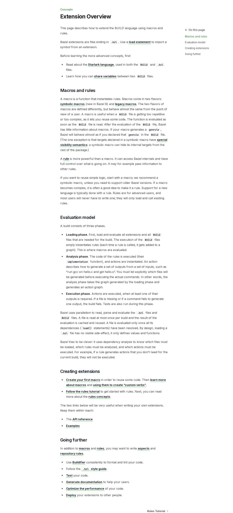 |

- The landing page's hero image, card-based navigation grid, and sub-navigation menu from the original site have been entirely replaced with a standard documentation article layout.
- The page title has changed from 'Extending Bazel' to 'Extension Overview', representing a significant discrepancy if these are meant to be the same page.
- There are stray spaces appearing before punctuation marks (periods and commas) when they follow inline code-styled text or links, such as in '.bzl .', 'genrule ,', and '.bzl style guide .'.
- The term 'BUILD' is inconsistently styled as plain text in the first paragraph, whereas it is consistently code-styled throughout the rest of the document.
- There is awkward and inconsistent spacing inside parentheses that contain code blocks, notably in the phrase '( `load()` statements)' where there are stray spaces around the internal code element.

## /versions/9.0.0/install

Old URL: https://bazel.build/versions/9.0.0/install
New URL: https://preview.bazel.build/versions/9.0.0/install

OK

## /versions/9.0.0/install/bazelisk

Old URL: https://bazel.build/versions/9.0.0/install/bazelisk
New URL: https://preview.bazel.build/versions/9.0.0/install/bazelisk

| Old | New |
| --- | --- |
|  |  |

- The '--incompatible_*' code snippet is incorrectly split into two separate segments and spans across two lines.

